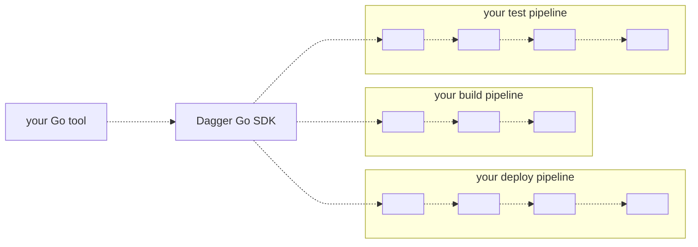

# Dagger Go SDK

Technical Preview

Dagger is a cross-platform CI/CD engine with three defining features:

1. **Portable**. Your pipelines run in containers so you get the same behavior on your local machine and in your CI environment.
2. **Scriptable**. Develop pipelines in Go, Typescript, Python, or even a shell script. No niche language or proprietary YAML is required.
3. **Extensible**. Each pipeline has an API. Pipelines can be shared and reused across projects, teams or the entire community.

The Dagger Go SDK enables you to communicate with the Dagger API by calling native Go functions. With this SDK, you can author your CI/CD pipeline entirely in Go, without needing to learn a new language or think about interoperability.

## Usage

The following sequence diagram explains how the Dagger SDK can be used in the typical CI/CD process flow:

## Next Steps

To learn more, [install the Go SDK](./r2eu9-install.md) and [start using it](./8g34z-get-started.md).
