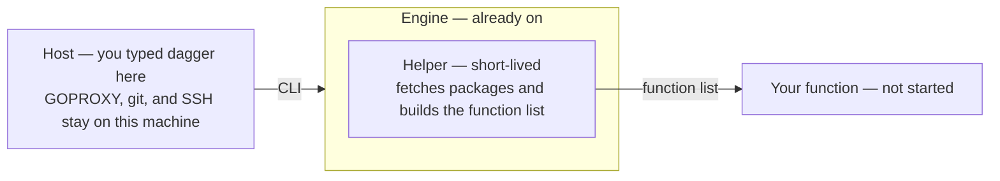

# Calling functions

`dagger check`, `dagger generate`, and `dagger up` are conveniences built on top of the underlying primitive: calling a module's functions. When you need something those verbs don't cover, call functions directly.

```shell
dagger api call jest test
```

Before you can call a function, Dagger loads the module and builds the function list. That work happens in the engine and a short-lived helper — not in your terminal shell. Your function has not started yet.



You typed `dagger` on the host. The engine and the helper are containers. They do not use that shell. The helper fetches packages and builds the list. Your function cannot run until that list exists.

## Discover functions

List the functions available in your workspace:

```shell
dagger api functions
```

List the functions on a specific module:

```shell
dagger api functions jest
```

Every function and its arguments are also visible through `--help`:

```shell
dagger api call jest --help
```

## Pass arguments

Arguments are flags on the function that accepts them:

```shell
dagger api call jest --package-manager=yarn test
```

Secrets are passed the same way, via provider URIs:

```shell
dagger api call deploy --token=env:DEPLOY_TOKEN
```

## Chain functions

Functions interconnect into a pipeline. Each function returns an object, and the next function is called on that result:

```shell
dagger -m core api call container \
  from --address=alpine \
  with-exec --args=echo,hello \
  stdout
```

## Output

By default the result is printed to your terminal. Format it as JSON:

```shell
dagger api call jest test --json
```

Or save a returned file or directory to the host:

```shell
dagger api call build --output=./dist
```
