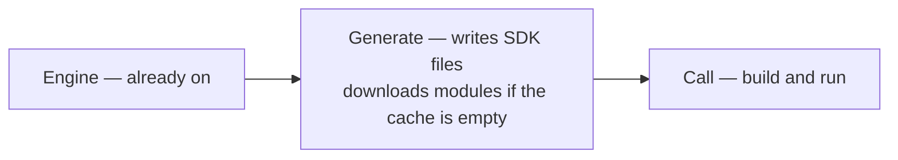

# Generating code

```shell
dagger generate
```

Runs every generator in your workspace. A generator doesn't write to your files directly — it returns a **changeset**: a diff of the proposed changes. Dagger shows you the changed paths and line counts, and nothing is written until you approve.

Functions can also return a changeset without being generators — a formatter's `fix`, called with `dagger api call`, is the common case. Checks never do; they only validate.

For Go modules, module downloads happen during generate (or on a first build with an empty cache), not on every call:



The engine is already on. It does not download here. Generate writes the SDK files. If the cache is empty, modules download then. Call builds and runs from those files. A first build can still download.

If the default Go module proxy (`https://proxy.golang.org`) is unreachable, set `_DAGGER_ENGINE_SYSTEMENV_GOPROXY` on the **engine container** (not your shell). Dagger propagates it into Go module downloads as `GOPROXY`. See [Service proxies](../config/proxy.mdx).

## List generators

```shell
dagger generate -l
```

## Filter generators

```shell
dagger generate protobuf:*         # all generators from a module
dagger generate changelog:generate  # a single generator
```

## Apply without prompting

Pass `-y` / `--auto-apply` to skip the review step — useful in scripts and non-interactive sessions:

```shell
dagger generate -y
```

## Coding agents

When Dagger detects that a coding agent is running `dagger generate`, it requires an explicit choice up front. Pass `-y` to apply the result, or `--no-apply` to run the generators and show the changes without writing them:

```shell
dagger generate --no-apply
```

`--no-apply` exits successfully even when there are pending changes, just like choosing **Discard** at the interactive prompt. Generators still run and may perform other work; only the changeset is withheld.

## Verify in CI

In CI you usually want to check that committed files are up to date rather than rewrite them. `dagger check` runs each generator as a read-only check and fails, without applying anything, if its output differs from what's committed:

```yaml
# GitHub Actions
- run: dagger check --generate
```

A failing generator check means the committed output is stale — run `dagger generate` locally, apply the changeset, and commit.
