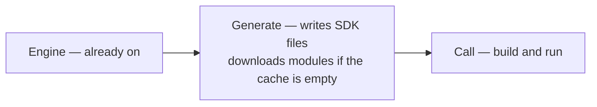

# Service proxies

Dagger can be configured to use HTTP(S) proxies to connect to external HTTP
services. This configuration applies to core operations like pulling
container images, cloning Git repositories, and is also supplied to user
containers in the form of standard environment variables.

The engine supports the following standard environment variables:

- `HTTP_PROXY`
- `HTTPS_PROXY`
- `NO_PROXY`
- `ALL_PROXY`
- `FTP_PROXY`

As well as the custom environment variable:

- `_DAGGER_ENGINE_SYSTEMENV_GOPROXY` — set this on the **engine container**.
  Dagger propagates it into Go module downloads (including SDK codegen) as
  `GOPROXY`. Use this when the default Go module proxy
  (`https://proxy.golang.org`) is unreachable and you need a mirror such as
  `https://goproxy.cn,direct`.

The engine is already on. It does not download here. Generate writes the SDK files. If the cache is empty, modules download then. Call builds and runs from those files. A first build can still download.

Set the variable(s) on the engine container when provisioning a custom engine,
then point the CLI at it with `_EXPERIMENTAL_DAGGER_RUNNER_HOST`.

:::warning Applies to all containers
As mentioned above, these proxy environment variables set on Dagger will also
be automatically set on all containers created by userspace Dagger Functions
(i.e. containers created via a `withExec` API call) unless otherwise specified.

This is useful so that Dagger code you are not in direct control of (e.g. an
external module dependency) does not need to be forked and updated to use your
proxies in order to operate in your network where those proxy settings may be
strictly required.

The values of these environment variables do not impact the caching of those
containers and are not persisted in Dagger's cache. Changing the value of the
settings won't invalidate the cache of the container's execution.

Additionally, if the `withEnvVariable` API is used to explicitly set any of
those proxy environment variable values, those will override any settings
inherited from Dagger's proxy configuration.
:::
