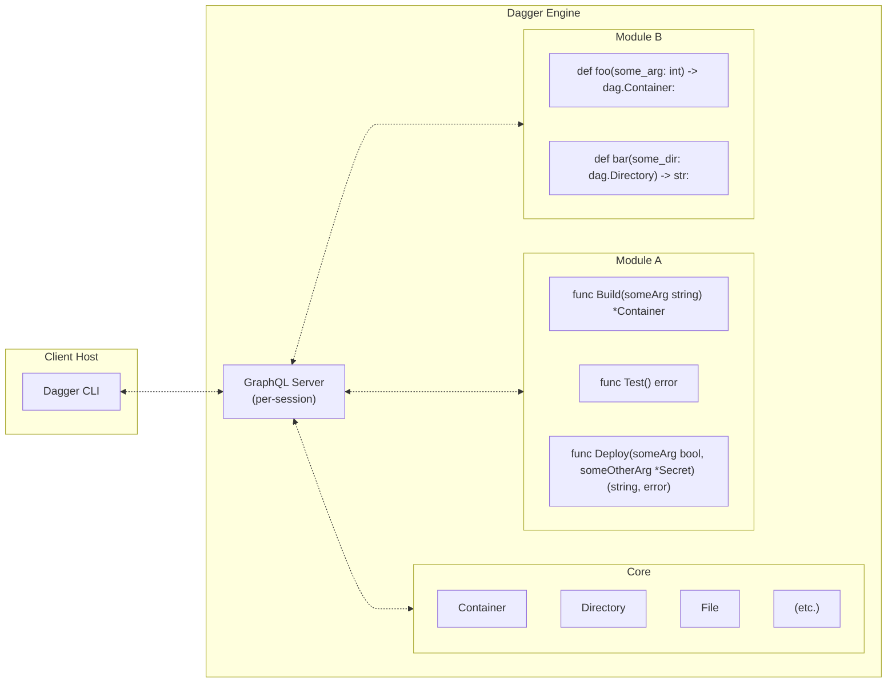

# Architecture

1. You execute a Dagger CLI command like `dagger call` against a Dagger Module. The CLI either connects to an existing engine or provisions one on-the-fly. Once connected, it opens a new session with the Dagger Engine.

   - Each session is associated with its own GraphQL server instance running inside the Dagger Engine. This GraphQL server initially only has the "core" API available, which provides basic functionality like running containers, interacting with files and directories, etc.
   - The core API is highly optimized: each request is turned into a [Directed Acyclic Graph (DAG)](https://en.wikipedia.org/wiki/Directed_acyclic_graph) of low-level operations required to compute the result. It uses caching and other optimizations to compute these results as efficiently as possible.

1. The core API also provides functionality for loading Dagger Modules. When a module is loaded into the session, the GraphQL API is dynamically extended with new APIs served by that module. So, after loading a module, the CLI client can now call all of the original core APIs _plus_ the new APIs provided by that module.

   - Dagger Modules are just source code that is configured to be loaded with a Dagger SDK. When the module is loaded, the source code is pulled into the Dagger Engine (if not already cached) and interfaced with the session via the SDK so that its APIs are parsed and prepared for execution. Once loaded, if an API provided by the module is called, the module will be executed inside a container in the Dagger Engine to obtain the result.
   - Dagger Modules are themselves also Dagger clients connected back to the same session they were loaded into. They can call core APIs in addition to other modules on which they have declared a dependency.

1. The Dagger CLI command you executed loads the specified Dagger Module and calls the requested API served by that module. It then uses the returned result in the most appropriate way depending on the CLI command being used (print a textual representation, download an asset, open an interactive shell, proxy network ports, etc.).
