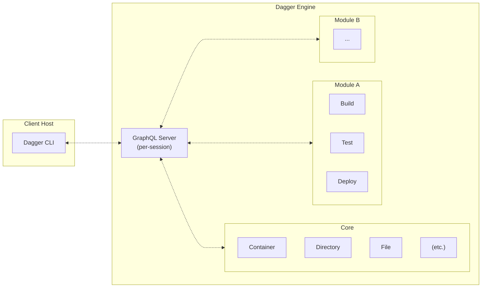

# Dagger Documentation

:::note
This page documents an upcoming release of Dagger. This release
is currently experimental and should not be considered production-ready. If you
arrived at this page by accident, you can [return to the official
documentation](https://docs.dagger.io/).
:::

## What is Dagger?

Dagger is an integrated platform to orchestrate the delivery of applications to the cloud from start to finish. The Dagger Platform includes the Dagger Engine, Dagger Cloud, and the Dagger SDKs.

### What is the Dagger Engine?

The Dagger Engine is a programmable tool that lets you replace your software project's artisanal scripts with a modern API and cross-language scripting engine.

1. Encapsulate all your project's tasks and workflows into simple functions, written in your programming language of choice.
2. Dagger packages your functions into a custom GraphQL API.
3. Run your functions from the command line, your language interpreter, or a custom HTTP client.
4. Package your functions into a module, to reuse in your next project or share with the community.
5. Search for existing modules, and import them into yours. All Dagger modules can reuse each other's functions - regardless of which language they are written in.

### What is Dagger Cloud?

Dagger Cloud complements the Dagger Engine with a production-grade control plane. Features of Dagger Cloud include pipeline visualization, operational insights, and distributed caching.

## Who is it for?

Dagger may be a good fit if you are...

- Your team's "designated devops person", hoping to replace a pile of artisanal scripts with something more powerful.
- A platform engineer writing custom tooling, with the goal of unifying application delivery across organizational silos.
- A cloud-native developer advocate or solutions engineer, looking to demonstrate a complex integration on short notice.

### Benefits to development teams

- Reduce complexity: Even complex builds can be expressed as a few simple functions.
- No more "push and pray": Everything CI can do, your local dev environment can do too.
- Native language benefits: Use the same programming language to develop your application and its delivery tooling.
- Easy onboarding of new developers: If you can build, test and deploy, they can too.
- Caching by default: Dagger caches everything. Expect 2x to 10x speed-ups.
- Cross-team collaboration: Reuse another team's workflows without learning their stack.

### Benefits to platform teams

- Reduce CI lock-in: Dagger functions run on all major CI platforms - no proprietary DSL needed.
- Eliminate bottlenecks: Let application teams write their own functions. Enable standardization by providing them a library of reusable components.
- Save time and money with faster CI runs: CI pipelines that are "Daggerized" typically run 2x to 10x faster, thanks to caching and concurrency. This means developers waste less time waiting for CI, and you spend less money on CI compute.
- Benefit from a viable platform strategy: Development teams need flexibility, and you need control. Dagger gives you a way to reconcile the two, in an incremental way that leverages the stack you already have.

## How does it work?

1. You execute a Dagger CLI command like `dagger call` against a Dagger Module. The CLI either connects to an existing engine or provisions one on-the-fly. Once connected, it opens a new session with the Dagger Engine.

   - Each session is associated with its own GraphQL server instance running inside the Dagger Engine. This GraphQL server initially only has the "core" API available, which provides basic functionality like running containers, interacting with files and directories, etc.
   - The core API is highly optimized: each request is turned into a [Directed Acyclic Graph (DAG)](https://en.wikipedia.org/wiki/Directed_acyclic_graph) of low-level operations required to compute the result. It uses caching and other optimizations to compute these results as efficiently as possible.

1. The core API also provides functionality for loading Dagger Modules. When a module is loaded into the session, the GraphQL API is dynamically extended with new APIs served by that module. So, after loading a module, the CLI client can now call all of the original core APIs _plus_ the new APIs provided by that module.

   - Dagger Modules are just source code that is configured to be loaded with a Dagger SDK. When the module is loaded, the source code is pulled into the Dagger Engine (if not already cached) and interfaced with the session via the SDK so that its APIs are parsed and prepared for execution. Once loaded, if an API provided by the module is called, the module will be executed inside a container in the Dagger Engine to obtain the result.
   - Dagger Modules are themselves also Dagger clients connected back to the same session they were loaded into. They can call core APIs in addition to other modules on which they have declared a dependency.

1. The Dagger CLI command you executed loads the specified Dagger Module and calls the requested API served by that module. It then uses the returned result in the most appropriate way depending on the CLI command being used (print a textual representation, download an asset, open an interactive shell, proxy network ports, etc.).
