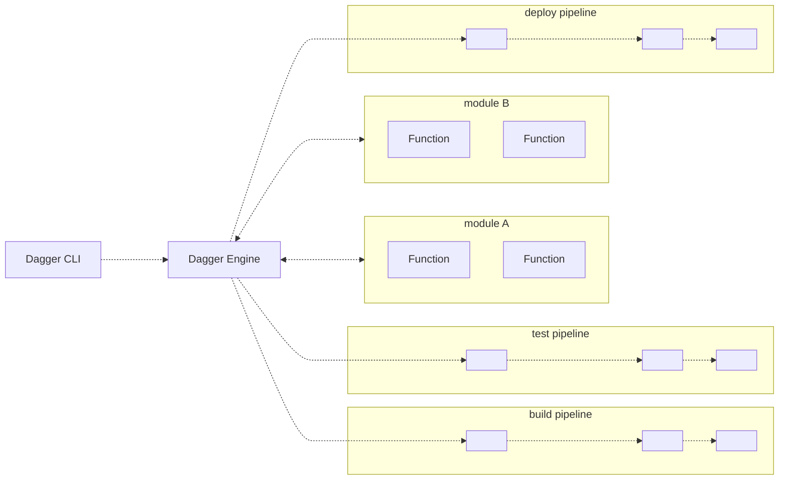

# Dagger Documentation

:::note
This page documents an upcoming release of Dagger. This release
is currently experimental and should not be considered production-ready. If you
arrived at this page by accident, you can [return to the official
documentation](https://docs.dagger.io/).
:::

## What is Dagger?

Dagger is an integrated platform to orchestrate the delivery of applications to the cloud from start to finish. The Dagger Platform includes the Dagger Engine, Dagger Cloud, and the Dagger SDKs.

### What is the Dagger Engine?

The Dagger Engine is a programmable tool that lets you replace your software project's artisanal scripts with a modern API and cross-language scripting engine.

1. Encapsulate all your project's tasks and workflows into simple functions, written in your programming language of choice.
2. Dagger packages your functions into a custom GraphQL API.
3. Run your functions from the command line, your language interpreter, or a custom HTTP client.
4. Package your functions into a module, to reuse in your next project or share with the community.
5. Search the [Daggerverse](https://daggerverse.dev) for existing modules, and import them into yours. All Dagger modules can reuse each other's functions - regardless of which language they are written in.

### What is Dagger Cloud?

Dagger Cloud complements the Dagger Engine with a production-grade control plane. Features of Dagger Cloud include pipeline visualization, operational insights, and distributed caching.

## Who is it for?

Dagger may be a good fit if you are...

- Your team's "designated devops person", hoping to replace a pile of artisanal scripts with something more powerful.
- A platform engineer writing custom tooling, with the goal of unifying application delivery across organizational silos.
- A cloud-native developer advocate or solutions engineer, looking to demonstrate a complex integration on short notice.

### Benefits to development teams

- Reduce complexity: Even complex builds can be expressed as a few simple functions.
- No more "push and pray": Everything CI can do, your local dev environment can do too.
- Native language benefits: Use the same programming language to develop your application and its delivery tooling.
- Easy onboarding of new developers: If you can build, test and deploy - they can too.
- Caching by default: Dagger caches everything. Expect 2x to 10x speedups.
- Cross-team collaboration: Reuse another team's workflows without learning their stack.

### Benefits to platform teams

- Reduce CI lock-in: Dagger functions run on all major CI platforms - no proprietary DSL needed.
- Eliminate bottlenecks: Let application teams write their own functions. Enable standardization by providing them a library of reusable components.
- Save time and money with faster CI runs: CI pipelines that are "Daggerized" typically run 2x to 10x faster, thanks to caching and concurrency. This means developers waste less time waiting for CI, and you spend less money on CI compute.
- Benefit from a viable platform strategy: Development teams need flexibility, and you need control. Dagger gives you a way to reconcile the two, in an incremental way that leverages the stack you already have.

## How does it work?

1. You execute a Dagger CLI command like `call`, `shell`, `up`, etc. against a module.
1. The CLI opens a new session to a Dagger Engine: either by connecting to an existing engine, or by provisioning one on-the-fly.
1. The CLI uses the built-in core API to load the module into its session, making the module's API available for calls. Each module uses an SDK, which is responsible for turning the module's source code into an executable format that interfaces with the Dagger Engine.
1. The CLI calls the requested APIs based on the user inputs to the command. The wire protocol used to communicate with the Dagger Engine is private and not yet documented, but this will change in the future.
1. The Dagger Engine executes the module in a container. The module itself is connected back to the same session and can use Dagger API calls. The module has access to the built-in core API and the APIs of any modules on which it has a declared dependency.
1. When the Dagger Engine receives an API request, it computes a [Directed Acyclic Graph (DAG)](https://en.wikipedia.org/wiki/Directed_acyclic_graph) of low-level operations required to compute the result, and starts processing operations concurrently.
1. The final result is returned back to the caller once resolved, making it available for further processing, including as input to other API calls.
