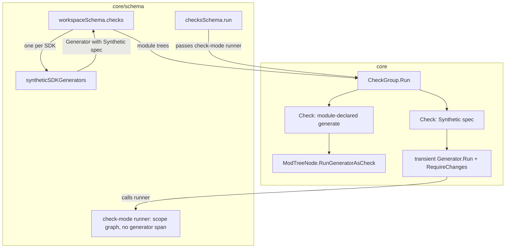

# Automatic checks for synthetic SDK generators

created: 2026-09-12
status: proposed

## Terms

- **Synthetic SDK generator**: a generator the engine injects for a workspace
  that declares an SDK. It is not a field on any module's dagql schema.
- **Provider module**: the workspace module named by `[sdks.<name>].module`. It
  supplies the SDK implementation.
- **Scope**: a workspace-root-relative directory that an SDK manages, declared
  as `[sdks.<name>.scopes."<dir>"]`. A scope is either a module scope
  (`is-module = true`) or a client scope that generates clients for other
  modules.
- **Derived check**: a check that `dagger check` creates from a generator
  instead of from a `+check` function. It runs the generator and passes when
  the generator produces no changes.

## Problem

`dagger check` derives a check from every generator it can see. The failure
message tells the user to run `dagger generate <target>`.

The derivation only sees generators that a module declares as a field in its own
dagql schema. `core.NewCheckGroup` (in `core/checks.go`) walks the module tree
built by `core.NewModTree` and calls `ModTreeNode.RollupGenerator` (in
`core/modtree.go`). `RollupGenerator` returns the tree nodes whose `IsGenerator`
flag is set. That flag is copied from `FunctionTypeDef.IsGenerator`, which the
engine sets for a function the module author annotated with `+generate`.

Pull request dagger/dagger#13992 ("sdk-ux-module-max", merged as commit
908d48ebda) introduced synthetic SDK generators. A workspace that declares an
SDK in `dagger.toml` gets one per SDK:

```toml
[modules.go-sdk]
source = ".dagger/modules/go-sdk"

[sdks.go]
module = "go-sdk"

[sdks.go.scopes.".dagger/modules/app"]
is-module = true
```

`workspaceSchema.syntheticSDKGenerators` (in
`core/schema/workspace_sdk_generator.go`) builds one `*core.Generator` per
configured SDK. Each holds a `*core.SyntheticGeneratorSpec` with kind
`"scopes"`. Each also holds a `*core.ModTreeNode` with `IsGenerator: true`, but
that node is constructed on the spot for naming and pattern matching only. The
node is not part of any module's dagql schema tree.

`workspaceSchema.generators` appends these generators to the group it returns,
so `dagger generate` lists and runs them. `workspaceSchema.checks` does not. It
builds its result only from `core.NewCheckGroup` per workspace module, and
`RollupGenerator` cannot reach a node that is not in a module tree.

The result is a coverage regression. A workspace whose SDK declares its own
`+generate` function gets a derived check. The same workspace loses that check
after the SDK moves to the built-in generate mechanism. Nothing tells the user
that generated files are stale until someone runs `dagger generate` by hand.

## Goals

- `dagger check` lists one derived check per configured SDK.
- The derived check passes when the SDK's scopes are already generated.
- The derived check fails when the SDK's scopes are stale. The failure message
  matches the message the module-declared mechanism produces.
- The derived check obeys the existing selection surface: positional include
  patterns, `--skip`, `--no-generate`, `--generate`, the workspace
  `check-generated` setting, and `[modules.<provider>.check] skip`.
- A derived check is indistinguishable from a module-declared generate check in
  the CLI. `Check.name` uses the same naming rule, `Check.checkType` returns
  `"generate"`, and the run emits the same telemetry a check emits.

## Non-goals

- No new configuration surface. There is no flag or `dagger.toml` key to turn
  the derived checks on or off beyond the flags checks already have.
- No cloud scale-out for the derived checks. `ModTreeNode` scale-out loads a
  module and selects a generator by name on the remote engine. A synthetic SDK
  generator has no module to load. `dagger generate` has no scale-out for these
  generators either, so the derived check matches it.
- No change to the SDK interface introduced by dagger/dagger#13992.
- No change to the public GraphQL schema. See "Original module" below.

## Proposed approach

Reuse the bridge that already carries a synthetic SDK generator across the
`core` / `core/schema` package boundary.

`core.Generator` already holds an optional `Synthetic *SyntheticGeneratorSpec`.
The spec is plain data: name, path, description, provider, and kind. `core`
never interprets the kind. `core.Generator.Run` takes a
`core.SyntheticGeneratorRunner` callback, and `core/schema` passes
`runSyntheticSDKGenerator` as that callback. So `core` owns the data and the
control flow, and `core/schema` owns the execution. No package imports the
other in a new direction.

Give `core.Check` the same shape, and have its run path delegate to
`core.Generator` rather than repeat it.

1. Add `Synthetic *SyntheticGeneratorSpec` to `core.Check`. A check with a
   non-nil `Synthetic` always has `IsGenerate` set, so `Check.checkType`
   already returns `"generate"` for it.
2. Add a `syntheticRunner core.SyntheticGeneratorRunner` parameter to
   `core.Check.Run` and `core.CheckGroup.Run`, with the same type the generator
   path uses.
3. For a check with a non-nil `Synthetic`, run it through a transient
   `core.Generator{Node: c.Node, Synthetic: c.Synthetic}`. `Generator.Run`
   already dispatches to the runner, and `Generator.RequireChangesResult`
   already folds the returned base and generated `Workspace` into a `Changeset`
   through `generatorWorkspaceChanges`. The check then fails when that
   changeset is not empty. Nothing in the diff path is written twice, and no
   generator state is stored on `Check`.
4. Emit the check's own span around that work, carrying `CheckNameAttr`,
   `UIRollUpLogsAttr`, `UIRollUpSpansAttr`, and `CheckPassedAttr` on
   completion, exactly as `ModTreeNode.runAsCheck` does.
5. In `core/schema`, pass a check-mode runner from `checksSchema.run` and
   `checksSchema.runSingleCheck`, mirroring
   `generatorsSchema.runSingleGenerator`.
6. In `workspaceSchema.checks`, call the existing
   `workspaceSchema.syntheticSDKGenerators` and convert each returned generator
   into a check. Do this only when the resolved `noGenerate` value is false.

### Telemetry: the check must not also look like a generator run

`runSDKModuleGeneratorGraph` opens one span per spec carrying
`GeneratorNameAttr`. The TUI reads that attribute into `Span.GeneratorName`,
`DB.SurfacedGenerators` collects those spans reveal-independently, and
`frontendPretty.promoteGeneratorsLocked` promotes them to the top level next to
the check row. A derived check that used the plain generator runner would
therefore show the generator twice: once as a check, once as a promoted
generator.

The module-declared path already avoids this. `runGeneratorAsCheckLocally`
calls `runGeneratorLocally` directly and skips `ModTreeNode.RunGenerator`,
which is the only place that sets `GeneratorNameAttr` on that path.

So the check-mode runner runs the same scope graph with the per-spec generator
span suppressed. The scope work then parents directly to the check span, which
already carries the roll-up attributes. `runSDKModuleGeneratorGraph` gains a
parameter for this, and `core/schema/workspace_sdk_generator.go` gains a
check-mode sibling of `runSyntheticSDKGenerator`.

### Original module

`Check.originalModule` is `Module!` in the schema. A derived check has no
originating module. `syntheticSDKGenerators` builds its node without an
`OriginalModule` because the same function serves `dagger generate -l`, where
listing must not load the SDK provider module —
`TestWorkspaceListsSyntheticGeneratorWithoutLoadingSDK` in
`core/integration/generators_test.go` locks that in. `workspaceSchema.checks`
does load the workspace modules strictly, so it could attach the provider
module to the derived check only. That is rejected: it would make the same
generator carry a module on the check path and no module on the generate path,
for a field no caller selects.

`Generator.originalModule` solved the same problem by being nullable. Copying
that for `Check` is rejected here: it is a public schema change that alters
every generated client. In the Go SDK a nullable object field becomes an eager
`func (r *Check) OriginalModule(ctx context.Context) (*Module, error)` instead
of today's lazy `func (r *Check) OriginalModule() *Module`
(compare `sdk/go/dagger.gen.go` for `Check` and for `Generator`). In the
TypeScript SDK it becomes `async () => Promise<Module_ | null>` instead of a
synchronous accessor. That is a breaking client change for a field no caller in
this repository selects.

Instead, `checksSchema.originalModule` returns a clear error when a check has
no original module. A non-null field that cannot be produced is a normal
GraphQL error, and the message names the check. Making the field nullable stays
available as a later change, behind a version gate, if a client ever needs it.

### Selection and naming

`syntheticSDKGenerators` already applies `filterGeneratorsByInclude` with the
caller's include patterns, so a derived check honours a positional pattern
without new matching code. `workspaceSchema.checks` then applies:

- the caller's `--skip` patterns through `filterNodesByExclude` with
  `moduleLocal` false, matching how it already filters module checks;
- `[modules.<provider>.check] skip` for the SDK's provider module, through
  `filterNodesByExclude` with `moduleLocal` true, again matching the module
  path. The synthetic node is namespaced under the provider module, and
  `workspace.ValidateSDKs` in `core/workspace/config.go` rejects an SDK naming a
  module that is not installed, and rejects one module providing two SDKs. The
  provider-to-SDK relation is one to one, so the per-module skip setting applies
  to exactly one derived check.

The derived check takes its `Node` from the generator, so `Check.Name`,
`Check.Path`, and `Check.Description` keep working unchanged. The name is
whatever `dagger generate -l` already prints for the same generator:
`<provider>:generate` normally, or `generate` when the provider module is the
workspace entrypoint, because `ModTreeNode.CommandPath` drops the leading
element for an entrypoint.

`core.NewCheckGroup` skips a generate-derived check when an explicit `+check`
function already occupies the same name. `workspaceSchema.checks` applies the
same rule to the derived checks, comparing `Check.Name()` on both sides,
against the names of every check collected from the workspace modules. An SDK
provider module that declares its own `+check` named `generate` therefore keeps
exactly one check.

### Loading the workspace configuration

`workspaceSchema.checks` reads the workspace configuration twice, for two
different purposes.

`workspaceConfigWithCompatFallback` stays as it is. It supplies
`check-generated` and the per-module check skip lists, and it tolerates a
legacy `dagger.json` workspace. `TestChecksViaLegacyBlueprintConfig` in
`core/integration/checks_test.go` depends on that tolerance.

The staged read for the SDK list is guarded by `parent.ConfigFile != ""`, the
same guard `workspaceSchema.generators` uses, because
`loadWorkspaceConfigForOverlay` rejects a legacy compat workspace and rejects a
missing `dagger.toml`. Without the guard, `dagger check` would start failing on
every workspace that has not migrated.

### One check per SDK

`syntheticSDKGenerators` emits one generator per configured SDK, sorted by SDK
name. Converting one for one gives one check per SDK, so a stale SDK is named
in the failure instead of being hidden inside one combined verdict.

Execution is per check. The check-mode runner plans the graph for a single
spec. `generatorsSchema.run` instead folds every selected spec into one graph
run, because `dagger generate` has to produce one combined result.

A per-SDK check is not the same as a per-SDK verdict. `planSDKModuleScopes`
pulls in the dependency closure of the selected SDK's scopes. Any scope that
lists clients depends on the module scopes of those clients, including module
scopes owned by a different SDK. So the derived
check for SDK A verifies A's scopes **and the scopes they depend on**. If SDK
B owns a dependency of A and B's output is stale, both checks fail. That is the
correct reading: A's generated output really is not reproducible from the
current tree. The test plan covers this case explicitly rather than using two
unrelated SDKs, which would hide it.

Two checks that share a dependency scope regenerate that scope twice. The
repeat collapses in dagql when both closures reach the shared scope with the
same `Workspace` identity, because then the call and its cache key are
identical. It does not collapse when each closure runs a different set of
independent scopes first, because `runSDKModuleGeneratorGraph` threads the
workspace from one scope to the next, so the shared call receives a different
input. Sharing the same bound base workspace alone does not guarantee the
collapse.



### Behaviour worth knowing

- **Invocation directory matters.** `planSDKModuleScopes` filters scopes by the
  bound workspace's `Cwd`. A derived check run from a subdirectory covers only
  the scopes at or under that directory. This matches `dagger generate`. The
  module-declared generate-as-check path has no such filter.
- **The failure message says "generate function".** It is reused verbatim from
  `runGeneratorAsCheckLocally` so the two mechanisms read identically. For a
  derived check there is no function, only an SDK. The remediation command in
  the message is correct: it uses the fully qualified path, which
  `dagger generate` matches whether or not the provider is an entrypoint.
- **Running one listed check directly does not carry workspace overlay edits.**
  `CheckGroup.Run` binds its rolled-up workspace into the context, so the
  normal `dagger check` path is correct. `Check.run` on a single listed check
  has no workspace to bind and falls back to `currentWorkspace`. This is
  exactly what `Generator.run` on a single listed generator already does.
- **A provider skip has no generate-side counterpart.**
  `[modules.<provider>.check] skip` now hides the derived check.
  `workspaceSchema.generators` drops provider modules from its module loop and
  never applies `[modules.<provider>.generate] skip` to the synthetic SDK
  generators it appends, so the matching `dagger generate` entry stays visible.
  This asymmetry is accepted: a check is something a user reasonably silences,
  a generator is not.
- **The workspace configuration is read twice.** One read supplies
  `check-generated` and the per-module skip lists and tolerates a legacy
  workspace; the other supplies the SDK list and the config directory. A host
  edit between the two reads could mix versions. Folding them would put the SDK
  list behind the compat fallback, which carries no config directory, so the
  two reads stay.
- **`Check` and `CheckGroup` have no persistence.** Unlike `Generator` and
  `GeneratorGroup`, they implement no `dagql.PersistedObject`; a replayed
  `node(id:)` re-derives them through the `Workspace.checks` resolver. No
  persistence work is needed for the new field.
- **Value workspaces.** A `Workspace` built from a `Directory` that contains a
  `dagger.toml` with `[sdks.*]` will now list a derived check.
  `future/workspace-api-cleanup.md` records empty check listings for such
  workspaces as an open question; this change makes `checks` consistent with
  `generators`, which already behaves this way.

## Alternatives considered

**Attach the synthetic SDK generator to a module tree.** `NewCheckGroup` would
then find it with no new code. Rejected: the generator belongs to the
workspace, not to any one module, and it has no dagql field to resolve.
Grafting a fake node onto a real module's tree would make the module's own
schema and its tree disagree.

**Move `syntheticSDKGenerators` into `core`.** Rejected: it reads workspace
configuration and resolves SDK modules, which is `core/schema` work. Moving it
would pull workspace config handling into `core`.

**Store a `*core.Generator` on `Check` instead of a spec.** Rejected: it would
put generator completion state and workspace results on a check that does not
need them, and complicate `Check.Clone`. Building a transient `Generator`
inside the run path gets the code reuse without the state.

**Make `Check.originalModule` nullable.** Rejected for this change; see
"Original module" above.

**Make `workspaceSchema.checks` exclude generate-derived checks that come from
an SDK provider module's own tree**, mirroring how `workspaceSchema.generators`
skips provider modules. Rejected as out of scope: that is existing behaviour at
commit 6bf59d5065 and removing it would drop coverage that exists today. The
name-based dedup already prevents a duplicate entry.

**Run every SDK's generator once and share the verdict.** Rejected: it collapses
N SDKs into one pass or fail, which hides which SDK is stale.

## Relation to the existing design corpus

- `future/done/simplify-dagger-check.md` settled that `dagger check` goes
  straight through `CurrentWorkspace().Checks(...)` to a `CheckGroup`. This
  change adds work inside that resolver and adds no CLI flag.
- `future/gates.md` treats a check as a deterministic function from workspace to
  evidence, running locally. This change adds one more such function.
- `future/module-max-review-fixes.md` item 1 settled that SDK generation keeps a
  `Workspace` and converts to a `Changeset` only when an operation needs one.
  The derived check converts only to answer "is it empty".
- `future/synthetic-workspace.md` supplies the bound-workspace model this change
  relies on. No new workspace source kind is introduced.
- `future/cloud-check-replay.md` covers Cloud replay and workspace remotes. This
  change touches neither.

## Affected components

| File | Change |
| --- | --- |
| `core/checks.go` | `Check.Synthetic` field; `Check.Run` and `CheckGroup.Run` take a synthetic runner; synthetic execution through a transient `Generator`, inside a check span. |
| `core/schema/checks.go` | Pass the check-mode runner into `CheckGroup.Run` and `Check.run`; error on `originalModule` for a check that has none. |
| `core/schema/workspace_sdk_generator.go` | Check-mode runner that suppresses the per-spec generator span. |
| `core/schema/generators.go` | Pass the generator-span flag at the existing `runSDKModuleGeneratorGraph` call site. |
| `core/schema/workspace.go` | `workspaceSchema.checks` derives checks from `syntheticSDKGenerators`, dedups by name, applies `--skip` and the provider module's configured check skips. |
| `core/integration/checks_test.go` | New integration coverage. |

`core/schema/module.go` needs no change: `Module.checks` and `Module.check` only
construct a `CheckGroup`, they never call `Run`.

## Testing

Integration tests use a new workspace fixture,
`core/integration/testdata/workspaces/sdk-generate-check`. It holds two test
SDKs written in Dang, so a test run does not pay for a compiled-language
runtime. Each SDK writes a marker file into the scope it generates, so deleting
that file is a reliable way to make a scope stale. A third module is the first
SDK under the same workspace name plus its own `generate` check, for the dedup
case. Each test writes the `dagger.toml` it needs.

The first assertion, which the whole feature rests on, is that regenerating an
already-generated SDK scope produces no changes: `dagger generate -y` twice in
a row, the second reporting no changes.

`TestChecksSyntheticSDKGenerateAsCheck` in `core/integration/checks_test.go`
then covers:

- `dagger check -l` lists the derived check under the provider module's name.
- `dagger check -l --no-generate` omits it.
- `dagger check -l --generate` lists it and omits annotated checks.
- `check-generated = false` in `dagger.toml` omits it.
- `dagger check <provider>:generate` passes when the scope is generated.
- `dagger check <provider>:generate` fails when the generated file is deleted,
  and the message is the full "produced changes; run 'dagger generate ...' to
  apply" text with the correct target.
- `dagger check --skip '<provider>:generate'` omits it.
- `[modules.<provider>.check] skip = ["generate"]` omits it.
- An explicit `+check` named `generate` on the provider module leaves exactly
  one check with that name.
- A provider module marked as the workspace entrypoint names the check
  `generate`.
- Two SDKs produce two derived checks. With a client scope of SDK A depending
  on a module scope of SDK B, deleting B's generated file fails both checks;
  with independent scopes, it fails only the owner's check.
- Selecting `originalModule` on a derived check returns the documented error.

Run the integration tests with the engine-dev path, which builds the dev engine
and runs the tests against it:

```bash
dagger api call engine-dev test --pkg ./core/integration --run='TestChecks/TestChecksSyntheticSDKGenerateAsCheck'
```

This repository's own `dagger.toml` declares no `[sdks]` section, so
`dagger check` on dagger/dagger cannot exercise the new path. The integration
tests are the only signal.

The suppressed generator span is not asserted. A workspace test drives the CLI
inside a container, so it observes rendered output rather than span attributes;
the `agentTraceSink` harness that can read attributes only serves in-process
clients. A `--progress=report` assertion would not help either, because the
pretty frontend renders the checks section and reaches the generators section
only when there is no check section. The suppression therefore rests on parity
with `runGeneratorAsCheckLocally`, which skips the generator span for the same
reason.

## Risks

- **Repeated generation work.** Each derived check runs its SDK's scope graph.
  Two SDKs with a shared dependency scope regenerate that scope twice, and
  checks run in parallel without a concurrency limit. The repeat collapses on
  the dagql cache only when both closures reach the shared scope with the same
  input workspace; otherwise the work is genuinely repeated.
- **Long-running checks.** An SDK generator can be slow. The derived check makes
  `dagger check` pay that cost where it previously did not. `--no-generate`,
  `check-generated = false`, and `[modules.<provider>.check] skip` all switch it
  off.
- **Changed `Run` signatures.** `core.Check.Run` and `core.CheckGroup.Run` gain a
  parameter. Both are internal to this repository, and the dagql field
  signatures do not change, so no SDK regeneration is needed.
- **`originalModule` now has a reachable error path.** A client that selects it
  on a derived check gets an error instead of a module. No caller in this
  repository selects it.

## Implementation plan

Patches, in order. Each patch keeps the tree building, its tests green, and
`golangci-lint` clean; in particular no patch leaves an unexported function
without a caller or an unexported parameter with one constant value.

1. `core: run synthetic SDK generators as checks`
   - `core/checks.go`: add `Synthetic *SyntheticGeneratorSpec` to `core.Check`
     and clone it in `Check.Clone`. Add the
     `syntheticRunner core.SyntheticGeneratorRunner` parameter to `Check.Run`
     and `CheckGroup.Run`.
   - Run a synthetic check through a transient
     `core.Generator{Node: c.Node, Synthetic: c.Synthetic}`. `Generator.Run`
     returns a completed clone, so call `RequireChangesResult` on the returned
     value, not on the transient one. Fail with the existing "produced changes;
     run 'dagger generate ...' to apply" message when the changeset is not
     empty. Wrap the work in a span carrying `CheckNameAttr`,
     `UIRollUpLogsAttr`, `UIRollUpSpansAttr`, and `CheckPassedAttr` on
     completion.
   - `core/schema/workspace_sdk_generator.go`: thread a flag through
     `runSDKModuleGeneratorGraph` that suppresses the per-spec span carrying
     `GeneratorNameAttr`, and add the check-mode sibling of
     `runSyntheticSDKGenerator` that sets it. `generatorsSchema.run` and
     `runSyntheticSDKGenerator` keep today's spans.
   - `core/schema/checks.go`: pass the check-mode runner into `CheckGroup.Run`
     and `Check.run`, and return a clear error from `originalModule` when a
     check has no original module.

2. `core/schema: derive a check from each synthetic SDK generator`
   - In `workspaceSchema.checks`, load the staged workspace config guarded by
     `parent.ConfigFile != ""`, as `workspaceSchema.generators` does.
   - When `noGenerate` is false, call `syntheticSDKGenerators` with the include
     patterns and the entrypoint names.
   - Convert each returned generator into
     `&core.Check{Node: g.Node, Synthetic: g.Synthetic, IsGenerate: true}`.
   - Drop a derived check whose `Name()` matches an already-collected check.
   - Apply the caller's `--skip` patterns, then the provider module's
     configured check skips.

3. `core/integration: cover checks derived from SDK generators`
   - Add `TestChecksSyntheticSDKGenerateAsCheck` covering the cases above.
