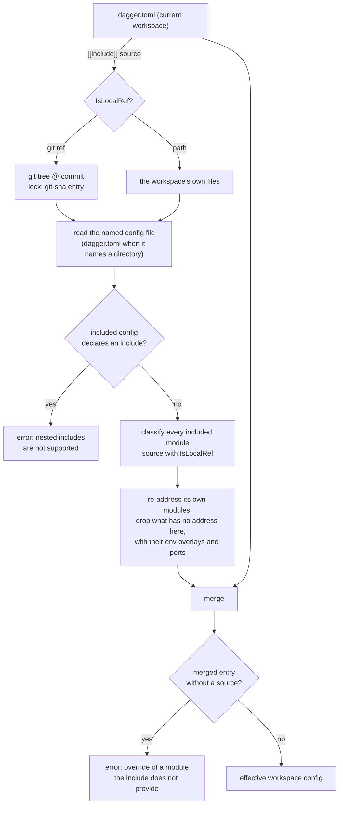
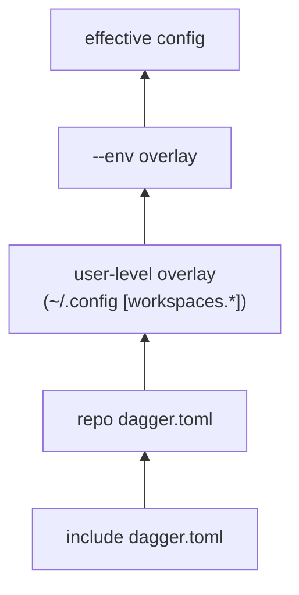
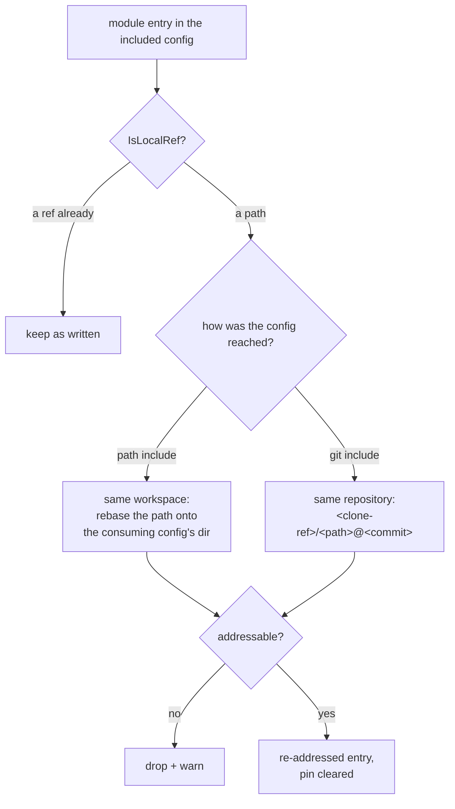

# Workspace Config Include

author: eunomie
created: 2026-08-12
status: implemented

PR: [#13882](https://github.com/dagger/dagger/pull/13882)

## Problem

Teams that run Dagger across many repositories duplicate the same `dagger.toml`
in every one of them: the same toolchain modules, the same pinned tool versions,
the same module settings, the same env definitions. When a version moves, every
repository has to be edited.

This is a confirmed want, not a hypothetical one. From Discord:

- _vindico_: "I'm currently putting duplicated workspace config in a lot of repos."
- _chrisp6229_: asked to publish standard workspace configs per project type
  (go / node / terraform) and have downstream repos point at one, so tool
  versions are managed in one place.
- _shykes_: "As long as we don't go crazy with the config layering and other
  complications, it seems reasonable. Like a basic import feature in dagger.toml."

There is no mechanism today. `dagger.toml` is read from exactly one file; the
only layering that exists is the user-level overlay (`[workspaces.*]` in the
user config) and env overlays (`[env.<name>]`), both of which are local to the
machine or to the file itself.

## Goals

- A workspace can name another config file — by path or by git ref — whose
  contents are loaded and merged **underneath** its own config.
- The current workspace wins on every conflict, with a merge rule that is
  written down per config section rather than left to whatever the code does.
  "Wins" means _explicitly set_, including an explicit `false` or an explicit
  empty list — not merely "non-zero".
- A git include is pinned in `dagger.lock` like every other git ref this repo
  resolves: later runs reuse the recorded pin, and `dagger update` refreshes it.
  A path include has nothing to pin.
- A module the included config installs is usable here, whether it named a
  remote ref or a directory beside itself. What it must never do is resolve a
  path of the included config's against the _consuming_ workspace.
- The merged result is what read surfaces (`dagger workspace config`, module
  listing, env listing) report, so the effect is visible rather than silent.

## Non-goals (YAGNI)

- **No multi-include composition.** The `[[include]]` shape allows several
  entries, but resolving more than one is an error for now: no ordered layer
  stack, no diamond resolution. The limit lives in `workspace.MaxIncludes` and
  can lift without changing what anyone has written.
- **No transitive includes.** If the included config itself declares an
  include, that is an error (see
  [One include, no chain](#one-include-no-chain)), not a second layer.
- **No new lock operation kind.** The include reuses the existing git lock
  operations (`git-latest` for a mutable selection, `git-sha` for the
  immutable resolution).
- **No inheriting generated clients or SDK-managed authoring state.** The
  modules an included config installs come with it, but `as-sdk` state and the
  client trees it implies do not — see
  [The included config's own modules](#the-included-configs-own-modules).
- **No tombstones.** An inherited entry can be overridden but not deleted. See
  [Inherited entries cannot be removed](#inherited-entries-cannot-be-removed).
- **No write-through.** `dagger install`, `dagger workspace config <key> <value>`
  and every other mutation keep writing the _local_ `dagger.toml` only. The
  include is read-only input.

## Proposed approach

### Config surface

A top-level array of tables in `dagger.toml`:

```toml
[[include]]
source = "github.com/acme/dagger-base@v1.2.0"

[modules.go]
settings.goVersion = "1.24"
```

`source` addresses a config **file**, not a workspace root, and comes in two
forms:

- **a path**: `common/base.toml` relative to the including config's directory,
  `./base.toml` or `../shared/base.toml` next to it, or `/common/base.toml` from
  the workspace root — the same rule `resolveWorkspacePath` applies to every
  other path a workspace resolves, so a root-anchored include reads the same
  from any subdirectory.
- **a git ref**: `github.com/acme/dagger-base@v1.2.0`,
  `github.com/acme/dagger-base/common/base.toml@v1.2.0`, or the fragment form
  that names the file inside the repository,
  `https://host/repo.git#main:dagger/base.toml`,
  `ssh://git@host/repo.git#v1:base.toml`, `git@github.com:acme/base.git`.

**Which of the two a source is, is decided by `workspace.IsLocalRef`** — the
classifier every other ref in a workspace config is read with. A leading `/`,
`./` or `../`, or a first path segment carrying neither a dot nor a colon, means
a path; anything else is a git ref. Answering the same question the same way
everywhere is worth more than a rule tuned for the paths an include happens to
favour, and it needs no scheme, no `#` fragment and no filesystem. The one place
the two readings differ is a dotted filename sitting directly beside the config:
`base.toml` on its own reads as a git ref, so it is spelled `./base.toml`.

A source naming a **directory** reaches the `dagger.toml` inside it, decided by
extension alone — path cleaning eats a trailing `/`, so it carries no signal. A
source with a file extension is a file, one without is a directory: `common` and
`https://host/repo.git#main:dagger/common` reach the `dagger.toml` inside,
`common/base.toml` is read as written, and a directory whose own name has an
extension is reached by naming the config inside it (`common.d/dagger.toml`).

**An array, with one entry allowed.** The shape is `[[include]]` so several can
be expressed, but resolving more than one is rejected: ordering between includes
and what happens when two of them disagree are questions this feature does not
answer yet. One entry is enough to share a base config, and the limit can lift
without changing what anyone has written. `workspace.MaxIncludes` is the single
place that says so.

**A file, not a workspace.** The earlier design resolved the ref to a workspace
_root_ and read the `dagger.toml` it detected there. Naming the file directly is
what makes `common/base.toml` and `https://host/repo.git#main:dagger/app-base.toml`
work: a
repository can publish several base configs side by side without each needing
its own workspace.

### Naming

The key is `include`, after two earlier names. `import` was rejected upstream as
confusing next to module imports; `blueprint` was tried and dropped because it
revived a retired `dagger.json` term for a different meaning. `include` says
what the feature does with no vocabulary to learn — this file, in that one — and
reads the same way in every config format people already use.

### Where it happens



Layering, lowest to highest — the include slots in _below_ everything that
exists today, so no current precedence changes:



Consumers of the merged config:

1. `engine/server/session_workspaces.go` — workspace module loading, merged
   before the user overlay and the env overlay are applied.
2. `core/schema/workspace_config.go:readWorkspaceConfig` — the shared read path
   behind `Workspace.modules`, `Workspace.envList`, `Workspace.sdks`,
   `currentModule.asSDK` and the SDK-ownership lookup in `modulesource.go`.
3. `core/schema/workspace_config.go:configRead` — **its base path too**.
   `configRead` only calls `readWorkspaceConfig` in its env-selected and
   user-overlay branches; with neither overlay it returns raw `readConfigBytes`
   output. Patching only `readWorkspaceConfig` would leave plain
   `dagger workspace config` unmerged, which is the headline surface. The
   `[[include]]` block is the one exception, and it is handled **above** the branch
   split: every effective view strips it, so answering it from a merged view
   would report "key is not set" under `--env` or a user overlay — and would
   resolve the include just to report what the local file already says.
4. `core/schema/modulesource.go:workspaceModuleSourceByName` — a separate raw
   read of `dagger.toml` from the caller's cwd, used to resolve
   `--load-module <installed-name>`.

`workspaceConfigWithCompatFallback` (checks, generate, up, port mappings, and
address demand-loading) sits on top of `readWorkspaceConfig` and inherits the
merge without its own change.

The three that resolve an include for themselves — 1, 2/3 and 4 — go through
one `core.ApplyIncludes`: validate the include list, load, merge, validate the
result. Only building the `IncludeSource` genuinely differs between them, and
the sequence is exactly the kind that drifts when it is written out three
times; the last step in particular, since a caller that skipped it would accept
a config every other read path rejects.

Include resolution must run under the **workspace owner's client context**
(`withWorkspaceClientContext`), the same way `readConfigBytes` and
`withUpdatedLock` do. Resolving in the caller's context would bind the git
lookup to the wrong workspace lock when the `Workspace` receiver is not the
caller's own.

Config **writers** (`loadWorkspaceConfigForOverlay`) keep parsing the raw local
file. Reads are effective; writes are local. That is the same split the env
overlay already uses.

### Merge semantics, per section

`current` is the workspace's own `dagger.toml`; `include` is the
resolved and sanitized one. **"Set" means explicitly present in the current
`dagger.toml`**, decided from the parsed TOML document, not from the Go zero
value: `entrypoint = false`, `ignore = []` and `check.skip = []` are overrides,
not absences.

| Section / key | Rule |
| --- | --- |
| `include` | Never inherited. The current workspace's own value survives the merge, so the merged `Config` still knows what it includes; the printed effective view replaces the block with a `# included: <source>` comment (see [CLI-visible behavior](#cli-visible-behavior)). An `include` in the included config is an error. |
| `ignore` | Current replaces when present, including `ignore = []` to clear. No union — a union would make it impossible to drop an inherited pattern. |
| `defaults_from_dotenv` | Current replaces when present, including `false`. |
| `check-generated` | `*bool`; current wins when non-nil. |
| `modules.<name>` | Merged **per field**, not wholesale, so a downstream repo can override one setting without repeating `source`. |
| `modules.<name>.source` | Current wins when set. When the current entry sets `source`, its `pin` travels with it and the included config's `pin` is discarded — the same coupling `applyModuleOverlays` already uses for env overlays. |
| `modules.<name>.pin` | Current wins when set, unless overridden by the source coupling above. |
| `modules.<name>.settings.<key>` | Merged key by key; current wins per key. An inherited key cannot be deleted, only overridden. |
| `modules.<name>.entrypoint` | Current replaces when present, including `false`. Presence matters here more than anywhere: an inherited `entrypoint = true` that could not be switched off would collide with the downstream repo's own entrypoint, and the loader rejects two ambient entrypoints. |
| `modules.<name>.legacy-default-path` | **Never inherited.** It is migration-compat state for a specific local module tree, not reusable configuration. A current entry keeps its own value. |
| `modules.<name>.{up,generate,check}.skip` | Current replaces when present, including an explicit empty list. |
| `modules.<name>.as-sdk` | **Never inherited** — marker, `name`, `modules` and `clients` are all dropped from the include. `modules`/`clients` are workspace-root-relative paths into the base repo; keeping the marker alone would advertise an SDK that no init flow can use, since init writes SDK-managed paths and reads only the local config. A current entry keeps its own `as-sdk` wholesale. |
| `env.<name>` | Merged per env name; an env that only the include defines is selectable downstream. |
| `env.<name>.modules.<mod>` | Same field rules as `modules.<name>` (source/pin coupling, settings key by key). |
| `ports.<host>` | Current replaces **wholesale** per host port. Per-field merge was tried and reverted: `writePortEntries` always serializes both keys, so setting one through `dagger workspace config` writes `backendPort = 0` into the file, which a presence-aware merge would then read as an explicit override to port 0. A service and its port are one unit; overriding one means repeating the other. Completeness is deliberately **not** validated — `dagger workspace config ports.3000.backendService web` writes one key at a time, so a partial mapping is a state the CLI itself produces and configs that load today would start failing on every read. Ports keep their pre-existing behavior. |

### Module entries become patches, and validation moves after the merge

With an include present, `[modules.<name>]` may omit `source` when the included
config supplies that module. This is the mechanism behind the primary use case
("bump one setting, inherit the module ref"), and it is a real change to the
config contract, not an implementation detail:

- **Generated JSON schema**: `docs/static/reference/dagger-workspace.schema.json`
  is reflected from `workspace.Config` by `cmd/json-schema`, and marked `source`
  required. `ModuleEntry.Source` gains `omitempty` so the schema stops rejecting
  a valid patch entry.
- **Serialization**: `SerializeConfig` and the document editor both stop
  writing `source = ""` for an entry with no source — otherwise the first
  `dagger workspace config` write over a patch entry re-introduces the empty
  key that the schema change just made unnecessary.
- **`ValidateEffectiveConfig(cfg) error`** takes over what the schema no longer
  guarantees, and it runs **unconditionally on every effective config**, not only
  when an include is present: every module entry has a non-empty source (a patch
  entry whose include was removed, or that names a module the include does not
  provide, is an error naming the module — not a `pendingModule` with an empty
  `Ref`). Port completeness is **not** checked, for the reason in the merge
  table's `ports.<host>` row.

  Running it only inside the include branch would be worse than not relaxing the
  schema at all: unsetting `include` would silently turn a valid patch into an
  unloadable entry. It is called after the optional merge in the load path and
  in the effective-read path.

Install and uninstall have to learn the same distinction, because they plan
against the raw local config:

- `planWorkspaceInstallConfig` compares a new ref against the existing entry's
  source and reports a conflict when they differ; an empty source must read as
  "not installed locally" so `dagger install` fills it in instead of failing.
- `withoutModule` deleting a source-less patch entry removes an **override**,
  not an installation — the inherited module comes back, and no managed-module
  directory is removed with it, because there is no local module. The CLI checks
  whether the module is still listed after the write and says the overrides were
  removed, rather than "Uninstalled module".

### One include, no chain

**Decision: an `[[include]]` block in the included config is an error**, reported at
workspace load with both refs named.

Silently ignoring it would hand the downstream user a config that is missing
whatever the base author expected to inherit, with no signal — the failure would
surface much later as a missing module or a wrong setting. An error is
actionable and fails closed, which is what this repo does elsewhere. The cost is
that an include author cannot themselves build on an include; that is the scope control
being asked for, and the error says so.

### The included config's own modules

**Decision: a module entry whose source is a local path is re-addressed so it
names the same module from here, and only what has no address on this side is
left out.**

A local source in an included config names a directory beside _that_ config.
Resolving it as written resolves it against the **consuming** workspace, via
`workspace.ResolveModuleEntrySource(configDir, …)` in
`workspaceConfigPendingModules` — loading a different module, or failing with a
path the user never wrote. So it cannot be passed through untouched. It also
must not simply be dropped, because sharing the modules is the point:

```text
monorepo/
  shared/tester/          the module
  common/dagger.toml      [modules.tester] source = "../shared/tester"
  project-a/dagger.toml   [[include]] source = "../common"
```

`dagger installed` in `project-a` has to list `tester`, and `dagger call tester`
has to run it. A config that could only pass on modules it had itself installed
from elsewhere would leave every monorepo re-declaring them per project, which
is the duplication this feature exists to remove.

Re-addressing differs by how the config was reached, because that is what
decides where its modules live:



**A path include re-bases the path.** Both configs live in one workspace, so
only what the path is relative to changes: `../shared/tester` written beside
`common/dagger.toml` becomes `../shared/tester` read beside
`project-a/dagger.toml` — the same directory, named from a different place. The
result is always dot-prefixed. A bare rewritten path whose first segment carries
a dot (`shared.v2/ci`) would otherwise read back as a git ref under
`IsLocalRef`, which is exactly the path-versus-ref confusion this exists to
prevent.

**A git include addresses the module in its repository.** The config came from a
repository at a known commit, so `modules/ci` becomes
`<clone-ref>/modules/ci@<commit>` — the same rewrite remote workspace selection
already performs for a workspace loaded with `-W`, through the same
`core.GitRefString`. The **commit**, not the include's symbolic version, for two
reasons: the config and the modules it names then always come from one revision
even if the branch moves mid-run, and a commit SHA short-circuits the lock
lookup, so no per-module lock entry appears. The entry's own pin is cleared —
it described the source that was just replaced.

Getting the clone ref back out intact is what the rewrite rests on, and it was
already broken: `gitref.Parse` dropped an explicit HTTP(S) port when rebuilding
the ref (only SSH put it back), so a re-addressed module on a custom-port remote
would be sent to a different remote, with different credentials and cache keys.
A pre-existing round-tripping bug in `core/gitref`, carried here because
re-addressing would inherit it — nothing on this branch exercises it, since the
integration fixture serves git on port 80.

**What is left out, and why each one:**

- **built-in SDK runtimes.** `source = "dang"` is a name the engine resolves
  in-process, not a path — even where the included tree has a directory by that
  name. Checked _before_ the path classification, because `go@v1.2.3` carries a
  dot and would otherwise read as a ref. Such an entry only ever appears
  alongside `as-sdk` state, which the merge strips, so nothing on this side
  could use it anyway.
- **absolute paths.** They address the machine the config was authored on;
  nothing in a shared tree corresponds to them.
- **paths that escape the tree they came from.** `GitRefString` would quietly
  normalize `../../elsewhere` into a root-level path and resolve the wrong
  module instead of failing; for a path include the same escape leaves the
  workspace.
- **the included config's own root.** A workspace, not a module.

Erroring on these instead was the first choice and is wrong: an ordinary
repository keeps project-specific modules under `modules/`, so erroring would
make it unusable as an include target because of a `ci` module the consuming
user never asked for.

**Classification is `workspace.IsLocalRef`, the classifier the loader itself
uses**, with an **empty pin**. Agreeing with the loader is the whole correctness
criterion: anything left alone here is something the loader will then resolve as
written, so the two must not disagree.

The empty pin is the one deliberate difference from a naive call. `IsLocalRef`
reads _any_ ref carrying a pin as git, so passing the entry's own pin would let
`source = "./ci", pin = "…"` through untouched and then be resolved against the
consuming workspace. `ResolveModuleEntrySource`, which the loader reaches for
the same decision, passes an empty pin for the same reason.

This is the same classifier that decides whether the **include source itself**
is a git ref or a path ([Config surface](#config-surface)). The two questions
are distinct — one reads a source in the current config, the other a module
entry inside the included one — but both are ref-vs-path, and answering them
differently is how a config comes to mean one thing when it is read and another
when it is loaded. Both replaced two-step rules of this feature's own that
paired `FastKindCheck` with a filesystem stat to settle `KindUnknown`. Since
`12d34c468` the shared classifier settles that case syntactically: only the
segment ahead of the first separator can be a host, so `common/.dagger/mymod`
reads as local while `vanity.example.com/acme/toolchain` reads as remote,
neither needing a filesystem. That matters twice over here, because the two
trees an include is read through — a local workspace and a cloned git tree —
have no statting in common.

`core.ParseRefString` remains the wrong helper for either: for an ambiguous ref
it attempts a git parse and **falls back to `Local` on `EndpointError`**, so a
vanity-domain remote would be classified local whenever endpoint discovery is
unavailable. Classification must not depend on network reachability.

**Existence is not checked.** A re-addressed path that names nothing fails at
module load, with the address it failed on in the message. Verifying it here
would mean a stat per entry against whichever tree the config came from, to turn
one clear failure into a different one.

The warning for what was left out is emitted **inside the shared loader**,
deduplicated per **client** and include source through the query's telemetry
seen-key store (the mechanism `shouldRecordWorkspaceMigrationProgress` already
uses), and written through the same global-writer + `slog.Warn` path the legacy
compat notice uses. Per client, not per session: a nested CLI shares its
parent's session, so session scope would silence every command after the first.
Not in the load path: `dagger workspace config` connects with
`SkipWorkspaceModules`, so a warning wired into module loading would never fire
on exactly the surface where the modules appear to be missing.

The warning names entries as the config spells them, so a dropped env overlay
appears as a dotted path (`env.ci.modules.local-ci`) rather than a bare module
name.

Re-addressing and dropping both cascade, so no stale state survives:

- `env.<name>.modules.<mod>` overlays are re-addressed or dropped by the same
  rule as base entries; an overlay whose module was dropped and that installs
  nothing itself goes with it;
- included `ports.<host>` entries whose `backendService` names a dropped module
  are dropped. `backendService` is a colon-joined service path
  (`hello-with-services:web`) whose first segment is the module's **CLI-cased**
  name, matched at runtime against `Up.Name()` — so the cascade compares the
  segment before the first colon to the dropped module's kebab-cased name, not
  to its raw config key.

### Inherited entries cannot be removed

The merge is additive per map key and writes only touch the local file, so an
inherited module, env, port or setting can be overridden but not deleted. No
tombstone syntax is introduced.

What this must _not_ do is fail confusingly:

- `dagger uninstall <name>` for a module that exists only in the include reports
  that the module comes from the include and cannot be uninstalled locally,
  instead of "module is not installed in the workspace". When the workspace does
  have a source-less entry for it, that entry is an override rather than an
  install, so uninstalling removes it and says the module is still provided by
  the include.
- `dagger workspace config <key> --unset` on an inherited-only value says the
  value comes from the include instead of "key is not set". The check lives in
  the schema wrapper (`unsetIncludedValueError` in
  `core/schema/workspace_builders.go`, called from `withoutConfigValue`), which
  re-reads the effective config to decide — writers only ever hold the local
  one; `core/workspace`'s document editor stays include-free. A key the local
  file does spell out is never blamed on the include.

### Lockfile

No new lock entry kind. The include ref is resolved through the ordinary
`git(url).head` / `git(url).ref(name)` dagql path, which already:

- writes a `git-sha` entry into `dagger.lock` (namespace `""`,
  inputs `[remote, ref name]`) the first time the lookup resolves. Locking is
  pinned by default, so an ordinary run is what records it;
- is refreshed afterwards by `core.UpdateWorkspaceLock` — `dagger update`
  refreshes entries that are already recorded; it does not discover an include
  that has never been resolved, so the first recording comes from an ordinary
  run;
- reuses the stored pin on later runs rather than re-resolving the symbolic
  ref. Reusing a pin does **not** mean offline — materializing the pinned tree
  may still fetch from the remote;
- follows whatever policy the lock subsystem applies to git refs generally; this
  feature adds no rule of its own.

The modules an include contributes add nothing to the lockfile. A git include's
own modules are re-addressed at the commit its config was read at, and a commit
SHA short-circuits the lock lookup, so no per-module entry appears; a path
include's modules are directories in this workspace, with nothing to pin.

Round trip: an ordinary run resolves the ref and writes the `git-sha` entry on
session flush; the next run reads the pin back and does not re-resolve the
symbolic ref — the integration test asserts the lockfile is byte-identical after
that second run. `dagger update` refreshes the pin.

**Remote workspaces** (`dagger -W <ref>` where that workspace declares an
include) resolve the include the same way, but their lock behavior is the one
remote workspaces already have: a remote workspace has no writable host lock
binding (`workspaceLockPath` needs a host path), so the include's pin has
nowhere to be recorded and the ref is resolved on each run. Inherited, not
redesigned.

### CLI-visible behavior

The command is `dagger workspace config`; the hidden top-level `dagger config`
alias was removed in CLI 1.0 (`future/cli-1.0.md`).

- `dagger workspace config` (no key) prints the **merged** config as a
  standalone snapshot: the merged `Config` still carries the current
  workspace's own `include` — the merge never drops it, see the
  [merge table](#merge-semantics-per-section) — but this printed view
  **strips** the `[[include]]` block and replaces it with a leading
  `# included: <source>` comment. This follows the existing env precedent
  exactly — `effectiveWorkspaceConfigBytes` already
  clears `Env` from the effective view rather than printing the layer that
  produced it. Keeping the line in would make the output actively dangerous:
  pasted back into `dagger.toml`, it would inline every inherited value _and_
  name the include again underneath them.
- `dagger workspace config <key>` reads the merged value, same rule.
  `dagger workspace config include` still reports the local sources, one per
  line, which is how the include stays addressable.
- `dagger workspace config include <source>` sets it. The stored shape is an
  array of tables, but with one entry allowed the CLI addresses it as a single
  value, and setting it replaces rather than appends.
- Include resolution runs inside a telemetry span named
  `including workspace config: <ref>`, mirroring the existing
  `applying env: <name>` span, so it is visible in the TUI and in traces and any
  fetch latency is attributed.
- Modules the include declares that have no address here produce one warning
  line naming them, on every command that resolves the include — including
  `dagger workspace config`, which skips workspace modules entirely.
- `dagger workspace config --help` gains the effective-read / local-write rule
  for includes, next to the `--env` wording it already carries.
- The raw local file remains available: `dagger workspace config-file` prints
  its path, and it is what every write touches.

## Alternatives considered

**A general `extends`/layer list.** Explicitly rejected upstream ("as long as we
don't go crazy with the config layering"). Multi-layer merge forces an ordering
model, conflict-precedence rules across layers, and diamond resolution — all
before anyone has asked for a second layer.

**An include at the module level (`[modules.X] from = "…"`)**. Solves nothing the
existing remote module source doesn't; the duplication complained about is the
_set_ of modules and their settings, not one entry.

**Store the include pin inline in `dagger.toml` (`include-pin = "sha"`).** The
include is a workspace-level git lookup that the lock subsystem already models; a
parallel inline pin would duplicate that state and would not be refreshed by
`dagger update`. (`dagger.toml` does carry `pin` for module and client entries —
the older "no resolved versions in dagger.toml" rule from
`hack/designs/workspace.md` is no longer categorical, so it is not the argument.)

**Merge wholesale per module entry instead of per field.** Simpler rule, and it
would avoid the source-optional change to the config contract, but it forces a
downstream repo that wants to bump one setting to copy the module's `source`
too — re-introducing exactly the duplication this feature removes.

**Erroring on local module entries in the include**, and later **dropping them
outright**. Both rejected: erroring makes an ordinary repository unusable as an
include target because of a `ci` module the consumer never asked for, and
dropping leaves every monorepo project re-declaring the modules its shared
config already installs. Re-addressing them is what both were standing in for.
See [The included config's own modules](#the-included-configs-own-modules).

**Classifying refs with `gitref.FastKindCheck` alone**, leaving `KindUnknown` to
a filesystem stat. Rejected for both the include source and the included
config's module entries: `IsLocalRef` settles the ambiguous case syntactically,
so the stat bought nothing and failed open to "remote" where no filesystem was
reachable. See the same section.

**Resolve the include in the CLI** rather than the engine. The CLI has no git
resolution or lockfile machinery; the engine has both, and the merged config has
to be right for module loading, which is engine-side anyway.

## Affected components

| Area | Change |
| --- | --- |
| `core/workspace/config.go` | `Config.Include` as `[]IncludeEntry`; `ModuleEntry.Source` gains `omitempty`; serialization; `cloneConfig`; `setConfigValue` case |
| `core/workspace/config_document.go` | `restoreIncludeSections` puts the `[[include]]` blocks back after the map application, which drops every array of tables it was not given — `configDocumentMap` deliberately does not carry them, since ApplyMap would render one inline. An unchanged list is restored verbatim so an unrelated write keeps its comments and position; explicit-key presence helper |
| `core/workspace/include.go` (new) | the one-include limit, pure merge, post-merge validation |
| `core/workspace_include.go` (new, package `core`) | classify the source, load the included config and re-address the modules it installs; `ApplyIncludes`, the one sequence — validate, load, merge, validate again — that every effective-config path goes through |
| `core/gitref/gitref.go` | keep an explicit HTTP(S) port in the clone ref, so a re-addressed module reaches the remote its config came from |
| `core/workspace_remote.go` (new, package `core`) | remote-workspace ref parsing and cloning, shared with workspace selection |
| `engine/server/session_workspaces.go` | the remote-workspace ref helpers **move** to `core`, with their tests moving out of `engine/server/session_test.go`; resolve and merge during workspace load |
| `core/schema/workspace_config.go` | merge in `readWorkspaceConfig` **and** in `configRead`'s base path; answer `include` from the local file whatever is layered on; strip `include` from the effective view; owner-client context |
| `core/schema/modulesource.go` | merge **and validate** in `workspaceModuleSourceByName` |
| `core/schema/workspace_builders.go` | uninstalling a source-less override removes the override; include-aware errors for uninstalling an inherited module and for `--unset` of an inherited value |
| `core/schema/workspace_install.go` | an empty source reads as "not installed locally" when planning an install |
| `internal/cmd/dagger/workspace.go` | `dagger workspace config --help` text; `dagger uninstall` reports the override case instead of "Uninstalled module" |
| `core/integration/workspace_include_test.go` (new) | multi-workspace fixture over a git service |
| `docs/current_docs/config/includes.mdx` (new) | the user-facing page, next to Environments |
| `docs/current_docs/reference/config-files/dagger-toml.mdx` | the `include` key and its `[[include]]` section |
| `docs/static/reference/dagger-workspace.schema.json` | regenerated |
| `.changes/unreleased/*.yaml` | changelog entries for the feature and for the `core/gitref` fix |

Untouched on purpose: every config **write** path, the lockfile format, and the
`Workspace` GraphQL surface (no new field — the merged config flows through
existing fields).

## Testing

Unit (`core/workspace`), on the pure merge:

- every row of the merge table, including the source/pin coupling;
- explicit-zero overrides: `entrypoint = false`, `ignore = []`,
  `defaults_from_dotenv = false`, `check.skip = []` each beat an inherited value;
- `legacy-default-path` and `as-sdk` never inherited;
- ports replace wholesale per host port;
- included config declaring `include` → error;
- `ValidateEffectiveConfig`: a module entry with no source errors **with and
  without** an include present, and a partial port mapping is accepted;
- an `[[include]]` with an empty source is rejected, and a write that would
  create one is refused;
- config round trip: `Include` survives `SerializeConfig` → `ParseConfig`,
  `WriteConfigValue` / `ReadConfigValue` / `DeleteConfigValue` on `include`, a
  document-preserving update over a source-less patch entry that neither
  re-introduces `source = ""` nor duplicates the key, and an unrelated write
  that leaves an untouched `[[include]]` block where it was, comment included.

Unit (`core`), on classifying an include source, one case per spelling the
reference page advertises in either direction, plus the path resolver (Windows
separators, root anchoring, refused escapes) and the file-versus-directory rule.

Unit (`core`), on re-addressing the included config's modules, against config
text alone — the syntactic classifier needs no tree:

- `source = "modules/ci"` → `<clone-ref>/modules/ci@<commit>`, and the same from
  a config in a subdirectory, where the entry's path is relative to the config
  rather than to the clone;
- `source = "./ci", pin = "abc"` → re-addressed with the pin cleared, proving
  the pin neither launders a local source nor survives the source it described;
- `source = "modules/foo.bar"` → re-addressed, the dotted-path case that only
  reads as a path because the dot is not in the host segment;
- `source = "github.com/acme/toolchain@v1"` and
  `source = "vanity.example.com/acme/toolchain"` → kept exactly as written, the
  vanity domain **with no network in play at all**, pinning the reason
  `ParseRefString` is not used;
- dropped: `source = "php"` and `source = "go@v1.2.3"` (the shapes
  `dagger setup` writes for a migrated SDK, and the reasoning the
  `setupResolveMigratedSDKs` risk below rests on), `source = "/opt/ci"`,
  `source = "."`, and a path escaping the tree;
- the path addresser on the monorepo shape: re-based onto the consuming
  config's directory, always dot-prefixed, refusing an escape — and each result
  asserted to read back as a path under `IsLocalRef`, which is the property the
  dot-prefix exists for;
- dropping cascades to the module's env overlays in the included config and to
  ports whose `backendService` prefix is the module's kebab-cased name (covered
  with a non-canonical module key such as `MyTool`, and for a module an env
  overlay alone installs).

Integration (`core/integration/workspace_include_test.go`). A git include's
repository is served by `gitSmartHTTPServiceDirAuth` at an IP-addressable URL —
the pattern `workspaceSelectionRemoteRef` already uses, which is reachable from
the engine that resolves the include itself (no `ExperimentalServiceHost`); a
path include needs no fixture beyond a second file in the workspace.

1. **Merge**: the workspace declares an include plus one setting override with
   no `source`; `dagger workspace config` shows the included module with its ref
   inherited and the override applied, the output names the include in a comment
   instead of carrying the block, `dagger workspace config include` still reports
   the local source, and the module the include contributes loads.
2. **Conflict**: same module name in both → the current workspace's `source`
   wins and the inherited pin goes with the ref it belonged to; `ignore`
   replaces; `entrypoint = false` downstream beats an inherited
   `entrypoint = true`.
3. **Path include**: `source = "common/base.toml"` next to the including config
   is merged with no git service in play, and `source = "/common/base.toml"`
   resolves from the workspace root.
4. **Directory include**: `source = "common"` reaches `common/dagger.toml`.
5. **More than one include**: two `[[include]]` blocks → error naming the count
   and the limit.
6. **The monorepo shape**, end to end: `shared/` holds the modules, `common/`
   installs them by relative path, `project-a/` and `project-b/` include
   `../common`. From either project, `dagger installed` lists the shared
   modules, `dagger call <module> …` runs them, the effective config shows them
   addressed relative to the _including_ project, and `project-b` overrides one
   of their settings without repeating a source.
7. **An inherited module reaches the command tree**: a module a path include
   contributes appears in `dagger functions`, `dagger call --help`,
   `dagger api functions` and `dagger api call --help`. The command tree is
   built from the API schema rather than from the config, so a workspace can
   list an inherited module and still not offer it as a command.
8. **A git include's own modules**: the consuming workspace holds a different
   module at the very same path the included entry names, which is what the
   re-addressing has to get right. The effective config shows the entry as a ref
   into the included repository at a full commit SHA rather than the path it was
   written as, and the call reaches the included repository's module.
9. **Modules with no address are left out**: a built-in SDK install and an entry
   escaping the included repository. Neither appears in the merged config, and
   the warning names both under plain `dagger workspace config`, which skips
   workspace modules entirely.
10. **No chain**: the included config includes something in turn → explicit error.
11. **Missing target**: the include points where no config exists → error naming
    the file.
12. **Dangling override**: a `[modules.x]` patch entry with no source and an
    include that does not provide `x` → clear error.
13. **Env from the include**: an env defined only in the included config is
    selectable with `--env` downstream.
14. **Setting the include through the CLI**:
    `dagger workspace config include common/base.toml` writes the block without
    swallowing the bare keys above it, reads back the local source, and the
    effective view then carries what the include provides.
15. **Writes stay local**: a setting write records only the override — no
    inherited ref, no `source = ""` — and uninstalling a module the include
    provides names the include.
16. **Lockfile**: an ordinary run records a `git-sha` entry naming the included
    repository, and a later run resolves the same merged config while leaving
    the lockfile byte-identical.

Two cases are deliberately absent:

- **Lock refresh** (`dagger update` after the base branch moves)
  is not expressible with this fixture: the git service serves a fixed tree, and
  re-serving moves the URL, which changes the lock inputs. The entry is the
  ordinary git entry whose refresh `core/integration/lockfile_test.go`
  already covers.
- **"A missing lock entry fails the run"** turned out to assert engine behavior
  this feature does not own: with the tree already resolved in the same engine,
  the dagql cache can satisfy `git().ref()` without the resolver — and therefore
  without any lock check — running at all.

Error-message assertions use stable substrings.

## Risks

- **Workspace load grows a network round trip** when an include is declared: a
  ref resolution plus a git tree fetch, both dagql-cached and both skipped
  entirely when no `[[include]]` block exists. Once pinned, the ref resolution
  is replaced by the stored pin, though the tree may still be fetched.
- **A git include's own modules are fetched as refs**, not read out of the tree
  already cloned to read its config. They resolve at the same commit, so the
  content is the same and the fetch is cache-shared with any other consumer of
  that ref — but it is a second addressing of a tree already in hand. Reading
  them out of the clone would mean synthesizing a local module source with no
  path on this filesystem, which the loader has no notion of.
- **A failed include can read as "module not installed".** Address resolution
  demand-loads workspace modules and deliberately discards config errors
  (`demandLoadInstalledModule` in `core/schema/address.go`), so an unreachable
  include degrades to a not-found on that path. The module-loading path and `dagger workspace config`
  still report it properly. Accepted; noted in the PR.
- **`dagger workspace config` becomes an effective view** for the base case as
  well, which may surprise someone expecting a `cat` of the file. Mitigated by
  the same behavior already existing for `--env` and user overlays, and by
  `dagger workspace config-file`.
- **The uninstall and unset error paths re-resolve the include** to decide what
  to say: they run in a writer, which only holds the local config, so naming the
  include costs another effective read. Only on the error and override paths, and
  the resolution is dagql-cached within the session.
- **`ValidateEffectiveConfig` rejects a source-less module entry in a workspace
  with no include.** Such a config loads on `main` today — the entry becomes a
  `pendingModule` with an empty `Ref` — and now fails every read with an error
  naming the module. That is the point of moving the check off the JSON schema,
  but it is a behavior change for a config nobody writes deliberately.
- **One CLI path writes from what `configRead` returned**:
  `setupResolveMigratedSDKs` (`internal/cmd/dagger/setup.go`) parses
  `Workspace.configRead` and writes fixups back. It only rewrites entries whose
  source is a bare runtime name (e.g. `php`), which is exactly the shape an
  include never contributes — a built-in runtime is dropped rather than
  re-addressed — so an inherited entry can never reach it. A unit test pins that
  reasoning; if it ever stops holding, that call site must read the local file
  instead.
- **Inherited entries cannot be deleted.** Covered above; the mitigation is
  error-message quality, not a mechanism.
- **An explicit clear reads as "not set".** `SerializeConfig` omits zero values,
  so a current `ignore = []` or `check.skip = []` that clears an inherited list
  does not appear in the effective view, and
  `dagger workspace config ignore` answers "key is not set". The _value_ it
  implies is right (the effective list is empty) and `entrypoint` /
  `defaults_from_dotenv` already resolve to `false` through
  `readMissingConfigDefault`; only the phrasing is off for explicitly-cleared
  lists. Fixing it properly needs a presence-preserving serializer, which is
  more machinery than the wording is worth. Documented.
- **Relaxing `source` to optional in the generated schema** weakens static
  validation for configs that have no include. The engine's post-merge check
  covers both cases, and is what actually gates loading.
- **Init flows against an included SDK.** `loadWorkspaceConfigForOverlay` is a
  write path and stays unmerged, and include `as-sdk` data is dropped entirely,
  so an SDK can only be authored against from the local config. Deliberate: init
  writes SDK-managed paths into the config that owns them.

## Related prior art

- `hack/designs/workspace.md` — `dagger.toml` shape, env overlays, entrypoint
  arbitration.
- `hack/designs/lockfile.md` — lookup entries and pinning policy, reused
  verbatim here.
- `future/cli-1.0.md` — `dagger workspace config` surface, `[modules.*.as-sdk]`
  semantics, and inline pins in `dagger.toml`.
- `future/done/2026-05-27-workspace-disable-inheritance.md` — a _different_
  inheritance: runtime workspace authority across module calls. Unrelated
  mechanism, but the same instinct — inheritance must be explicit and bounded.
- `future/synthetic-workspace.md` — `GitRef.asWorkspace`; the same "a git ref can
  denote a workspace" idea the include ref relies on.
