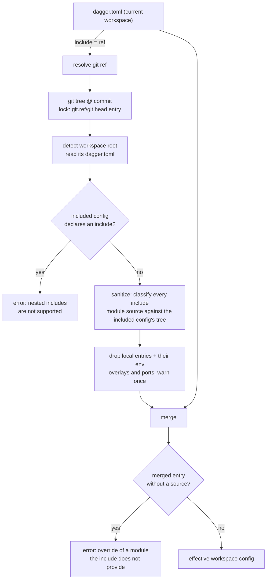
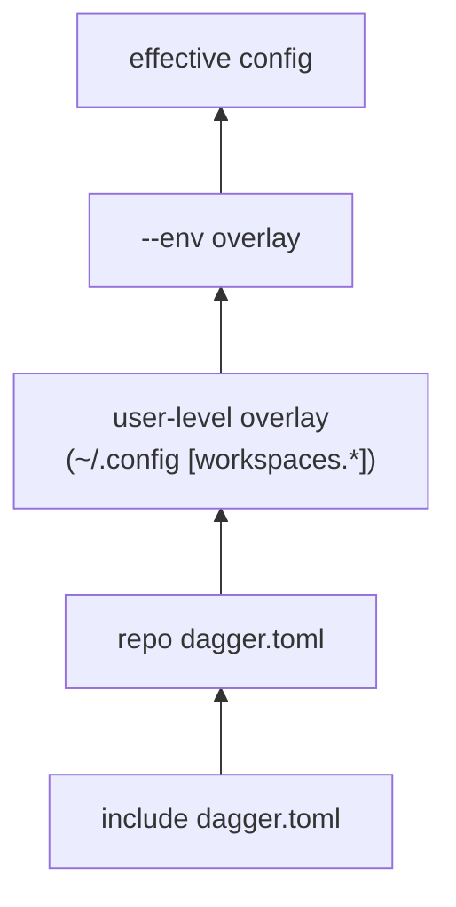

# Workspace Config Include

author: eunomie
created: 2026-08-12
status: implemented

## Progress

| Field | Value |
| --- | --- |
| Phase | Draft PR open; renamed to `include`, reshaped to `[[include]]` with path or git sources, rebased |
| Branch | `feature-dev-a451d460` |
| Base | `upstream/main` @ `752b365cf` |
| PR | [#13882](https://github.com/dagger/dagger/pull/13882) (draft) |
| Last green SHA | `b8215e01bea18143892ebb29477f1bc400c33d2e` (87 checks passed, 1 skipped) |

## Problem

Teams that run Dagger across many repositories duplicate the same `dagger.toml`
in every one of them: the same toolchain modules, the same pinned tool versions,
the same module settings, the same env definitions. When a version moves, every
repository has to be edited.

This is a confirmed want, not a hypothetical one. From Discord:

- _vindico_: "I'm currently putting duplicated workspace config in a lot of repos."
- _chrisp6229_: asked to publish standard workspace configs per project type
  (go / node / terraform) and have downstream repos point at one, so tool
  versions are managed in one place.
- _shykes_: "As long as we don't go crazy with the config layering and other
  complications, it seems reasonable. Like a basic import feature in dagger.toml."

There is no mechanism today. `dagger.toml` is read from exactly one file; the
only layering that exists is the user-level overlay (`[workspaces.*]` in the
user config) and env overlays (`[env.<name>]`), both of which are local to the
machine or to the file itself.

## Goals

- A workspace can name another config file — by path or by git ref — whose
  contents are loaded and merged **underneath** its own config.
- The current workspace wins on every conflict, with a merge rule that is
  written down per config section rather than left to whatever the code does.
  "Wins" means _explicitly set_, including an explicit `false` or an explicit
  empty list — not merely "non-zero".
- A git include is pinned in `dagger.lock` like every other git ref this repo
  resolves, refreshes under `dagger update` / `--lock=live`, and replays from
  the lock under `--lock=frozen`. A path include has nothing to pin.
- Only _remote_ module references survive the include. A local module reference
  in the included config must not become loadable in the workspace.
- The merged result is what read surfaces (`dagger workspace config`, module
  listing, env listing) report, so the effect is visible rather than silent.

## Non-goals (YAGNI)

- **No multi-include composition.** The `[[include]]` shape allows several
  entries, but resolving more than one is an error for now: no ordered layer
  stack, no diamond resolution. The limit lives in `workspace.MaxIncludes` and
  can lift without changing what anyone has written.
- **No transitive includes.** If the included config itself declares an
  include, that is an error (see
  [Limitation 1](#limitation-1--one-include-no-chain)), not a second layer.
- **No new lock operation kind.** The include reuses the existing `git.head` /
  `git.ref` / `git.tag` lock entries.
- **No inheriting the included config's local module tree**, generated clients,
  or SDK-managed authoring state — see
  [Limitation 2](#limitation-2--configuration-not-code) for what was built and
  parked here.
- **No tombstones.** An inherited entry can be overridden but not deleted. See
  [Inherited entries cannot be removed](#inherited-entries-cannot-be-removed).
- **No write-through.** `dagger install`, `dagger workspace config <key> <value>`
  and every other mutation keep writing the _local_ `dagger.toml` only. The
  include is read-only input.

## Proposed approach

### Config surface

A top-level array of tables in `dagger.toml`:

```toml
[[include]]
source = "github.com/acme/dagger-base@v1.2.0"

[modules.go]
settings.goVersion = "1.24"
```

`source` addresses a config **file**, not a workspace root, and comes in two
forms:

- **a path**: `common/base.toml` relative to the including config's directory,
  or `/common/base.toml` from the workspace root — the same rule
  `resolveWorkspacePath` applies to every other path a workspace resolves, so a
  root-anchored include reads the same from any subdirectory. A source naming a
  directory reaches the `dagger.toml` inside it.
- **a git ref**: `github.com/acme/base@v1`, or the fragment form that names the
  file inside the repository,
  `https://host/repo.git#main:dagger/common/app-base.toml`.

A git source needs a scheme or a `#` fragment. Without one there is no way to
tell where the repository ends and the path to the config begins, so anything
else reads as a path — which makes a bare `common/base.toml` mean what it looks
like.

**An array, with one entry allowed.** The shape is `[[include]]` so several can
be expressed, but resolving more than one is rejected: ordering between includes
and what happens when two of them disagree are questions this feature does not
answer yet. One entry is enough to share a base config, and the limit can lift
without changing what anyone has written. `workspace.MaxIncludes` is the single
place that says so.

**A file, not a workspace.** The earlier design resolved the ref to a workspace
_root_ and read the `dagger.toml` it detected there. Naming the file directly is
what makes `common/base.toml` and `#:dagger/common/app-base.toml` work: a
repository can publish several base configs side by side without each needing
its own workspace.

### Naming

The key is `include`, after two earlier names. `import` was rejected upstream as
confusing next to module imports; `blueprint` was tried and dropped because it
revived a retired `dagger.json` term for a different meaning. `include` says
what the feature does with no vocabulary to learn — this file, in that one — and
reads the same way in every config format people already use.

### Where it happens



Layering, lowest to highest — the include slots in _below_ everything that
exists today, so no current precedence changes:



Consumers of the merged config:

1. `engine/server/session_workspaces.go` — workspace module loading, merged
   before the user overlay and the env overlay are applied.
2. `core/schema/workspace_config.go:readWorkspaceConfig` — the shared read path
   behind `Workspace.modules`, `Workspace.envList`, `Workspace.sdks`,
   `currentModule.asSDK` and the SDK-ownership lookup in `modulesource.go`.
3. `core/schema/workspace_config.go:configRead` — **its base path too**.
   `configRead` only calls `readWorkspaceConfig` in its env-selected and
   user-overlay branches; with neither overlay it returns raw `readConfigBytes`
   output. Patching only `readWorkspaceConfig` would leave plain
   `dagger workspace config` unmerged, which is the headline surface. The
   `[[include]]` block is the one exception, and it is handled **above** the branch
   split: every effective view strips it, so answering it from a merged view
   would report "key is not set" under `--env` or a user overlay — and would
   resolve the include just to report what the local file already says.
4. `core/schema/modulesource.go:workspaceModuleSourceByName` — a separate raw
   read of `dagger.toml` from the caller's cwd, used to resolve
   `--load-module <installed-name>`.

`workspaceConfigWithCompatFallback` (checks, generate, up, port mappings, and
address demand-loading) sits on top of `readWorkspaceConfig` and inherits the
merge without its own change.

Include resolution must run under the **workspace owner's client context**
(`withWorkspaceClientContext`), the same way `readConfigBytes` and
`withUpdatedLock` do. Resolving in the caller's context would bind the git
lookup to the wrong workspace lock when the `Workspace` receiver is not the
caller's own.

Config **writers** (`loadWorkspaceConfigForOverlay`) keep parsing the raw local
file. Reads are effective; writes are local. That is the same split the env
overlay already uses.

### Merge semantics, per section

`current` is the workspace's own `dagger.toml`; `include` is the
resolved and sanitized one. **"Set" means explicitly present in the current
`dagger.toml`**, decided from the parsed TOML document, not from the Go zero
value: `entrypoint = false`, `ignore = []` and `check.skip = []` are overrides,
not absences.

| Section / key | Rule |
| --- | --- |
| `include` | Never inherited. The current workspace's own value stays in the effective config so the source is visible. An `include` in the included config is an error. |
| `ignore` | Current replaces when present, including `ignore = []` to clear. No union — a union would make it impossible to drop an inherited pattern. |
| `defaults_from_dotenv` | Current replaces when present, including `false`. |
| `check-generated` | `*bool`; current wins when non-nil. |
| `modules.<name>` | Merged **per field**, not wholesale, so a downstream repo can override one setting without repeating `source`. |
| `modules.<name>.source` | Current wins when set. When the current entry sets `source`, its `pin` travels with it and the includeed `pin` is discarded — the same coupling `applyModuleOverlays` already uses for env overlays. |
| `modules.<name>.pin` | Current wins when set, unless overridden by the source coupling above. |
| `modules.<name>.settings.<key>` | Merged key by key; current wins per key. An inherited key cannot be deleted, only overridden. |
| `modules.<name>.entrypoint` | Current replaces when present, including `false`. Presence matters here more than anywhere: an inherited `entrypoint = true` that could not be switched off would collide with the downstream repo's own entrypoint, and the loader rejects two ambient entrypoints. |
| `modules.<name>.legacy-default-path` | **Never inherited.** It is migration-compat state for a specific local module tree, not reusable configuration. A current entry keeps its own value. |
| `modules.<name>.{up,generate,check}.skip` | Current replaces when present, including an explicit empty list. |
| `modules.<name>.as-sdk` | **Never inherited** — marker, `name`, `modules` and `clients` are all dropped from the include. `modules`/`clients` are workspace-root-relative paths into the base repo; keeping the marker alone would advertise an SDK that no init flow can use, since init writes SDK-managed paths and reads only the local config. A current entry keeps its own `as-sdk` wholesale. |
| `env.<name>` | Merged per env name; an env that only the include defines is selectable downstream. |
| `env.<name>.modules.<mod>` | Same field rules as `modules.<name>` (source/pin coupling, settings key by key). |
| `ports.<host>` | Current replaces **wholesale** per host port. Per-field merge was tried and reverted: `writePortEntries` always serializes both keys, so setting one through `dagger workspace config` writes `backendPort = 0` into the file, which a presence-aware merge would then read as an explicit override to port 0. A service and its port are one unit; overriding one means repeating the other. Completeness is deliberately **not** validated — `dagger workspace config ports.3000.backendService web` writes one key at a time, so a partial mapping is a state the CLI itself produces and configs that load today would start failing on every read. Ports keep their pre-existing behavior. |

### Module entries become patches, and validation moves after the merge

With an include present, `[modules.<name>]` may omit `source` when the includeed
config supplies that module. This is the mechanism behind the primary use case
("bump one setting, inherit the module ref"), and it is a real change to the
config contract, not an implementation detail:

- **Generated JSON schema**: `docs/static/reference/dagger-workspace.schema.json`
  is reflected from `workspace.Config` by `cmd/json-schema`, and currently marks
  `source` required. `ModuleEntry.Source` gains `omitempty` so the schema stops
  rejecting a valid patch entry.
- **Serialization**: `SerializeConfig` and `configDocumentMap` must both stop
  writing `source = ""` for an entry with no source — otherwise the first
  `dagger workspace config` write over a patch entry re-introduces the empty
  key that the schema change just made unnecessary.
- **`ValidateEffectiveConfig(cfg) error`** takes over what the schema no longer
  guarantees, and it runs **unconditionally on every effective config**, not only
  when an include is present: every module entry has a non-empty source (a patch
  entry whose include was removed, or that names a module the include does not
  provide, is an error naming the module — not a `pendingModule` with an empty
  `Ref`). Port completeness is **not** checked, for the reason in the merge
  table's `ports.<host>` row.

  Running it only inside the include branch would be worse than not relaxing the
  schema at all: unsetting `include` would silently turn a valid patch into an
  unloadable entry. It is called after the optional merge in the load path and
  in the effective-read path.

Install and uninstall have to learn the same distinction, because they plan
against the raw local config:

- `planWorkspaceInstallConfig` compares a new ref against the existing entry's
  source and reports a conflict when they differ; an empty source must read as
  "not installed locally" so `dagger install` fills it in instead of failing.
- `withoutModule` deleting a source-less patch entry removes an **override**,
  not an installation — the inherited module comes back, and no managed-module
  directory is removed with it, because there is no local module. The CLI checks
  whether the module is still listed after the write and says the overrides were
  removed, rather than "Uninstalled module".

### Limitation 1 — one include, no chain

**Decision: an `[[include]]` block in the included config is an error**, reported at
workspace load with both refs named.

Silently ignoring it would hand the downstream user a config that is missing
whatever the base author expected to inherit, with no signal — the failure would
surface much later as a missing module or a wrong setting. An error is
actionable and fails closed, which is what this repo does elsewhere. The cost is
that an include author cannot themselves build on an include; that is the scope control
being asked for, and the error says so.

### Limitation 2 — configuration, not code

**Decision: module entries in the included config whose source is a local path
are dropped, with a warning naming them.**

A local source in an included config means a directory next to _that_ config,
and resolving it as written resolves it against the **consuming** workspace, via
`workspace.ResolveModuleEntrySource(configDir, …)` in
`workspaceConfigPendingModules` — loading a different module or failing with a
path the user never wrote. Dropping prevents that, and keeps an include to
sharing configuration.

Erroring instead was the first choice and is wrong: a normal repository keeps
project-specific modules under `modules/`, so erroring would make an ordinary
repo unusable as an include target because of a `ci` module the consuming user
never asked for.

**This is a deliberate stopping point, not the end state.** A git include's own
modules _are_ addressable — the config came from a repository at a known commit,
so `source = "modules/ci"` could be inherited as
`<clone-ref>/modules/ci@<commit>`, exactly the rewrite remote workspace
selection already performs through `core.GitRefString`. That was built, verified
end to end, and then parked to keep this first version minimal; the patches stay
recoverable in the branch's stgit stack (`workspace-blueprint-local-modules*`).
Two findings from that work are worth keeping:

- `gitref.Parse` drops an explicit HTTP(S) port when rebuilding a clone ref
  (only SSH puts it back), which would send a rewritten module to the wrong
  remote — with different credentials and cache keys;
- a rewrite must skip built-in SDK runtimes (`source = "dang"` is a name the
  engine resolves in-process), absolute paths, and paths that escape the
  repository, which `GitRefString` would silently normalize to a root-level
  path.

**Classification is a two-step rule against the included config's tree, not a
string heuristic and not `ParseRefString`.** For each entry, with an **empty
pin**:

1. `gitref.FastKindCheck(source, "")` — `KindLocal` → drop.
2. `KindUnknown` → stat the path next to the included config; a directory →
   drop, otherwise keep as remote. `KindGit` → keep.

Why each part:

- the empty pin is required — `FastKindCheck` returns `KindGit` for _any_ ref
  that carries a pin, so classifying with the entry's own pin would let
  `source = "./ci", pin = "…"` pass as remote, while the loader (which
  classifies with an empty pin) would then resolve it as a local path;
- statting where the config was written — not the consuming workspace — is what
  resolves `KindUnknown` correctly. A dotted path such as `modules/foo.bar`
  would otherwise be judged against the wrong tree;
- `github.com/acme/toolchain` is also `KindUnknown` and is not a directory
  there, so it is kept. Requiring `KindGit` outright would reject the most
  common remote form;
- `core.ParseRefString` looks like the natural helper and is the wrong one: for
  an ambiguous ref that is not a local directory it attempts a git parse and
  **falls back to `Local` on `EndpointError`**. A vanity-domain remote would
  then be classified local whenever endpoint discovery is unavailable.
  Classification must not depend on network reachability.

A path include has no tree of its own: it is read through the consuming
workspace's filesystem, and the classifier stats the included config's directory
there. Where no filesystem is available at all, an ambiguous ref keeps its
remote reading, which is what it looks like.

The warning is emitted **inside the shared loader**, deduplicated per **client**
and include source through the query's telemetry seen-key store (the mechanism
`shouldRecordWorkspaceMigrationProgress` already uses), and written through the
same global-writer + `slog.Warn` path the legacy compat notice uses. Per client,
not per session: a nested CLI shares its parent's session, so session scope
would silence every command after the first. Not in the load path:
`dagger workspace config` connects with `SkipWorkspaceModules`, so a warning
wired into module loading would never fire on exactly the surface where the
modules appear to be missing.

The warning names entries as the config spells them, so a dropped env overlay
appears as a dotted path (`env.ci.modules.local-ci`) rather than a bare module
name.

Dropping cascades, so no orphan state survives:

- `env.<name>.modules.<dropped>` overlays from the included config are dropped;
- included `ports.<host>` entries whose `backendService` names a dropped module
  are dropped. `backendService` is a colon-joined service path
  (`hello-with-services:web`) whose first segment is the module's **CLI-cased**
  name, matched at runtime against `Up.Name()` — so the cascade compares the
  segment before the first colon to the dropped module's kebab-cased name, not
  to its raw config key;
- an env overlay in the included config that _installs_ a local module is
  dropped the same way.

**Residual hole, accepted and stated rather than closed.** A source that is
`KindUnknown`, absent where the included config lives, and present as a directory
in the _consuming_ tree is kept by sanitization and then resolved locally
downstream, because `moduleSource` resolution stats the caller's filesystem.
Reaching it needs both halves: the included config declares a dotted, schemeless
source that does not exist next to it — so that config cannot load the module
either — and the consuming repo happens to hold a directory at exactly that
path. Closing it properly means teaching `pendingModule` a "resolve remotely
only" hint and threading it through `moduleSource`, a resolution-pipeline change
well outside a config feature.

### Inherited entries cannot be removed

The merge is additive per map key and writes only touch the local file, so an
inherited module, env, port or setting can be overridden but not deleted. No
tombstone syntax is introduced.

What this must _not_ do is fail confusingly:

- `dagger uninstall <name>` for a module that exists only in the include reports
  that the module comes from the include and cannot be uninstalled locally,
  instead of "module is not installed in the workspace". When the workspace does
  have a source-less entry for it, that entry is an override rather than an
  install, so uninstalling removes it and says the module is still provided by
  the include.
- `dagger workspace config <key> --unset` on an inherited-only value says the
  value comes from the include instead of "key is not set". The check lives in
  the schema wrapper (`unsetImportedValueError` in
  `core/schema/workspace_builders.go`, called from `withoutConfigValue`), which
  re-reads the effective config to decide — writers only ever hold the local
  one; `core/workspace`'s document editor stays include-free. A key the local
  file does spell out is never blamed on the include.

### Lockfile

No new lock entry kind. The include ref is resolved through the ordinary
`git(url).head` / `git(url).ref(name)` dagql path, which already:

- writes a `git.head` / `git.ref` entry into `dagger.lock` (namespace `""`,
  inputs `[remote, name]`, policy `pin` for tags and `float` otherwise) when the
  lookup resolves live under `pinned` or `live`;
- is refreshed afterwards by `core.UpdateWorkspaceLock` — `dagger update`
  refreshes entries that are already recorded; it does not discover an include
  that has never been resolved, so the first recording comes from an ordinary
  run;
- replays the stored pin under `--lock=frozen`, and errors when the entry is
  missing, exactly like every other frozen lookup. Frozen means the symbolic ref
  is not re-resolved; it does **not** mean offline — materializing the pinned
  tree may still fetch from the remote;
- under `--lock=pinned`, reuses the stored pin for a tag ref and re-resolves a
  branch/HEAD ref, which is this repo's current behavior for _all_ git refs, not
  something this feature chooses.

Round trip: fresh resolve → `git.ref` entry written on session flush → frozen
replay reads the pin and does not re-resolve the ref.

**Remote workspaces** (`dagger -W <ref>` where that workspace declares
an include) resolve the include the same way, but their lock behavior is the one
remote workspaces already have: no writable host lock binding, so `pinned`
degrades to live resolution, and frozen replays a committed `dagger.lock` **only
for an explicit-commit `-W` ref** (`engine/server/session.go:2167`). A remote
workspace selected by branch or tag fails under frozen with "no writable
workspace lockfile", which `core/integration/lockfile_test.go:243` already
asserts for every lookup. Inherited, not redesigned.

### CLI-visible behavior

The command is `dagger workspace config`; the hidden top-level `dagger config`
alias was removed in CLI 1.0 (`future/cli-1.0.md`).

- `dagger workspace config` (no key) prints the **merged** config as a
  standalone snapshot: the `[[include]]` block is **stripped** from the output and
  replaced by a leading `# included: <source>` comment. This follows the
  existing env precedent exactly — `effectiveWorkspaceConfigBytes` already
  clears `Env` from the effective view rather than printing the layer that
  produced it. Keeping the line in would make the output actively dangerous:
  pasted back into `dagger.toml`, it would inline every inherited value _and_
  name the include again underneath them.
- `dagger workspace config <key>` reads the merged value, same rule.
  `dagger workspace config include` still reports the local sources, one per
  line, which is how the include stays addressable.
- `dagger workspace config include <source>` sets it. The stored shape is an
  array of tables, but with one entry allowed the CLI addresses it as a single
  value, and setting it replaces rather than appends.
- Include resolution runs inside a telemetry span named
  `workspace config: <ref>`, mirroring the existing
  `applying env: <name>` span, so it is visible in the TUI and in traces and any
  fetch latency is attributed.
- Dropped local modules from the include produce one warning line naming them,
  on every command that resolves the include — including
  `dagger workspace config`, which skips workspace modules entirely.
- `dagger workspace config --help` gains the effective-read / local-write rule
  for includes, next to the `--env` wording it already carries.
- The raw local file remains available: `dagger workspace config-file` prints
  its path, and it is what every write touches.

## Alternatives considered

**A general `extends`/layer list.** Explicitly rejected upstream ("as long as we
don't go crazy with the config layering"). Multi-layer merge forces an ordering
model, conflict-precedence rules across layers, and diamond resolution — all
before anyone has asked for a second layer.

**An include at the module level (`[modules.X] from = "…"`)**. Solves nothing the
existing remote module source doesn't; the duplication complained about is the
_set_ of modules and their settings, not one entry.

**Store the include pin inline in `dagger.toml` (`include-pin = "sha"`).** The
include is a workspace-level git lookup that the lock subsystem already models; a
parallel inline pin would duplicate that state and would not be refreshed by
`dagger update`. (`dagger.toml` does carry `pin` for module and client entries —
the older "no resolved versions in dagger.toml" rule from
`hack/designs/workspace.md` is no longer categorical, so it is not the argument.)

**Merge wholesale per module entry instead of per field.** Simpler rule, and it
would avoid the source-optional change to the config contract, but it forces a
downstream repo that wants to bump one setting to copy the module's `source`
too — re-introducing exactly the duplication this feature removes.

**Erroring on local module entries in the include** instead of dropping them.
Rejected after review: it makes ordinary repositories unusable as includes. See [Limitation 2](#limitation-2--configuration-not-code).

**Classifying include sources with `gitref.FastKindCheck` alone.** Rejected: it
is bypassable through a pin and ambiguous for dotted paths. See the same
section.

**Resolve the include in the CLI** rather than the engine. The CLI has no git
resolution or lockfile machinery; the engine has both, and the merged config has
to be right for module loading, which is engine-side anyway.

## Affected components

| Area | Change |
| --- | --- |
| `core/workspace/config.go` | `Config.Import`; `ModuleEntry.Source` gains `omitempty`; serialization; `cloneConfig`; `setConfigValue` case |
| `core/workspace/config_document.go` | `configDocumentMap` entry for `include`; explicit-key presence helper |
| `core/workspace/include.go` (new) | pure merge + post-merge validation |
| `core/workspace_include.go` (new, package `core`) | resolve the ref, load and sanitize the included config |
| `engine/server/session_workspaces.go` | `parseWorkspaceRemoteRef` and `normalizeWorkspaceRemoteSubdir` **move** to `core` (only `cloneGitTree` stays as a delegating wrapper), with their tests moving from `engine/server/session_test.go` to `core/workspace_include_test.go`; resolve and merge during workspace load |
| `core/schema/workspace_config.go` | merge in `readWorkspaceConfig` **and** in `configRead`'s base path; answer `include` from the local file whatever is layered on; strip `include` from the effective view; owner-client context |
| `core/schema/modulesource.go` | merge **and validate** in `workspaceModuleSourceByName` |
| `core/schema/workspace_builders.go` | uninstalling a source-less override removes the override; include-aware errors for uninstalling an inherited module and for `--unset` of an inherited value |
| `core/schema/workspace_install.go` | an empty source reads as "not installed locally" when planning an install |
| `internal/cmd/dagger/workspace.go` | `dagger workspace config --help` text; `dagger uninstall` reports the override case instead of "Uninstalled module" |
| `core/integration/workspace_include_test.go` (new) | multi-workspace fixture over a git service |
| `docs/current_docs/reference/configuration/workspace.mdx` | the `[[include]]` block and merge order |
| `docs/static/reference/dagger-workspace.schema.json` | regenerated |
| `.changes/unreleased/Added-*.yaml` | changelog entry |

Untouched on purpose: every config **write** path, the lockfile format, and the
`Workspace` GraphQL surface (no new field — the merged config flows through
existing fields).

## Testing

Unit (`core/workspace`), on the pure merge:

- every row of the merge table, including the source/pin coupling;
- explicit-zero overrides: `entrypoint = false`, `ignore = []`,
  `defaults_from_dotenv = false`, `check.skip = []` each beat an inherited value;
- `legacy-default-path` and `as-sdk` never inherited;
- ports replace wholesale per host port;
- included config declaring `include` → error;
- `ValidateEffectiveConfig`: a module entry with no source errors **with and
  without** an include present, and a partial port mapping is accepted;
- config round trip: `Import` survives `SerializeConfig` → `ParseConfig`,
  `WriteConfigValue` / `ReadConfigValue` / `DeleteConfigValue` on `include`, and
  a document-preserving update over a source-less patch entry that neither
  re-introduces `source = ""` nor duplicates the key.

Unit (`core`), on sanitization, with a `StatFS` over a fake included config's tree:

- `source = "modules/ci"` (exists in the included config's tree) → dropped;
- `source = "./ci", pin = "abc"` → dropped, proving the pin does not launder a
  local source;
- `source = "modules/foo.bar"` existing in the included config's tree → dropped;
- `source = "github.com/acme/toolchain"` → kept, **and still kept when the git
  endpoint is unreachable**, pinning the reason `ParseRefString` is not used;
- `source = "php"` — the bare short name `dagger setup` writes for a migrated
  SDK — → dropped, which is the reasoning the `setupResolveMigratedSDKs` risk
  below rests on;
- dropping cascades to the module's include env overlays and to ports whose
  `backendService` prefix is the module's kebab-cased name (covered with a
  non-canonical module key such as `MyTool`, and for a module an env overlay
  alone installs).

Integration (`core/integration/workspace_include_test.go`). A git include's
repository is served by `gitSmartHTTPServiceDirAuth` at an IP-addressable URL —
the pattern `workspaceSelectionRemoteRef` already uses, which is reachable from
the engine that resolves the include itself (no `ExperimentalServiceHost`); a
path include needs no fixture beyond a second file in the workspace.

1. **Merge**: the workspace declares an include plus one setting override with
   no `source`; `dagger workspace config` shows the included module with its ref
   inherited and the override applied, the output names the include in a comment
   instead of carrying the block, `dagger workspace config include` still reports
   the local source, and the module the include contributes loads.
2. **Conflict**: same module name in both → the current workspace's `source`
   wins and the inherited pin goes with the ref it belonged to; `ignore`
   replaces; `entrypoint = false` downstream beats an inherited
   `entrypoint = true`.
3. **Path include**: `source = "common/base.toml"` next to the including config
   is merged with no git service in play, and `source = "/common/base.toml"`
   resolves from the workspace root.
4. **Directory include**: `source = "common"` reaches `common/dagger.toml`.
5. **More than one include**: two `[[include]]` blocks → error naming the count
   and the limit.
6. **Local module blocked**: the included config declares a local module _and_
   the consuming repo contains a same-named directory. The module does not
   appear in the merged config, and the warning names it under plain
   `dagger workspace config`, which skips workspace modules entirely.
7. **No chain**: the included config includes something in turn → explicit error.
8. **Missing target**: the include points where no config exists → error naming
   the file.
9. **Dangling override**: a `[modules.x]` patch entry with no source and an
   include that does not provide `x` → clear error.
10. **Env from the include**: an env defined only in the included config is
    selectable with `--env` downstream.
11. **Writes stay local**: a setting write records only the override — no
    inherited ref, no `source = ""` — and uninstalling a module the include
    provides names the include.
12. **Lockfile**: a git include under `--lock=pinned` records a `git.ref` entry
    naming the included repository, and a `--lock=frozen` run reproduces the
    same merged config from that pin.

Two cases from the plan are deliberately absent:

- **Lock refresh** (`dagger update` / `--lock=live` after the base branch moves)
  is not expressible with this fixture: the git service serves a fixed tree, and
  re-serving moves the URL, which changes the lock inputs. The entry is the
  ordinary `git.ref` entry whose refresh `core/integration/lockfile_test.go`
  already covers.
- **"Frozen fails with no entry"** turned out to assert engine behavior this
  feature does not own: with the tree already resolved in the same engine, the
  dagql cache can satisfy `git().ref()` without the resolver — and therefore
  without the frozen check — running at all.

Error-message assertions use stable substrings.

## Risks

- **Workspace load grows a network round trip** when an include is declared: a
  ref resolution plus a git tree fetch, both dagql-cached and both skipped
  entirely when no `[[include]]` block exists. Under `--lock=frozen` the ref resolution
  is replaced by the stored pin, though the tree may still be fetched.
- **A failed include can read as "module not installed".** Address resolution
  demand-loads workspace modules and deliberately discards config errors
  (`core/schema/address.go:184`), so an unreachable include degrades to a
  not-found on that path. The module-loading path and `dagger workspace config`
  still report it properly. Accepted; noted in the PR.
- **`dagger workspace config` becomes an effective view** for the base case as
  well, which may surprise someone expecting a `cat` of the file. Mitigated by
  the same behavior already existing for `--env` and user overlays, and by
  `dagger workspace config-file`.
- **The uninstall and unset error paths re-resolve the include** to decide what
  to say: they run in a writer, which only holds the local config, so naming the
  include costs another effective read. Only on the error and override paths, and
  the resolution is dagql-cached within the session.
- **`ValidateEffectiveConfig` rejects a source-less module entry in a workspace
  with no include.** Such a config loads on `main` today — the entry becomes a
  `pendingModule` with an empty `Ref` — and now fails every read with an error
  naming the module. That is the point of moving the check off the JSON schema,
  but it is a behavior change for a config nobody writes deliberately.
- **One CLI path writes from what `configRead` returned**:
  `setupResolveMigratedSDKs` (`internal/cmd/dagger/setup.go`) parses
  `Workspace.configRead` and writes fixups back. It only rewrites entries whose
  source is a bare short name (e.g. `php`), which classify as local and are
  therefore always dropped from an include — so an inherited entry can never
  reach it. A unit test pins that reasoning; if it ever stops holding, that call
  site must read the local file instead.
- **Inherited entries cannot be deleted.** Covered above; the mitigation is
  error-message quality, not a mechanism.
- **An explicit clear reads as "not set".** `SerializeConfig` omits zero values,
  so a current `ignore = []` or `check.skip = []` that clears an inherited list
  does not appear in the effective view, and
  `dagger workspace config ignore` answers "key is not set". The _value_ it
  implies is right (the effective list is empty) and `entrypoint` /
  `defaults_from_dotenv` already resolve to `false` through
  `readMissingConfigDefault`; only the phrasing is off for explicitly-cleared
  lists. Fixing it properly needs a presence-preserving serializer, which is
  more machinery than the wording is worth. Documented.
- **Relaxing `source` to optional in the generated schema** weakens static
  validation for configs that have no include. The engine's post-merge check
  covers both cases, and is what actually gates loading.
- **Init flows against an includeed SDK.** `loadWorkspaceConfigForOverlay` is a
  write path and stays unmerged, and include `as-sdk` data is dropped entirely,
  so an SDK can only be authored against from the local config. Deliberate: init
  writes SDK-managed paths into the config that owns them.

## Related prior art

- `hack/designs/workspace.md` — `dagger.toml` shape, env overlays, entrypoint
  arbitration.
- `hack/designs/lockfile.md` — lookup entries, policy, and lock modes reused
  verbatim here.
- `future/cli-1.0.md` — `dagger workspace config` surface, `[modules.*.as-sdk]`
  semantics, and inline pins in `dagger.toml`.
- `future/done/2026-05-27-workspace-disable-inheritance.md` — a _different_
  inheritance: runtime workspace authority across module calls. Unrelated
  mechanism, but the same instinct — inheritance must be explicit and bounded.
- `future/synthetic-workspace.md` — `GitRef.asWorkspace`; the same "a git ref can
  denote a workspace" idea the include ref relies on.

## Implementation plan

### Patch series

| # | Patch | Scope |
| --- | --- | --- |
| 1 | `workspace-include-config` | `core/workspace`: the `[[include]]` block, presence helper, pure merge + validation, unit tests |
| 2 | `workspace-include-resolve` | `core`: shared remote-workspace ref parsing/cloning, include-config loader and sanitization, unit tests |
| 3 | `workspace-include-load` | `engine/server`: resolve and merge during workspace load |
| 4 | `workspace-include-reads` | `core/schema`: merge in the read paths, effective view, patch-entry-aware install/uninstall |
| 5 | `workspace-include-tests` | `core/integration`: multi-workspace fixture and the nine cases |
| 6 | `workspace-include-docs` | docs page, CLI help, regenerated JSON schema, changelog entry |

Each patch builds and tests on its own. 1 and 2 carry their own unit tests; 3
and 4 are wiring covered by 5.

### Patch 1 — `core/workspace`

`config.go`:

- `Config.Include string` with `json:"include,omitempty" toml:"include,omitempty"`.
- `ModuleEntry.Source` gains `omitempty` so a patch entry is schema-valid.
- `SerializeConfig`: emit `include = "…"` before `ignore`; skip `source` when
  empty.
- `ValidateEffectiveConfig(cfg *Config) error`: non-empty source on every module
  entry, both fields on every port entry. Called unconditionally by consumers,
  include or not.
- `cloneConfig`: copy `Import`.
- `setConfigValue`: an `"include"` case accepting `include` or
  `include.source`, replacing the list with the single entry given.
- `readMissingConfigDefault`: unchanged, `include` has no default.
- `SerializeConfig` writes the `[[include]]` blocks **after** the top-level
  scalars: a bare key cannot follow a table header, so emitting them first would
  swallow `ignore` and friends into the include table.

`config_document.go`:

- `configDocumentMap`: deliberately does **not** carry `include` — ApplyMap
  renders an array of tables as an inline array. `rewriteIncludeSections`
  handles the blocks surgically, the same treatment the `as-sdk` sub-blocks
  already get, and inserts them after the document's global section for the
  same TOML ordering reason. It does omit `source` when empty, so editing
  another key on a patch entry does not write `source = ""` back into the
  file.
- `ExplicitConfigKeys(data []byte) (map[string]bool, error)`: the set of dotted
  key paths a config file actually spells out, walked off the `toml.Tree` with
  `JoinConfigPath` formatting. This is what makes `entrypoint = false` and
  `ignore = []` overrides rather than absences. Presence is already the rule the
  document editor uses for deletes (`config.go:796`), so this generalizes an
  existing notion rather than inventing one.

`include.go` (new):

```go
// MergeIncludedConfig layers current on top of its include. currentKeys is the
// explicit-key set of the current config, from ExplicitConfigKeys.
func MergeIncludedConfig(include, current *Config, currentKeys map[string]bool) (*Config, error)
```

1. `include.Include != ""` → `*NestedIncludeError`.
2. Clone `include` as the base; clear its `Include`, every `AsSDK` and every
   `LegacyDefaultPath`.
3. Apply `current` per the merge table, consulting `currentKeys` for the
   presence-sensitive fields.
4. `current.Import` is preserved on the result.

Source completeness is **not** checked here — it belongs to
`ValidateEffectiveConfig`, which every consumer runs whether or not an include
exists. Putting it in the merge would mean unsetting `include` silently turns a
valid patch entry into an unloadable one.

No ref classification lives here either — `core/workspace` stays free of module
resolution. Tests: table-driven per merge row, the explicit-zero cases, the
error types, and the config round trips.

### Patch 2 — `core`

`core/workspace_include.go` (package `core`):

- `ParseWorkspaceRemoteRef`, `NormalizeWorkspaceRemoteSubdir` and
  `CloneWorkspaceGitTree` moved verbatim from
  `engine/server/session_workspaces.go` (`parseWorkspaceRemoteRef`,
  `normalizeWorkspaceRemoteSubdir`, `cloneGitTree`), along with their tests;
  only `cloneGitTree` stays behind as a delegating wrapper. One implementation, no behavior change;
  the move is what lets `core/schema` and `engine/server` share it. There is no
  drop-in alternative: `ParsedGitRefString.GitRef` carries module-oriented
  semver/subdir behavior, and `GitRef.asWorkspace` is schema-private and
  API-version-gated.
- `LoadIncludedConfig(ctx, dag *dagql.Server, ref string) (*workspace.Config, error)`
  returning the sanitized config:
  1. reject a `gitref.KindLocal` ref up front;
  2. parse, clone, `workspace.DetectInRoot` at the ref's subdir, error when the
     included config's tree has no `dagger.toml` (a legacy `dagger.json`-only target is
     rejected with "run dagger setup in the included config" — compat
     workspaces are projections and have no config to inherit);
  3. parse it;
  4. sanitize: `FastKindCheck(source, "")` plus a directory stat against a
     `core.DirectoryStatFS` over the included config's tree, per
     [Limitation 2](#limitation-2--configuration-not-code). A dropped
     entry cascades to its env overlays and to ports whose `backendService`
     prefix matches its kebab-cased name;
  5. warn once per client and include ref, here rather than in any caller — the
     warning has to reach `dagger workspace config`, which skips module loading;
  6. all of it inside a span named `workspace config: <ref>`.

The clone runs through the ordinary `git(url).head` / `.ref(name)` dagql
selectors, which is what makes the lockfile entry appear — no lock code here.

### Patch 3 — `engine/server/session_workspaces.go`

In `detectAndLoadWorkspaceWithRootfs`, inside the `loadModules` block and
_before_ `ApplyUserOverlay`:

```go
if wsConfig != nil && wsConfig.Include != "" {
    include, err := core.LoadIncludedConfig(ctx, client.dag, wsConfig.Include)
    if err != nil { return err }
    wsConfig, err = workspace.MergeIncludedConfig(include, wsConfig, currentKeys)
    if err != nil { return err }
}
if err := workspace.ValidateEffectiveConfig(wsConfig); err != nil { return err }
```

Placement is load-bearing:

- after `client.workspace = coreWS`, so the workspace lock binding exists and
  the git resolution's lock entry lands in this workspace's `dagger.lock`
  (verified: `currentWorkspaceLockBinding` needs `HostPath` + `LockFile`, both
  set by then, and `client.dag` is initialized before query serving);
- before the user overlay and the env overlay, so the layering is
  include → repo → user → env.

`loadWorkspaceConfig` returns the explicit-key set alongside the parsed config,
computed from the bytes it already read, so nothing re-reads the file.

### Patch 4 — `core/schema`

- `workspace_config.go:readWorkspaceConfig` — resolve and merge after
  `ParseConfig`, under the workspace owner's client context.
- `workspace_config.go:configRead` — the base (no env, no user overlay) path
  serializes the merged config instead of returning raw bytes when an include is
  present, with `Include` cleared and a `# included: <source>` comment prepended
  (the env branch already clears `Env` the same way). With no include it keeps
  returning the file verbatim, so nothing changes for workspaces that do not use
  the feature. A read of the `[[include]]` block short-circuits to the local file
  **before** the env / user-overlay / base branch split, since every one of
  those views strips it.
- `workspace_builders.go:withoutConfigValue` — when the unset target is absent
  locally but present in the merged config, `unsetImportedValueError` names the
  include instead of "key is not set". It re-reads the effective config to
  decide, and leaves the original error alone when the key _is_ present locally.
- `modulesource.go:workspaceModuleSourceByName` — same merge, plus
  `ValidateEffectiveConfig`, so `--load-module <name>` resolves a module the
  include contributes and reports a broken config as broken rather than missing.
- `workspace_builders.go:withoutModule` — three cases instead of one: installed
  locally (unchanged), a source-less patch entry the effective config still
  provides (removes the override, no managed-module directory removal), and no
  local entry at all (cannot be uninstalled locally). `dagger uninstall` reports
  the override case honestly.
- `workspace_install.go:planWorkspaceInstallConfig` — an existing entry with an
  empty source is not a conflicting install; the new ref fills it in and clears
  any pin recorded for the inherited ref, per the source/pin coupling.
- `loadWorkspaceConfigForOverlay` is deliberately **not** touched: writes stay
  local. A comment states that.

### Patch 5 — `core/integration/workspace_include_test.go`

The base workspace is served by `workspaceSelectionRemoteRef`, which stands up
`gitSmartHTTPServiceDirAuth` and returns an IP-addressed
`http://…/repo.git@main` — reachable from the engine, which resolves the include
itself. The nine cases from [Testing](#testing) run against a container
workspace whose `dagger.toml` carries the include, with `t.Run` subtests where
one fixture answers several questions.

### Patch 6 — docs

- `docs/current_docs/reference/configuration/workspace.mdx`: the `[[include]]` block,
  merge order, source-less patch entries, explicit-empty clearing, the stripped
  `as-sdk` / `legacy-default-path` state, read-effective vs write-local, the
  no-argument snapshot rule, the two limitations, dropped local modules, the "no
  deletion of inherited entries" rule, and where the pin lives.
- `dagger workspace config --help` (`internal/cmd/dagger/workspace.go`).
- `docs/static/reference/dagger-workspace.schema.json` regenerated.
- `.changes/unreleased/Added-*.yaml`.

### Verification

```sh
go build ./...
go test ./core/workspace/... ./core/... -run 'Import'
golangci-lint run core/workspace/... core/schema/... engine/server/...
dagger call engine-dev test --pkg="./core/integration" --run='^TestWorkspaceInclude'
```

### Decisions taken

- **Key name and shape**: `[[include]]` with a `source` per entry, after
  `import` (rejected upstream as confusing) and `blueprint` (a retired term
  revived for a different meaning). The array shape leaves multiple includes
  expressible while only one resolves; recorded in
  [Config surface](#config-surface).
- **What `source` addresses**: a config _file_, by path or git ref — not a
  workspace root.
- **Nested include**: error, not ignore.
- **Local module from the include**: dropped with a warning, classified against
  the included config's tree — not an error, and not a string heuristic.
- **`as-sdk` and `legacy-default-path`**: never inherited.
- **Presence-aware overrides**: explicit `false` / `[]` in the current config
  beat inherited values.
- **`dagger workspace config` view**: merged, consistent with `--env`.
- **Module entries may omit `source`** when the include provides it, with a
  relaxed generated schema and an unconditional `ValidateEffectiveConfig` that
  is stronger than the rule it replaces.
- **The effective no-argument view strips `include`** and names it in a comment,
  so the output is a standalone snapshot rather than a config that re-includes
  itself.
- **Ports replace wholesale**, and completeness is deliberately not validated:
  per-field merge is unrepresentable while the serializer writes both keys
  unconditionally, and a partial mapping is a state `dagger workspace config`
  itself writes, so rejecting it would break configs that load today.
- **Sanitization does not use `ParseRefString`**, whose `EndpointError` fallback
  would misclassify a remote as local when the network is down.
