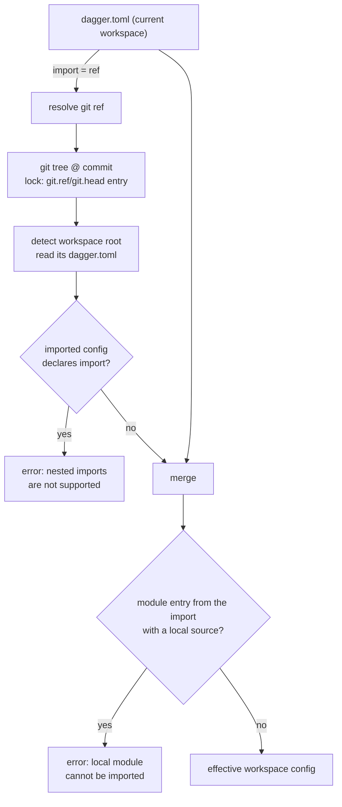
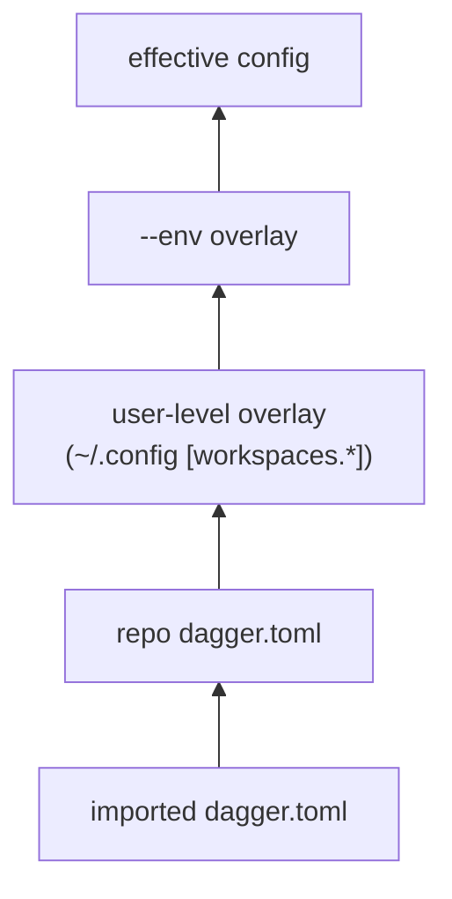

# Workspace Config Import

author: eunomie
created: 2026-08-12
status: draft

## Progress

| Field | Value |
| --- | --- |
| Phase | 1 — feature doc |
| Branch | `feature-dev-a451d460` |
| Base | `upstream/main` @ `49a8726ee` |
| PR | _not opened yet_ |
| Last green SHA | _none_ |

## Problem

Teams that run Dagger across many repositories duplicate the same `dagger.toml`
in every one of them: the same toolchain modules, the same pinned tool versions,
the same module settings, the same env definitions. When a version moves, every
repository has to be edited.

This is a confirmed want, not a hypothetical one. From Discord:

- _vindico_: "I'm currently putting duplicated workspace config in a lot of repos."
- _chrisp6229_: asked to publish standard workspace configs per project type
  (go / node / terraform) and have downstream repos point at one, so tool
  versions are managed in one place.
- _shykes_: "As long as we don't go crazy with the config layering and other
  complications, it seems reasonable. Like a basic import feature in dagger.toml."

There is no mechanism today. `dagger.toml` is read from exactly one file; the
only layering that exists is the user-level overlay (`[workspaces.*]` in the
user config) and env overlays (`[env.<name>]`), both of which are local to the
machine or to the file itself.

## Goals

- A workspace can declare **one** git ref whose `dagger.toml` is loaded and
  merged **underneath** its own config.
- The current workspace wins on every conflict, with a merge rule that is
  written down per config section rather than left to whatever the code does.
- The resolved import is pinned in `dagger.lock` like every other git ref this
  repo resolves, and refreshes under `dagger update` / `--lock=live`, replays
  from the lock under `--lock=frozen`.
- Only _remote_ module references survive the import. A local module reference
  in the imported config must not become loadable in the importing workspace.
- The merged result is what read surfaces (`dagger config`, module listing, env
  listing) report, so the effect is visible rather than silent.

## Non-goals (YAGNI)

- **No multi-import composition.** One import per workspace, full stop. No list,
  no ordered layer stack, no diamond resolution.
- **No transitive imports.** If the imported workspace itself declares `import`,
  that is an error (see [Decision: transitive imports](#decision-transitive-imports)),
  not a second layer.
- **No local-path imports.** `import = "../base"` is rejected. Imports point at
  published configs.
- **No new lock operation kind.** The import reuses the existing `git.head` /
  `git.ref` / `git.tag` lock entries.
- **No import of the base workspace's local module tree**, generated clients, or
  SDK-managed authoring state.
- **No write-through.** `dagger install`, `dagger config <key> <value>` and every
  other mutation keep writing the _local_ `dagger.toml` only. The import is
  read-only input.

## Proposed approach

### Config surface

A new top-level scalar key in `dagger.toml`:

```toml
import = "github.com/acme/dagger-base@v1.2.0"

[modules.go]
settings.goVersion = "1.24"
```

The value is the same shape of git ref the workspace already accepts for
`-W <ref>` (`github.com/acme/base@v1`, `https://host/repo.git#refs/heads/main`,
`…#main:subdir`). It resolves to a _workspace root_, not to a module: the
imported repository (or subdir) is detected as a workspace and its `dagger.toml`
is read from there.

Scalar rather than `[import] source = "…"`: there is exactly one field, the pin
lives in `dagger.lock` by design, and "a basic import feature" is the explicit
brief. Growing it into a table later is a compatible change only if the scalar
form stays accepted, so this is a real one-way door — accepted deliberately.

### Where it happens



Layering, lowest to highest — the import slots in _below_ everything that
exists today, so no current precedence changes:



Two engine-side choke points consume the merged config:

1. `engine/server/session_workspaces.go` — workspace module loading, merged
   before the user overlay and the env overlay are applied.
2. `core/schema/workspace_config.go:readWorkspaceConfig` — the shared read path
   behind `dagger config`, `Workspace.modules`, `Workspace.envList`,
   `Workspace.sdks`, `currentModule.asSDK`.

Plus `moduleSourceSchema.workspaceModuleSourceByName`, which resolves
`dagger call -m <name>` against the cwd workspace config before a workspace is
built, and reads `dagger.toml` directly.

Config **writers** (`loadWorkspaceConfigForOverlay`) keep parsing the raw local
file. Reads are effective; writes are local. That is the same split the env
overlay already uses.

### Merge semantics, per section

`current` is the importing workspace's own `dagger.toml`; `imported` is the
resolved one. "Set" means non-zero for scalars, non-empty for lists and maps.

| Section / key | Rule |
| --- | --- |
| `import` | Never inherited. The current workspace's own value stays in the effective config so the source is visible. An `import` in the imported config is an error. |
| `ignore` | Current replaces when set; otherwise the imported list. No union — a union would make it impossible for a downstream repo to drop an inherited pattern. |
| `defaults_from_dotenv` | Current wins when `true`. `false` is indistinguishable from unset in the parsed config, so a downstream repo cannot turn off an inherited `true` (see [Risks](#risks)). |
| `check-generated` | `*bool`; current wins when non-nil, otherwise the imported value. |
| `modules.<name>` | Merged **per field**, not wholesale, so a downstream repo can override one setting without repeating `source`. |
| `modules.<name>.source` | Current wins when set. When the current entry sets `source`, its `pin` travels with it and the imported `pin` is discarded — the same coupling `applyModuleOverlays` already uses for env overlays. |
| `modules.<name>.pin` | Current wins when set, unless overridden by the source coupling above. |
| `modules.<name>.settings.<key>` | Merged key by key; current wins per key. |
| `modules.<name>.entrypoint`, `legacy-default-path` | Current wins when `true`; `false` reads as unset. |
| `modules.<name>.{up,generate,check}.skip` | Current replaces when non-empty. |
| `modules.<name>.as-sdk` | Current replaces wholesale when present. From the import, the marker and `name` are kept; `as-sdk.modules` and `as-sdk.clients` are **dropped** — they are workspace-root-relative paths into the _base_ repo's tree, which is exactly the local state an import must not reach into. |
| `env.<name>` | Merged per env name; an env that only the import defines is selectable downstream. |
| `env.<name>.modules.<mod>` | Same field rules as `modules.<name>` (source/pin coupling, settings key by key). |
| `ports.<host>` | Current replaces wholesale per host port. A `PortMapping` is one unit (service + port); half-overriding it yields a mapping nobody wrote. |

### Limitation 1 — one import, no chain {#decision-transitive-imports}

**Decision: an `import` key in the imported config is an error**, reported at
workspace load with both refs named.

Silently ignoring it would hand the downstream user a config that is missing
whatever the base author expected to inherit, with no signal — the failure would
surface much later as a missing module or a wrong setting. An error is
actionable and fails closed, which is what this repo does elsewhere. The cost is
that a base config author cannot themselves import; that is the scope control
being asked for, and the error says so.

### Limitation 2 — no local modules from the import

Enforced explicitly, in the merge function, **after** the merge:

> any module entry that survived from the imported config (the current workspace
> does not define a `source` for that name) whose effective source is a local
> ref → error naming the entry, the import ref, and the offending source.

It is deliberately _not_ left to fall out of resolution. It does not: local
module sources are resolved by `workspace.ResolveModuleEntrySource(configDir, …)`
against the _importing_ workspace's config dir, so `source = "modules/ci"`
inherited from a base repo would silently resolve to `modules/ci` **in the
importing repo** — loading a different module, or failing with a confusing
"module not found" that names a path the user never wrote. Checking after the
merge means an entry the downstream repo overrides with its own source is fine,
because the imported entry did not survive.

The same check covers env-overlay module sources (`env.<name>.modules.<mod>.source`).
`as-sdk.modules` / `as-sdk.clients` paths are dropped by the merge rule above, so
they cannot leak. `ports.<host>.backendService` names a module, not a path, so it
follows whatever that module resolved to.

### Lockfile

No new lock entry kind. The import ref is resolved through the ordinary
`git(url).head` / `git(url).ref(name)` dagql path, which already:

- writes a `git.head` / `git.ref` entry into `dagger.lock` (namespace `""`,
  inputs `[remote, name]`, policy `pin` for tags and `float` otherwise);
- is refreshed by `core.UpdateWorkspaceLock` — so `dagger update` and
  `--lock=live` refresh an import with zero new code;
- replays the stored pin under `--lock=frozen`, and errors when the entry is
  missing, exactly like every other frozen lookup;
- under `--lock=pinned`, reuses the stored pin for a tag ref and re-resolves a
  branch/HEAD ref, which is this repo's current behavior for _all_ git refs, not
  something this feature chooses.

So the round trip is: fresh resolve → `git.ref` entry written on session flush →
frozen replay reads the pin and never touches the remote.

### CLI-visible behavior

- `dagger config` (no key) prints the **merged** config, with the current
  workspace's `import = "…"` line still in it — so the merged view names its own
  source. This matches the existing precedent: `dagger config` already reports
  the effective view when a user overlay or `--env` is in play.
- `dagger config <key>` reads the merged value, same rule.
- `dagger config import <ref>` / `--unset` set and clear the key through the
  existing dotted-key machinery.
- Import resolution runs inside a telemetry span named
  `importing workspace config: <ref>`, mirroring the existing
  `applying env: <name>` span, so it is visible in the TUI and in traces and any
  fetch latency is attributed.
- The raw local file remains available: `dagger workspace config-file` prints its
  path, and it is what every write touches.

## Alternatives considered

**A general `extends`/layer list.** Explicitly rejected upstream ("as long as we
don't go crazy with the config layering"). Multi-layer merge forces an ordering
model, conflict-precedence rules across layers, and diamond resolution — all
before anyone has asked for a second layer.

**Import at the module level (`[modules.X] from = "…"`)**. Solves nothing the
existing remote module source doesn't; the duplication complained about is the
_set_ of modules and their settings, not one entry.

**Store the import pin inline in `dagger.toml` (`import-pin = "sha"`),** like
`[modules.X].pin`. Rejected: the workspace design states `dagger.toml` carries no
resolved versions — those live in `dagger.lock` — and the task explicitly asks
for the lockfile. Reusing `git.ref` entries also gets `dagger update` for free.

**Merge wholesale per module entry instead of per field.** Simpler rule, but it
forces a downstream repo that wants to bump one setting to copy the module's
`source` too, which re-introduces exactly the duplication this feature removes.

**Silently skip local module entries from the import** instead of erroring.
Rejected: the downstream user then sees a module that the base repo's README
promises simply not exist, with nothing to grep for.

**Resolve the import in the CLI** rather than the engine. The CLI has no git
resolution or lockfile machinery; the engine has both, and the merged config has
to be right for module loading, which is engine-side anyway.

## Affected components

| Area | Change |
| --- | --- |
| `core/workspace/config.go` | `Config.Import` field; merge + validation function; serialization; `setConfigValue` case |
| `core/workspace/config_test.go` | merge table, precedence, local-module rejection, nested-import rejection |
| `core` (new file, e.g. `core/workspace_import.go`) | resolve an import ref: parse → clone tree → detect workspace → read + parse `dagger.toml` |
| `engine/server/session_workspaces.go` | `parseWorkspaceRemoteRef` / `cloneGitTree` delegate to the new `core` helpers; merge imported config during workspace load |
| `core/schema/workspace_config.go` | merge in `readWorkspaceConfig` (read choke point) |
| `core/schema/modulesource.go` | merge in `workspaceModuleSourceByName` |
| `core/integration/workspace_config_test.go` (or a new `workspace_import_test.go`) | multi-workspace fixture over a git service |
| `docs/` | `dagger.toml` reference gains `import` |

Untouched on purpose: every config **write** path, the lockfile format, the
`Workspace` GraphQL surface (no new field — the merged config flows through
existing fields).

## Testing

Unit (`core/workspace`), on the pure merge function:

- every row of the merge table above, including the source/pin coupling;
- current-wins precedence for each section;
- a local module source surviving from the import → error;
- an env-overlay local source surviving from the import → error;
- a local source in the import that the current config overrides → no error;
- `as-sdk.modules` / `as-sdk.clients` dropped from the import, marker kept;
- imported config declaring `import` → error.

Integration (`core/integration`), with the base workspace served by
`gitSmartHTTPServiceDirAuth` at an IP-addressable URL — the pattern
`workspaceSelectionRemoteRef` already uses, which is reachable from the engine:

1. **Merge**: importing workspace declares `import` plus one setting override;
   `dagger config` shows the base's modules with the override applied, and
   `dagger call <imported-module>` runs.
2. **Conflict**: same module name in both → the current workspace's `source`
   wins; settings merge key-wise.
3. **Local module blocked**: base config declares a local module → load fails
   with the explicit error, and the failure does _not_ resolve a same-named
   directory in the importing repo (the mis-resolution case is asserted
   directly).
4. **No chain**: base config itself declares `import` → explicit error.
5. **Lockfile round trip**: fresh run writes a `git.ref`/`git.head` entry for the
   import into `dagger.lock`; a second run under `--lock=frozen` reproduces the
   same merged config; a lock whose import entry is removed fails under frozen.
6. **Env from import**: an env defined only in the base config is selectable with
   `--env` downstream.

## Risks

- **`defaults_from_dotenv` cannot be turned off downstream.** The field is a
  plain `bool`, so `false` and unset are the same value after parsing. Narrow,
  documented; the fix (presence tracking or `*bool`, as `check-generated` already
  does) is a separate change.
- **Workspace load grows a network round trip** when an import is declared: a
  ref resolution plus a git tree fetch, both dagql-cached and both skipped
  entirely when no `import` key exists. Under `--lock=frozen` the ref resolution
  is replaced by the stored pin.
- **A read surface reached before the workspace is built** (`workspaceModuleSourceByName`)
  now performs git access. Failure there must degrade to a clear error, not a
  silent "module not found".
- **`dagger config` becoming an effective view** may surprise someone expecting
  a `cat` of the file. Mitigated by the `import` line staying visible, by the
  same behavior already existing for `--env` and user overlays, and by
  `dagger workspace config-file`.
- **Init flows against an imported SDK.** `loadWorkspaceConfigForOverlay` is a
  write path and stays unmerged, so `dagger module init <sdk>` will not find an
  SDK that only the import installs. Known gap, called out in the PR; the
  workaround is to install the SDK locally, which is what the entry would have
  to record anyway since init writes SDK-managed paths into the local config.

## Related prior art

- `hack/designs/workspace.md` — `dagger.toml` shape, env overlays, and the
  "`dagger.toml` carries no resolved versions" rule this feature follows.
- `hack/designs/lockfile.md` — lookup entries, policy, and lock modes reused
  verbatim here.
- `future/done/2026-05-27-workspace-disable-inheritance.md` — a _different_
  inheritance: runtime workspace authority across module calls. Unrelated
  mechanism, but the same instinct — inheritance must be explicit and bounded.
- `future/synthetic-workspace.md` — `GitRef.asWorkspace`; the same "a git ref can
  denote a workspace" idea the import ref relies on.
