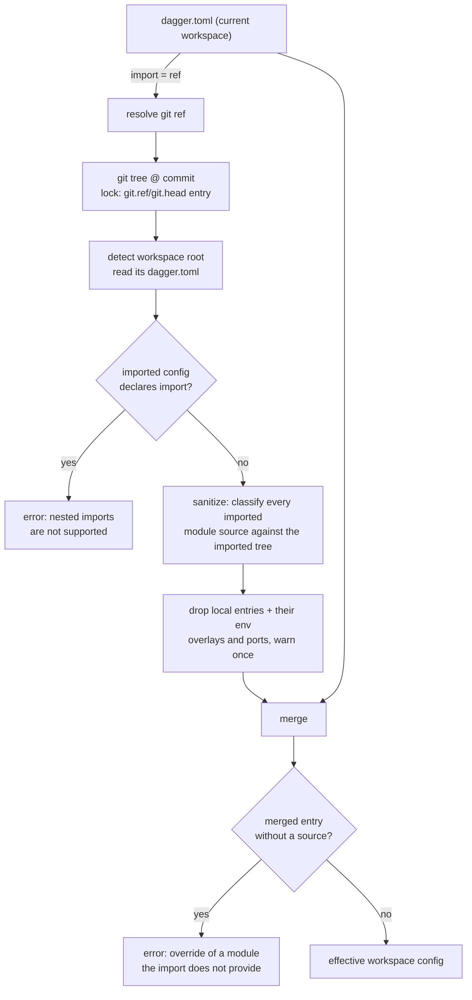
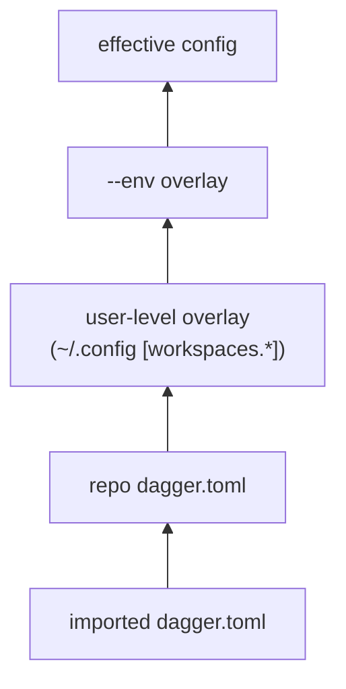

# Workspace Config Import

author: eunomie
created: 2026-08-12
status: draft

## Progress

| Field | Value |
| --- | --- |
| Phase | 3 — plan review, round 1 applied |
| Branch | `feature-dev-a451d460` |
| Base | `upstream/main` @ `49a8726ee` |
| PR | _not opened yet_ |
| Last green SHA | _none_ |

## Problem

Teams that run Dagger across many repositories duplicate the same `dagger.toml`
in every one of them: the same toolchain modules, the same pinned tool versions,
the same module settings, the same env definitions. When a version moves, every
repository has to be edited.

This is a confirmed want, not a hypothetical one. From Discord:

- _vindico_: "I'm currently putting duplicated workspace config in a lot of repos."
- _chrisp6229_: asked to publish standard workspace configs per project type
  (go / node / terraform) and have downstream repos point at one, so tool
  versions are managed in one place.
- _shykes_: "As long as we don't go crazy with the config layering and other
  complications, it seems reasonable. Like a basic import feature in dagger.toml."

There is no mechanism today. `dagger.toml` is read from exactly one file; the
only layering that exists is the user-level overlay (`[workspaces.*]` in the
user config) and env overlays (`[env.<name>]`), both of which are local to the
machine or to the file itself.

## Goals

- A workspace can declare **one** git ref whose `dagger.toml` is loaded and
  merged **underneath** its own config.
- The current workspace wins on every conflict, with a merge rule that is
  written down per config section rather than left to whatever the code does.
  "Wins" means _explicitly set_, including an explicit `false` or an explicit
  empty list — not merely "non-zero".
- The resolved import is pinned in `dagger.lock` like every other git ref this
  repo resolves, refreshes under `dagger update` / `--lock=live`, and replays
  from the lock under `--lock=frozen`.
- Only _remote_ module references survive the import. A local module reference
  in the imported config must not become loadable in the importing workspace.
- The merged result is what read surfaces (`dagger workspace config`, module
  listing, env listing) report, so the effect is visible rather than silent.

## Non-goals (YAGNI)

- **No multi-import composition.** One import per workspace, full stop. No list,
  no ordered layer stack, no diamond resolution.
- **No transitive imports.** If the imported workspace itself declares `import`,
  that is an error (see [Limitation 1](#limitation-1--one-import-no-chain)), not
  a second layer.
- **No local-path imports.** `import = "../base"` is rejected. Imports point at
  published configs.
- **No new lock operation kind.** The import reuses the existing `git.head` /
  `git.ref` / `git.tag` lock entries.
- **No import of the base workspace's local module tree**, generated clients, or
  SDK-managed authoring state.
- **No tombstones.** An inherited entry can be overridden but not deleted. See
  [Inherited entries cannot be removed](#inherited-entries-cannot-be-removed).
- **No write-through.** `dagger install`, `dagger workspace config <key> <value>`
  and every other mutation keep writing the _local_ `dagger.toml` only. The
  import is read-only input.

## Proposed approach

### Config surface

A new top-level scalar key in `dagger.toml`:

```toml
import = "github.com/acme/dagger-base@v1.2.0"

[modules.go]
settings.goVersion = "1.24"
```

The value is the same shape of git ref the workspace already accepts for
`-W <ref>` (`github.com/acme/base@v1`, `https://host/repo.git#refs/heads/main`,
`…#main:subdir`). It resolves to a _workspace root_, not to a module: the
imported repository (or subdir) is detected as a workspace and its `dagger.toml`
is read from there.

Scalar rather than `[import] source = "…"`: there is exactly one field, the pin
lives in `dagger.lock` by design, and "a basic import feature" is the explicit
brief. Growing it into a table later is a compatible change only if the scalar
form stays accepted, so this is a real one-way door — accepted deliberately.

The example above is also the feature's point: `[modules.go]` carries **no
`source`**. See [Module entries become patches](#module-entries-become-patches).

### Where it happens



Layering, lowest to highest — the import slots in _below_ everything that
exists today, so no current precedence changes:



Consumers of the merged config:

1. `engine/server/session_workspaces.go` — workspace module loading, merged
   before the user overlay and the env overlay are applied.
2. `core/schema/workspace_config.go:readWorkspaceConfig` — the shared read path
   behind `Workspace.modules`, `Workspace.envList`, `Workspace.sdks`,
   `currentModule.asSDK` and the SDK-ownership lookup in `modulesource.go`.
3. `core/schema/workspace_config.go:configRead` — **its base path too**.
   `configRead` only calls `readWorkspaceConfig` in its env-selected and
   user-overlay branches; with neither overlay it returns raw
   `readConfigBytes` output (`core/schema/workspace_config.go:234`). Patching
   only `readWorkspaceConfig` would leave plain `dagger workspace config`
   unmerged, which is the headline surface.
4. `core/schema/modulesource.go:workspaceModuleSourceByName` — a separate raw
   read of `dagger.toml` from the caller's cwd, used to resolve
   `--load-module <installed-name>`.

Import resolution must run under the **workspace owner's client context**
(`withWorkspaceClientContext`), the same way `readConfigBytes` and
`withUpdatedLock` do. Resolving in the caller's context would bind the git
lookup to the wrong workspace lock when the `Workspace` receiver is not the
caller's own.

Config **writers** (`loadWorkspaceConfigForOverlay`) keep parsing the raw local
file. Reads are effective; writes are local. That is the same split the env
overlay already uses.

### Merge semantics, per section

`current` is the importing workspace's own `dagger.toml`; `imported` is the
resolved and sanitized one. **"Set" means explicitly present in the current
`dagger.toml`**, decided from the parsed TOML document, not from the Go zero
value: `entrypoint = false`, `ignore = []` and `check.skip = []` are overrides,
not absences.

| Section / key | Rule |
| --- | --- |
| `import` | Never inherited. The current workspace's own value stays in the effective config so the source is visible. An `import` in the imported config is an error. |
| `ignore` | Current replaces when present, including `ignore = []` to clear. No union — a union would make it impossible to drop an inherited pattern. |
| `defaults_from_dotenv` | Current replaces when present, including `false`. |
| `check-generated` | `*bool`; current wins when non-nil. |
| `modules.<name>` | Merged **per field**, not wholesale, so a downstream repo can override one setting without repeating `source`. |
| `modules.<name>.source` | Current wins when set. When the current entry sets `source`, its `pin` travels with it and the imported `pin` is discarded — the same coupling `applyModuleOverlays` already uses for env overlays. |
| `modules.<name>.pin` | Current wins when set, unless overridden by the source coupling above. |
| `modules.<name>.settings.<key>` | Merged key by key; current wins per key. An inherited key cannot be deleted, only overridden. |
| `modules.<name>.entrypoint` | Current replaces when present, including `false`. Presence matters here more than anywhere: an inherited `entrypoint = true` that could not be switched off would collide with the downstream repo's own entrypoint, and the loader rejects two ambient entrypoints. |
| `modules.<name>.legacy-default-path` | **Never inherited.** It is migration-compat state for a specific local module tree, not reusable configuration. A current entry keeps its own value. |
| `modules.<name>.{up,generate,check}.skip` | Current replaces when present, including an explicit empty list. |
| `modules.<name>.as-sdk` | **Never inherited** — marker, `name`, `modules` and `clients` are all dropped from the import. `modules`/`clients` are workspace-root-relative paths into the base repo; keeping the marker alone would advertise an SDK that no init flow can use, since init writes SDK-managed paths and reads only the local config. A current entry keeps its own `as-sdk` wholesale. |
| `env.<name>` | Merged per env name; an env that only the import defines is selectable downstream. |
| `env.<name>.modules.<mod>` | Same field rules as `modules.<name>` (source/pin coupling, settings key by key). |
| `ports.<host>` | Merged per field (`backendService`, `backendPort`), like module entries. Wholesale replacement was considered and rejected: config addressing sets the two keys independently, so a partial current `[ports.3000]` would blank the other half of a complete inherited mapping. |

### Module entries become patches

With an import present, `[modules.<name>]` may omit `source` when the imported
config supplies that module. This is the mechanism behind the primary use case
("bump one setting, inherit the module ref"), and it is a real change to the
config contract, not an implementation detail:

- **Post-merge validation**: every module entry in the merged config must have a
  non-empty source. An entry that survives with no source — the import was
  removed, or the base dropped that module — is an error naming the module and
  the import, not a silent unloadable entry.
- **Generated JSON schema**: `docs/static/reference/dagger-workspace.schema.json`
  is reflected from `workspace.Config` by `cmd/json-schema`, and currently marks
  `source` required. `ModuleEntry.Source` gains `omitempty` so the schema stops
  rejecting a valid patch entry. The engine's post-merge check is strictly
  stronger than the schema rule it relaxes.
- **Serialization**: `SerializeConfig` must stop writing `source = ""` for an
  entry with no source.

### Limitation 1 — one import, no chain

**Decision: an `import` key in the imported config is an error**, reported at
workspace load with both refs named.

Silently ignoring it would hand the downstream user a config that is missing
whatever the base author expected to inherit, with no signal — the failure would
surface much later as a missing module or a wrong setting. An error is
actionable and fails closed, which is what this repo does elsewhere. The cost is
that a base config author cannot themselves import; that is the scope control
being asked for, and the error says so.

### Limitation 2 — no local modules from the import

**Decision: imported local module entries are dropped with a warning, not an
error.**

An error was the first choice and is wrong: a normal repository keeps its own
project-specific modules under `modules/` (`hack/designs/workspace.md`,
"Project-Specific Modules"), so erroring would make any ordinary repo unusable
as an import target because of a `ci` module the downstream user never asked
for. Dropping enforces the limitation just as hard — the entry does not exist
downstream, so it can never resolve — while keeping the import usable. One
deduplicated warning names every dropped entry and why, through the same
`console(ctx, …)` + `slog.Warn` path the legacy compat notice uses.

**Classification happens against the imported tree, not against a string
heuristic.** Each imported entry's source runs through `core.ParseRefString`
with a `StatFS` over the **imported** workspace tree and an **empty pin**:

- an empty pin is required — `gitref.FastKindCheck` returns `KindGit` for _any_
  ref that carries a pin (`core/gitref/gitref.go:82`), so classifying with the
  entry's own pin would let `source = "./ci", pin = "…"` pass as remote, while
  the loader (which classifies with an empty pin,
  `engine/server/session_workspaces.go:559`) would then resolve it as a local
  path;
- statting the imported tree is what resolves `KindUnknown` correctly. A dotted
  path such as `modules/foo.bar` is `KindUnknown` and would otherwise be
  resolved by statting the **importing** workspace — the exact mis-resolution
  this limitation exists to prevent. Against the imported tree it classifies as
  the base's local module and is dropped;
- `github.com/acme/toolchain` is also `KindUnknown`; it does not exist in the
  imported tree, so it falls through to the git parse and is kept. Requiring
  `KindGit` outright would reject this, the most common remote form.

Dropping cascades, so no orphan state survives:

- `env.<name>.modules.<dropped>` overlays from the imported config are dropped;
- imported `ports.<host>` entries whose `backendService` names a dropped module
  are dropped;
- an env overlay in the imported config that _installs_ a module with a local
  source is dropped the same way.

Without this, an inherited `source = "modules/ci"` would be resolved by
`workspace.ResolveModuleEntrySource(configDir, …)` against the **importing**
workspace's config dir (`engine/server/session_workspaces.go:528`), loading a
different module or failing with a path the user never wrote.

### Inherited entries cannot be removed

The merge is additive per map key and writes only touch the local file, so an
inherited module, env, port or setting can be overridden but not deleted. No
tombstone syntax is introduced.

What this must _not_ do is fail confusingly:

- `dagger uninstall <name>` for a module that exists only in the import reports
  that the module comes from the import and cannot be uninstalled locally,
  instead of "module is not installed in the workspace".
- `dagger workspace config <key> --unset` on an inherited-only value keeps the
  existing "key is not set" error; making that import-aware would push import
  knowledge into `core/workspace`'s document editor, which is deliberately
  import-free. Documented, not fixed.

### Lockfile

No new lock entry kind. The import ref is resolved through the ordinary
`git(url).head` / `git(url).ref(name)` dagql path, which already:

- writes a `git.head` / `git.ref` entry into `dagger.lock` (namespace `""`,
  inputs `[remote, name]`, policy `pin` for tags and `float` otherwise) when the
  lookup resolves live under `pinned` or `live`;
- is refreshed afterwards by `core.UpdateWorkspaceLock` — `dagger update`
  refreshes entries that are already recorded; it does not discover an import
  that has never been resolved, so the first recording comes from an ordinary
  run;
- replays the stored pin under `--lock=frozen`, and errors when the entry is
  missing, exactly like every other frozen lookup. Frozen means the symbolic ref
  is not re-resolved; it does **not** mean offline — materializing the pinned
  tree may still fetch from the remote;
- under `--lock=pinned`, reuses the stored pin for a tag ref and re-resolves a
  branch/HEAD ref, which is this repo's current behavior for _all_ git refs, not
  something this feature chooses.

Round trip: fresh resolve → `git.ref` entry written on session flush → frozen
replay reads the pin and does not re-resolve the ref.

**Remote importing workspaces** (`dagger -W <ref>` where that workspace declares
an import) resolve the import the same way, but their lock behavior is the one
remote workspaces already have: no writable host lock binding, so `pinned`
degrades to live resolution, and frozen replays a committed `dagger.lock` **only
for an explicit-commit `-W` ref** (`engine/server/session.go:2167`). A remote
workspace selected by branch or tag fails under frozen with "no writable
workspace lockfile", which `core/integration/lockfile_test.go:243` already
asserts for every lookup. Inherited, not redesigned.

### CLI-visible behavior

The command is `dagger workspace config`; the hidden top-level `dagger config`
alias was removed in CLI 1.0 (`future/cli-1.0.md`).

- `dagger workspace config` (no key) prints the **merged** config, with the
  current workspace's `import = "…"` line still in it — so the merged view names
  its own source. This matches the existing precedent: it already reports the
  effective view when a user overlay or `--env` is in play.
- `dagger workspace config <key>` reads the merged value, same rule.
- `dagger workspace config import <ref>` / `--unset` set and clear the key
  through the existing dotted-key machinery.
- Import resolution runs inside a telemetry span named
  `importing workspace config: <ref>`, mirroring the existing
  `applying env: <name>` span, so it is visible in the TUI and in traces and any
  fetch latency is attributed.
- Dropped local modules from the import produce one warning line naming them.
- The raw local file remains available: `dagger workspace config-file` prints
  its path, and it is what every write touches.

## Alternatives considered

**A general `extends`/layer list.** Explicitly rejected upstream ("as long as we
don't go crazy with the config layering"). Multi-layer merge forces an ordering
model, conflict-precedence rules across layers, and diamond resolution — all
before anyone has asked for a second layer.

**Import at the module level (`[modules.X] from = "…"`)**. Solves nothing the
existing remote module source doesn't; the duplication complained about is the
_set_ of modules and their settings, not one entry.

**Store the import pin inline in `dagger.toml` (`import-pin = "sha"`).** The
import is a workspace-level git lookup that the lock subsystem already models; a
parallel inline pin would duplicate that state and would not be refreshed by
`dagger update`. (`dagger.toml` does carry `pin` for module and client entries —
the older "no resolved versions in dagger.toml" rule from
`hack/designs/workspace.md` is no longer categorical, so it is not the argument.)

**Merge wholesale per module entry instead of per field.** Simpler rule, and it
would avoid the source-optional change to the config contract, but it forces a
downstream repo that wants to bump one setting to copy the module's `source`
too — re-introducing exactly the duplication this feature removes.

**Erroring on local module entries in the import** instead of dropping them.
Rejected after review: it makes ordinary repositories unusable as import
targets. See [Limitation 2](#limitation-2--no-local-modules-from-the-import).

**Classifying imported sources with `gitref.FastKindCheck` alone.** Rejected: it
is bypassable through a pin and ambiguous for dotted paths. See the same
section.

**Resolve the import in the CLI** rather than the engine. The CLI has no git
resolution or lockfile machinery; the engine has both, and the merged config has
to be right for module loading, which is engine-side anyway.

## Affected components

| Area | Change |
| --- | --- |
| `core/workspace/config.go` | `Config.Import`; `ModuleEntry.Source` gains `omitempty`; serialization; `cloneConfig`; `setConfigValue` case |
| `core/workspace/config_document.go` | `configDocumentMap` entry for `import`; explicit-key presence helper |
| `core/workspace/import.go` (new) | pure merge + post-merge validation |
| `core/workspace_import.go` (new, package `core`) | resolve the ref, load and sanitize the imported config |
| `engine/server/session_workspaces.go` | `parseWorkspaceRemoteRef` / `cloneGitTree` delegate to the new `core` helpers; resolve and merge during workspace load |
| `core/schema/workspace_config.go` | merge in `readWorkspaceConfig` **and** in `configRead`'s base path; owner-client context |
| `core/schema/modulesource.go` | merge in `workspaceModuleSourceByName` |
| `core/schema/workspace_builders.go` | import-aware error for `dagger uninstall` of an inherited module |
| `core/integration/workspace_import_test.go` (new) | multi-workspace fixture over a git service |
| `docs/current_docs/reference/configuration/workspace.mdx` | the `import` key and merge order |
| `docs/static/reference/dagger-workspace.schema.json` | regenerated |
| `.changes/unreleased/Added-*.yaml` | changelog entry |

Untouched on purpose: every config **write** path, the lockfile format, and the
`Workspace` GraphQL surface (no new field — the merged config flows through
existing fields).

## Testing

Unit (`core/workspace`), on the pure merge:

- every row of the merge table, including the source/pin coupling;
- explicit-zero overrides: `entrypoint = false`, `ignore = []`,
  `defaults_from_dotenv = false`, `check.skip = []` each beat an inherited value;
- `legacy-default-path` and `as-sdk` never inherited;
- ports merge per field;
- a merged module entry with no source → error;
- imported config declaring `import` → error;
- config round trip: `Import` survives `SerializeConfig` → `ParseConfig`,
  `WriteConfigValue` / `ReadConfigValue` / `DeleteConfigValue` on `import`, and
  a document-preserving update that neither drops nor duplicates the key.

Unit (`core`), on sanitization, with a `StatFS` over a fake imported tree:

- `source = "modules/ci"` (exists in the imported tree) → dropped;
- `source = "./ci", pin = "abc"` → dropped, proving the pin does not launder a
  local source;
- `source = "modules/foo.bar"` existing in the imported tree → dropped;
- `source = "github.com/acme/toolchain"` → kept;
- dropping cascades to the module's imported env overlays and ports.

Integration (`core/integration/workspace_import_test.go`), with the base
workspace served by `gitSmartHTTPServiceDirAuth` at an IP-addressable URL — the
pattern `workspaceSelectionRemoteRef` already uses, which is reachable from the
engine that resolves the import itself (no `ExperimentalServiceHost`):

1. **Merge**: importing workspace declares `import` plus one setting override
   with no `source`; `dagger workspace config` shows the base's modules with the
   override applied, and `dagger call <imported-module>` runs.
2. **Conflict**: same module name in both → the current workspace's `source`
   wins; settings merge key-wise; `entrypoint = false` downstream beats an
   inherited `entrypoint = true`.
3. **Local module blocked**: the base declares a local module _and_ the
   importing repo contains a same-named directory. The module does not appear in
   the merged config, the warning names it, and nothing resolves to the
   importing repo's directory.
4. **No chain**: base config itself declares `import` → explicit error.
5. **Lockfile round trip**: a first run writes a `git.ref`/`git.head` entry for
   the import into `dagger.lock`; a second run under `--lock=frozen` reproduces
   the same merged config; removing that entry makes frozen fail.
6. **Env from import**: an env defined only in the base config is selectable
   with `--env` downstream.
7. **Dangling override**: a `[modules.x]` patch entry with no source and an
   import that does not provide `x` → clear error.

## Risks

- **Workspace load grows a network round trip** when an import is declared: a
  ref resolution plus a git tree fetch, both dagql-cached and both skipped
  entirely when no `import` key exists. Under `--lock=frozen` the ref resolution
  is replaced by the stored pin, though the tree may still be fetched.
- **A failed import can read as "module not installed".** Address resolution
  demand-loads workspace modules and deliberately discards config errors
  (`core/schema/address.go:184`), so an unreachable import degrades to a
  not-found on that path. The module-loading path and `dagger workspace config`
  still report it properly. Accepted; noted in the PR.
- **`dagger workspace config` becomes an effective view** for the base case as
  well, which may surprise someone expecting a `cat` of the file. Mitigated by
  the `import` line staying visible, by the same behavior already existing for
  `--env` and user overlays, and by `dagger workspace config-file`.
- **One CLI path writes from what `configRead` returned**:
  `setupResolveMigratedSDKs` (`internal/cmd/dagger/setup.go`) parses
  `Workspace.configRead` and writes fixups back. It only rewrites entries whose
  source is a bare short name (e.g. `php`), which classify as local and are
  therefore always dropped from an import — so an inherited entry can never
  reach it. A unit test pins that reasoning; if it ever stops holding, that call
  site must read the local file instead.
- **Inherited entries cannot be deleted.** Covered above; the mitigation is
  error-message quality, not a mechanism.
- **Relaxing `source` to optional in the generated schema** weakens static
  validation for configs that have no import. The engine's post-merge check
  covers both cases, and is what actually gates loading.
- **Init flows against an imported SDK.** `loadWorkspaceConfigForOverlay` is a
  write path and stays unmerged, and imported `as-sdk` data is dropped entirely,
  so an SDK can only be authored against from the local config. Deliberate: init
  writes SDK-managed paths into the config that owns them.

## Related prior art

- `hack/designs/workspace.md` — `dagger.toml` shape, env overlays, entrypoint
  arbitration.
- `hack/designs/lockfile.md` — lookup entries, policy, and lock modes reused
  verbatim here.
- `future/cli-1.0.md` — `dagger workspace config` surface, `[modules.*.as-sdk]`
  semantics, and inline pins in `dagger.toml`.
- `future/done/2026-05-27-workspace-disable-inheritance.md` — a _different_
  inheritance: runtime workspace authority across module calls. Unrelated
  mechanism, but the same instinct — inheritance must be explicit and bounded.
- `future/synthetic-workspace.md` — `GitRef.asWorkspace`; the same "a git ref can
  denote a workspace" idea the import ref relies on.

## Implementation plan

### Patch series

| # | Patch | Scope |
| --- | --- | --- |
| 1 | `workspace-import-config` | `core/workspace`: the `import` key, presence helper, pure merge + validation, unit tests |
| 2 | `workspace-import-resolve` | `core`: shared remote-workspace ref parsing/cloning, imported-config loader and sanitization, unit tests |
| 3 | `workspace-import-load` | `engine/server`: resolve and merge during workspace load |
| 4 | `workspace-import-reads` | `core/schema`: merge in the read paths; import-aware uninstall error |
| 5 | `workspace-import-tests` | `core/integration`: multi-workspace fixture and the seven cases |
| 6 | `workspace-import-docs` | docs page, regenerated JSON schema, changelog entry |

Each patch builds and tests on its own. 1 and 2 carry their own unit tests; 3
and 4 are wiring covered by 5.

### Patch 1 — `core/workspace`

`config.go`:

- `Config.Import string` with `json:"import,omitempty" toml:"import,omitempty"`.
- `ModuleEntry.Source` gains `omitempty` so a patch entry is schema-valid.
- `SerializeConfig`: emit `import = "…"` before `ignore`; skip `source` when
  empty.
- `cloneConfig`: copy `Import`.
- `setConfigValue`: an `"import"` case, single-segment, string value — mirroring
  the `"ignore"` case's shape.
- `readMissingConfigDefault`: unchanged, `import` has no default.

`config_document.go`:

- `configDocumentMap`: `values["import"]` when non-empty, so document-preserving
  writes and managed-path deletion handle it like the other scalars.
- `ExplicitConfigKeys(data []byte) (map[string]bool, error)`: the set of dotted
  key paths a config file actually spells out, walked off the `toml.Tree` with
  `JoinConfigPath` formatting. This is what makes `entrypoint = false` and
  `ignore = []` overrides rather than absences. Presence is already the rule the
  document editor uses for deletes (`config.go:796`), so this generalizes an
  existing notion rather than inventing one.

`import.go` (new):

```go
// MergeImportedConfig layers current on top of imported. currentKeys is the
// explicit-key set of the current config, from ExplicitConfigKeys.
func MergeImportedConfig(imported, current *Config, currentKeys map[string]bool) (*Config, error)
```

1. `imported.Import != ""` → `*NestedImportError`.
2. Clone `imported` as the base; clear its `Import`, every `AsSDK` and every
   `LegacyDefaultPath`.
3. Apply `current` per the merge table, consulting `currentKeys` for the
   presence-sensitive fields.
4. Post-merge: a module entry with an empty source → `*DanglingOverrideError`
   naming the module and the import ref.
5. `current.Import` is preserved on the result.

No ref classification lives here — `core/workspace` stays free of module
resolution. Tests: table-driven per merge row, the explicit-zero cases, the two
error types, and the config round trips.

### Patch 2 — `core`

`core/workspace_import.go` (package `core`):

- `ParseWorkspaceRemoteRef` and `CloneWorkspaceGitTree` moved verbatim from
  `engine/server/session_workspaces.go` (`parseWorkspaceRemoteRef`,
  `cloneGitTree`), which then delegates. One implementation, no behavior change;
  the move is what lets `core/schema` and `engine/server` share it. There is no
  drop-in alternative: `ParsedGitRefString.GitRef` carries module-oriented
  semver/subdir behavior, and `GitRef.asWorkspace` is schema-private and
  API-version-gated.
- `LoadImportedWorkspaceConfig(ctx, dag *dagql.Server, ref string) (*workspace.Config, []string, error)`
  returning the sanitized config and the dropped-entry names:
  1. reject a `gitref.KindLocal` ref up front;
  2. parse, clone, `workspace.DetectInRoot` at the ref's subdir, error when the
     imported tree has no `dagger.toml` (a legacy `dagger.json`-only target is
     rejected with "run dagger setup in the imported workspace" — compat
     workspaces are projections and have no config to import);
  3. parse it;
  4. sanitize: for each module entry, `ParseRefString(ctx, treeStatFS, source, "")`
     against a `core.DirectoryStatFS` over the imported tree; `Local` → drop,
     cascade to that module's env overlays and to ports naming it;
  5. all of it inside a span named `importing workspace config: <ref>`.

The clone runs through the ordinary `git(url).head` / `.ref(name)` dagql
selectors, which is what makes the lockfile entry appear — no lock code here.

### Patch 3 — `engine/server/session_workspaces.go`

In `detectAndLoadWorkspaceWithRootfs`, inside the `loadModules` block and
_before_ `ApplyUserOverlay`:

```go
if wsConfig != nil && wsConfig.Import != "" {
    imported, dropped, err := core.LoadImportedWorkspaceConfig(ctx, client.dag, wsConfig.Import)
    if err != nil { return err }
    warnDroppedImportedModules(ctx, wsConfig.Import, dropped)
    wsConfig, err = workspace.MergeImportedConfig(imported, wsConfig, currentKeys)
    if err != nil { return err }
}
```

Placement is load-bearing:

- after `client.workspace = coreWS`, so the workspace lock binding exists and
  the git resolution's lock entry lands in this workspace's `dagger.lock`
  (verified: `currentWorkspaceLockBinding` needs `HostPath` + `LockFile`, both
  set by then, and `client.dag` is initialized before query serving);
- before the user overlay and the env overlay, so the layering is
  import → repo → user → env.

`loadWorkspaceConfig` returns the raw bytes alongside the parsed config so the
explicit-key set can be computed without re-reading.

### Patch 4 — `core/schema`

- `workspace_config.go:readWorkspaceConfig` — resolve and merge after
  `ParseConfig`, under the workspace owner's client context.
- `workspace_config.go:configRead` — the base (no env, no user overlay) path
  serializes the merged config instead of returning raw bytes when an import is
  present. With no import it keeps returning the file verbatim, so nothing
  changes for workspaces that do not use the feature.
- `modulesource.go:workspaceModuleSourceByName` — same merge, so
  `--load-module <name>` resolves a module the import contributes.
- `workspace_builders.go:withoutModule` — when the name is absent locally but
  present in the merged config, say so instead of "not installed".
- `loadWorkspaceConfigForOverlay` is deliberately **not** touched: writes stay
  local. A comment states that.

### Patch 5 — `core/integration/workspace_import_test.go`

Fixture helper following `workspaceSelectionRemoteRef`:

```go
func workspaceImportBaseRef(ctx, t, c, base *dagger.Directory) string
```

serving the base workspace over `gitSmartHTTPServiceDirAuth` and returning an
IP-addressed `http://…/repo.git@main`. The seven cases from
[Testing](#testing) run as `t.Run` subtests against a container workspace whose
`dagger.toml` carries the import.

### Patch 6 — docs

- `docs/current_docs/reference/configuration/workspace.mdx`: the `import` key,
  merge order, the two limitations, dropped local modules, the "no deletion of
  inherited entries" rule, and where the pin lives.
- `docs/static/reference/dagger-workspace.schema.json` regenerated.
- `.changes/unreleased/Added-*.yaml`.

### Verification

```sh
go build ./...
go test ./core/workspace/... ./core/... -run 'Import'
golangci-lint run core/workspace/... core/schema/... engine/server/...
dagger call engine-dev test --pkg="./core/integration" --run='^TestWorkspaceImport'
```

### Decisions taken

- **Key name**: scalar `import`. Table form is the alternative and is a one-way
  door; recorded in [Config surface](#config-surface).
- **Nested import**: error, not ignore.
- **Local module from the import**: dropped with a warning, classified against
  the imported tree — not an error, and not a string heuristic.
- **`as-sdk` and `legacy-default-path`**: never inherited.
- **Presence-aware overrides**: explicit `false` / `[]` in the current config
  beat inherited values.
- **`dagger workspace config` view**: merged, consistent with `--env`.
- **Module entries may omit `source`** when the import provides it, with a
  post-merge check and a relaxed generated schema.
