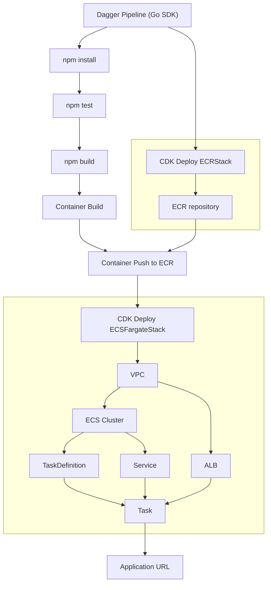

# App deployment to AWS with Dagger and the CDK

## How to use

### Bootstrap the CDK

You will have to do this only once per region.

```shell
cdk bootstrap aws://<account-id>/<region>
```

The bootstrap creates metadata in a new cloudformation stack.

### Configure you AWS credentials

This demo uses your AWS crendentials already configured under `$HOME/.aws/`.

If this directory does not exist, you should run `aws configure`.

### Run the Dagger Pipeline

```shell
go build && ./main
```

### Pipeline Overview


