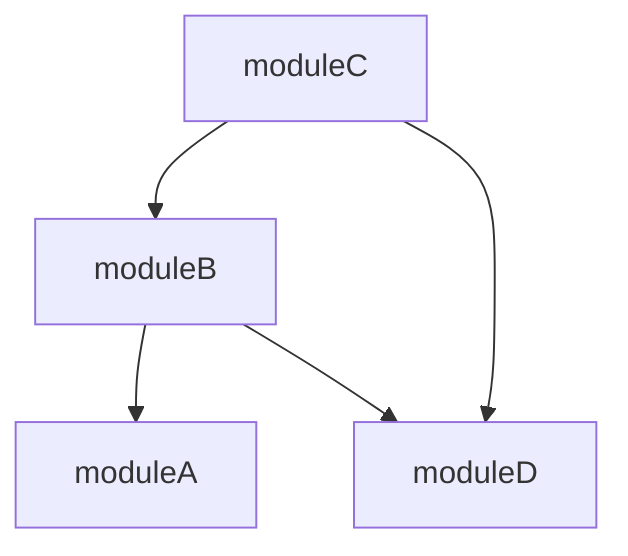

# `currentModule.asSDK.modules` — leaf-first dependency ordering

## Problem

SDK code generation over a workspace with many locally-managed modules runs
"generate all" by iterating `currentModule.asSDK.modules`. Today that field is a
pure pass-through of the `[[modules.<sdk>.as-sdk.modules]]` list in whatever
order `dagger.toml` stores it — zero dependency awareness. When module C depends
on module B depends on module A, generating in declaration order can regenerate
C against a stale B. Order must be **leaf-first**: a module's locally-managed
dependencies must be generated before it.

The SDK generator (`dagger/go-sdk`'s `go-sdk.dang` `generateAll`) just folds over
`currentModule.asSDK.modules` in list order:

```
currentModule.asSDK.modules
  .map { m => Mod(path: m.path, ...) }
  .filter { mod => mod.skipGenerate(ws) == false }
  .reduce(pws.fork) { fork, mod => fork.merge(pws.moduleSource("/" + mod.path).generate) }
```

No SDK-side sorting. So the fix is entirely engine-side: return the list already
ordered leaf-first. **Zero SDK changes** (confirmed against `go-sdk.dang`).

## Approach

Order the list once, where it is built, in `currentModuleAsSDK`
(`core/schema/module_as_sdk.go`). `currentModuleAsSDKModules` stays a pure
pass-through — the ordering is baked into the persisted `CurrentModuleAsSDK`
object, computed once per `asSDK` resolution (the field is `DoNotCache`; it is
queried once per generate-all, so N small toml reads once is fine).

### Dependency source

Each managed module's directory (`SDKManagedModule.Path`, **workspace-root**-
relative — per its doc comment and the go-sdk consumer `moduleSource("/" +
mod.path)`; *not* config-dir-relative) contains `dagger-module.toml`. Its
`[[dependencies]]` list (`modules.ModuleConfigDependency`) carries the edges.
Only current-schema **dependencies** are modeled — toolchains/blueprint are
legacy `dagger.json` concepts not persisted in current `dagger-module.toml`, and
`LocalModuleRefs` includes them only for migration. Only **local** deps
(`workspace.IsLocalRef(dep.Source, dep.Pin)`) can point at another
workspace-managed module; git/registry deps are external and already resolved
independently — treat as leaves (no edge).

A local dep's `Source` is relative to the referring module's config-file dir
(= its `Path`). **Absolute** sources are rejected before joining (mirroring the
loader's `ResolveDepToSource`, which rejects absolute local deps) — no edge.
Otherwise resolve to a workspace-root-relative path
`clean(join(m.Path, dep.Source))`, then match against the set of managed module
`Path`s (both canonicalized with `path.Clean(filepath.ToSlash(...))`). A match
is an ordering edge `m -> dep`; a local dep resolving outside the managed set
(e.g. via `..` escaping the root) is an external leaf (no edge). A dep resolving
to the module itself (self-ref) is skipped — no edge, not a reported cycle.

Both the file-read path (`join(m.Path, dagger-module.toml)`) and the edge
resolution use the workspace root as the base; `readWorkspaceFileBytes` reads
relative to the workspace source root (`ws.HostPath()` / SourceDirectory root),
exactly as `readConfigBytes` reads root-relative `ws.ConfigFile` today. Config
dir is **not** prepended.

### Where the tree is built

- **`core/workspace/sdkorder.go`** (new, pure, unit-tested): `OrderSDKModulesLeafFirst([]SDKManagedModuleDeps) ([]string, error)`. Takes managed modules paired with their parsed `*modules.ModuleConfig` (nil = treat as leaf). Builds edges restricted to the managed set, returns the **original** path strings in leaf-first, deduplicated order. No filesystem access — fully testable.
- **`core/schema/module_as_sdk.go`**: reads each managed module's `dagger-module.toml` (via a new package-level `readWorkspaceFileBytes`, extracted from `readConfigBytes` so both share the SourceDirectory / host-overlay / host-path / rootfs read paths), parses with `modules.ParseModuleConfigForFilename`, calls the pure orderer.
- **`core/schema/workspace_config.go`**: factor `readConfigBytes` → `readWorkspaceFileBytes(ctx, ws, relPath)`.

### Topological sort

DFS post-order with white/grey/black coloring:

- Dedup managed paths by canonical form, **first declaration wins**.
- Edges = local deps resolving into the managed set, in declaration order.
- Visit roots in **declaration order**; visit each node's deps in declaration
  order; append the node *after* its deps (post-order ⇒ leaf-first).
- Grey node re-encountered ⇒ cycle. Black ⇒ already emitted, skip (dedup +
  diamonds handled: a shared dep is emitted once, before both dependents).

Declaration-order tie-breaking means a list of independent modules (or an
already-correct list) comes back unchanged — minimal churn. Module counts are
small (tens), so recursion depth is a non-issue.



### Cycle handling — **error, don't fall back**

A dependency cycle between two locally-managed modules is a malformed workspace.
Decision: **fail with a clear, actionable error naming the cycle**
(`workspace SDK modules form a dependency cycle: b -> c -> b`). Reasoning:

- Leaf-first ordering is only meaningful on a DAG; any emitted order for a cycle
  is arbitrary and wrong.
- Module dependency cycles are rejected by the engine's module loader anyway, so
  generation already fails today for a real cycle — erroring here just surfaces
  it earlier, at generate time, with the exact module names, instead of a
  cryptic load-time failure. **No working scenario regresses.**

The coloring guarantees no infinite loop / crash regardless.

### Unreadable / unparseable module config → leaf (degrade, don't fail)

If a managed module's `dagger-module.toml` can't be read or parsed (missing,
mid-creation, version-skewed), that module contributes **no edges** (Config=nil,
treated as leaf). A genuinely broken config surfaces later at module load;
failing the whole generate here over one unreadable module would be a worse UX
and a regression. Ordering is a best-effort enhancement — missing info degrades
to "no reorder for that module", never to a hard failure.

### Version gating — **no new gate**

The whole `asSDK` surface is already `View(AfterVersion("v1.0.0-0"))`-gated
(`core/schema/module.go:393-416`) and is unreleased v1 prerelease API. This
change alters only the **runtime ordering** of an existing list field — not its
type, shape, or schema definition. Ordering was never documented or guaranteed,
so tightening an unspecified order to a specified one is inherently
backward-compatible; nothing could depend on the old arbitrary order. No schema
surface is added, so `TestBaseSchemaAllowlist` is unaffected. **No new
`View(...)` gate needed.**

## Files

| File | Change |
|------|--------|
| `core/workspace/sdkorder.go` | new: pure `OrderSDKModulesLeafFirst` + cycle error |
| `core/workspace/sdkorder_test.go` | new: chain, diamond, cycle, external/non-local deps, no-deps, empty, dedup, order-preservation |
| `core/schema/module_as_sdk.go` | order the list in `currentModuleAsSDK`; read+parse each managed toml |
| `core/schema/workspace_config.go` | extract `readWorkspaceFileBytes` from `readConfigBytes` |

## Verification

- Unit: `go test ./core/workspace/ -run SDKModules`. Shapes: chain, diamond
  (shared dep emitted once, before both dependents), multiple independent roots
  (declaration order preserved), zero-dep module, empty list, duplicate paths
  with different spelling (`mods/a` vs `./mods/a`), `../a` dep inside the managed
  set, `../../a` dep escaping the root (no edge), absolute dep source (no edge),
  self-ref dep (no edge, no false cycle), a real cycle (errors, names it), and
  nil/unparseable config in a dependent chain (degrades deterministically to a
  leaf).
- E2E (dev engine): workspace with a Go SDK managing A←B←C plus a diamond
  (B,C both →D); assert `currentModule.asSDK.modules` returns leaf-first,
  deduplicated; run `dagger generate` and confirm correct order with **zero**
  edits to a `dagger/go-sdk` checkout. Cycle fixture ⇒ clear error.
