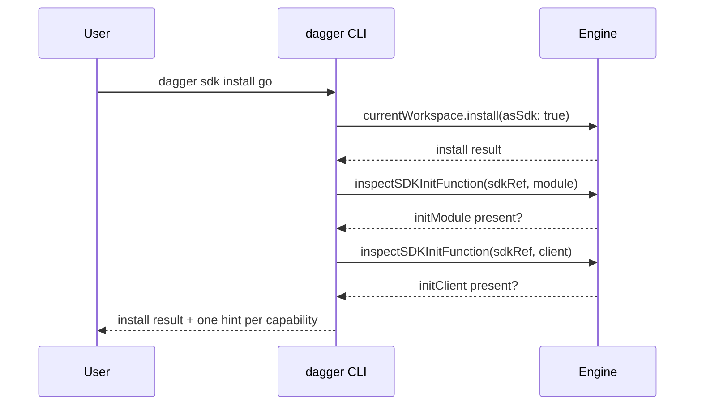
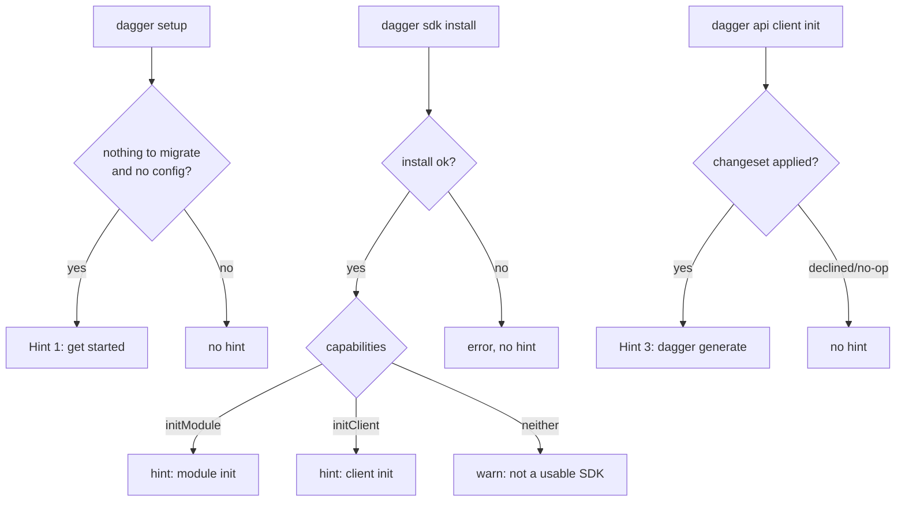

# Contextual Command Hints

*Guide users to the next step after `dagger setup`, `dagger sdk install`, and
`dagger api client init` by printing a short, contextual hint on the success
path.*

## Table of Contents

- [Problem](#problem)
- [Solution](#solution)
- [Hint 1: empty setup](#hint-1-empty-setup)
- [Hint 2: after SDK install](#hint-2-after-sdk-install)
- [Hint 3: after client init](#hint-3-after-client-init)
- [Detecting SDK capabilities](#detecting-sdk-capabilities)
- [Mechanism and consistency](#mechanism-and-consistency)
- [When each hint fires](#when-each-hint-fires)
- [Edge cases and lifecycle](#edge-cases-and-lifecycle)
- [Open questions](#open-questions)
- [Phased plan](#phased-plan)

## Problem

The authoring commands succeed silently: they do the thing and stop, without
pointing at the natural next step. A new user who runs `dagger setup` in an
empty directory, installs an SDK, or scaffolds a client is left guessing.

1. **Empty `setup` is a dead end** — nothing to migrate, no config written, no
   guidance on how to actually start.
2. **`sdk install` doesn't say what the SDK is for** — an SDK can author
   modules, generate clients, both, or neither, and the user has no way to know
   which without reading docs.
3. **`api client init` scaffolds but doesn't generate** — the client code isn't
   produced until `dagger generate` runs, and nothing tells the user that.

## Solution

Print a short, contextual hint on the **success path only** of each command,
reusing the plain-text hint style introduced by PR #13556 (a multi-line string
written to `cmd.OutOrStdout()`). Hint 2 inspects the just-installed SDK's
capabilities — which it can already do CLI-side, with no new engine API — and
prints one hint per capability the SDK actually has.

| # | Command | Trigger | Hint points at |
|---|---------|---------|----------------|
| 1 | `dagger setup` | nothing to migrate **and** no existing config | `dagger install`, `dagger sdk install`, `dagger module init` |
| 2 | `dagger sdk install <sdk>` | install succeeds | `dagger module init` and/or `dagger api client init`, per capability |
| 3 | `dagger api client init …` | changeset **applied** | `dagger generate` |

All three build on the same mechanism, so they read and feel identical.

## Hint 1: empty setup

**Extends PR #13556**, which already prints a hint when `dagger setup` finds
nothing to migrate and no existing `dagger.toml`. That hint currently points
only at `dagger install <module>`. This requirement broadens it to the three
real ways to get started.

**Emission point:** `internal/cmd/dagger/setup.go`, in `setupStepMigrate`, the
`isEmpty && configFile == ""` branch — the same spot and the same
`emptyWorkspaceSetupHint` constant #13556 adds.

> **Rebase note.** #13556 was cut against an older `setupStepMigrate` that
> returned `error`; current `main` returns `(bool, error)`. #13556 must be
> rebased first, and the empty-case early return becomes `return false, nil`
> after printing the hint. Hint 1 is a text-only change on top of that.

**Proposed text:**

```text
  No workspace loaded here yet — nothing to migrate.

  To get started:

    • Install a published module as a dependency:
        dagger install <module>

    • Install an SDK to author your own:
        dagger sdk install <sdk>        (e.g. dagger sdk install go)

    • Create a new module (after installing an SDK):
        dagger module init <sdk> <name>
```

The ordering encodes the dependency: "create a module" is annotated as needing
an SDK first, so the flow reads top to bottom.

## Hint 2: after SDK install

**Emission point:** `internal/cmd/dagger/sdk.go`, in `runSDKInstall`, right
after `callSDKInstall` returns without error.

Inspect the installed SDK for its two authoring capabilities and print a hint
for **each one present**:

| Capability | `initModule` present | `initClient` present |
|------------|:--------------------:|:--------------------:|
| Hint | `dagger module init <sdk> <name>` | `dagger api client init <sdk> <path> <module>` |

`<sdk>` is the user-facing command name: the `as-sdk.name` alias if set (e.g.
`go`), otherwise the install name (e.g. a direct ref's basename) — the same
name `sdkCommandName` resolves for dispatch.

**Proposed text (SDK with both capabilities):**

```text
  Installed SDK "go".

  This SDK can:

    • Create a new module:
        dagger module init go <name>

    • Initialize a generated API client:
        dagger api client init go <path> <module>
```

For a single-capability SDK, print only the matching bullet (and drop the "can"
framing to a single line).

**SDK with neither capability → warn.** A module marked as an SDK that can
neither init a module nor init a client is useless as an SDK, which almost
always means something is wrong — the ref probably isn't an SDK, or it's built
for an incompatible engine version. Instead of a neutral note, surface a
warning (to **stderr**, since it's a warning, not guidance):

```text
  ⚠ "x" was installed as an SDK, but it can neither create modules nor
    initialize clients (no initModule or initClient). This usually means the
    ref isn't an SDK, or it targets an incompatible engine version.

    If that's not what you wanted, remove it:
        dagger sdk uninstall x
```

The install itself already succeeded, so this is a warning, not a failure — see
[edge cases](#edge-cases-and-lifecycle).

## Hint 3: after client init

**Emission point:** `internal/cmd/dagger/client.go`, in
`runAPIClientInitWithSDK`, after the changeset is **applied**.

`api client init` records the client in `dagger.toml` and scaffolds its
config, but the client bindings themselves are produced by `dagger generate`.
The hint closes that gap.

**Proposed text:**

```text
  Client scaffolded.

  Generate the client bindings:
      dagger generate
```

**Firing only on apply.** `handleChangesetResponseAt` returns `nil` in three
cases: nothing to apply, user declined the preview, and changes applied. To
fire the hint only when files were actually written, it needs to report whether
it applied:

```go
func handleChangesetResponseAt(...) (applied bool, rerr error)
```

Return `false` from the no-op and declined branches, `true` after a successful
`Export`. The caller prints the hint only when `applied`. This is a small,
honest signature change; `handleChangesetResponse` (the `"."` wrapper) forwards
it. Callers that ignore the bool are unaffected.

## Detecting SDK capabilities

Hint 2 needs to know whether the SDK implements `initModule` and/or
`initClient`. **This detection already exists in the CLI.**

`inspectSDKInitFunction` (`internal/cmd/dagger/sdk_init_dynamic.go`) loads the
SDK module source, inspects its constructor's return type for the
`initModule` / `initClient` function, and returns `errSDKInitFunctionNotFound`
when absent. It is exactly what `registerSDKInitCommandsFromConfigForKind`
already uses to decide whether to register the dynamic `module init <sdk>` /
`api client init <sdk>` subcommands. Hint 2 reuses it:

```go
func sdkAuthoringCapabilities(ctx context.Context, dag *dagger.Client, sdkRef string) (module, client bool) {
    _, errM := inspectSDKInitFunction(ctx, dag, sdkRef, sdkInitKindModule)
    _, errC := inspectSDKInitFunction(ctx, dag, sdkRef, sdkInitKindClient)
    return errM == nil, errC == nil
}
```

These `initModule` / `initClient` functions are the authoring contract. In the
engine they surface as the **`ModuleInitializer`** and **`ClientInitializer`**
capabilities (`core/sdk.go`, `core/modulesource.go`'s
`persistedModuleSourceSDKCapabilities`) — *not* `CodeGenerator` /
`ClientGenerator`, which are the lower-level runtime-codegen and
client-generation contracts. The brief's "can init a module / init a client"
maps to the `*Initializer` pair, which is what the `init` commands dispatch to
and what the CLI already probes.



**No new public GraphQL surface is required**, so no `View(AfterVersion(...))`
gating and no `base_schema.json` / `TestBaseSchemaAllowlist` churn.

**Cost.** Each probe initializes the SDK module (with `skipDependencies:
true`), so Hint 2 pays two initializations. That's the same per-probe cost the
dynamic-command registration already pays, run once at install time — an
acceptable one-off. The alternative (below) would avoid it.

**Alternative — expose capability flags over GraphQL.** The engine already
computes `ModuleInitializer` / `ClientInitializer` booleans when it loads a
module source. A field like `ModuleSource.sdkCapabilities` returning those
flags would let the CLI read them with one cheap query instead of two
introspections. But it is new public API: it must be
`View(AfterVersion("v1.0.0-0"))`-gated across the field, its return type, and
kept out of `base_schema.json` (guarded by `TestBaseSchemaAllowlist`). Not
worth it for the hint alone — recommend deferring until there's a second
consumer.

**Recommendation:** reuse `inspectSDKInitFunction`. It ships today with zero API
surface and is already the source of truth for these capabilities.

## Mechanism and consistency

- **Format:** plain multi-line string to `cmd.OutOrStdout()`, matching #13556
  and every existing CLI hint (`sdk list`/`search` footers). No new styling
  system; no color. Interpolate the SDK name with `fmt.Fprintf` where needed.
- **Stream:** hints go to stdout, consistent with existing hints. The Hint 2
  neither-capability **warning** goes to stderr — the conventional split (guidance
  on stdout, warnings on stderr) and it keeps the warning out of piped output.
  (See [open questions](#open-questions) on stdout vs stderr for hints.)
- **Tone/shape:** a blank line, a one-line lead, then indented `•` bullets with
  the command on its own indented line — identical across all three so they're
  visually one family.
- **A single helper.** Factor one `printHint(w io.Writer, lines ...string)` (or
  reuse a shared constant block) so the three sites can't drift apart.

## When each hint fires



## Edge cases and lifecycle

- **SDK with both / one / neither capability (Hint 2).** Both → both bullets.
  One → that bullet only. Neither → a **warning** to stderr (see Hint 2): a
  module that authors nothing is not a usable SDK, so flag it as likely-wrong
  and offer `dagger sdk uninstall`, rather than a neutral note that implies all
  is well.
- **Unknown / third-party SDK refs.** Handled by construction: `<sdk>` is the
  resolved command name, and capabilities come from introspecting the actual
  installed module, not a registry. A direct-ref SDK gets correct hints.
- **Success path only.** Hint 1 already lives behind the empty-and-no-config
  branch. Hint 2 fires only after `callSDKInstall` returns nil. Hint 3 fires
  only when the changeset was applied (the `applied` bool) — never on decline
  or no-op.
- **Capability probe failure (Hint 2).** If `inspectSDKInitFunction` fails for a
  reason other than "not found" (network, malformed SDK), the install itself
  already succeeded. Don't fail the command over a hint — swallow the probe
  error and skip Hint 2. Log at debug level.
- **`--auto-apply`.** Hint 3 still fires (changes were applied). Hint 1/2 are
  unaffected.
- **`--here`, custom `--path`, `--name`.** No effect on whether a hint fires;
  Hint 2 shows the resolved command name regardless of install location.

## Open questions

1. **Suppress hints under `-s`/`-q`?** `silent` and `quiet` are package globals
   in `main.go`. Hints are guidance, not core output, and pollute piped stdout.
   **Recommendation:** gate all three on `!silent` (a scripted `--silent` run
   wants clean output); leave `-q` alone (it governs progress cleanup, not
   stdout). Low effort, one shared guard in `printHint`. The Hint 2
   neither-capability **warning** is exempt — it's a warning, not a hint, and
   should surface even under `--silent`.
2. **stdout vs stderr.** Existing hints all use stdout, so matching that keeps
   consistency; but advisory text on stderr keeps stdout pipe-clean.
   **Recommendation:** stay on stdout for consistency now; revisit globally if
   stdout-cleanliness becomes a real complaint — it's a cross-cutting change,
   not a per-hint one.
3. **Exact copy.** The text above is a proposal. **Recommendation:** Yves owns
   the final wording/tone; the structure (lead + per-capability bullets +
   command line) is the part that matters for consistency.
4. **Hint 3 scope.** Bare `dagger generate` regenerates everything; a scoped
   `dagger generate <pattern>` would need a generator selector, not the client
   path. **Recommendation:** hint bare `dagger generate` — simpler and correct.
5. **Reuse vs new capability API for Hint 2.** **Recommendation:** reuse
   `inspectSDKInitFunction` now (zero API surface); defer a GraphQL capability
   field until a second consumer justifies the version-gating work.

## Phased plan

**Phase 1 — text-only hints on existing code paths.** *Depends on #13556.*

- Rebase #13556 onto current `main` (`setupStepMigrate` now returns
  `(bool, error)`).
- Hint 1: broaden `emptyWorkspaceSetupHint` to the three next steps.
- Hint 3: add the `applied bool` return to `handleChangesetResponseAt`; print
  the `dagger generate` hint on apply in `runAPIClientInitWithSDK`.
- Add the shared `printHint` helper and the `!silent` gate.
- No engine changes, no new API.

**Phase 2 — capability-aware Hint 2.**

- Add `sdkAuthoringCapabilities` (two `inspectSDKInitFunction` calls) and wire
  it into `runSDKInstall`, printing one hint per present capability, the
  neither-capability warning to stderr, and swallowing non-"not-found" probe
  errors.
- Still no engine changes.

Both phases are CLI-only. A later, optional Phase 3 could replace Phase 2's
double introspection with a version-gated `sdkCapabilities` GraphQL field if the
cost ever matters — explicitly out of scope here.

## Status

Design proposal. No implementation yet.
