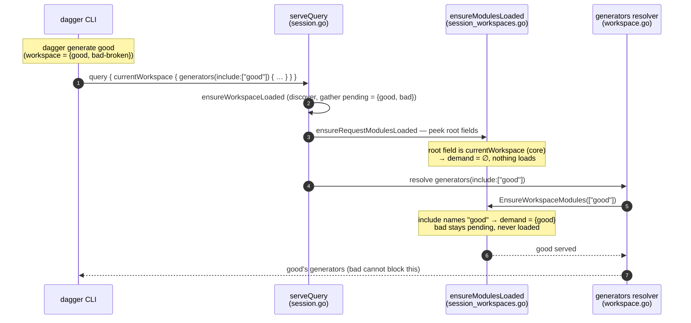

# Demand-Driven Workspace Module Loading

Scope: `dagger generate` / `check` / `up` and raw execution queries.
`dagger call` / `functions` are explicitly out of scope — see
[Out of scope](#out-of-scope-dagger-call--functions).

## Table of Contents

- [Problem](#problem)
- [Solution](#solution)
- [Why this is safe without SingleQuery](#why-this-is-safe-without-singlequery)
- [Core concept](#core-concept)
- [What each command gains](#what-each-command-gains)
- [Out of scope: `dagger call` / `functions`](#out-of-scope-dagger-call--functions)
- [Implementation](#implementation)
- [Edge cases](#edge-cases)

## Problem

1. **One-shot loading** — the first schema-needing request loads *every*
   workspace module (`ensureModulesLoaded`, sticky `modulesLoaded` flag in
   `engine/server/session_workspaces.go`). `dagger generate good` pays for
   every module in the workspace.
2. **Fragility** — one broken module fails the whole load, for every request in
   the session. For `dagger generate` this includes the very module you were
   trying to fix by running generate.
3. **Narrowing is SingleQuery-only** — `narrowPendingWorkspaceModulesForSingleQuery`
   drops pending modules based on root fields, which is only safe under the
   single-request promise. `generate` / `check` / `up` are structurally
   multi-request and cannot use it.

## Solution

Make workspace module loading **additive and demand-driven** instead of
one-shot. Each request loads only the modules it can possibly touch; the rest
stay *pending* and load when a later request demands them. The dagql schema is
already rebuilt from the served set per request, so the session schema grows
monotonically — narrowing becomes **deferral, not exclusion**, safe for open
multi-request sessions, and the root-field demand generalizes from
`SingleQuery` to every client.

The demand source is the natural one for each query shape:

- **`currentWorkspace { checks | generators | services(include: …) }`**
  validates against the core schema (all those fields return core types), so
  loading moves *into the resolvers* via a new `Query.Server.EnsureWorkspaceModules`
  hook — they receive `include` natively, no request peeking or variable
  resolution. The CLI already sends `include` as the command's functional
  argument, so `dagger generate | check | up <module>` narrows with **zero CLI
  and zero API change**.
- **Root fields** naming a pending module (raw `dagger query '{ good { … } }'`,
  shell) load just that module; the existing entrypoint fallback is preserved;
  full-schema fields (`__schema`, `currentTypeDefs`, `env`, …) and anything
  unrecognized conservatively load everything.



## Why this is safe without SingleQuery

The schema is already rebuilt per request from whatever is served
(`client.servedMods.Schema(ctx)`), and `serveModule` is per-module, idempotent,
and conflict-checked. So the session schema is allowed to *grow* between
requests today — module SDKs and `Module.serve` rely on this.

With one-shot loading, narrowing is a bet that no later request needs the
dropped modules — only SingleQuery can keep that promise. With additive loading
there is no bet: a later request that references a not-yet-loaded module
triggers its load before validation. The schema is monotonically increasing and
every request sees at least what it demands.

## Core concept

Demand-driven loading has two entry points, depending on whether the request
can even *validate* without the modules:

**1. Resolution-time loading — the `currentWorkspace` selector API.** Every
`Workspace` field returns core types (`GeneratorGroup`, `CheckGroup`,
`ServiceGroup`, …): a `currentWorkspace { generators(include: ["good"]) }`
request validates against the core schema with zero modules loaded. So these
need **no request peeking** — the `generators` / `checks` / `services` resolvers
already receive `include` as a native typed argument, and they enumerate modules
through `currentWorkspacePrimaryModules` → `CurrentServedDeps(ctx)`, which reads
whatever is served *at resolution time*. The resolvers gain one load hook at
entry:

```go
// top of checks/generators/services resolvers:
if err := ensureWorkspaceIncludeModulesLoaded(ctx, include); err != nil { … }
// existing enumeration picks up the freshly served modules.
```

`EnsureWorkspaceModules` matches the patterns against pending module *names*
(known from config without loading): a pattern whose first segment names a
module demands just that module; a bare token that is not a module name (an
entrypoint-proxied item) or an unmatched pattern falls back to loading
everything; empty `include` loads all. Names are kebab-normalized on both sides,
matching the include matchers (`ModTreePath.Glob` / `CliCase`) and the CLI
command names.

**2. Pre-request loading — module root fields.** For execution queries like
`{ good { verify } }` the *schema itself* depends on the module, so loading must
happen before validation. `serveQuery` keeps a generalized root-field peek
(`dagql.PeekRootFields`, already parsed today) for this path, only while pending
modules remain.

| Request shape | Mechanism | Demand |
|---|---|---|
| `currentWorkspace { generators \| checks \| services(include: […]) }` | resolver | modules matching the patterns |
| `currentWorkspace { … }` bare (`dagger generate` no args) | resolver | all pending |
| Root field matches a pending module name | peek | that module |
| Root field unknown (entrypoint-proxied item) | peek | entrypoint module (existing fallback) |
| `currentTypeDefs`, `__schema`, `env`, `currentModule` | peek | all pending |
| Unparseable body, non-query operation, anything unrecognized | peek | all pending (conservative) |

`currentWorkspace` is a core root field: its selector resolvers are the demand
source, so the root-field peek loads nothing for it.

## What each command gains

Engine-only. Zero CLI changes, zero API changes:

| Command | Today (main) | This change |
|---|---|---|
| `dagger generate good` | loads all | loads `good` — the CLI **already sends** `generators(include: ["good"])`; the resolver narrows from it |
| `dagger check good` / `dagger up good` | loads all | loads `good` (same: `include` is already in the query) |
| `dagger query '{ good { verify } }'` | narrowed only with `--single-query` | narrowed for every client, root-field demand |
| `dagger call good verify`, bare `dagger functions`, `shell`, `mcp` | loads all | loads all (unchanged — see below) |

A broken or stale sibling module can no longer block a scoped `generate` /
`check` / `up`, including the case where running `generate` is itself the fix.

## Out of scope: `dagger call` / `functions`

`call` / `functions <module>` build their command tree from a
`currentTypeDefs(returnAllTypes: true)` introspection, which genuinely carries
no module signal — it asks for the whole served schema. Narrowing it requires
getting the target module into the request (a new typedefs path or argument plus
a CLI change), which is a larger, separately reviewable change with its own
trade-offs; it is intentionally **not** part of this work.

This change does not regress `call` / `functions`: `currentTypeDefs` stays on
the full-schema list, so they load everything exactly as on `main`. The
additive engine underneath is the foundation a later `call`-narrowing change
can build on.

## Implementation

1. `engine/server/session.go` — `ensureRequestModulesLoaded` peeks every request
   while pending modules exist (skipped once drained, and for clients with
   `LoadWorkspaceModules=false`); replaces the SingleQuery-only narrowing call.
2. `engine/server/session_workspaces.go` — `ensureModulesLoaded(ctx, client,
   filter)`: per-module load state, additive serving via the existing
   `serveModule`, per-module (non-sticky) ambient errors, extras kept eager with
   sticky errors, precomputed entrypoint arbitration. Adds the
   `EnsureWorkspaceModules` implementation and the selector/root-field demand
   filters (kebab-normalized name matching, served-module recognition).
3. `core/schema/workspace.go` + `core/query.go` — add the
   `Query.Server.EnsureWorkspaceModules(ctx, include)` hook (implemented by the
   engine, precedent: `CurrentWorkspace`) and call it at the top of the
   `checks` / `generators` / `services` resolvers. `currentWorkspace` drops off
   `rootFieldsRequireFullWorkspaceSchema`.

## Edge cases

- **Extra (`-m`) modules** keep loading eagerly with sticky errors — they were
  explicitly requested.
- **Ambient failures are per-module and non-sticky**: a broken module only fails
  the requests that demand it, and stays pending so a later demand reports its
  load error. Full listings (`dagger generate -l`, bare `dagger functions`) still
  load everything and surface it.
- **Cancellation / deadline** is never recorded as a module failure, so an
  interrupted load stays retryable by later demands in the session.
- **Entrypoint arbitration** is split across batches: extras outrank ambient
  candidates; multiple ambient entrypoint declarations load together so the
  existing conflict detection still runs.
- **Re-evaluated selectors** (e.g. loading a `GeneratorGroup` from its ID on a
  later request) name an already-served module; served names are tracked so the
  demand filter recognizes them instead of falling back to loading everything.
