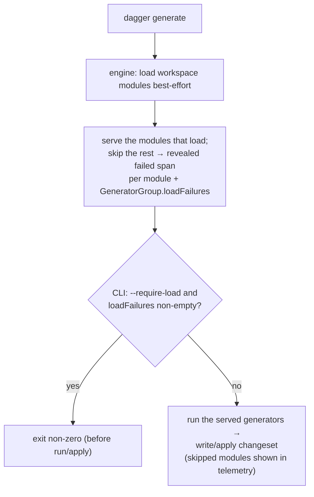

# Resilient `dagger generate` — tolerating module load failures

Scope: `dagger generate`. Builds on
[Demand-Driven Workspace Module Loading](../demand-driven-module-loading.md).

This documents the **as-implemented** behavior. The core (best-effort load for
generators) landed on `main` as `44dd63287`; this change adds the two pieces
layered on top of it — a `GeneratorGroup.loadFailures` API field and a
`dagger generate --require-load` opt-out.

## Table of Contents

- [Problem](#problem)
- [Solution](#solution)
- [Mechanics](#mechanics)
- [Exit-code and output semantics](#exit-code-and-output-semantics)
- [Not in scope](#not-in-scope)

## Problem

There is a chicken-and-egg failure mode. As SDKs move to **no codegen at
runtime** (the `java` SDK already; others following), a module's bindings are
generated ahead of time — so a module can fail to **load** *because its bindings
are missing or stale*. The fix is to (re)generate them with `dagger generate`,
whose SDK generator writes those files from source. But `dagger generate`
without a selector loads *every* workspace module, and a single load failure
used to abort the whole command — so the one command that would repair the
module could not run. The goal: a user types plain `dagger generate` and it just
works, regenerating whatever it can and reporting what it could not.

## Solution

**Generator collection loads modules best-effort.** A workspace module that
fails to load is **skipped with a warning** instead of aborting the run; the
modules that do load still generate. `check` and `up` keep the strict behavior —
a module that can't load fails those commands, by design. (This best-effort core
is `44dd63287` on `main`.)

On top of that, this change adds:

- **`GeneratorGroup.loadFailures: [String!]!`** — the collected per-module load
  errors for the modules that were skipped. Empty when everything loaded. It is
  new public workspace API, so it is gated `View(AfterVersion("v1.0.0-0"))` and
  kept out of `core/schema/base_schema.json` (guarded by
  `TestBaseSchemaAllowlist`).
- **`dagger generate --require-load`** — opt back into strict: fail the command
  if any workspace module could not be loaded, instead of skipping it. Default
  is best-effort.

## Mechanics

### Engine

`ensureModulesLoadedMode(ctx, client, filter, bestEffort bool) ([]string, error)`
(in `engine/server/session_workspaces.go`) loads the demanded pending modules.
With `bestEffort`, a module that fails to resolve is skipped — its error is
recorded (kept for other operations that may demand it) and surfaced by
`reportSkippedModule`, which opens a short span **named by the module and marked
failed** (`telemetry.Reveal()` + roll-up attrs, closed with
`telemetry.EndWithCause`). It renders like a check that did not pass: a concise
red row lifted into the primary view, with the load error nested rather than
dumped inline. The error message is also appended to the returned `[]string`.
The successfully resolved modules are served. Without `bestEffort`, the first
load error aborts (strict, unchanged). `EnsureWorkspaceModules(ctx, include,
bestEffort)` and the `Query.Server` interface (`core/query.go`) return the same
`([]string, error)`.

The `generators` resolver (`core/schema/workspace.go`) calls
`ensureWorkspaceModulesLoaded(ctx, include, true)` — **always best-effort** —
and sets the returned messages on `GeneratorGroup.LoadFailures`. `checks` and
`services` call it with `false` and ignore the slice, staying strict.

`GeneratorGroup.LoadFailures` (`core/generators.go`) is carried through `Clone`
and the persisted-object encode/decode so the field survives the object's
lifecycle; `core/schema/generators.go` installs the gated `loadFailures` field.

### CLI

Skipped modules are surfaced **in telemetry** (the engine's `reportSkippedModule`
span above), so the default path needs no CLI-side reporting — the revealed
per-module span renders in `dagger generate`'s progress output like a check that
did not pass, lifted into the zoomed generators view. (In `-l` list mode the
enumeration runs inside an `Encapsulate`d "fetch generator information" span,
which is a `Reveal` boundary, so the list table just omits the broken module
rather than showing the span; the skip is visible on the run path.)

The span also carries `GenerateSkippedAttr`, which the pretty TUI collects into
a persisted **"SKIPPED MODULES"** final-report section — the generate analogue of
the "CHECKS" section (`dagql/idtui/generate_report.go`, gated by
`DB.HasGenerateReport()`). Without it, a *successful* `dagger generate` (best-effort
skips don't fail the command) would collapse its completed telemetry on exit and
the user would lose the live skip rows after the Apply prompt; the section keeps
them, each as a failed row with the load error, even on exit 0.

The CLI only reads `loadFailures` for `--require-load`, with a
`currentWorkspace { generators(include: …) { loadFailures } }` query (rooted at
the core `currentWorkspace` field so the fetch itself demands no modules). A
non-empty result becomes a fatal error before running or applying anything; the
error is a terse count, since the per-module detail is already in the revealed
spans.

## Exit-code and output semantics

| Situation | Default | `--require-load` |
|---|---|---|
| A module can't **load** | skipped, warned; **exit 0** | fatal; **exit non-zero** |
| A module loads but its **generator execution** fails | fatal; **exit non-zero** | fatal; **exit non-zero** |
| Some load + generate, another can't load | the healthy ones generate; skip warned; **exit 0** | **exit non-zero** |

A generator that *ran and failed* is always fatal — that is real work going
wrong, not a missing prerequisite. In default mode, `exit 0` means no generator
that ran failed; the changeset from the modules that generated cleanly is
applied.

## Not in scope

- **Per-module tolerance of the run/apply id-round-trips** for a broken
  entrypoint is a shared follow-up on top of the landed best-effort load, not
  part of this change. Best-effort tolerance of broken **non-entrypoint** modules
  — the motivating case (a user module with missing bindings) — works today.
