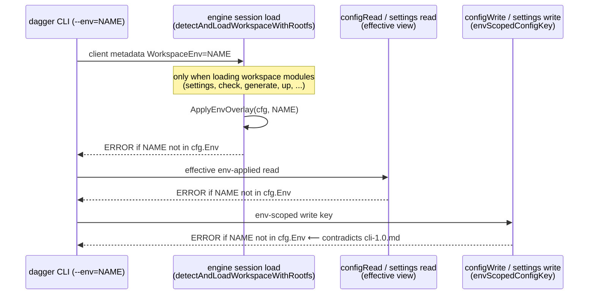

# Handling `--env=<name>` when the environment is not defined

status: accepted (2026-07-16) — Option 1 (hybrid) approved with: read errors
enumerate defined envs; raw env-scoped writes also auto-create; raw explicit
env.* writes print the same creation notice.
created: 2026-07-07
updated: 2026-07-15 — re-checked against the workspace overlay & export rewrite
(#13600, merged 2026-07-13). All failure sites, error strings, and tests cited
below are unchanged; only the mutation API renamed: `envCreate`/`envRemove` →
`withConfigEnv`/`withoutConfigEnv`, now staged-overlay builders applied via
`workspace.export()`. References updated accordingly.

## Problem

`dagger --env=MY_ENV settings` (and every other command that selects an env)
fails with a dead-end error when `MY_ENV` has no `env.MY_ENV.*` entry in
`dagger.toml`:

```console
$ dagger --env=MY_ENV settings
Error: workspace env "MY_ENV" is not defined
```

Since the CLI 1.0 surface landed (`9b518f32f`, "cli: ship the CLI 1.0 command
surface"), the explicit `dagger env create/list/rm` commands are gone. The
error above is now a dead end: there is no porcelain command the user can run
to make the env exist, short of hand-editing `dagger.toml`, using the raw
config editor with an explicit `env.*` key, or calling the `withConfigEnv`
API directly.

## Current behavior (confirmed by repro against a v1.0.0-dev engine)

| Command (env `MY_ENV` not defined) | Result |
| --- | --- |
| `dagger --env=MY_ENV settings` (read) | `workspace env "MY_ENV" is not defined` |
| `dagger --env=MY_ENV settings <mod> <key> <val>` (typed write) | same error, fails at session load before the write is attempted |
| `dagger --env=MY_ENV workspace config` (raw read) | same error |
| `dagger --env=MY_ENV workspace config modules.<m>.settings.<k> <v>` (raw env-scoped write) | same error |
| `dagger workspace config env.MY_ENV.modules.<m>.settings.<k> <v>` (raw explicit key, no `--env`) | **succeeds and silently creates the env** |
| `currentWorkspace{withConfigEnv(name:...)}` + `export` via `dagger api query` (was `envCreate` pre-#13600) | succeeds (idempotent), still in the API |

The behavior table above was confirmed by repro on 2026-07-07 (pre-#13600);
the strictness sites below were re-verified on the post-#13600 code.

The strictness lives in three engine-side sites, all funneling into the same
error string:

- `core/workspace/config.go` `ApplyEnvOverlay` — `workspace env %q is not
  defined`. Called from:
  - `engine/server/session_workspaces.go` `detectAndLoadWorkspaceWithRootfs`
    — fires at **session/workspace load** for any client that loads workspace
    modules (this is where `dagger --env=X settings` fails, read *or* write,
    since `settings` loads modules for schema discovery);
  - `core/schema/workspace_config.go` `configRead` (effective env-applied
    view);
  - `core/schema/workspace_module.go` module-settings resolution.
- `core/schema/workspace_config.go` `envScopedConfigKey` — rejects env-scoped
  **writes** for undefined envs (this is where `--env=X workspace config k v`
  fails when module loading is skipped).

The behavior is deliberate and test-locked: integration tests named
*"missing env fails clearly instead of silently falling back to base"*
(`workspace_settings_test.go`, `workspace_env_management_test.go`,
`workspace_selection_test.go`) date from April–May 2026, when `dagger env
create` still existed as the creation porcelain. The June 20 CLI 1.0 commit
removed the porcelain without revisiting what the error should now point to.

## What the design docs say

`future/cli-1.0.md` (per-command decision table) is explicit about the
intended model:

> **`env` (removed)** — Originally a top-level group with `create` / `list` /
> `rm`. Removed entirely after recognizing that `env` is *strictly a path
> prefix in workspace config* (`env.<name>.modules.<m>.settings.<k>`), not a
> first-class concept. **CRUD happens via `dagger settings --env <name>`
> (typed) and `dagger workspace config` (raw).** Discoverability moves into
> the `--env` flag's description.

and rewrites the flag help to *"Apply **(or write to)** a named env overlay"*
(the current flag help on main still reads "Apply the named workspace
environment overlay" — the rewrite hasn't landed).

`workspace-location-model.md` sets the creation philosophy for workspace
config generally:

> Read-only commands should not create config directories.
> [...] the new model has no "initialize workspace" operation. **Prefer
> implicit config creation through config-writing commands.**

That philosophy is already implemented for `dagger.toml` itself: config-value
writes and `withConfigEnv` use `workspaceConfigInitIfMissing`, so writing a
config value creates the config file implicitly. Envs are currently the one exception:
writes refuse to create them — except through the raw explicit-`env.*`-key
path, which creates them silently today.

So the docs point at a clear answer: **the typed write path is supposed to be
the creation path**, and the current "is not defined" rejection on writes
contradicts the intended model. For reads, the docs (and the test names)
equally clearly want loud failure rather than silent fallback to base.

## Where `--env` flows



## Options

### 1. Hybrid: auto-create on write, actionable error on read (recommended)

- Typed writes (`dagger settings --env=NAME <mod> <key> <val>`) and raw
  env-scoped writes (`dagger --env=NAME workspace config
  modules.<m>.settings.<k> <v>`) create the env implicitly, printing a
  one-line notice (e.g. `created env "NAME" in dagger.toml`). Everything else
  about the write (settings-schema validation, known-module validation) stays
  strict.
- Reads and module-loading commands with a missing env keep failing, but the
  error becomes actionable and names the defined envs:

  ```text
  workspace env "MY_ENV" is not defined (defined envs: ci, prod)
  create it by writing a setting to it:
    dagger settings --env=MY_ENV <module> <setting> <value>
  ```

Pros: fulfills the cli-1.0.md contract ("CRUD happens via `dagger settings
--env`"); consistent with implicit `dagger.toml` creation on config writes and
with the raw explicit-key path that already creates envs; preserves the typo
protection where it matters — reads and `check`/`generate`/`up` in CI never
silently run base settings under a misspelled env name.

Cons: a typo'd env name on a *write* creates a junk `env.<typo>` section. The
notice plus the `dagger.toml` diff make that visible and trivially reversible
(`dagger workspace config` raw editing, or the `withoutConfigEnv` API). An
empty-overlay env created this way always contains the key that was written,
so nothing dangling is left behind.

Implementation note (the one real wrinkle): for `settings` the missing-env
rejection currently fires at **session load**, before the CLI can express
write intent. Two ways through, in order of preference:

1. Keep the engine invariant "applying an undefined env fails" untouched, and
   make the CLI porcelain create-first. As built, the two write paths reach the
   env by different mechanisms, intentionally: (a) typed `dagger settings
   --env=NAME <mod> <key> <val>` connects with the session env *suppressed* — an
   explicit empty `WorkspaceEnv` in the client metadata, which the engine
   uniformly treats as "no env" — so schema discovery loads module typedefs
   against base config, then addresses the setting through raw `env.NAME.*`
   storage chained after an explicit `WithConfigEnv`; (b) raw `dagger --env=NAME
   workspace config modules.<m>.settings.<k> <v>` keeps engine-side env scoping,
   with `envScopedConfigKey` relaxed to create-on-write (`workspaceConfigInitIfMissing`)
   while unsets stay strict (`workspaceConfigMustExist`); (c) the `Created env`
   notice is printed by the CLI, not the engine, and is detected here-aware by
   comparing config directories: a `--here` write targets the workspace cwd, and
   since workspace detection selects the nearest `dagger.toml` walking up from
   the cwd, a cwd that isn't the selected config's own directory has no config of
   its own — so `--here` always writes a fresh config there, creating the env.
   When the `--here` target and the selected config share a directory (or
   `--here` is off), the write lands in the selected config and the env is new
   iff `EnvList` (read from that same config) doesn't already list it. The split
   CLI/engine mechanism is deliberate: `settings` must bypass overlay application
   to load module schema,
   whereas raw `workspace config` writes never load modules and so can scope the
   env inside the engine.
2. Alternatively, relax session load to treat a missing env as an empty
   overlay and enforce existence only at the read surfaces. Rejected as the
   primary path: it weakens the CI guarantee for workspaces whose modules
   don't consult settings (a typo'd `--env` on `check` could pass silently).

### 2. Better-error-only

Keep strictness everywhere; upgrade the message (list defined envs, point at
the raw creation gesture or hand-editing).

Pros: minimal change, zero new typo surface.
Cons: leaves the cli-1.0.md promise broken — the *typed* daily verb still
can't create an env, and the error can only recommend the raw escape hatch
(`dagger workspace config env.NAME.modules.<m>.settings.<k> <v>`), which is
exactly the "advanced plumbing" the redesign wanted to keep out of the daily
loop. Also leaves the C/D asymmetry (raw explicit keys create silently, raw
env-scoped writes refuse).

Reasonable as a stopgap if Option 1's porcelain work is deferred.

### 3. Auto-create always (reads too / missing env = empty overlay)

Pros: maximal convenience; philosophically consistent with "env is strictly a
path prefix" (undefined env ≡ empty overlay).
Cons: destroys the typo protection the current tests deliberately lock in —
`dagger check --env=prdo` in CI would silently run base settings and go green.
Reads that *create* config additionally violate "read-only commands should not
create config directories". Rejected.

### 4. Resurrect `dagger env create`

Rejected: contradicts the deliberate, documented cli-1.0 decision that env is
not a first-class concept, and re-opens the "workspace vs env vs --env vs
settings" confusion the redesign eliminated.

## Recommendation

**Option 1 (hybrid)**, implemented CLI-side (create-first via the idempotent
`withConfigEnv` builder chained into the write) so the engine's "undefined env
fails" invariant and all existing missing-env tests stay intact, plus the
improved read error. Land the
cli-1.0.md flag-help rewrite ("Apply (or write to) a named env overlay ...")
at the same time, since the flag description is now the only discovery
affordance for envs.

## Resolved questions (decision, 2026-07-16)

- The read error enumerates defined envs: yes.
- Raw env-scoped `workspace config --env=NAME` writes also auto-create: yes.
- Raw explicit `env.*` writes print the same "created env" notice: yes.

## Open questions

- `upstream/codex/user-level-envs` (not merged) adds user-level workspace
  envs; if that lands, "where does auto-create write" (workspace vs user
  scope) needs an answer — presumably workspace unless `--here`-style
  targeting says otherwise.
