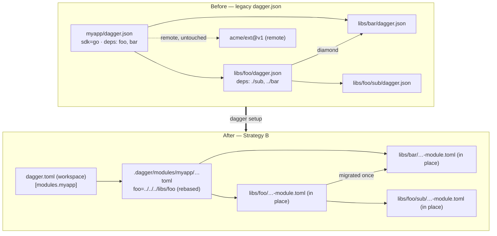

# Recursive local-dependency migration during `dagger setup`

Design + implementation plan. **Status: draft for review — no code written. Codex-reviewed (gpt-5.5, high). Seed set decided (O7 = toolchains + main-module deps).**

This mirrors the owner-facing HTML design pane. It extends `dagger setup`'s legacy-config
migration so that module dependencies referenced by a **local relative path** (and their
transitive local deps) are migrated to the new format, discovered via a deduplicated
dependency tree so each module is migrated exactly once, in a safe order.

## 1. Verified understanding (correcting the recon)

Two premises needed correcting; net, **Yves was essentially right and the recon's headline claim was wrong.**

### 1.1 The `.dagger/modules/**/dagger.json` glob DOES exist

The recon claimed there is no such glob-scan. It exists at `core/schema/workspace_migrate.go:283`,
built from constants (which is why a literal grep missed it):

```go
moduleConfigPattern := path.Join(projectRoot, workspace.LockDirName, "modules", "**", workspace.LegacyModuleConfigFileName)
// == "<projectRoot>/.dagger/modules/**/dagger.json"
```

Current discovery set = `{ selected root dagger.json }` ∪ `{ every dagger.json under <projectRoot>/.dagger/modules/** }`.

### 1.2 Today's three handlers

- **Workspace-shaped** config (`blueprint`/`toolchains`, or SDK with non-`.` `source`) → `workspace.PlanMigration`: writes `dagger.toml`, **moves the main module** into `.dagger/modules/<name>/dagger-module.toml`, records `[modules.<name>]`, rebases dep paths.
- **Plain module** under `.dagger/modules/**` → `workspaceMigrationModuleConfigConversions`: **in-place** `dagger.json → dagger-module.toml`, no move, no rebasing.
- **Plain module** elsewhere → `workspaceMigrationParentPlansForPlainModules`: creates a parent `dagger.toml`, installs the module's SDK runtime, warns "requires explicit loading"; the `dagger.json` is **not** converted.

### 1.3 `PlanMigration` is PURE (the crux)

`PlanMigration(compatWorkspace)` has no `ctx`/filesystem/engine client. It migrates one main
module and **rebases** each local-ref dependency's `Source` (via `migratedModuleRelPath`) so the
reference resolves from the moved config — but never reads that dependency's own `dagger.json`,
never migrates it, never sees its transitive deps. **The recursive discovery cannot live in
`PlanMigration`** — filesystem access exists only at the schema layer. This task is primarily a
**discovery extension at the schema layer.**

### 1.4 The gap

Two flavors, both about local references in the root `dagger.json` whose own config lives
*outside* `.dagger/modules/**`:

- **Local toolchains (primary case).** A toolchain `{name: defaults, source: ./toolchain}` gets a
  workspace `[modules.defaults]` entry pointing at `./toolchain`, but `./toolchain/dagger.json` is
  **never converted** — it isn't under `.dagger/modules/**`. (The existing test only checks the
  workspace entry, not the toolchain's config.)
- **Main-module local dependencies.** For `myapp` with `dependencies: [{name: foo, source: ./libs/foo}]`,
  `foo` is not discovered; myapp's dep is rebased to `../../../libs/foo`, which still holds an
  unconverted legacy `dagger.json`.

## 2. Key reframe: unconverted deps still LOAD

`modules.ConfigFilenames()` returns **both** `dagger-module.toml` and `dagger.json`, and
`moduleConfigInDir` / `selectFoundModuleConfig` (`core/schema/modulesource.go:361-393`) accept
either. So a dep dir holding only a legacy `dagger.json` **still loads** in the migrated engine.

Therefore the current dangling-reference state is **safe-but-incomplete, not broken**. The task
is about **completeness of migration** (leave nothing in legacy format), and **"leave as legacy
and warn" is a genuinely safe fallback** for every edge case we can't cleanly convert.

## 3. Design

### 3.1 Strategy: in-place, not move (recommend Strategy B)

- **A — move into `.dagger/modules/<name>/`** (Yves's sketch): cascades a move+rebase to every node.
- **B — convert in place** (recommended): nothing moves ⇒ nothing rebases; the referrer's dep
  path (already rebased to the physical location) stays valid.

Codex confirmed B is rebase-free for plain deps and matches the shipped `.dagger/modules/**`
behavior. B avoids the whole class of "did we rebase referrer + source + transitive deps +
includes consistently?" silent bugs. **Verdict: B.**

### 3.2 Do NOT register transitive deps in `[modules.*]`

Verified (`core/schema/modulesource.go:968, 614, 3402`): module deps are read from each module's
own config and resolved via `ResolveDepToSource` — a workspace `[modules.*]` entry is **not
required** for a dependency to load. Promoting a private transitive dep changes its visibility
for no gain. Existing in-place `.dagger/modules/**` conversion already doesn't register them.

### 3.3 Tree-building algorithm

Pure "which local dep dirs" lives in `core/workspace`; impure "read + recurse" in the schema layer.

```text
localModuleRefs(cfg): return cfg.Toolchains ++ cfg.Dependencies   # NOT cfg.Blueprint (O7)
hasOwnWorkspaceSemantics(cfg): return cfg.Blueprint != nil OR len(cfg.Toolchains) > 0

discoverLocalModules(seedConfigs, projectRoot):
    visited := {}                              # canonical rel-path of every config dir
    for c in seedConfigs: visited.add(cleanRel(dir(c)))   # SEED with all initial dirs (Codex #2)
    order := []
    walk(cfg, cfgDir):
      for ref in localModuleRefs(cfg):                            # root: toolchains + deps
        if not IsLocalRef(ref.Source, ref.Pin): continue         # git/registry: leave as-is
        modDir := cleanRel(join(cfgDir, ref.Source))             # canonical dedup key
        if escapesProjectRoot(modDir):   warn+skip; continue     # e1
        if modDir in visited:            continue                # diamond + cycle + seed guard
        visited.add(modDir)
        cfgPath := join(modDir, "dagger.json")
        if not exists(cfgPath):          continue                # e2
        modCfg := parseLegacyShapeTolerant(read(cfgPath))        # e4
        if hasOwnWorkspaceSemantics(modCfg): warn+skip; continue # O6 — genuine nested workspace only
        order.append({cfgPath, DiscoveredLocalModule})
        walk(modCfg, modDir)                                     # recurse into ITS toolchains + deps
    for c in seedConfigs: walk(parse(c), dir(c))
    return order
```

- **Seeds = toolchains + main-module dependencies** of the root (O7); blueprint excluded. The root's
  own main module keeps its existing `PlanMigration` handling; the walk only *discovers* the local
  modules it references.
- **Dedup key** = cleaned referenced-module **directory** path, not the declared string.
- **Seed visited** with every initial config dir so a cycle back to a seed can't double-plan the root.
- **Cycle safety**: `visited` populated before recursing; explicit worklist avoids stack blowups.
- **Skip predicate is narrow (O6)**: skip only a module with its *own* `toolchains`/`blueprint`. A
  normal `sdk`+`source:"src"` toolchain converts in place — do **not** use `mustMigrateToWorkspaceConfig`
  (it over-fires on `source != "."`).

### 3.4 Naming / collision

Under B + no `[modules.*]` promotion there is **no destination-name allocation** — each dep keeps
its dir; dedup key is its path; `uniqueModuleName` unnecessary. (If O2 = register: key by the
module's own `Name`, fallback referrer entry `Name`, with `uniqueModuleName` collision handling.)

### 3.5 Edge cases

| # | Case | Decision |
|---|------|----------|
| e1 | escapes project root (`../shared`) | Skip + warn (plain dep still loads); escalate to actionable report if workspace-shaped/newer-engine |
| e2 | dep dir has no `dagger.json` | Leave reference; info note |
| e3 | dep already under `.dagger/modules/**` | Dedup across glob + walk; preserve glob behavior (origin precedence) |
| e4 | dep requires newer engine | Shape fallback (`parseLegacyConfigShape`); also add to `workspaceMigrationCompatWorkspaceForLegacyConfig` (Codex #7) |
| e5 | hidden-path dep (`./.internal/foo`) | Explicit dep bypasses `workspaceMigrationHiddenPath` (Codex #5) |
| e6 | dep under existing `dagger.toml` ancestor | Skip + diagnostic (ancestor owns it) (Codex #6) |
| e7 | symlink / `..` aliasing | Clean-path dedup; `EvalSymlinks` out of scope |
| e8 | two dep entries, same source | Collapsed by `visited` |

### 3.6 Path-rebasing correctness

Under B, **only the main module moves** (existing, tested behavior). Its dep refs rebase to the
physical dependency locations, which don't move ⇒ valid. Converted-in-place deps keep every
relative path unchanged ⇒ valid. No dangling old-path references.

### 3.7 Warnings

Plain deps: no new gap warnings (customizations already preserved by `cloneCustomizations`). Add
info notes for the skip cases (e1/e2/e5/e6).

## 4. Diagram



## 5. File-by-file implementation plan

- **`core/workspace/` (pure):** new `LocalModuleRefs(cfg)` (local refs from **Toolchains + Dependencies**,
  blueprint excluded) and `HasOwnWorkspaceSemantics(cfg) = Blueprint != nil || len(Toolchains) > 0` (the
  O6 predicate — **not** `mustMigrateToWorkspaceConfig`). `PlanMigration` / `buildMigratedModuleConfig`
  **unchanged** under B.
- **`core/schema/workspace_migrate.go`:** new `workspaceMigrationLocalModuleConfigPaths` (the DFS of
  §3.3, walking toolchains+deps, using `core.DirectoryReadFile` + `workspaceMigrationPathExists`).
  Change `workspaceMigrationLegacyConfigPaths` to return paths with an **origin set**
  (`{Selected, UnderDefaultModules, DiscoveredLocalModule}`, merged on dedup — Codex #3). Thread origin
  onto `CompatWorkspace`; bypass `workspaceMigrationHiddenPath` for discovered modules.
- **Routing (two edits):** the `workspace_migrate.go` main loop must **skip `DiscoveredLocalModule`
  configs** for `PlanMigration` (even when `source != "."`); `workspace_migrate_module_config.go`
  converts them in place via `legacyModuleConfigAsCurrent` unless `HasOwnWorkspaceSemantics` (O6).
- **`core/schema/workspace_migrate_parent.go`:** `workspaceMigrationParentAssignments` skips a
  **purely**-`DiscoveredLocalModule` config (no "explicit loading" warning, no runtime hoist).
  Precedence: if also `UnderDefaultModules`, keep today's behavior (Codex #3).
- **Tests:** unit for `LocalModuleRefs`/`HasOwnWorkspaceSemantics`/DFS (dedup, diamond, cycle, seed-cycle,
  boundary); integration subtests: **local toolchain converted (incl. `source:"src"`)**, local dep
  converted, transitive depth ≥2, diamond→once, cycle→terminates, cycle-to-root, no-dagger.json,
  out-of-tree, nested-workspace (O6), remote untouched.

## 6. Open decisions (recommendations in bold)

- **O1 — in-place vs move:** **in-place (B).** Main pushback on the sketch.
- **O2 — register transitive deps in `[modules.*]`:** **No** (top-level toolchains keep their existing
  registration; only deeper transitive deps are excluded). Departs from sketch item 4.
- **O3 — out-of-tree (`../shared`):** **skip + warn** (plain); escalate for nested-workspace/newer-engine.
- **O4 — warnings for plain deps:** **none new**; info notes for skip cases.
- **O5 — symlink dedup:** **out of scope.**
- **O6 — genuine nested workspace as a discovered module (from Codex, corrected):** **leave legacy +
  warn**, but only when it has its *own* `toolchains`/`blueprint` — `PlanMigration` would move+delete
  its `dagger.json` and break the referrer. A normal `sdk`+`source:"src"` toolchain converts (predicate
  is `hasOwnWorkspaceSemantics`, not `mustMigrateToWorkspaceConfig`).
- **O7 — seed set (decided by Yves):** **toolchains + main-module dependencies** (and their transitive
  local deps); blueprint excluded.

**Scope:** with O1=B and O2=No, the change is new schema-layer discovery + a one-line gate + a
parent-plan skip; `core/workspace/migrate.go` and `PlanMigration` stay untouched. O1=A / O2=Yes
expands into per-node move+rebase and collision handling — materially larger and riskier.

## 7. Codex review — findings folded in

Confirmed: in-place is rebase-free for plain deps (#8); transitive deps load without `[modules.*]`
(#9). Actionable gaps folded above: workspace-shaped nested dep (#1 → O6), cycle-to-seed (#2 →
seed visited), origin-as-set precedence (#3 → §5), out-of-tree load safety (#4 → e1/O3), hidden
paths (#5 → e5), `dagger.toml` ancestor shadowing (#6 → e6), newer-engine shape fallback in compat
construction (#7 → e4).

Signed-off-by: Yves Brissaud <yves@dagger.io>
