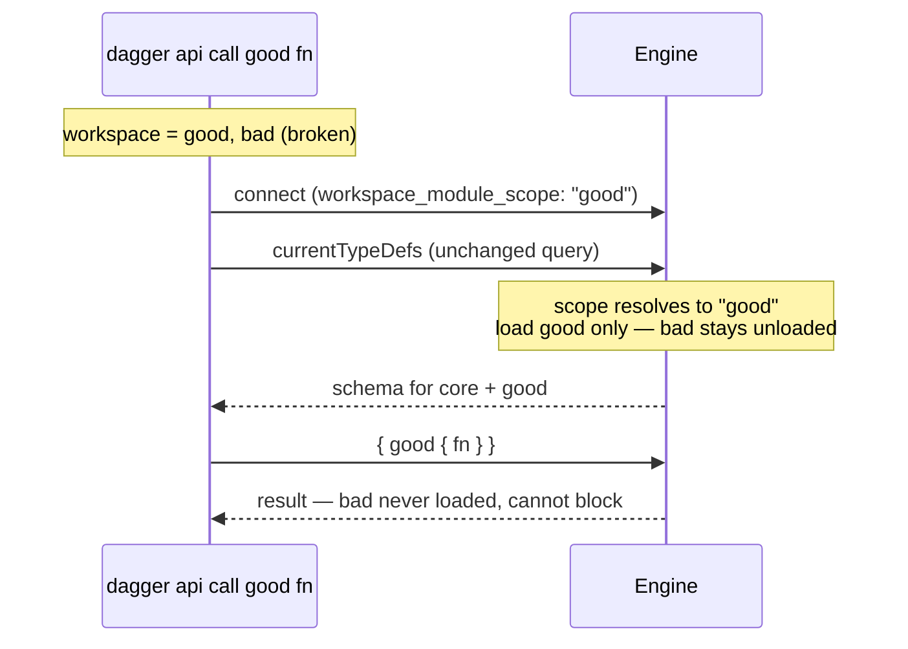

# Targeted module loading for `dagger api call` / `api functions`

This documents the as-implemented behavior. It builds on
[Demand-Driven Workspace Module Loading](../demand-driven-module-loading.md),
which narrowed `dagger generate` / `check` / `up` and left `call` / `functions`
out of scope.

## Problem

A workspace can install several modules. To run one function —
`dagger api call mymod build` — the CLI first asks the engine for the schema of
everything loaded (`currentTypeDefs`) and builds its command tree from the
answer. That request names no module, so the engine loaded **every** workspace
module before answering. Two costs:

1. Calling one module paid the load time of all its siblings.
2. One broken module blocked calling *any* module.

`generate` / `check` / `up` don't have this problem anymore: their queries
carry the target (`generators(include: ["mymod"])`), so the engine loads just
that. The `call` / `functions` introspection has no place to carry the target —
so it must reach the engine some other way.

## Solution

The CLI sends its first command-line word to the engine as connection metadata,
and the engine does the rest:

```go
// engine.ClientMetadata
WorkspaceModuleScope string `json:"workspace_module_scope,omitempty"`
```

**The CLI does not interpret the word.** It may be a module name, a function of
the entrypoint module (the module whose functions are promoted onto the root),
or a typo. `dagger api call` and `dagger api functions` send it; `shell` and
everything else don't.

**The engine resolves it** when the introspection arrives:

- the word names a module (kebab-insensitive: `good-mod` matches `goodMod`) →
  load that module plus the entrypoint module;
- it names nothing known → load just the entrypoint module when one is
  configured (the word is probably one of its functions), otherwise everything;
- the hint is honored once per session, then discarded (see below).

Nothing else changes. `currentTypeDefs` itself is untouched — bare listings,
`shell`, and the in-engine LLM tool builder still load everything — and the
follow-up request that actually runs the function names the module in its
query, so it was already narrowed.



## Why connection metadata, not API

The target has to cross the wire somehow. Earlier attempts (#13380, #13406
then #13539 and #13543) tried the other channels:

- **A new `include` argument on `currentTypeDefs`** (#13380, #13406): public
  API change — version gating, SDK regeneration in every language, a CLI
  fallback for older engines, and a cache-key fix — for a signal only the CLI
  sends.
- **Encoding the target in the GraphQL operation name** (#13539): no API
  change, but a hidden magic-string contract between CLI and engine.
- **A per-module typedefs field** (#13543): the CLI resolves the name itself
  first, duplicating rules the engine already owns.

Connection metadata is where this kind of session setup already lives
(`LoadWorkspaceModules`, `ExtraModules` from `-m`, `Workspace` from `-W`). It
never touches the GraphQL API — no gating, no SDK changes — and version skew
resolves itself: an old engine ignores the unknown field and loads everything;
an old CLI doesn't send it.

A hint is also safe here: module loading is additive and per-request (from the
demand-driven work), so a wrong or unused hint never excludes anything — a
later request that needs more modules loads them then.

## Behavior

| Command | Loads |
|---|---|
| `api call good fn`, `api functions good`, `api call good --help` | `good` + entrypoint |
| `api call good-mod fn` (module `goodMod`) | `goodMod` + entrypoint |
| `api call deploy` (entrypoint function) | entrypoint only |
| `api call typo fn` | entrypoint if configured, else all; the unknown-command error still fires, though its suggestions come from the smaller tree |
| bare `api call` / `api functions` | all (a full listing needs everything, and still surfaces a broken module) |
| `api call -o out.txt good fn` | all — the CLI can't safely tell which word is the target, so it sends nothing |
| `-m <module>`, core mode, `shell`, `mcp`, `api query` | unchanged — no scope sent |

## Details worth knowing

**Used once per session.** `api call` can end in the interactive shell (a
function returning `LLM`), which re-introspects in the same session and must
see every module — so the first introspection the hint narrows also consumes
it. Consumption only happens after a *successful* load; a transient failure
leaves the hint usable for the retry. One consequence: a script running several
dagger commands inside one nested exec shares one session, so only the first
command narrows — the rest load everything, exactly the old behavior.

**Works the same inside containers.** A dagger CLI running in a container (CI
jobs, our integration tests) is a nested client. It never inherits the parent's
scope and its own scope is honored — which requires two plumbing points in
`engine/server/session.go`: `nestedClientMetadataForRequest` re-reads the field
from the nested request's own headers, and `getOrInitClient`'s late-arriving
fill-in picks it up, because the nested client is created by a headerless
pre-request before the CLI's metadata arrives.

**Scoped loads are strict.** Bare `dagger generate` tolerates and reports load
failures; a scoped call does not — if the module you target fails to load, the
call fails with that module's error.

## Tests

`TestWorkspaceCallNarrowsToRequestedModule` and
`TestWorkspaceCallNarrowsByCliNameAndEntrypoint`
(`core/integration/generators_test.go`, fixtures `generators-broken` and
`call-narrowing`) cover: exact and kebab-case targets, entrypoint functions,
scoped `--help`, one-shot consumption within a session, and that bare listings
still load — and surface — a broken module. Unit tests cover the demand filter
matrix (`engine/server/session_test.go`), metadata plumbing including the
nested inherit/forward rules, and that `shell`'s shared param helper never
sends a scope.
