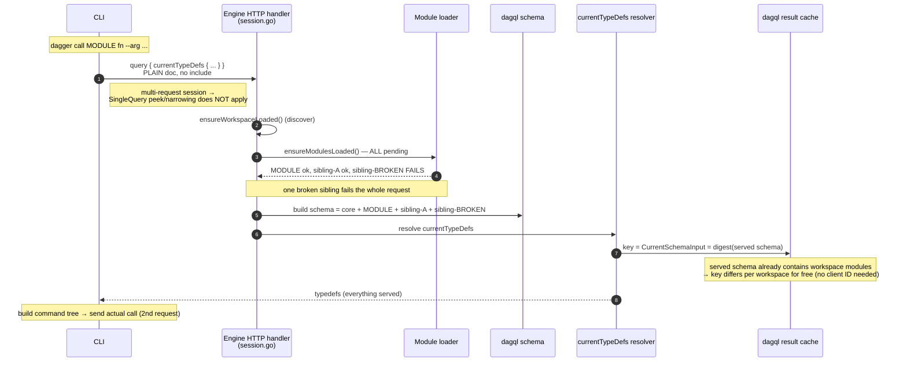
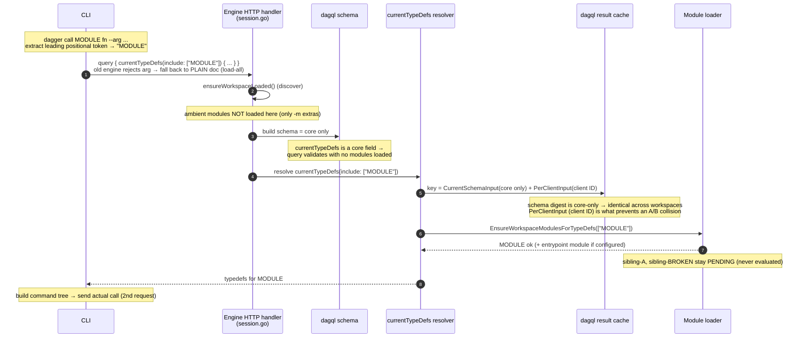
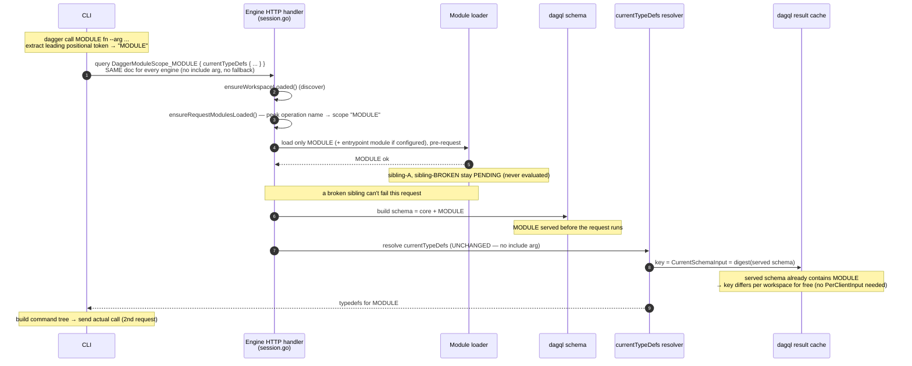

# Demand-Driven Workspace Module Loading — Dumb-Client Variant

*Alternative to [#13406](https://github.com/dagger/dagger/pull/13406)
(`module-loading`, "Load workspace modules on demand"), which is itself an
alternative to [#13380](https://github.com/dagger/dagger/pull/13380).*

## Table of Contents

- [Problem](#problem)
- [Shared foundation: additive demand-driven loading](#shared-foundation-additive-demand-driven-loading)
- [The one hard case: `dagger call` / `functions`](#the-one-hard-case-dagger-call--functions)
- [This design: peek the operation name](#this-design-peek-the-operation-name)
- [What each command does](#what-each-command-does)
- [Sequence comparison](#sequence-comparison)
- [Comparison with #13406](#comparison-with-13406)
- [Implementation](#implementation)
- [Edge cases](#edge-cases)

## Problem

Workspace module loading is one-shot: the first schema-needing request loads
*every* configured module (`ensureModulesLoaded`, a sticky `modulesLoaded` flag
in `engine/server/session_workspaces.go`). So `dagger generate|check|up|call|
functions <module>` pays for all its siblings, and a single broken or stale
module blocks operating on *any* module — for `generate`, including the very
module you were running generate to fix. The pre-existing narrowing
(`narrowPendingWorkspaceModulesForSingleQuery`) is restricted to `SingleQuery`
clients, because once a pending module is *dropped* it can't come back in a
later request.

## Shared foundation: additive demand-driven loading

This variant keeps #13406's engine foundation verbatim, because that part is
already a "dumb client" — it requires no CLI change at all. Loading becomes
**additive and demand-driven**: each request loads only the modules it can
possibly touch, and the rest stay *pending*, loading when a later request
demands them. The dagql schema is rebuilt from the served set per request, so
the session schema grows monotonically — **narrowing is deferral, not
exclusion**, which is what makes it safe for open multi-request sessions and
generalizes the demand signal from `SingleQuery` to every client.

The demand source is the natural one for each query shape:

- **Root fields** naming a pending module load just that module (the existing
  entrypoint fallback is preserved); full-schema fields (`__schema`, `env`, …)
  and anything unrecognized conservatively load everything.
- **`currentWorkspace { checks|generators|services(include: …) }`** validates
  against the core schema, so loading moves *into* those resolvers via a
  `Query.Server.EnsureWorkspaceModules` hook — they receive `include` as a
  native typed argument, no request peeking. Since the CLI already sends
  `include` as the command's functional argument, `dagger generate|check|up
  <module>` narrows with **zero CLI change**.

A failed module stays pending and only fails the requests that demand it; full
listings still load everything and surface it. Extra (`-m`) modules keep loading
eagerly with sticky errors — they were explicitly requested.

## The one hard case: `dagger call` / `functions`

`call`/`functions <module>` build their command tree from a
`currentTypeDefs(returnAllTypes: true, hideCore: true)` introspection
(`internal/cmd/dagger/typedefs.graphql`). That request validates against the
core schema and **names no module** — there is no functional argument to read,
unlike the selector commands. The narrowing signal has to enter the request
somehow.

PR #13406 answers this client-side (its "phase 2"): it adds a public
`currentTypeDefs(include:)` argument and teaches the CLI to derive a
scope-bearing query document, send it only when a target exists, and fall back
to the plain document when the engine reports the argument as unknown. That is
correct, but it is a lot of client intelligence plus a permanent public API
surface: a base-schema-allowlist gate, a version gate, a `PerClientInput` cache
fix (loading now happens *inside* the cached resolver), and a regeneration of
the argument into every SDK's generated client.

## This design: peek the operation name

Keep the CLI dumb. The signal it must convey is one token — *which module*. Put
that token where every GraphQL request already carries free-form, server-ignored
text: the **operation name**.

When `dagger call`/`functions` targets a module, the CLI names its introspection
operation `DaggerModuleScope_<module>` (and sets the matching `operationName` in
the request envelope). The engine already parses the operation name in its
per-request peek (`dagql.PeekRootFields` reads it today); the peek now also
returns it, decodes the scope, and loads just that module (plus the workspace
entrypoint) **before the request runs** — exactly the same
`filterPendingWorkspaceModulesForTypeDefsTarget` demand rule #13406 uses, fed
from the peek instead of a resolver argument.

Consequences, all in the dumb-client direction:

- **No public API change.** `currentTypeDefs` is untouched — no `include`
  argument, no SDK regeneration, no version gate, no base-schema allowlist
  entry.
- **No `PerClientInput`.** Loading happens *before* the resolver (in
  `serveQuery`, as on `main`), so the schema digest at `currentTypeDefs` call
  time reflects the workspace's served modules and stays workspace-unique.
  `CurrentSchemaInput` alone is correct; the resolver-time cache-collision
  hazard #13406 had to defend against never arises.
- **No fallback branch.** The same query is sent to every engine: an operation
  name is always valid GraphQL, so an engine that doesn't peek it simply ignores
  it and loads every module — the pre-narrowing behavior. The CLI does not need
  to know the engine's version.
- **The CLI change is ~one statement per call site** plus a string rename of the
  embedded operation. No conditional documents, no error sniffing.

Kebab-case command names (`dagger call good-mod`, module `goodMod`) survive
because GraphQL names allow only `[_0-9A-Za-z]`: the `-` is sanitized to `_` in
the operation name, and the engine kebab-normalizes the decoded token the same
way it normalizes module names (`canonicalWorkspaceModuleName` →
`strcase.ToKebab`), so both sides resolve to `good-mod`.

## What each command does

| Command | Today (`main`) | This design |
|---|---|---|
| `dagger generate good` / `check good:*` / `up good` | loads all | loads `good` — resolver reads the `include` it already receives; **no CLI change** |
| `dagger query '{ good { verify } }'` | narrowed only with `--single-query` | narrowed for every client, root-field demand |
| `dagger call good verify` | loads all | loads `good` — operation `DaggerModuleScope_good`, peeked; execution `{ good { verify } }` then narrows by root field |
| `dagger call good-mod ping` | loads all | loads `goodMod` — `-`→`_` sanitized, engine kebab-matches |
| `dagger call greet` (entrypoint fn) | loads all | loads the entrypoint module alone (scope names no module → entrypoint demand) |
| bare `dagger functions` / `shell` / `mcp` | loads all | loads all (correct: they need everything) |

## Sequence comparison

All three diagrams trace the same scenario — `dagger call MODULE fn` in a
workspace of `{ MODULE, sibling-A, sibling-BROKEN }` where `sibling-BROKEN` has
broken source — since that is where the approaches diverge.
(`generate`/`check`/`up` narrow identically in #13406 and this design, through
the selector resolvers' `include` argument, with no CLI change.)

The participants are the engine HTTP handler (`session.go`), the module loader,
the dagql schema, the `currentTypeDefs` resolver, and the dagql result cache.
The last two matter because *when* a module loads decides the resolver's cache
key: load it before the request and the schema digest already identifies the
workspace; load it inside the resolver and it does not.

### `main` — one-shot, load everything

### #13406 — demand-driven, signal in a public argument

Loading inside the resolver has a cost: the schema digest at `currentTypeDefs`
call time is core-only, so it no longer distinguishes workspaces, and
`PerClientInput` (client ID) must be mixed into the cache key to avoid two
workspaces sharing one entry. The CLI also owns the `include` document and its
old-engine fallback, and the new argument ships in every SDK's generated client.

### #13539 — demand-driven, signal peeked from the operation name

Because the module loads *before* the request runs, the schema already contains
it at `currentTypeDefs` call time, so `CurrentSchemaInput` is workspace-unique
for free — exactly as on `main`, and the resolver is left untouched. No
`PerClientInput`, no public argument, no old-engine fallback. The follow-up call
request (`{ MODULE { fn } }`) then narrows by root field, and `sibling-BROKEN`
is never evaluated.

## Comparison with #13406

| | #13406 | This design |
|---|---|---|
| Engine foundation (additive loading, selector resolvers, root-field peek) | yes | **identical, reused** |
| `call`/`functions` signal | new public `currentTypeDefs(include:)` arg | operation name, peeked |
| CLI logic for `call`/`functions` | derive scoped document, conditional send, unknown-arg fallback | name the operation after the target |
| Public API change | `currentTypeDefs(include:)` (+ allowlist + version gate) | none |
| `PerClientInput` cache fix | required (resolver-time loading) | not needed (pre-request loading) |
| SDK regeneration | all SDKs + runtimes | none |
| Old-engine compatibility | fallback branch in the CLI | same query works everywhere, no branch |

The two are not in conflict about the engine model — they share it. They differ
only in where the `call`/`functions` target enters the request: a typed public
argument the client constructs, versus an operation name the server peeks.

## Implementation

1. `dagql/request_peek.go` — `PeekRootFieldsAndOperation` (operation name +
   root fields, name recovered from the document when the envelope omits it);
   `ModuleScopeOperationName` / `ModuleScopeFromOperationName` codec.
2. `engine/server/session.go` — `ensureRequestModulesLoaded` peeks the operation
   name; a `DaggerModuleScope_<module>` operation narrows via
   `filterPendingWorkspaceModulesForTypeDefsTarget`, otherwise root-field demand
   applies.
3. `engine/server/session_workspaces.go` — `currentTypeDefs` returns to the
   load-everything default (`rootFieldsRequireFullWorkspaceSchema`), since the
   scope now overrides it via the peek; the `EnsureWorkspaceModulesForTypeDefs`
   resolver hook is dropped (the selector hook `EnsureWorkspaceModules` stays).
4. `internal/cmd/dagger` — `call`/`functions` pass the leading positional token
   as `loadTypeDefsOpts.Scope`; `loadTypeDefs` renames the introspection
   operation and sets `operationName`. `currentTypeDefs` and every SDK client
   are unchanged.

## Edge cases

- **Bare `functions` / `shell`** send no scope, so the operation name carries no
  prefix and `currentTypeDefs` falls under the load-everything default — they
  correctly see every module (and surface a broken one).
- **Operation-name drift**: if `typedefs.graphql`'s `query TypeDefs(` header
  changes, the rename silently no-ops and the CLI loads everything (safe
  degradation); a unit test pins the coupling.
- **Entrypoint execution** (`dagger call greet`): the introspection loads the
  entrypoint; the follow-up `{ greet }` execution finds it already served, and
  with no pending entrypoint left an unrecognized root field demands nothing, so
  the broken sibling stays unloaded.
- **Cache identity**: pre-request loading keeps the `currentTypeDefs` schema
  digest workspace-specific, so `CurrentSchemaInput` keys results correctly
  across concurrent sessions in different workspaces.
- **Aliases/variables**: the peek uses field and operation *names*, never
  aliases; operation names cannot be GraphQL variables, so there is nothing to
  resolve.
