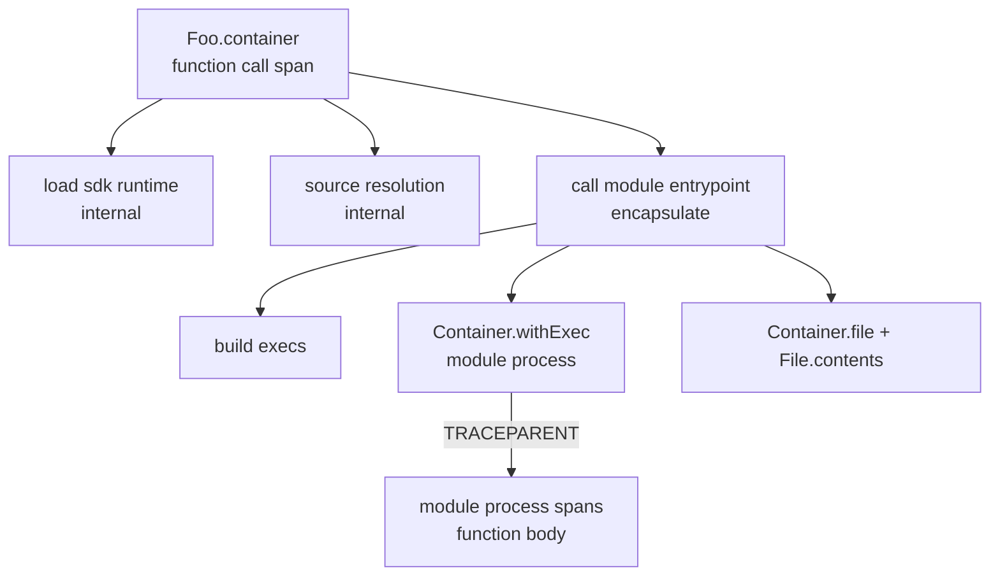
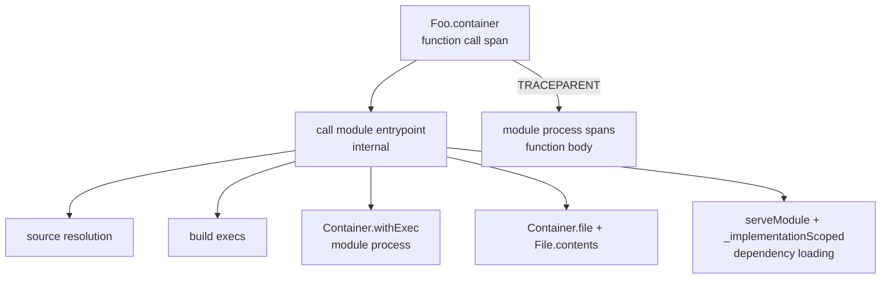
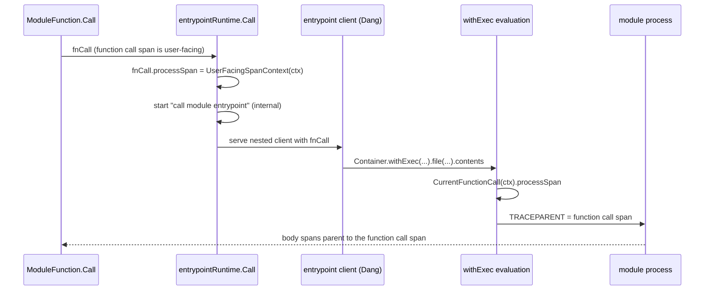
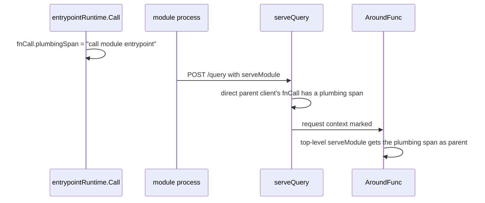

# Module entrypoint span tree

Scope: the spans the engine emits when it calls a module function through a
module entrypoint (`[entrypoint] kind = "dang"`). Base: dagger/dagger `main` at
`dea716e377`. Entrypoints were introduced by PR #14038 (`4acb52a962`) and first
released in `v1.0.0-beta.14`.

## Table of Contents

- [Problem](#problem)
- [Solution](#solution)
- [Before](#before)
- [Design](#design)
- [After](#after)
- [Out of scope](#out-of-scope)
- [Test strategy](#test-strategy)
- [Verification](#verification)
- [Status](#status)

## Problem

A module loaded through an entrypoint renders a worse trace than the same
module on v0.21.9. The reference traces are:

| Trace | Engine |
|---|---|
| `bf7a97aa1d3b9e3ae28e873ba87a2660` (regressed) | eunomie/dagger `unified-clients-python-e2e-test` at `99f4acee6a`, same span code as dagger/dagger `2c33ec4588` |
| `6d83b664db1d1d63abe02a76024784f6` (known good) | tag `v0.21.9` |

Both traces run a Python module `foo` that calls a Python dependency
`my-module`.

1. **A runtime span without a runtime.** `ModuleFunction.loadFunctionRuntime`
   (`core/modfunc.go:814`) starts `load sdk runtime` on every function call. For
   an entrypoint it wraps `entrypointSDK.Runtime`, which returns a struct
   literal. The span has no children and lasts at most 15 µs.
2. **Plumbing as ordinary spans.** v0.21.9 never emitted its plumbing: the
   runtime exec ran under `dagql.WithSkip`, and calls rooted at
   `currentFunctionCall` were skipped as introspection. An entrypoint does the
   same plumbing in Dang code, and that code reaches the engine as an ordinary
   GraphQL client. Every step becomes a normal span: source guard, container
   build, request encoding, `withExec`, `Container.file`, `File.contents`. Only
   `telemetry.Encapsulate()` on `call module entrypoint` hides them.
3. **The function body sits inside the plumbing.** The executor injects the
   user-facing span of the exec as the process `TRACEPARENT`
   (`engine/engineutil/executor_spec.go:883-898`). For the module process that
   span is the entrypoint's own `Container.withExec` call. The body's API calls
   therefore descend from the encapsulated entrypoint span. At default verbosity
   the body disappears with the plumbing. At `-vvv` the two interleave: 467 rows
   instead of 44 for the same two calls.
4. **Dependency loading in the body.** Once the body leaves the plumbing, a
   module process that calls a dependency also shows how it loads it. The
   generated client calls `serveModule` (eunomie/python-sdk
   `sdk/src/dagger/client/_load.py`). The engine then selects
   `Module._implementationScoped` when the process's next request installs that
   dependency. Both render as rows of the function call, beside its real calls.

The requirements are:

1. No "load runtime"-like span when a module loads through an entrypoint.
2. The internals of writing and reading the JSON result stay hidden, or at
   least sit in one collapsible span.
3. The call hierarchy is clear: plumbing is separate from function bodies.
4. Dependency loading joins `call module entrypoint`, or at least one similar
   collapsible span.

## Solution

The entrypoint path stops emitting `load sdk runtime`. The entrypoint span
`call module entrypoint` becomes internal and starts before source resolution,
so it holds all plumbing. The module process parents its telemetry to the
function call span instead of the entrypoint's `withExec` span, so the body
leaves the plumbing. The engine finds the module process with an implicit rule:
an entrypoint starts only one process that talks to the Dagger API. The module
process's dependency loading joins the entrypoint span.

## Before

Raw spans of `foo container` in trace `bf7a97aa`, condensed. Flags are
`dagger.io/ui.*` attributes.

```text
Foo.container
├─ load sdk runtime                                   [internal]
├─ Workspace.file, Workspace.moduleSource (+6)        [internal]
└─ call module entrypoint                             [encapsulate]
   ├─ Workspace.moduleSource, ModuleSource.directory
   ├─ Container.withExec  python -m dagger.mod call --output /dagger/result.json
   │  ├─ Query.serveModule  my-module (+44 descendants)
   │  ├─ Query.myModule
   │  │  ├─ load sdk runtime                          [internal]
   │  │  └─ call module entrypoint                    [encapsulate]
   │  │     ├─ Directory.exists ×12, Directory.file ×3, …          source guard
   │  │     ├─ Container.withExec  uv pip install …                build
   │  │     ├─ Container.withExec  python -m dagger.mod call …
   │  │     │  └─ Workspace.directory                              ← body
   │  │     ├─ Container.file("/dagger/result.json")
   │  │     └─ File.contents
   │  └─ MyModule.container
   │     ├─ load sdk runtime                          [internal]
   │     └─ call module entrypoint                    [encapsulate]
   │        ├─ Container.withExec  python -m dagger.mod call …
   │        │  ├─ Container.from("alpine:3.24")                    ← body
   │        │  └─ Container.withDirectory                          ← body
   │        ├─ Container.file("/dagger/result.json")
   │        └─ File.contents
   ├─ Container.file("/dagger/result.json")
   └─ File.contents
```

The TUI at default verbosity shows no body at all:

```text
▼ ✔ foo(ws: currentWorkspace: Workspace!): Foo! 2.8s
╰╴▼ ✔ call module entrypoint 2.8s
▼ ✔ .container(ws: currentWorkspace: Workspace!): Container! 9.2s
╰╴▼ ✔ call module entrypoint 9.2s
```

v0.21.9 showed the dependency calls and their bodies:

```text
▼ ✔ foo: Foo! 1.1s
▼ ✔ .containerEcho: Container! 5.2s
├╴▼ ✔ myModule: MyModule! 1.1s
╰╴▼ ✔ .containerEcho(stringArg: "hello foo"): Container! 3.1s
  ├╴▼ ✔ Container.from(address: "alpine:latest"): Container! 2.0s
  ╰╴▼ ✔ withExec echo 'hello foo' 0.1s
```

## Design

### Span parenting

Today every span of the call descends from the entrypoint's `withExec`:



After the change the plumbing and the body are siblings under the function
call span:



### 1. No `load sdk runtime` for entrypoints

`loadFunctionRuntime` skips the span when the module's SDK reports that it has
no runtime. The report is an optional method on the SDK, `HasNoRuntime() bool`,
found by type assertion. `AlwaysEnablesSelfCalls` (`core/modulesource.go:160`)
sets the precedent for this shape. `core` cannot import `core/sdk`, so a type
switch on `entrypointSDK` is not possible. Only `entrypointSDK` implements the
method. Every other SDK keeps the span unchanged.

### 2. One internal span for the plumbing

`entrypointRuntime.Call` (`core/sdk/dang/v2/entrypoint.go`) starts
`call module entrypoint` as its first step, before `entrypoint.ResolveSource`
and `SchemaIntrospectionJSONFileForModule`. The span gains
`telemetry.Internal()` and keeps `telemetry.Encapsulate()`:

- `Internal` hides the span and its subtree below verbosity 3. At `-vvv` the
  span is one row that holds every plumbing step.
- `Encapsulate` keeps reveal bubbling and surfacing from crossing the plumbing.
- A failed span stays visible at default verbosity and above
  (`dagql/dagui/opts.go` `ShouldShow`). A failing build or module process still
  shows its chain and its output.

This change is only safe together with change 3. On its own it hides the body
at every verbosity below 3.

### 3. Module process telemetry parents to the function call span

#### Rule

Every exec that the entrypoint's `call` evaluation runs parents its process
telemetry to the function call span. The rule relies on one property: an
entrypoint starts only one process that talks to the Dagger API. Build tools
(`uv`, `pip`, `go build`) emit no telemetry, so their `TRACEPARENT` has no
effect. The module process is the only emitter, so its spans and OTel logs land
on the function call.

The rule covers every known entrypoint:

| Entrypoint | Execs in `call` | Telemetry emitter |
|---|---|---|
| Python shared, eunomie/python-sdk `d1c60dc685` `entrypoint/main.dang` | `uv sync` or `uv pip install` or `pip install` (`entrypoint/build.dang`), `python -c <workspace reader>` for a scope, `python -m dagger.mod call` | `python -m dagger.mod call` |
| Python generated, same commit, `MAIN_TEMPLATE` in `sdk/src/dagger/mod/_entrypoint.py` | `uv pip install` ×2, `python -m dagger.mod call` | `python -m dagger.mod call` |
| Go generated, eunomie/go-sdk `c064cb85cc` `helpers/codegen/generator/gogenerator/templates/v2.go` | `go build ./cmd/<module>-dispatch`, `dispatch engine-call` | `dispatch engine-call` |

#### Why not privileged nesting

The first candidate rule was "the exec with `experimentalPrivilegedNesting`".
That rule no longer holds. Commits `1554cac4a9`, `99dcf882da` and `33c00b2a0d`
landed after `2c33ec4588`. They make nesting the default and turn
`experimentalPrivilegedNesting` into a no-op for newer API views. Commit
`88ab8c74d3` sets that gate to `v1.0.0-0` (`core/schema/util.go`,
`defaultNestingVersion`). The entrypoint client runs at the module's
`engineVersion` view (`engine/server/session.go:1510-1514`), and
`engine.APIViewVersion` drops the prerelease from that version. Every module on
a v1.0.0 prerelease, `v1.0.0-beta.14` included, therefore gives `uv pip install`
and `go build` nesting too.

#### Mechanism



1. `FunctionCall` gains an engine-side field `processSpan`, a
   `trace.SpanContext`. It is not persisted and not sent to the module, like
   `callerAgent` (`core/typedef.go`).
2. `entrypointRuntime.Call` reads `dagql.UserFacingSpanContext(ctx)` before it
   starts its own span. At that point the value names the function call span.
   It stores the value on `fnCall`.
3. The entrypoint client already carries `fnCall`: `evalDangSource` passes it
   to `dangshared.WithNestedClientServer`, and the session stores it on the
   client (`engine/server/session.go:1467`).
4. Exec setup in `core/container_exec.go` sets
   `execMD.UserFacingSpanCtx`. When the exec has no function call of its own,
   it asks `query.CurrentFunctionCall(ctx)`. A valid `processSpan` replaces the
   exec's user-facing span. `CallerAgent` (`core/agent_context.go`) resolves the
   agent through the same lookup.
5. The executor already injects `execMD.UserFacingSpanCtx` as `TRACEPARENT`.
   The field is `json:"-"`, so it never enters an exec cache key.

The lookup excludes execs that carry their own function call. A legacy
container runtime runs its exec with the function call attached
(`ContainerRuntime.Call`). If the entrypoint's Dang code called such a
function, the dependency's process keeps its own function call span.

Other clients are unaffected. A plain Dang module stores no `processSpan`. A
module process connects as the exec's nested client, whose function call is nil.
Execs issued by the function body therefore keep their normal parent.

#### Process stdio stays with the exec

The executor writes the process's stdout and stderr to the exec's cause span,
not to `TRACEPARENT` (`core/container_exec.go`, `causeCtx`). This design does
not move stdio:

- The Go entrypoint returns its result on stdout (`dispatch engine-call` read
  through `.stdout`). Stdio on the function row would print the result JSON,
  which breaks requirement 2.
- Build output (`uv pip install`, `go build`) stays in the plumbing.
- The rule finds the module process only through the telemetry it emits. Stdio
  exists before the process emits anything, so the rule cannot select stdio.

A Python function's `print` output therefore shows under the internal
entrypoint span: at `-vvv`, or whenever the exec fails. v0.21.9 showed it on
the function row. Restoring that needs a result channel other than stdout for
every entrypoint, and it is a separate decision.

### 4. Dependency loading joins the entrypoint span

#### Rule

A top-level call in a request from a module process joins the entrypoint span
of its function call when it loads a dependency:

- `Query.serveModule`, which serves a dependency into the process's schema;
- an engine-private call, whose field starts with `_`, such as
  `Module._implementationScoped` when the next request installs that dependency.

A top-level call is one whose parent is the request's own span. A call nested
in a body call keeps its parent, even an engine-private one. Every other call of
the module process stays in the body.

A hidden span of its own would not be enough: Dagger Cloud shows internal
spans, so an internal `serveModule` row would stay visible there. Joining
`call module entrypoint` folds the calls under one collapsed row in every
renderer.

#### Mechanism



1. `FunctionCall` gains a second engine-side field, `plumbingSpan`.
   `entrypointRuntime.Call` sets it to the `call module entrypoint` span right
   after it starts that span.
2. `serveQuery` (`engine/server/session.go`) starts each request's passthrough
   `POST /query` span. When the client's direct parent client has a function
   call with a plumbing span, it marks the request context with
   `core.WithModuleProcessRequest`. The module process is that direct child:
   its exec runs under the entrypoint client, which carries the function call.
3. `AroundFunc` (`core/telemetry.go`) starts the span of a call that
   `moduleProcessPlumbingParent` matches under the plumbing span.

Only the parent changes. The span keeps its call, digest, attributes and
children. The plumbing span is still open while the process runs, because the
entrypoint waits for the process.

## After

Measured on the runs listed in [Verification](#verification). Renderers hoist
passthrough spans, so the raw tree omits them: the `call_exec` profiling span
that holds `call module entrypoint`, and the module process's `POST /query`
client spans that hold the body. The scenario is the module `greetings` calling
its own client: `hello` runs `greetings(ws).helloContainer(name).stdout`.

Raw spans of `hello --name Plop`:

```text
Greetings.hello
├─ call module entrypoint                    [internal, encapsulate]
│  ├─ Workspace.withWorkdir ×2               [internal]
│  ├─ Container.withExec  python -m dagger.mod call …   (no children)
│  ├─ Container.file("/dagger/result.json"), File.contents
│  ├─ Query.serveModule("/greetings")                     dependency loading
│  └─ Module._implementationScoped           [internal]   dependency loading
├─ Query.greetings
│  ├─ call module entrypoint                 [internal, encapsulate]
│  └─ Workspace.directory                                  ← body
├─ Greetings.helloContainer
│  ├─ call module entrypoint                 [internal, encapsulate]
│  ├─ Container.from("alpine:3.24")                        ← body
│  ├─ Container.withDirectory                              ← body
│  ├─ Container.withWorkdir                                ← body
│  └─ Container.withExec                                   ← body
└─ Container.stdout                                        ← body
```

TUI at default verbosity, every row expanded. Before change 4, a
`serveModule(address: "/greetings"): Void` row sat first under `.hello`:

```text
✔ greetings(ws: currentWorkspace: Workspace!): Greetings! 6.2s
╰╴✔ Workspace.directory(path: "/", exclude: […]): Directory! 0.0s
✔ .hello(ws: currentWorkspace: Workspace!, name: "Plop"): String! 5.3s
┃ hello Plop
├╴✔ greetings(ws: currentWorkspace: Workspace!): Greetings! 2.6s
│ ╰╴✔ Workspace.directory(path: "/", exclude: […]): Directory! 0.0s
├╴✔ .helloContainer(name: "Plop"): Container! 1.5s
│ ├╴✔ Container.from(address: "alpine:3.24"): Container! 0.5s
│ ├╴✔ .withDirectory(path: "/src", …): Container! 0.2s
│ ├╴✔ withWorkdir /src 0.2s
│ ╰╴✔ withExec echo hello Plop 0.3s
╰╴✔ .stdout: String! 0.3s
```

TUI at `-vvv`, every row expanded, first two levels of `.hello`. Every plumbing
step, dependency loading included, sits below the `call module entrypoint` row
of its function:

```text
✔ Greetings.hello(…): String!
├╴✔ call module entrypoint 5.3s
│ ├╴✔ Workspace.withWorkdir(path: "."): Workspace!
│ ├╴✔ .withWorkdir(path: "greetings"): Workspace!
│ ├╴✔ Container.withExec(args: ["python", "-m", "dagger.mod", "call", …], stdin: "{…}")
│ ├╴✔ .file(path: "/dagger/result.json"): File!
│ ├╴✔ .contents: String!
│ ├╴✔ serveModule(address: "/greetings"): Void 0.3s
│ ╰╴✔ Module._implementationScoped: Module!
├╴✔ greetings(…): Greetings!
│ ├╴✔ call module entrypoint 2.6s
│ ╰╴✔ Workspace.directory(…)
├╴✔ .helloContainer(name: "Plop"): Container! 1.5s
│ ├╴✔ call module entrypoint 1.2s
│ ├╴✔ Container.from(address: "alpine:3.24"): Container!
│ ├╴✔ .withDirectory(…)
│ ├╴✔ .withWorkdir(path: "/src"): Container!
│ ╰╴✔ .withExec(args: ["echo", "hello", "Plop"]): Container!
╰╴✔ .stdout: String! 0.3s
```

A failing module process still surfaces at default verbosity. A Go function
body that panics renders as follows:

```text
✘ .container: Container! 0.1s ERROR
┇ call module entrypoint ›
✘ withExec /usr/local/bin/dispatch engine-call (stdin: "{…}") 0.1s ERROR
panic: boom from the function body
```

## Out of scope

- **Expanded call trees in the CLI's final frame.** `--progress plain` prints
  every visible call, the nested `greetings`, `.helloContainer` and
  `Container` calls included. The pretty and report frontends collapse
  completed rows below the top level at default verbosity
  (`TraceTree.IsExpanded`, `dagql/dagui/types.go`); `DAGGER_EXPAND_COMPLETED=1`
  or `-vvvvv` expand them. Showing nested calls by default changes that policy
  for every command, so it is a separate decision.
- **The CLI's own `Module._implementationScoped`.** The main client's request
  selects it too, at the top of the trace. The CLI hides it as internal; Dagger
  Cloud shows it. It is not module process plumbing, so change 4 leaves it.
- **`module entrypoint interface` spans.** `recordInterface`
  (`core/sdk/entrypoint.go`) stays. Its spans are internal and now sit inside
  the entrypoint span for calls.
- **The `types` path.** `EntrypointModuleTypes` has no function call span. Its
  `describe` exec stays under module loading.
- **Dagger Cloud.** The Cloud trace browser needs no change. It may show hidden
  and internal spans.
- **An OTel link from the `withExec` span to the body.** The body's causal
  parent is the function call. No link is added.

## Test strategy

**Unit, `core/modfunc_test.go`.** `loadFunctionRuntime` emits
`load sdk runtime` for an SDK with a runtime and no span for an SDK that reports
`HasNoRuntime`.

**Unit, `core/telemetry_plumbing_test.go`.** `moduleProcessPlumbingParent` moves
a top-level `serveModule` and a top-level engine-private call, and keeps a body
call, a nested engine-private call, and any call from an unmarked request.

**Integration, `core/integration/module_entrypoint_test.go`.** A Dang
entrypoint fixture whose `call` runs a build exec and a module process. The
module process posts two GraphQL queries to the nested session with the
injected `TRACEPARENT`: `serveModule` of its own module, as a generated client
does, then one body call. It writes its result to a file. A trace sink
(`core/integration/tracesink_test.go`) captures the session. The test asserts:

- the body's API call span descends from the function call span and not from
  `call module entrypoint`;
- the build exec stays under `call module entrypoint`;
- the `serveModule` call joins `call module entrypoint`;
- every `call module entrypoint` span is internal;
- the trace has no `load sdk runtime` span.

On `9c30b614ea` without the change, the test failed on the body, internal and
runtime assertions; that run predates the `serveModule` assertion. With
changes 1 to 3 only, the test fails on the `serveModule` assertion only.

## Verification

Each run executes one `dagger call` on a dedicated dev engine, with telemetry
captured by `hack/otlpdump`. The trace IDs are Dagger Cloud traces. Both runs
predate the rebase onto `dea716e377`: the engines in the table are the ones that
ran.

| Case | Engine | Before | After |
|---|---|---|---|
| Python `foo` calling `my-module@v1`, eunomie/python-sdk `d1c60dc685`, static entrypoints | `99f4acee6a` / `99f4acee6a` with this change applied | `f4144ca25c8a25d9706ed2e40b8e0a74` | `849f0f9f2551da302ad5ea694f5c9b59` |
| Go `gomod`, eunomie/go-sdk `c064cb85cc`, generated Dang entrypoint | `9c30b614ea` / `9c30b614ea` with this change applied | `f379f8b683dfde153fd969f0990010ab` | `8e24ee8422922a6f652e01ee935a85e0` |

The Python case needs the client handover of eunomie/python-sdk `d1c60dc685`.
dagger/python-sdk refuses clients on a static entrypoint. The runs use the
engine of the reference trace, `99f4acee6a`, so before and after differ only
by this change. The local before tree has the same shape as trace `bf7a97aa`.

The Go case has no dependency. eunomie/go-sdk `c064cb85cc` refuses `clients`
and `dependencies` when `dangEntrypoint = true`. The run checks the other
properties on the Go entrypoint: the body leaves the plumbing, `go build`
stays in the entrypoint span, and the result JSON on stdout stays on the
internal `withExec` span.

## Status

Implemented and verified.
