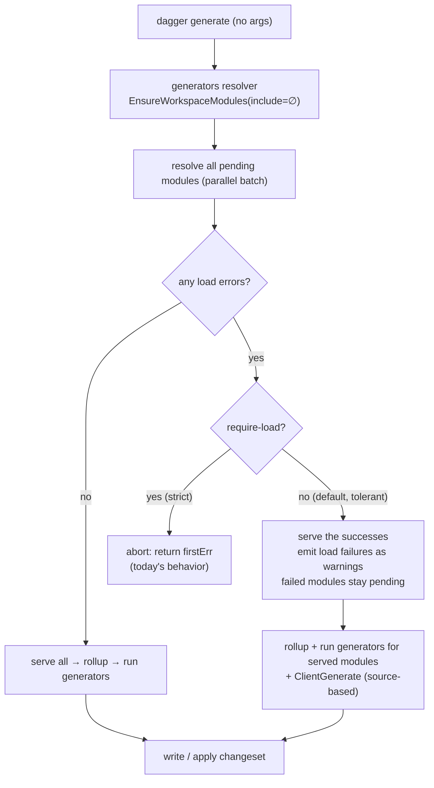

# Resilient `dagger generate` — tolerating module load failures

Scope: `dagger generate` (all forms). Builds directly on
[Demand-Driven Workspace Module Loading](demand-driven-module-loading.md),
which is already shipped and does most of the hard work.

## Table of Contents

- [Problem](#problem)
- [What already works today](#what-already-works-today)
- [Root cause of the remaining failure](#root-cause-of-the-remaining-failure)
- [Solution](#solution)
- [The chicken-and-egg question](#the-chicken-and-egg-question)
- [Mechanics](#mechanics)
- [Exit-code and output semantics](#exit-code-and-output-semantics)
- [Engine vs CLI split](#engine-vs-cli-split)
- [Edge cases](#edge-cases)
- [Open questions and recommendations](#open-questions-and-recommendations)
- [Implementation plan](#implementation-plan)

## Problem

There is a chicken-and-egg failure mode. As SDKs move to **no codegen at runtime**
(the `java` SDK already; others following), a module's bindings must be generated
ahead of time — so a module can fail to **load** *because its bindings are missing
or stale*. The fix is to regenerate them with `dagger generate`. But `dagger
generate` with no selector loads *every* workspace module, and a single load
failure aborts the whole command — so the one command that would fix the module
cannot run. The explicit workaround (scope to the SDK module, e.g. `dagger
generate dagger-java-sdk`) works but is easy to miss. The goal: a user types plain
`dagger generate` and it just works.

## What already works today

Demand-driven loading already made the **scoped** path resilient. `dagger
generate <pattern>` sends `generators(include: [...])`; the resolver loads only
the modules those patterns name (`EnsureWorkspaceModules` →
`filterPendingWorkspaceModulesBySelectorInclude`). A broken *sibling* stays
`pending` and is never loaded, so it cannot block the healthy module — including
when running generate is itself the fix. Per-module load failures are already
isolated and non-sticky (`daggerClient.failedModules`,
`recordFailedModule`, retriable across requests).

Confirmed by `core/integration/generators_test.go`
(`TestWorkspaceGenerateNarrowsToRequestedModule`): `dagger generate good`
succeeds against the `generators-broken` fixture (a `bad` module with invalid
`.dang` source) and never touches `bad`.

## Root cause of the remaining failure

The gap is the **unscoped** forms: `dagger generate` (no args) and `dagger
generate -l`. With no `include`, the generators resolver demands *all* pending
modules, and `ensureModulesLoaded` resolves them as one batch
(`engine/server/session_workspaces.go`):

```go
var firstErr error
for i, load := range loads {
    if resolveErrs[i] != nil {
        loadErr := moduleLoadErr(load, resolveErrs[i])
        client.recordFailedModule(load.mod, loadErr) // already isolated + non-sticky
        if firstErr == nil {
            firstErr = loadErr
        }
    }
}
if firstErr != nil {
    return firstErr   // <-- aborts; the successfully-resolved loads are never served
}
```

Two consequences, both **confirmed**:

1. The command aborts on the first load failure.
2. Because the abort happens *before* `serveResolvedModuleLoadsLocked`, the
   modules that *did* resolve are not served either — the healthy modules don't
   generate.

The same test file documents this as intended-current-behavior:
`daggerExecFail("generate", "-l")` against `generators-broken` asserts a
**non-zero exit** and that the `bad` error surfaces. `check` and `up` list modes
behave identically (`TestWorkspaceCheckNarrowsToRequestedModule`).

**This single `return firstErr` is the entire behavior to soften.** All the
per-module isolation plumbing already exists; it is simply gated behind an
all-or-nothing barrier for the unscoped batch.

## Solution

Make the unscoped generate path **tolerant of load failures by default**: serve
every module that loads, run generators for those, and report each load failure
as a **warning** instead of aborting. Add `--require-load` to restore today's
strict behavior (fail if any module this invocation loads cannot load).

A module that fails to load is simply **absent from the served set**. The
generators resolver already builds its generator set from
`currentWorkspacePrimaryModules(ctx)` (the served modules), so a tolerant load
needs no change to the rollup — the failed module contributes zero generators,
and everything downstream is unchanged.

Unchanged, as required: a module that **loads** but whose **generator execution**
fails (`GeneratorGroup.Run` → `RunGenerator`, or `ClientGenerate`) is still a
hard failure. Resilience is about the *load* step only.

**Generate is the special case — `check` and `up` are deliberately excluded.**
`dagger check` exists precisely to fail when a module is not in a healthy,
loadable state; silently skipping a module that can't load would defeat its
purpose. `dagger up` similarly must not pretend a service exists when its module
can't load. Only `generate` gets load tolerance, because `generate` is the
command that *repairs* the load-broken state — it writes the missing/stale
bindings a module needs in order to load (via the SDK module's generator) — so it
is the one command a broken sibling must never block. `check`/`up` keep today's
strict, load-failure-is-fatal behavior.

## The chicken-and-egg question

This is the core motivation, and it is real. The direction of travel is **no
codegen at runtime**: a module's SDK bindings are generated ahead of time and
committed, and the runtime loads the module *as-is* instead of regenerating
bindings on every load. The **`java` SDK already works this way**, and other SDKs
(including `go`) are expected to follow.

In that model the failure is direct: **a module cannot load *because* its bindings
are missing or stale** — there is no load-time regeneration to paper over it. The
fix is to (re)generate those bindings: `dagger generate dagger-java-sdk` runs the
SDK module's generator, which reads the module's **source** and writes its
bindings. The chicken-and-egg is that the obvious command — plain, unscoped
`dagger generate` — loads *every* workspace module to enumerate generators, hits
the module whose bindings are missing, and **aborts before the SDK generator that
would fix it ever runs**. The user is forced to know the scoped incantation.
**The goal is that a user simply types `dagger generate` and it works.**

Resilient mode delivers exactly that:

- The broken user module can't load → it is **tolerated** (warned) and contributes
  no generators of its own. It does not need to — the *fixing* generator does not
  live on it.
- The **SDK modules** (`dagger-java-sdk`, `dagger-go-sdk`, …) load fine, so their
  `generate-all` generators are enumerated as usual. `generate-all` iterates the
  modules the SDK authors (`[[modules.<sdk>.as-sdk.modules]]`) and regenerates
  each **from source**, including the one that couldn't load.
- So bare `dagger generate` runs the SDK generators, writes the missing/stale
  bindings for every module from source, and the previously-unloadable module is
  now fixed. A subsequent `dagger call <module>` loads cleanly.

The only thing standing between today and this is the unscoped-load abort — which
is precisely what [tolerant load](#mechanics) removes. The fix does *not* require
the broken module to load, because it comes from the SDK module's `generate-all`,
which operates on the authored modules' source.

What resilient mode still does **not** repair (correctly): a module whose
**hand-written source** is invalid — a real syntax error in `main.go`, not missing
bindings. No generator rewrites hand-written source, so that stays a warning in
default mode and a hard failure under `--require-load`.

Key facts (from code):

- `NewGeneratorGroup` → `NewModTree` needs a fully-loaded `*Module`, so an
  unloadable user module contributes zero generators — but the fix comes from the
  SDK module's `generate-all`, not from the broken module.
- `generate-all` is a `@generate` generator on the **SDK module** and operates on
  the authored modules' **source**, so it does not require the target user module
  to load (`ModuleSource.generatedContextChangeset` → `go SDK: run codegen`,
  observed in the reproduction below).

### Reproduction (evidence)

Two behaviors must be separated: the **target** no-runtime-codegen model (the
motivation) and the **current** Go behavior (which still regenerates at load time
and therefore masks the missing-bindings failure).

Against a dev engine with `dagger sdk install go` + a healthy module `myapp` and a
module `bad` whose `main.go` has a syntax error:

| Command | Result | Meaning |
|---|---|---|
| `dagger generate -l` (unscoped) | **exit 1**, `# dagger/bad … syntax error` | the abort this design removes: one unloadable module fails the whole generate |
| `dagger generate myapp -y` (scoped) | **exit 0**, regenerates `myapp` | demand-driven narrowing already isolates the broken sibling |
| `dagger call myapp hello` | **exit 1** (loads all → hits `bad`) | the broken module blocks non-narrowed commands |

The trace also confirms the recovery mechanism: bare `dagger generate` dispatches
to `dagger-go-sdk:generate-all` → `ModuleSource.generatedContextChangeset` →
`go SDK: run codegen`, i.e. the SDK module regenerating authored modules from
source. That is the exact generator that fixes a missing-bindings module once the
abort is gone.

Caveat on the Go SDK **today**: it still regenerates bindings *at load time*, so
corrupting a Go module's committed `dagger.gen.go` and busting the cache still
loaded and ran it (verified) — the pure "missing bindings block load" case is not
yet observable with `go`. But that is already the standing behavior for `java`
(no runtime codegen) and the direction `go` is heading; the design targets that
model. The abort and scoped-narrowing evidence above is
architecture-independent and already real.

Note: `dagger generate go` matched **nothing** — the SDK module is
`dagger-<lang>-sdk` (as-sdk alias `go`/`java`), so the manual workaround is
`dagger generate dagger-java-sdk`, which is exactly the incantation users should
not have to know.

## Mechanics

### Tolerant load

`ensureModulesLoaded` gains a tolerant path for the generate demand. Instead of
`return firstErr`, it records the failures (already done), serves the loads that
succeeded, and returns the collected per-module errors to the resolver without
aborting. Failed modules stay `pending` (already the case), so no other request
path is affected.



### Signaling the mode

The resolver must tell the engine whether to tolerate. Add one version-gated
boolean argument to `Workspace.generators`:

```graphql
extend type Workspace {
  """
  Collect the workspace's generators.

  requireLoad: fail if any module this call loads cannot load. Default false —
  load failures are reported as warnings and the remaining generators still run.
  """
  generators(include: [String!], requireLoad: Boolean = false): GeneratorGroup!
}
```

The resolver passes `requireLoad` into a tolerant variant of the load hook
(`EnsureWorkspaceModules` gains a `tolerate bool`, or a sibling
`EnsureWorkspaceModulesTolerant` returning `[]moduleLoadFailure`). The CLI sets
`requireLoad: true` only when `--require-load` is passed.

Because it is new public workspace API surface, `requireLoad` must be
`View(AfterVersion("v1.0.0-0"))`-gated (workspace APIs already are) and must not
appear in `core/schema/base_schema.json` — verified by `TestBaseSchemaAllowlist`.

### Surfacing load failures

The per-module load error is already turned into a failed telemetry span
(`moduleLoadErr`). In tolerant mode, emit it at **warning** level rather than as
the request's fatal error, so the existing TUI/progress rendering shows it with
no new rendering code. The CLI additionally prints a one-line end-of-run summary
(`N module(s) failed to load: bad, …; run 'dagger generate <module>' or fix the
source`) so it is visible in plain/non-TUI output.

## Exit-code and output semantics

Three distinct outcomes, kept separate:

| Situation | Default (resilient) | `--require-load` (strict) |
|---|---|---|
| **Load failure** (module can't load) | warning; **exit 0** | fatal; **exit non-zero** (today) |
| **Generator-execution failure** (module loaded, its `@generate`/client gen failed) | fatal; **exit non-zero** | fatal; **exit non-zero** |
| **Mixed** (some load+generate fine, another fails to load) | healthy modules generate + changeset applied; load failures warned; **exit 0** | **exit non-zero** on the load failure |

Rationale: default optimizes for the interactive "just fix what you can" case;
`--require-load` is the CI/scripting guard that keeps a silently-skipped module
from passing unnoticed. A generator that *ran and failed* is always fatal in both
modes — that is real work going wrong, not a missing prerequisite.

## Engine vs CLI split

**Engine:**

- Tolerant path in `ensureModulesLoaded` (serve successes; don't abort on partial
  failure; return collected failures).
- Thread `requireLoad`/tolerance through `EnsureWorkspaceModules` and the
  `generators` resolver.
- Emit tolerated load failures as warning-level telemetry.
- Version-gate the new `requireLoad` argument; keep it out of `base_schema.json`.

**CLI (`internal/cmd/dagger/generators.go`):**

- Add `--require-load` (default false); pass it as `requireLoad` on the
  `Generators(...)` call.
- Print the end-of-run load-failure summary.

Both `ws.Generators()` and `ws.Generators(WorkspaceGeneratorsOpts{Include: args})`
call sites gain the option.

## Edge cases

- **All modules fail to load.** Default: nothing to rollup, but `ClientGenerate`
  is source-based and still runs (it is on the no-args path,
  `includeClients = len(args)==0`), so a changeset may still be produced. Exit 0
  with warnings and a clear "0 module generators ran" summary. `--require-load`
  makes it fatal.
- **`--require-load` with a selector** (`dagger generate good --require-load`).
  Demand-driven loading still only loads `good`. `--require-load` therefore
  ensures *the modules this invocation actually loads* succeed; it does **not**
  force-load unselected siblings. Documented in the flag help.
- **Dependency module failing to load.** Loading is at workspace-primary-module
  granularity; a failing dependency fails its dependent primary module's load,
  which is tolerated as a single load failure like any other.
- **Quiet mode.** Load-failure warnings explain why output is partial, so they
  survive `-q` (at minimum as the one-line summary). Recommendation: do not
  suppress them.
- **Partial changeset.** The changeset for the modules that loaded and generated
  (plus client generation) **is** written/applied; failed-to-load modules simply
  aren't in it. This is the point of the feature.
- **`generate -l` (list).** Same tolerant treatment: list the generators of the
  modules that loaded, warn about the ones that didn't, exit 0. (Today it fails —
  this test flips to success-with-warnings.)
- **Re-run stability.** Failed modules stay `pending` and non-sticky, so a
  subsequent `dagger generate good` in the same session still loads `good`
  cleanly; nothing is poisoned.

## Open questions and recommendations

1. **Flag name.** `--require-load` (recommended) reads as "require modules to
   load." The brief's `--ensure-load` is acceptable but slightly ambiguous
   (ensure they *are* loaded, i.e. force-load?). Alternatives: `--strict-load`,
   `--fail-on-load-error`. **Recommendation: `--require-load`.**
2. **Default.** Resilient by default (this is the ask). **Recommendation:
   default tolerant; strict is opt-in.**
3. **All-fail outcome.** **Recommendation: success-with-warnings (exit 0) in
   default mode** — client generation may still produce useful changes, and the
   summary makes the failures visible; `--require-load` is there for CI.
4. **Client-generation tolerance** (Phase 2 decision — explained below).
   `ClientGenerate` (`core/schema/workspace_client.go`) loops over every workspace
   client entry (`cfg.Modules` with `AsSDK.Clients`); for each it calls
   `resolveClientTargetModule` (which loads the target's module **source**) and
   then generates the client, and it `return`s on the first error — so one bad
   client aborts *all* client generation, and because that changeset is merged
   into the generate result, it aborts the whole command. Two sub-questions,
   neither settled here:
   - *(a) Classification.* A client whose target-module **source** can't be
     resolved is load-shaped (it's a load), but it happens inside the generation
     step. If we keep it strictly "generator-execution → fatal," we reintroduce
     the exact chicken-and-egg for **client bindings**: the broken client you were
     trying to regenerate aborts the run.
   - *(b) Granularity.* Even if kept fatal, should one broken client stop the
     healthy clients from generating? Today it does (first-error `return`).
   **Recommendation: leave `ClientGenerate` untouched in Phase 1** (fatal,
   all-or-nothing — honors "generator failure stays fatal" and keeps Phase 1
   small). In Phase 2, decide whether to (a) reclassify target-source-resolution
   as a tolerable load failure and/or (b) make per-client generation independent
   so healthy clients still emit their changeset. This needs your call because it
   blurs the load/generate line for the client path specifically.
5. **New arg vs always-tolerant resolver.** An alternative avoids new public API
   by making the `generators` resolver *always* tolerant and implementing
   `--require-load` purely CLI-side (inspect reported load errors, exit non-zero).
   **Recommendation: keep the version-gated `requireLoad` arg** — it keeps strict
   semantics honest (strict should not have half-served the workspace) and a
   load-error surface is needed anyway.

## Implementation plan

**Phase 1 — the feature (engine + CLI).**

1. Tolerant path in `ensureModulesLoaded`: serve successful loads, collect
   failures, don't abort; emit failures as warning-level telemetry.
2. Thread tolerance through `EnsureWorkspaceModules` and the `generators`
   resolver; add version-gated `requireLoad` arg; keep `base_schema.json` clean
   (`TestBaseSchemaAllowlist`).
3. CLI `--require-load` flag + end-of-run load-failure summary.
4. Tests: flip `TestWorkspaceGenerateNarrowsToRequestedModule`'s "across all
   modules" case from `daggerExecFail` to success-with-warnings (healthy modules
   generate; `bad` reported as a warning); add a `--require-load` strict-mode test
   that keeps today's abort. Add a **recovery** fixture in the no-runtime-codegen
   model (the `java` SDK, or a `go` module with load-time regeneration disabled): a
   module whose bindings are missing so it cannot load, fixed by bare `dagger
   generate` via the SDK module's `generate-all`, asserting the module loads
   afterward. This is the scenario the feature exists for.

**Phase 2 — polish.**

1. **Structured per-module load-error field.** Phase 1 surfaces load failures as
   warning-level telemetry plus a CLI summary string — enough for a human reading
   the terminal, but not machine-readable. Phase 2 adds a version-gated GraphQL
   field enumerating the failures, e.g.

   ```graphql
   type ModuleLoadFailure { module: String!  error: String! }
   extend type GeneratorGroup { loadFailures: [ModuleLoadFailure!]! }
   ```

   so consumers can act on *which* modules failed and *why* without scraping
   telemetry: `dagger generate --json` output, editor/LSP integrations, and a
   robust exit-code decision (rather than inferring from log text). Like
   `requireLoad`, it is public workspace surface and must be
   `View(AfterVersion("v1.0.0-0"))`-gated and absent from `base_schema.json`.
2. **Client-generation per-client tolerance** — decide open question 4.

`check` / `up` are intentionally **not** in this plan (see the special-case note
under [Solution](#solution)); they keep failing on load errors by design.
