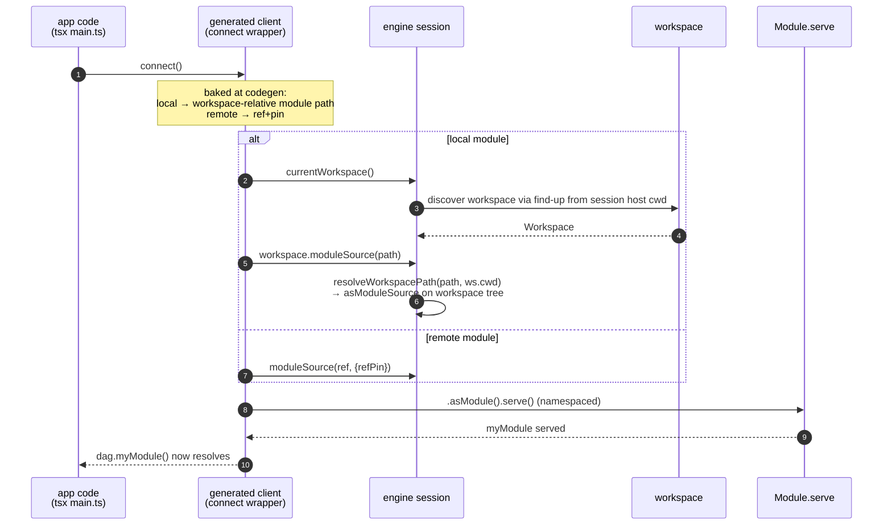

# Generated-Client Module Loading

## Status

In progress. Companion to `client-codegen-engine-cleanup.md` (the client-facing
schema primitives). The runtime half of the new client-codegen workflow.

Split across two pieces:

- **Engine (this doc, implemented).** A workspace-scoped `Workspace.moduleSource(path)`
  field — the API originally requested in issue
  [#13157](https://github.com/dagger/dagger/issues/13157) — lets a plain client
  session resolve the module its bindings are bound to and serve it. Landed on
  branch `feat+add-workspace-modulesource-api`.
- **Codegen (separate, TypeScript SDK).** The generated `serveModuleDependencies`
  helper is replaced by a minimal `serveBoundModule` that calls the new field.
  This lives in the TypeScript SDK's client generator (codegen now ships there),
  handled separately from this doc.

Depends on the two client-codegen schema primitives added in
[#13646](https://github.com/dagger/dagger/pull/13646)
(`ModuleSource.clientSchemaIntrospectionJSON` and
`CurrentModuleAsSDKClient.moduleSource`). The first is a hard prerequisite: it is
what makes the client schema "core + the bound module only," which is why the
runtime only ever needs to serve the one bound module.

## Table of Contents

- [Context for a fresh reader](#context-for-a-fresh-reader)
- [Problem](#problem)
- [Why the current helper breaks](#why-the-current-helper-breaks)
- [Key insight: resolve against the workspace, not the cwd](#key-insight-resolve-against-the-workspace-not-the-cwd)
- [Solution](#solution)
- [Why not the existing APIs](#why-not-the-existing-apis)
- [Hard limitation (state it honestly)](#hard-limitation-state-it-honestly)
- [API](#api)
- [Implementation](#implementation)
- [Open questions](#open-questions)
- [Reference: relevant code](#reference-relevant-code)

## Context for a fresh reader

Read this first — the rest assumes it.

**What a generated client is.** A user runs
`dagger api client init typescript ./my-bindings ./.dagger/modules/my-module`.
This generates a typed client library (the "bindings") into `./my-bindings` that
lets ordinary application code call a Dagger **module** (`my-module`) as
`dag.myModule().someFunction()`. The client is *bound to one module*.

**Two directories, now decoupled.** In the new workflow the **client directory**
(`./my-bindings`) and the **module directory** (`./.dagger/modules/my-module`)
are independent arguments. Previously they were effectively the same directory;
they no longer are. This decoupling is the root cause of most of what follows.

**The client schema is core + the bound module only.** The engine primitive
`ModuleSource.clientSchemaIntrospectionJSON` (backed by
`clientSchemaIntrospectionJSONFile` in `core/schema/modulesource.go`, added in
[#13646](https://github.com/dagger/dagger/pull/13646)) builds the introspection
schema that client codegen consumes. It contains **core plus the single bound
module, installed namespaced** (reached via `dag.<moduleName>`, never promoted to
the `Query` root). The bound module's own **dependencies are deliberately
excluded** — a client is generated for one module, not its whole dependency
graph. (It starts from a core-only `SchemaBuilder` via `loadDefaultSchemaBuilder`
and installs only the bound module.)

**How the generated client runs.** The bindings are consumed by ordinary,
language-specific application code executed through a normal entrypoint —
`tsx main.ts`, `python main.py`, `go run .`. That process opens a plain Dagger
SDK session via `connect()`. It is **not** a module runtime and **not** a
workspace-aware CLI session. It is just a client talking to an engine.

**The runtime requirement.** For `dag.myModule().someFunction()` to resolve, the
engine **session's schema must have `myModule` served/installed**. The dagql
schema is rebuilt per request from whatever is served
(`client.servedMods.Schema(ctx)`), and modules are installed into a session via
`Module.serve` → `Query.ServeModule` → `Server.serveModule`
(`engine/server/session.go`), which mutates that session's global schema. So
*something* has to serve the bound module into the session before the first call.
Today that "something" is a helper baked into the generated client. This doc is
about fixing that helper.

Because the client schema now excludes dependencies, the client's bindings never
reference `dag.<dep>()` — so **only the bound module needs to be served at
runtime**, never its dependencies.

## Problem

The TypeScript client codegen emits a `serveModuleDependencies` function
(`cmd/codegen/generator/typescript/templates/src/header.ts.gtpl:19-51`) wired
into the generated `connect`/`connection` wrappers so it runs before the user's
callback. It does two things:

1. Serves each **git dependency** explicitly, with ref + pin baked into the
   template at codegen time:
   `client.moduleSource(src, {refPin}).withName(name).asModule().serve()`.
2. Serves the **bound/local module** itself, gated on `configExists()`:

```ts
const modSrc = client.moduleSource(".")
const configExist = await modSrc.configExists()
if (configExist) {
  await modSrc.asModule().serve({ includeDependencies: true })
}
```

Under the new design this is wrong in three independent ways.

## Why the current helper breaks

**1. Serving dependencies is now dead work.** The client schema is core + the
bound module only. The bindings contain no `dag.<dep>()` calls, so the git-dep
loop and `includeDependencies: true` serve modules the client can never
reference. Both should simply go away — the helper only ever needs to serve the
one bound module, namespaced (`serve()` with no args, i.e. not an entrypoint).

**2. `moduleSource(".")` finds the wrong module.** Local module resolution does
**find-up for `dagger.json`**: `moduleSource(<local ref>)` →
`localModuleSource(..., findUp=true)` → `findUpModuleConfig`, which walks **up**
the directory tree from the given path looking for a config file and selects the
deepest ancestor match (`core/schema/modulesource.go:315-377`). It does *not*
descend. With the client dir decoupled from the module dir, `.` (the client's
context root) find-ups to the *nearest ancestor* `dagger.json` — the project root
config, or nothing — never `./.dagger/modules/my-module`. So `configExists()` is
false, or it serves the wrong module.

**3. It assumes a context the client no longer has.** `moduleSource(".")`
resolves relative to the client session's host working directory. A generated
client run as `tsx main.ts` has no guarantee that its cwd/context is the module
directory, and — crucially — once the application code is **compiled and shipped**
(a bundled binary, a container image, a different machine), there is no project
tree at all. A path baked relative to "where the client runs" resolves to
nothing.

So: the client must make an **explicit call from its own code** to load its
module — but that call must not depend on cwd find-up or a baked filesystem path.

## Key insight: resolve against the workspace, not the cwd

The fragility comes from the client carrying a path resolved against a **moving
reference point** — the process cwd, plus `dagger.json` find-up. The fix is to
resolve against the **workspace** instead: the engine already discovers the
workspace by finding it up from the session's host cwd (the same discovery
`currentWorkspace` uses), and the workspace root is a *stable* reference point
anywhere within the project tree.

So the client bakes a **workspace-relative module path** and asks the engine to
resolve it against the discovered workspace. That path is independent of where
the client process's cwd happens to be — it only requires that the process runs
*somewhere inside the project tree* so the workspace is discoverable. It does not
survive being shipped away from the project — see the limitation section.

**What we deliberately did *not* do.** An earlier draft proposed baking the
*client's* own path and having the engine look up the module + pin from the
`SDKManagedClient{Path, Module, Pin}` config entry keyed by that path — robust to
the module moving (only config changes; no client regen). We chose the simpler
route: bake the module's workspace-relative path directly and reuse the
general-purpose `Workspace.moduleSource(path)` API (issue #13157). The trade-off:
if the bound module *moves within the workspace*, the client must be
regenerated. That is rare, codegen re-runs on develop-style flows anyway, and in
exchange we ship one small, broadly useful field instead of a client-specific
config-lookup primitive. For local modules the pin is irrelevant (a local path is
resolved fresh); for remote modules the ref+pin is baked directly (below).

## Solution

Reuse the workspace-scoped module loader requested in issue
[#13157](https://github.com/dagger/dagger/issues/13157):

```graphql
extend type Workspace {
  moduleSource(path: String! = "."): ModuleSource!
}
```

`Workspace.moduleSource` resolves a path *inside the workspace* to a
`ModuleSource`, using the standard workspace path rules that `Workspace.directory`
/ `file` / `glob` already use:

- **Absolute** path (`/foo`) → resolved from the **workspace root**.
- **Relative** path (`foo`, `../foo`) → resolved from the **current cwd within the
  workspace** (determined at load).

`dag.currentWorkspace()` is a `Query` root field reachable from a plain
`connect()` session, so a standalone client can get the workspace and load its
bound module with no cwd find-up and no baked host path.

Two resolution modes, chosen by the bound module's kind at codegen time:

### Local module → `dag.currentWorkspace().moduleSource(path)`

The client bakes the bound module's **workspace-relative path** (the codegen
knows it: it is the `client init` module-dir argument, workspace-relativized). At
runtime:

```ts
await dag.currentWorkspace().moduleSource("<workspace-relative-module-path>")
  .asModule().serve()
```

The engine discovers the workspace by find-up from the session's host cwd,
resolves the path against it (absolute-from-root / relative-from-cwd), loads the
module source from the workspace tree, and `serve()` installs it namespaced. This
works **anywhere within the project tree** (cwd-independent) but does **not**
survive being shipped away from it (see limitation).

### Remote (git) module → baked canonical ref + pin

For a git-backed module the identity *is* a location, and an immutable one. Bake
the canonical ref + pin and serve directly, no workspace lookup:

```ts
await dag.moduleSource("<canonical-ref>", { refPin: "<pin>" }).asModule().serve()
```

This is the one case that survives compilation/relocation, because a git ref
resolves from anywhere. It is essentially what the existing git-dep loop already
does, applied to the bound module itself.

Both modes end in the same `.asModule().serve()` (namespaced — no
`includeDependencies`, no `entrypoint`); only how the `ModuleSource` is obtained
differs.



## Why not the existing APIs

- **`CurrentModuleAsSDKClient.moduleSource`** (added in
  [#13646](https://github.com/dagger/dagger/pull/13646),
  `currentModuleAsSDKClientModuleSource` in `core/schema/module_as_sdk.go`) —
  right resolution, wrong caller. It hangs off `CurrentModule.asSDK`, only
  reachable from the **currently executing module** (an SDK generator running
  inside the engine). A standalone `tsx main.ts` client is not "the current
  module," so it cannot call it. It is a *generation-time* primitive; the runtime
  needs a *client-session* one. `Workspace.moduleSource` is that runtime analog,
  reached from `dag.currentWorkspace()`.
- **`moduleSource(".")`** — find-up for `dagger.json`, resolves against the
  client's cwd, wrong under decoupled client/module dirs (see problem #2).
- **`Module.serve(includeDependencies, entrypoint)`** — still the right *serve*
  mechanism, but its `includeDependencies` arm is now obsolete for clients (deps
  excluded from the schema). Serve the bound module with neither flag
  (namespaced).
- **`resolveClientTargetModule`** (`core/schema/workspace_client.go:138`) — the
  shared local/remote resolver behind the init and `CurrentModuleAsSDKClient`
  paths. `Workspace.moduleSource` intentionally does **not** route through it:
  its local/remote branch selection uses `workspace.IsLocalRef`, which
  mis-classifies any module directory whose name contains a `.` as a remote ref.
  `Workspace.moduleSource`'s input is always a local workspace path, so it loads
  the local branch directly.
- **Workspace auto-serving** (`EnsureWorkspaceModules` / `CurrentServedDeps`) —
  only applies to workspace-aware sessions, not a raw client `connect()`; and it
  requires the module to be installed as a *workspace module*, not merely
  referenced as a client target.

## Hard limitation (state it honestly)

A **local module shipped standalone** — the application compiled into a binary or
image and run with no project tree / workspace config on disk — is
**fundamentally unservable**. The module's source literally is not present, so no
primitive can resolve it: `currentWorkspace()` finds nothing to find-up. This
case is **remote-only**: if you need bindings that run detached from the project,
the bound module must be a git module (then baked ref + pin works everywhere).
This is not a solvable engineering gap; it should be documented and, ideally,
`client init` should warn when generating a *local*-bound client whose intended
usage is standalone.

## API

Implemented on `Workspace`:

```graphql
extend type Workspace {
  """
  Load a module source from a path within the workspace.
  Relative paths resolve from the workspace cwd; absolute paths resolve from the
  workspace root. Fails if the path does not point to an initialized module.
  """
  moduleSource(path: String! = "."): ModuleSource!
}
```

- Gated `AfterVersion("v1.0.0-0")`, to match the sibling client-codegen
  primitives.
- `PerClientInput`, like `Workspace.directory` / `file` / `glob` (the result
  reflects host-derived workspace state).
- Errors if the path escapes the workspace root, or if it does not point to an
  initialized module (`ConfigExists` is false).

The generated client template shrinks to roughly:

```ts
// local-bound client
async function serveBoundModule(client: Client): Promise<void> {
  await client.currentWorkspace()
    .moduleSource("{{ .ModulePath }}") // baked workspace-relative path
    .asModule()
    .serve()
}
// remote-bound client
async function serveBoundModule(client: Client): Promise<void> {
  await client.moduleSource("{{ .ModuleRef }}", { refPin: "{{ .ModulePin }}" })
    .asModule().serve()
}
```

`serveModuleDependencies` (name + git-dep loop + `includeDependencies`) is
deleted.

## Implementation

Engine (**done** — `feat+add-workspace-modulesource-api`):

1. **`Workspace.moduleSource(path)`** — resolver in
   `core/schema/workspace_module.go`, registered in `core/schema/workspace.go`.
   It:
   - resolves `path` with the shared `resolveWorkspacePath(path, ws.Cwd)` helper
     (absolute-from-root / relative-from-cwd — the same rule as
     `directory`/`file`/`glob`);
   - materializes the workspace tree with `workspaceOverlayRootfs` (host reads are
     routed to the workspace owner inside `resolveRootfs`, so this also works when
     a **module** received the workspace as an argument — issue #13157's original
     use case, not just the standalone-client case);
   - selects `asModuleSource(sourceRootPath: <resolved>)` and validates
     `ConfigExists`.
2. Session-context feasibility (was the main open risk) is **confirmed**: a plain
   SDK `connect()` is a non-module client, so the engine sets
   `pendingWorkspaceLoad` (`engine/server/session.go`) and detects the workspace
   from the host cwd (`loadWorkspaceFromHost`). Workspace *detection* happens
   regardless of the `LoadWorkspaceModules` flag (that flag only gates
   auto-*serving* of modules), so `dag.currentWorkspace()` resolves for the
   generated client's session.
3. Integration coverage: `TestModuleSourceResolvesWorkspacePaths`
   (`core/integration/workspace_api_test.go`) — relative-from-root-cwd,
   relative-from-nested-cwd, absolute, default `.`, non-module error, escape
   error.

Codegen (**separate**, TypeScript SDK — the client generator now lives there):

1. Feed the template the **bound module's** kind + identity (workspace-relative
   path for local; canonical ref + pin for remote).
   - **Contract for the local path (`{{ .ModulePath }}`): it MUST be the module's
     path relative to the workspace root — not cwd-relative, not an absolute host
     path.** `Workspace.moduleSource` resolves it against the workspace
     (absolute-from-root / relative-from-workspace-cwd), so a cwd-relative or
     absolute host path baked at codegen time resolves to the wrong module (or
     nothing) at runtime — which is exactly the fragility this design removes. The
     `client init` module-dir argument workspace-relativized is the value to bake.
2. Replace `serveModuleDependencies` with the minimal `serveBoundModule` above;
   drop the git-dep loop and `includeDependencies` for the client path.
3. Generalize the serve bootstrap beyond TypeScript (Go, Python) as those client
   generators gain the same need.

## Open questions

1. **~~Session context for workspace discovery.~~** Resolved — see implementation
   step 2. A plain `connect()` detects the workspace from the host cwd; the field
   is reachable.
2. **~~Client identity choice.~~** Resolved — bake the module's workspace-relative
   path and reuse `Workspace.moduleSource`, accepting client regen on module
   move. See the key-insight section.
3. **`serve` is once-per-session.** `Module.serve` is documented "can only be
   called once per session" (`core/schema/module.go`). Confirm a single
   bound-module serve per client is fine, and what happens if an app wires up
   multiple generated clients (bound to different modules) in one session —
   whether the limit is per-module or session-global.
4. **Interaction with demand-driven workspace loading**
   (`demand-driven-module-loading.md`). If a future client session is made
   workspace-aware, the module might already be served and the bootstrap becomes a
   no-op — the primitive should short-circuit when the module is already served
   (`serveModule` is already idempotent/conflict-checked).
5. **Cross-module types.** Because the client schema excludes dependencies, if the
   bound module's public API exposes a *dependency's* object type (as an argument
   or return), that type is absent from the client schema — the generated bindings
   would be incomplete or invalid. Confirm the new client design forbids exposing
   dependency types in a module's public surface; if it doesn't, that's a separate
   schema-completeness problem this doc does not solve.

## Reference: relevant code

| Thing | Location | Note |
|---|---|---|
| **`Workspace.moduleSource(path)`** (this work) | `core/schema/workspace_module.go` (`moduleSource`), registered in `core/schema/workspace.go` | runtime resolver; `v1.0.0-0`-gated, `PerClientInput` |
| Workspace path rule (abs-from-root / rel-from-cwd) | `core/schema/workspace.go` `resolveWorkspacePath` | shared by `directory`/`file`/`glob`/`moduleSource` |
| Whole-tree materialization + host routing | `core/schema/workspace.go` `workspaceOverlayRootfs` → `resolveRootfs` | routes host reads to the workspace owner |
| `Query.currentWorkspace` (root field) | `core/schema/workspace.go` | reachable from a plain `connect()` session |
| Plain-session workspace detection | `engine/server/session.go` (`pendingWorkspaceLoad`), `engine/server/session_workspaces.go` (`loadWorkspaceFromHost`) | detects workspace from host cwd regardless of `LoadWorkspaceModules` |
| Client-facing schema (core + bound module, deps excluded) | `core/schema/modulesource.go` `clientSchemaIntrospectionJSONFile` ([#13646](https://github.com/dagger/dagger/pull/13646)) | starts from `loadDefaultSchemaBuilder` (core-only), installs bound module namespaced |
| `ModuleSource.clientSchemaIntrospectionJSON` field | `core/schema/modulesource.go` (`v1.0.0-0`-gated, [#13646](https://github.com/dagger/dagger/pull/13646)) | the schema codegen consumes; hard prerequisite |
| `CurrentModuleAsSDKClient.moduleSource` | `core/schema/module_as_sdk.go` `currentModuleAsSDKClientModuleSource` ([#13646](https://github.com/dagger/dagger/pull/13646)) | generation-time analog; only reachable from the current module |
| `resolveClientTargetModule` | `core/schema/workspace_client.go:138` | shared local/remote resolver; **not** reused (its `IsLocalRef` branch-selection mis-routes dotted dir names) |
| `Module.serve(includeDependencies, entrypoint)` | `core/schema/module.go` | serve mechanism; `includeDependencies` now obsolete for clients |
| `Query.ServeModule` → `serveModule` | `engine/server/session.go` | per-session schema mutation, idempotent/conflict-checked |
| `SDKManagedClient{Path,Module,Pin}` (client entry written at init) | `core/schema/workspace_client.go:82-89` | config source of truth for the client-path-identity alternative we did not take |
| Local module resolution / find-up for `dagger.json` | `core/schema/modulesource.go:315-377` (`moduleSource`, `findUpModuleConfig`) | walks **up**, deepest ancestor; the cwd-relative behavior we avoid |
| Issue: `Workspace.moduleSource()` request | [#13157](https://github.com/dagger/dagger/issues/13157) | the API this reuses |
| TS runtime serve helper (to replace) | `cmd/codegen/generator/typescript/templates/src/header.ts.gtpl:19-51` | `serveModuleDependencies`; codegen handled separately |
