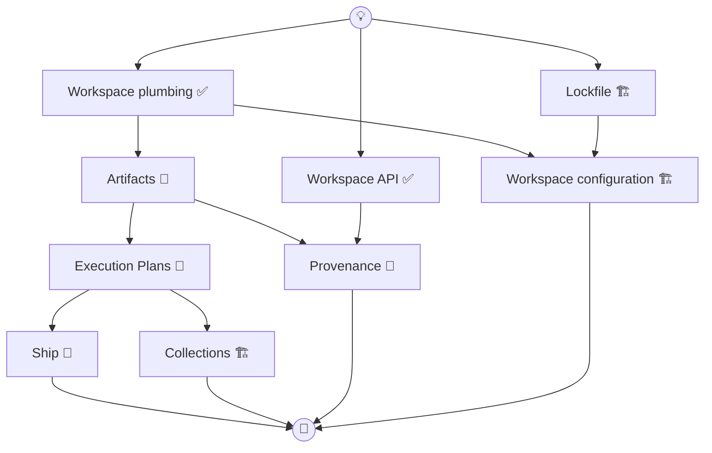

# Modules v2

Modules v2 is the umbrella for all changes to the way you develop, configure,
and operate Dagger modules.

## Components

| Component | Status | Doc |
| --- | --- | --- |
| [Workspace](./workspace.md) | API + plumbing shipped; configuration in progress | workspace.md |
| [Lockfile](./lockfile.md) | In progress | lockfile.md |
| [Artifacts](./artifacts.md) | Designed | artifacts.md |
| [Execution Plans](./plans.md) | Designed | plans.md |
| [Ship](./ship.md) | Designed | ship.md |
| [Collections](./collections.md) | Designed; prior prototype exists (`collections` branch) | collections.md |
| [Provenance](./provenance.md) | Designed (high level) | provenance.md |
| [Stdlib](./stdlib.md) | Stage 1 in progress | stdlib.md |

## Dependency Graph

**Main track:** Workspace plumbing → Artifacts. From there the design splits:
- **Selector/orchestration track** — Artifacts → Execution Plans. From there,
  [Ship](./ship.md) extends the plan model with shipping semantics, and
  [Collections](./collections.md) extends the selector/plan base with keyed
  dimensions and collection-aware batching.
- **Provenance track** — Artifacts → Provenance

Artifacts establishes the base selector model first: top-level module objects
and later collection items become artifact rows; `type` is the built-in
selector dimension. Execution Plans turns selected artifacts into inspectable
DAGs of actions. Ship plugs in later as a verb-specific extension over that
plan substrate. Collections plug in later as keyed dimension providers and
batch/subset semantics on top of the Artifacts/Plans base. Provenance also
builds on Artifacts, but it is orthogonal to Execution Plans, Ship, and
Collections: it adds path/git filtering over effective artifact provenance
rather than new plan or collection semantics.

## Component Boundaries

- **Artifacts** defines the base selector space: eligible artifact rows,
  scopes, built-in dimensions, and scope-relative coordinate rows.
- **Provenance** extends `Artifacts` with path/change predicates over effective
  artifact provenance.
- **Execution Plans** defines `Action`, `Plan`, plan construction, and plan
  execution. This unit rolls out `check` and `generate`.
- **Ship** extends `Artifacts` and `Execution Plans` with `+ship`,
  `filterVerb(SHIP)`, and `Artifacts.ship`.
- **Collections** extends both layers: it adds new keyed selector dimensions
  and collection-aware lowering/batching on top of the Artifacts/Plans base.

**Config track:** Lockfile → Workspace configuration. Independent of the main
track.

**Stdlib track:** Progresses in stages with gateway dependencies:
- **Stage 1** — regular modules, no new infrastructure needed
- **Stage 2** — modules adopt Workspace API (receive workspace, read files/dirs)
- **Stage 3** — modules expose collections (GoModules, GoTests, etc.)

## Design Principles

- **Engine smart, CLI dumb.** In doubt, push logic into the engine.
- **API is UX.** Type names, function names, and breakdown matter.
- **One filter surface.** Selector dimensions use repeatable
  `--<dimension>=<value>` flags; provenance uses dedicated artifact filters.
- **Introspection-driven.** The CLI is a generic client — no per-workspace
  codegen. Dimensions, filters, and actions are discovered at runtime.
- **Plans, not VMs.** Verbs compile to inspectable finite DAGs. No loops,
  conditionals, or variables.

## Related Documents

- [../artifacts-on-collections-report.md](../artifacts-on-collections-report.md) —
  design exploration transcript (Artifacts API, Plans, filter model)
- [../workspace-artifacts.md](../workspace-artifacts.md) — baseline artifacts design
- [../workspace-artifacts-transcript-guide.md](../workspace-artifacts-transcript-guide.md) —
  reading guide for the full design transcript
