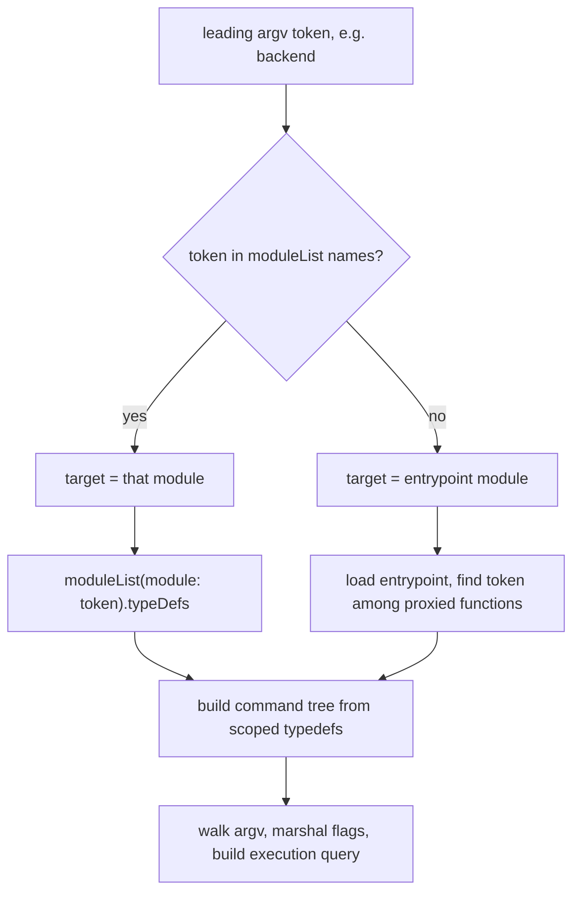
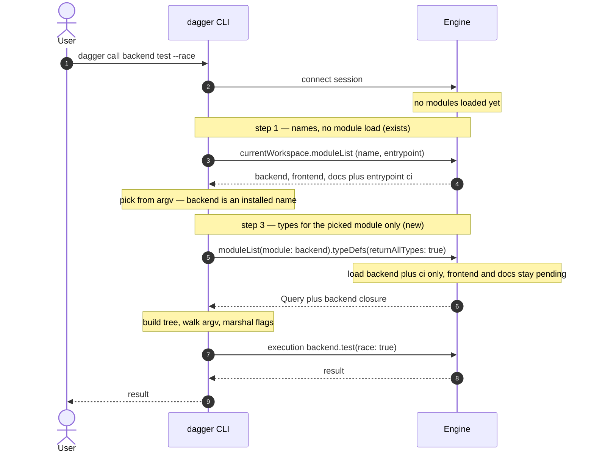

# Lazy workspace module loading: names first, types on demand

*Stop loading every workspace module to operate on one: `dagger call`/`functions`
discovers module names without loading anything, then fetches only the targeted
module's typedefs — instead of the load-all `currentTypeDefs`.*

## Table of Contents

- [Problem](#problem)
- [Solution](#solution)
- [Core Concept](#core-concept)
- [Flow](#flow)
- [CLI](#cli)
- [Edge cases](#edge-cases)
- [Version gating and caching](#version-gating-and-caching)
- [Status](#status)

## Problem

1. **One-shot load-all** — `dagger call|functions <module>` builds its command
   tree from `currentTypeDefs(returnAllTypes: true)` (`core/schema/module.go:2110`),
   which serves *every* workspace module. Running one module pays for all its
   siblings.
2. **Fragility** — one broken or stale sibling fails the whole introspection for
   every request in the session, including the module you ran `dagger generate`
   to fix.
3. **The target isn't in the query** — `currentTypeDefs` names no module, so the
   engine cannot scope the load from the request. The CLI knows the target (the
   leading argv token), but the introspection it sends has no place to carry it.

## Solution

Don't fetch the typed universe up front. The workspace already exposes module
**names** without loading anything (`currentWorkspace.moduleList`,
`core/schema/workspace.go:210`); add a sibling that returns a **single module's
typedefs while loading only that module**. `dagger call backend test` reads the
names (free), picks `backend` from argv, then asks for `backend`'s types alone —
the engine reads the target straight from the query as a normal argument.
`currentTypeDefs` stays as-is
for its other consumer, the in-engine MCP/LLM tool builder (`core/mcp.go:505`),
and for bare `dagger functions`.

## Core Concept

A `typeDefs` field on `WorkspaceModule`, beside the existing `settings`:

```graphql
type WorkspaceModule {
  name: String!
  entrypoint: Boolean!
  source: String!

  "Per-module constructor arguments (existing)."
  settings: [WorkspaceModuleSetting!]!

  """
  Type definitions for this module alone. Loads only this module (plus the
  workspace entrypoint) and its dependency closure, leaving sibling modules
  pending. Mirrors Query.currentTypeDefs, scoped to one workspace module.
  """
  typeDefs(
    "Return the full referenced typedef closure, not only top-level served typedefs."
    returnAllTypes: Boolean = false
    "Strip core API functions from the Query type."
    hideCore: Boolean
  ): [TypeDef!]!
}
```

`WorkspaceModule` comes from `currentWorkspace.moduleList`, which reads workspace
config and serves nothing (`core/schema/workspace_module.go:17`, `DoNotCache`).
The existing `settings` field already demonstrates per-module scoped introspection
(constructor args, `workspace_module.go:94`); `typeDefs` extends that pattern to
the full type closure.

The resolver is a scoped load followed by the existing `currentTypeDefs` body:

```go
func (s *workspaceSchema) moduleTypeDefs(
    ctx context.Context, mod dagql.Instance[*core.WorkspaceModule], args typeDefsArgs,
) ([]*core.TypeDef, error) {
    // additive demand load: serve this module (+ the entrypoint, as the
    // typedefs-target rule does), leaving siblings pending.
    if err := mod.Self().Query.EnsureWorkspaceModules(ctx, []string{mod.Self().Name}); err != nil {
        return nil, err
    }
    // identical closure computation to Query.currentTypeDefs, now over the
    // scoped served set (CurrentServedDeps -> deps.TypeDefs -> expand/strip).
    return s.currentTypeDefs(ctx, currentTypeDefsArgs{
        ReturnAllTypes: args.ReturnAllTypes,
        HideCore:       args.HideCore,
    })
}
```

`EnsureWorkspaceModules(include)` (`core/query.go:90`) is the additive demand hook
already used by the `generators|checks|services(include:)` resolvers. Here it
loads `backend` (+ the entrypoint), leaving `frontend`/`docs` pending — a broken
`frontend` can't fail `dagger call backend`.

## Flow

The "pick" comes from argv, so step 1 (names) is for completion, good errors, and
installed-module-vs-entrypoint disambiguation:





## CLI

`dagger call backend test --race` issues:

```graphql
# step 1 — names, no module load (already exists)
{ currentWorkspace { moduleList { name entrypoint } } }
# -> [backend, frontend, docs], entrypoint = ci

# step 3 — types for the picked module only (new field)
{ currentWorkspace { moduleList(module: "backend") {
    typeDefs(returnAllTypes: true, hideCore: true) { ...TypeDefParts }
} } }
# engine loads backend (+ ci) only; frontend/docs stay pending
```

The leading-token extraction already exists (`functionName`,
`internal/cmd/dagger/function_name.go`). The CLI builds `moduleDef` from the
returned `[TypeDef]` exactly as today — the shape is identical to
`currentTypeDefs`, so the `module_inspect.go` walker is unchanged.

```bash
dagger call backend test --race    # loads backend (+ ci) only
dagger call deploy                  # 'deploy' not in moduleList -> entrypoint fn -> load ci
dagger functions                    # no token -> currentTypeDefs (load all) fallback
```

## Edge cases

| Case | Handling |
|---|---|
| Entrypoint-proxied function (`dagger call deploy`) | token not in `moduleList` names → load the entrypoint (its `entrypoint` flag is in `moduleList`) and find the proxied fn there |
| Cross-module chaining (`dagger call backend test report`) | covered by `backend`'s `returnAllTypes` closure — a function can only return types its own module depends on |
| Name collision (token is both an installed module and an entrypoint fn) | installed module wins; document the precedence |
| Bare `dagger functions` / `shell` / `mcp` | no token → `currentTypeDefs` load-all (listing everything inherently loads everything) |
| Old engine without the field | CLI falls back to `currentTypeDefs`; `moduleList` already exists so step 1 stays valid |

## Version gating and caching

- Gate the field with `View(AfterVersion("v1.0.0-0"))`, matching `moduleList` and
  the rest of the v1 workspace API (`core/schema/workspace.go`). The return type
  `[TypeDef!]!` already exists, so there is no new type surface to gate — but
  still run `TestBaseSchemaAllowlist` (see `internal-docs/version-gating.md`).
- `DoNotCache`, like `moduleList` (it reads live host config and loads on demand).
  Because the load happens in a non-cached resolver, there is no
  `CurrentSchemaInput` collision, so **no `PerClientInput`** is needed.

## Status

Proposal. Engine: one new `WorkspaceModule.typeDefs` field reusing
`currentTypeDefs`' closure logic after a scoped `EnsureWorkspaceModules` load.
CLI: `call`/`functions` phase-1 switches from `currentTypeDefs` to
`moduleList(module:) { typeDefs }` when it has a target, with `currentTypeDefs`
as the no-token / old-engine fallback. `currentTypeDefs` itself is unchanged.
