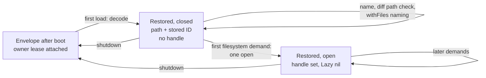
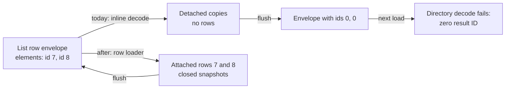

# Deferred opening of completed Directory and File snapshots, and stable identity for persisted lists

This document explains two local cache changes for Erik: restored `Directory` and `File` values keep their saved metadata usable until filesystem access is needed, and persisted lists keep their element identities across repeated restarts. Sections 1 to 5 explain the before and after. Sections 6 to 15 retain the approved design and implementation plan. Section 16 connects that plan to the implemented code and measured checks.

**Design baseline:** `50016de4f8b03041fdcab7654277f2d68c2d8f6d`, the head of PR #14051 used for this change. In sections 1 to 15, “today” means that baseline and all code line references name that revision. **Implementation:** `dd5d0f8ad5116673fb49fb27e19d1562245a35c4`, on `sipsma/remote-cache-deferred-filesystem-restoration`. Section 16 uses that revision for its code references. **How claims were checked:** the baseline and implementation were read against source; the implementation was also checked with focused race tests, a physical snapshot store and successive real engines. Section 16 records the completed checks and their limits. Earlier defect reproductions used uncommitted overlay tests over successive SQLite cache instances with a fake snapshot manager. Those historical tests were neither daemon runs nor remote transfer tests. The historical guiding pages "Remote Cache, Guiding Requirements & Principles" and "Engine Foundations" (recovered from commit `d255a086c0`) were read as goals.

Claim markers, as a bold word at the end of a sentence: **Verified** (read at the cited line), **Overlay test** (reproduced by the coordinator's uncommitted overlay test; this author read the test source and its log), **Inferred** (follows from verified facts), **Proposed** (a mechanism introduced by the approved plan; absent at the design baseline, with implementation status in section 16), **Open** (an unresolved question), and **Scope** (an agreed boundary of this unit, not a code fact). **Tested** marks a completed implementation check recorded in section 16. Section 13 lists the design decisions.

## 1. The changes in one screen

### 1.1 Reading saved metadata without opening the filesystem

A **snapshot** is filesystem state stored on this engine by the snapshot manager, identified by an engine-local snapshot ID. A `Directory` or `File` value names one snapshot and one path inside it. To use the files, code first obtains a **handle** to the snapshot (`bkcache.ImmutableRef`) by asking the manager for it by ID; the handle is what a later mount uses. Obtaining that handle is what this document calls **opening**. Opening rehydrates the snapshot's metadata record and returns the handle. It mounts nothing and reads no file bytes. **Verified**, `engine/snapshots/manager.go:158-165` and `engine/snapshots/manager.go:237-260`.

Today, a `Directory` or `File` that was computed in an earlier engine process, persisted at shutdown, and restored after a restart **opens its saved snapshot the moment the cache first hands the value to anyone**, before any operation has asked for the filesystem. Reading only the file's name opens it. Re-encoding it at the next shutdown relies on that open handle. **Verified**, `core/file.go:285-291` and `core/file.go:231-244`.

After this change, restoring the value installs its path, platform, service references, and an immutable record of the snapshot's ID, and leaves the handle closed. The first operation that needs the filesystem opens the snapshot once, through the same lazy-evaluation machinery that already runs deferred work for these types. Operations that need only the saved path, and re-encoding at the next shutdown, never open it. **Proposed**.

| Operation on a restored `File` after a restart | Today | After |
| --- | --- | --- |
| `name` | opens the snapshot, then reads the saved path | reads the saved path; no open |
| `contents`, `size`, `digest`, `export` | already open at decode; mounts and reads | opens once at first demand; mounts and reads |
| a second filesystem read | no new open | no new open |
| shutdown after only `name` | re-encodes from the open handle | re-encodes from the saved ID |

The same holds for `Directory.name` versus `entries`, `glob`, `digest`, `stat`, `export`. **Verified** for today's column and **Proposed** for the other; section 5 classifies the operations.

### 1.2 Keeping saved lists usable across repeated restarts

A module function that returns a list of objects, for example `[]*dagger.Directory`, is cached and persisted by default (`core/typedef.go:303-325`). The persisted form of that list is a **list envelope**: one row for the list, whose payload holds one **element envelope** per element, and each element envelope records the **result ID** of the element's own row when the element was an attached result at the time of the flush (`dagql/cache_persistence_self.go:152-181`). The element rows themselves are persisted as ordinary dependencies of the list row. **Verified**.

Today that identity survives exactly one restart. On the first restart the list decodes fine, because every element envelope still names its row. But decoding builds each element as a **detached** wrapper, a value with no row of its own, even when the envelope names one (`dagql/cache_persistence_self.go:290-303`). If the engine then shuts down again without anything having re-attached those elements, the flush asks each detached wrapper for its row ID, gets none, and silently writes zero (`dagql/cache_persistence_self.go:94-99`). On the next boot the `Directory` decoder cannot find the element's snapshot link without an ID and the whole list fails to load with `load persisted directory snapshot link: zero result ID`. **Verified** for the mechanism; **Overlay test** for the outcome: the coordinator's `TestAuditPersistedDirectoryListSecondFlush` saw element ID 1 on the first flush, 0 on the second, and that error on the third cache instance.

| Saved list of `Directory` after restarts | Today | After |
| --- | --- | --- |
| First restart, load the list | works; elements are detached copies | works; elements are their own rows |
| Shutdown again without selecting an element | element IDs written as zero | element IDs preserved |
| Second restart, load the list | fails: zero result ID | works |
| Select an element after any restart | publishes a new row keyed by the list and position; the array's slot still holds the detached copy | hands back the element's own row |
| Read an element's files | today opens at decode of the copy | opens on first demand, per 1.1 |

After this change, decoding a list restores every element that has a saved row through the ordinary row loader, the same path every other codec uses to reach the rows it references, so the element is the attached result it was before the restart. Elements that never had a row, such as inline result records, decode inline as today. **Proposed**, section 4.6.

### 1.3 The remote goal, and the limits of this unit

Both changes move where the engine touches local state: handle acquisition moves from decode to demand, and list elements are reached through their rows instead of copied. Neither changes what boot requires: at import the cache attaches an owner lease to every persisted snapshot and that attachment checks the snapshot exists locally, so a restored value still needs its snapshot present on disk before any demand (`dagql/cache_persistence_import.go:519-536`, `engine/snapshots/persistent_metadata.go:132-165`). What the changes establish is the demand-time boundary a future remote step would extend, "open by local ID" becoming "make the content local, then open", while metadata reads, re-encoding, and list restoration stay untouched. That step is not built here. It mirrors what PR #14050 did for `Container`, whose completed parts already open on demand (`core/container_persistence.go:464-537`), and what `HTTPState` already does for its immutable snapshot (`core/http.go:216-228`, `core/http.go:255-261`). **Verified** for boot, the container, and HTTP state; **Inferred** for the remote connection.

The goal remains that every result the local cache can persist becomes remotely cacheable. This unit covers the immutable snapshot owners and the list envelope. It does not supply: remote content movement; the portable result, dependency, and session-resource description; a fix for persisted results whose values have no persisted encoder, which is recorded as a separate follow-up with its witness in section 9.3; or any new eligibility policy. Immutable outputs of git repositories stay eligible even though the repository row depends on a mutable mirror, and a `Volume` row persists only configuration, never mounted data. Section 9 lists the boundaries in full. **Scope**.

## 2. Glossary

Each term names the Go type, field, or function it stands for.

| Term | Meaning at this commit |
| --- | --- |
| Snapshot | Filesystem state stored by the snapshot manager, `engine/snapshots`. One snapshot per stored tree; a `Directory` or `File` selects a path within one. |
| Snapshot ID | The engine-local string identifying one snapshot, `ImmutableRef.SnapshotID()` (`engine/snapshots/refs.go:40-45`). Meaningful only inside this engine. |
| Handle, open | `bkcache.ImmutableRef` (`engine/snapshots/refs.go:47-50`), obtained by `GetBySnapshotID` (`engine/snapshots/manager.go:158-165`). Opening is obtaining it. `Release` closes it (`engine/snapshots/refs.go:652-663`). Handles obtained this way do not keep the snapshot on disk; owner leases do. |
| Result, row | One cache entry, `sharedResult` in `dagql/cache.go`: an ID, the call that produced it, a typed payload, dependency edges, and an ownership count. Persisted, it is one row in the results table. Every `Directory` or `File` a client can name is the payload of one result. |
| Attached, detached | An attached result has a row with a nonzero ID and can answer `ID()`; a detached result is a wrapper with no row, built by `NewResultForCall` or `newDetachedResult`, and `ID()` refuses it (`dagql/cache.go:2521-2533`, `dagql/cache.go:2960-2972`). |
| Typed value | The Go object the result holds: `*Directory` (`core/directory.go:45-53`) or `*File` (`core/file.go:35-44`). |
| Accessor | `LazyAccessor` (`core/lazy_state.go:207-211`): a slot holding a value and an `isSet` flag under its own lock. `Directory.Dir` and `File.File` hold the path. `Directory.Snapshot` and `File.Snapshot` hold the handle. |
| `GetOrEval` | `LazyAccessor.GetOrEval` (`core/lazy_state.go:217-236`). Calls `Cache.Evaluate` on the owning result first, then returns the accessor's value. It evaluates even when the value is already set. |
| `Peek` | `LazyAccessor.Peek` (`core/lazy_state.go:239-248`). Returns the value if set, without evaluating. |
| Lazy op | The value's stored deferred work, `Directory.Lazy` or `File.Lazy`, an implementation of `Lazy[T]` (`core/lazy_state.go:15-19`). `Lazy != nil` means deferred work remains. A successful run clears it (`core/directory.go:128-145`). |
| Whole group | The one evaluation unit of a value that does not split its deferred work, `LazyGroupWhole` (`dagql/types.go:189`). `Directory` and `File` have exactly this group; `Container` has named groups. |
| Attempt | One run of a group's callback, coordinated by the cache so concurrent callers share it (`dagql/cache.go:4005-4234`). |
| Bookkeeping | Cache-side work after a successful callback body: owner-lease sync, then release of the attempt's operation lease (`dagql/cache.go:4164-4173`). |
| Snapshot link | `PersistedSnapshotRefLink{RefKey, Role}` (`dagql/cache_persistence_self.go:379-382`): this result owns the snapshot with this ID under this role. Standalone values use the role `snapshot` (`core/directory.go:187-192`). |
| Owner lease | The containerd lease `dagql/result/<id>/<role>` (`dagql/cache.go:1490-1492`) that keeps a linked snapshot on disk while the result exists. Attached at boot from the link rows and re-synced from the typed value's links after decode and after every callback (`dagql/cache.go:1556-1624`). |
| Persisted edge | The retention root that keeps a result alive across sessions and includes it in the shutdown flush; see `internal-docs/cache_persistence.md`. |
| Envelope | The on-disk payload of a result before decode, `PersistedResultEnvelope` (`dagql/cache_persistence_self.go:25-35`). A list envelope holds one element envelope per element in `Items`; an element envelope's `ResultID` names the element's row when it had one at flush time. |
| Decode, restore | Turning an envelope into a typed value on first load, in `ensurePersistedHitValueLoaded` (`dagql/cache_persistence_import.go:578-788`), which calls the type's `DecodePersistedObject`. This document says "restore" for the same event. |
| Row loader | `Cache.LoadResultByResultID` with an empty session (`dagql/cache_persistence_resolver.go:164-174`, `dagql/cache_persistence_resolver.go:128-162`): finds a row by exact ID, decodes it if needed through `ensurePersistedHitValueLoaded`, and returns its attached wrapper without adding session ownership. Every codec that references other rows uses it (`core/persisted_object.go:76-114`). |
| Type-name prepass | The scan in `ensurePersistedHitValueLoaded` that collects object type names from an envelope, including inline list elements, and resolves each against the enclosing row's call before decoding (`dagql/cache_persistence_import.go:563-575`, `dagql/cache_persistence_import.go:720-734`). |
| Pending, operational | `dagql.HasPendingLazyEvaluation` (`dagql/cache.go:1035-1063`): true while any deferred work, attempt, or bookkeeping remains. Decides whether a value may be treated as materialized. |
| Pending computation, reporting | `dagql.HasPendingLazyComputation` (`dagql/cache.go:1067-1096`): true while computation remains. Opening an already computed snapshot is not computation. Used only for telemetry status. |

## 3. Today

### 3.1 The fields

**Verified**, `core/directory.go:45-53`:

```go
type Directory struct {
	Platform Platform
	// Services necessary to provision the directory.
	Services ServiceBindings

	Lazy     Lazy[*Directory]
	Dir      *LazyAccessor[string, *Directory] // a selected subdir of the rootfs of the on-disk Result, if any
	Snapshot *LazyAccessor[bkcache.ImmutableRef, *Directory]
}
```

`File` has the same shape with `File` in place of `Dir` (`core/file.go:35-44`). What each field means, when it changes, and what guards it:

| Field | Meaning | Set when | Guard |
| --- | --- | --- | --- |
| `Platform`, `Services` | Plain metadata. | At construction or decode. Some fresh bodies assign them again from the source they resolve, for example a container-derived directory copies its mount source's platform and services (`core/container.go:3273-3274`). On a restored completed value they are final at decode. | None; written only by the constructor, decode, or the value's own body. |
| `Lazy` | Deferred work, or nil. | Set at construction or decode; cleared once by `LazyEvalFunc` after a successful body (`core/directory.go:136-143`). | Ordered by the cache: the value's op is read only when no attempt is in flight (`dagql/cache.go:3637-3647`). |
| `Dir` / `File` | The selected path inside the snapshot. | Pre-seeded by schema constructors when the parent's path is known (`core/schema/directory.go:491-493`), set by the body, or installed at decode (`core/directory.go:302-304`). | The accessor's lock. |
| `Snapshot` | The handle. | Set by the body, or at decode (`core/directory.go:306-312`). | The accessor's lock. |

Two consequences. There is no field that records the snapshot's identity without holding a handle. And every reader of the snapshot's identity, size, links, or release goes through `Snapshot.Peek()`: `OnRelease` (`core/directory.go:71-80`), `CacheUsageSize` (`core/directory.go:147-166`), `CacheUsageIdentities` (`core/directory.go:168-177`), `PersistedSnapshotRefLinks` (`core/directory.go:179-193`), and the encoder (`core/directory.go:246-260`). **Verified**.

### 3.2 The two persisted forms, and when decode runs

The encoder writes the **snapshot form** when `Snapshot.Peek()` returns a handle: a JSON payload with `form: "snapshot"`, the path, platform, and service references, plus one link `{RefKey: handle.SnapshotID(), Role: "snapshot"}` (`core/directory.go:246-260`). Otherwise, if `Lazy` is set, it writes the **lazy form** with the op's recipe JSON (`core/directory.go:262-275`). A value with neither is not ready to persist (`core/directory.go:276-282`). **Verified**.

The decoder rebuilds the value and, for the snapshot form, **opens the snapshot immediately**: it looks up this result's link by role and calls `GetBySnapshotID` (`core/directory.go:306-312`, `core/persisted_object.go:157-171`). For the lazy form it rebuilds the op, which loads the op's parent results by ID (`core/directory.go:652-673`); loading a completed parent decodes it, so the parent opens then too. **Verified**.

Decode does not run at boot. The boot import tries an eager decode with no dagql server; object payloads fail that attempt and stay envelopes (`dagql/cache_persistence_import.go:434-469`, requirement at `dagql/cache_persistence_self.go:227-229`). Decode runs on the first load with a server: a cache hit (`dagql/cache.go:5111`), an ID load (`dagql/cache_persistence_resolver.go:128-162`), a dependency attachment (`dagql/cache.go:2712`, `dagql/cache.go:2780`), or another decoder loading it as a referenced row (`dagql/cache_persistence_resolver.go:336-349`). All go through `ensurePersistedHitValueLoaded`, which in order: runs the type-name prepass, decodes, installs the typed value, replaces the result's release hook, syncs owner leases from the typed value's links, and only then returns through its fast path, where it registers the value's whole-group callback with the cache (`dagql/cache_persistence_import.go:720-786`, then `dagql/cache_persistence_import.go:611-626`). **Verified**.

The sync step is the hidden dependency this plan must respect: after decode, the desired links come from the typed value, no longer from the envelope (`dagql/cache.go:1511-1525`). A typed value reporting no link would have its owner lease removed (`dagql/cache.go:1592-1602`). **Verified**.

### 3.3 Who reads the accessors

The common contract is: evaluate the result before using its snapshot. Most readers do that through `Snapshot.GetOrEval` (`core/directory.go:1373`, `core/file.go:826`). Some evaluate explicitly and then `Peek`: the `Directory.file` resolver runs the new file's body and peeks both accessors (`core/schema/directory.go:859-869`), and `Directory.withDirectory` evaluates both inputs before a peek-only helper (`core/directory.go:2207-2220`). `File.export` reads the path with `File.GetOrEval` and then the snapshot (`core/schema/file.go:330-334`). For a value with no op, `Cache.Evaluate` finds no callback, records completion, and returns (`dagql/cache.go:3966-3999`). **Verified**.

The path is read three ways. Schema constructors `Peek` the parent's path to pre-seed the child's (`core/schema/directory.go:491-493`, `core/schema/file.go:279-281`). Two fields read it through `GetOrEval`: `Directory.name` (`core/schema/directory.go:715`) and `File.name` (`core/schema/file.go:231`). `Directory.diff` reads both inputs' paths through `GetOrEval` to decide whether to rebase them (`core/schema/directory.go:1156`, `core/schema/directory.go:1185`). Both `withFiles` resolvers evaluate every source and then read each path (`core/schema/directory.go:993-1008`, `core/schema/container.go:3722-3746`). **Verified**.

A pre-seeded path is not always final. `container.directory("/work/sub")` pre-seeds the container-visible path (`core/schema/container.go:3315`) and its body later sets the path inside the mounted source's snapshot (`core/container.go:3248-3275`). A generic "return the path if set" rule would change `name` for such values. The plan treats the path as final only on restored completed values, section 6.4. **Verified**; **Inferred** for the rule.

### 3.4 One example, today

Run one. A client builds a directory with one file, selects the file, renames it, and reads it:

```
d = directory().withNewFile("a.txt", "hello")   // Directory, lazy op DirectoryWithNewFileLazy
f = d.file("a.txt")                               // File; the resolver runs f's body at once
g = f.withName("b.txt")                           // File, lazy op FileWithNameLazy
g.contents()                                      // "hello"; runs g's body
```

`withNewFile` and `withName` are persistable (`core/schema/directory.go:115-116`, `core/schema/file.go:64-65`). `directory.file` is not (`core/schema/directory.go:92-96`), but `f` is a recorded dependency of `g` and is retained with it. At shutdown all three are written in the snapshot form with one link each. `f` and `d` link the same snapshot ID, because `f`'s body reopened its parent's snapshot by ID (`core/file.go:594-607`). `g` links a new snapshot produced by the rename (`core/file.go:1202-1235`). **Verified** for the forms; **Inferred** for the identities.

Run two, today. The client loads `g` from its ID and asks only for its name:

| Moment | `g` result payload | `g.Snapshot` | Opens of `g`'s snapshot |
| --- | --- | --- | --- |
| After boot import | envelope; owner lease attached | no typed value yet | 0 |
| After `g.name()` | typed `File{File:"/b.txt", Lazy:nil}` | **handle** | 1 |
| After `g.contents()` | unchanged | handle | 1 |
| After `g.size()` | unchanged | handle | 1 |
| Shutdown | snapshot form from the handle | released at collection | 1 |

The open happened while loading `g` for `name`, before any filesystem demand. **Verified**, `core/file.go:285-291`.

### 3.5 A saved list, today

Run one. A module function `dirs()` returns two directories. The engine converts the returned IDs into a list value whose elements are results, each carrying the function's call with its position (`core/modtypes.go:275-309`); when the list is published, every element is attached as an owned dependency of the list row (`dagql/builtins.go:186-206`; typed arrays do the same at `dagql/types.go:1619`). The function is persistable by default, so the list row and its two element rows survive shutdown. The flush writes the list envelope with the element envelopes' `ResultID` set to the element rows, because `PersistedResultID` answers for attached results (`dagql/cache_persistence_self.go:94-99`, `dagql/cache_persistence_self.go:158-168`). **Verified**.

Run two. A client calls `dirs()` again; the call is a hit on the list row, which decodes its envelope. The list branch builds each element with `NewResultForCall` from the element envelope and a forked call, then wraps them in a fresh `DynamicResultArrayOutput` (`dagql/cache_persistence_self.go:290-324`). Each element is a detached wrapper. Its `Directory` payload was decoded with the saved element ID, which is why the snapshot link lookup succeeds this time (`dagql/cache_persistence_self.go:246-254`, `core/directory.go:306-312`). **Verified**.

If the client then selects an element, `NthValue` on the list result finds the element detached and publishes it as a new row keyed by the list row and the position, leaving the array's slot pointing at the detached wrapper (`dagql/cache.go:3167-3196`). That new row duplicates the original element row, which still exists as the list's dependency. **Verified**.

Run two ends. The flush re-encodes the list from the array's detached wrappers; `PersistedResultID` fails for each and the encoder records zero (`dagql/cache_persistence_self.go:94-99`). The element rows remain in the store, retained by the list's dependency edges, but the envelope no longer names them. **Verified**.

Run three. The hit decodes the list; the `Directory` decoder receives a zero ID and refuses to look up a snapshot link (`core/persisted_object.go:116-119`). The load fails and the failure is returned to the caller rather than converted to a miss (`dagql/cache.go:5111-5119`). The function call errors on every attempt until the row is pruned or the store is wiped. **Verified** for the mechanism; **Overlay test** for runs two and three: the coordinator's `TestAuditPersistedDirectoryListSecondFlush` attached one `Directory` row and one persistable list holding it, loaded the list on a second cache instance without selecting elements, and saw the third instance fail with `load persisted directory snapshot link: zero result ID`.

| Element decoder | Behavior when the element ID is zero |
| --- | --- |
| `Directory`, `File` | error, the load fails (`core/persisted_object.go:116-119`) |
| `CacheVolume`, `HTTPState`, the two mirrors | skip their snapshot link and lose it silently (`core/cache.go:426-428`, `core/http.go:216-228`, `core/client_filesync_mirror.go:144-146`, `core/git_remote_mirror.go:141-143`) |
| payload-only objects such as `SearchResult` | decode, but as a detached duplicate of their row |
| scalars, nulls | decode; no row needed |

**Verified**. `Container` also takes a result ID at decode (`core/container.go:1448`); its zero handling was not traced. **Open**.

## 4. After

### 4.1 The state of a restored Directory or File

Add one immutable record and one restore op per type. Names are **Proposed**.

```go
// core/directory.go, proposed additions to the struct in section 3.1
	// stored records the completed local snapshot this value was restored
	// from. Set once by decode before publication, never cleared, never
	// copied into children. Snapshot holds only a handle opened here.
	stored *storedSnapshot

	// diagnostics is the opt-in open counter of section 6.8. Nil unless the
	// diagnostics flag is set; allocated by decode with stored, never copied
	// or persisted.
	diagnostics *storedSnapshotDiagnostics

// new file stored_snapshot.go in package core, proposed, shared by Directory and File
type storedSnapshot struct {
	SnapshotID string // the persisted link's RefKey
}

// DirectoryRestoreLazy opens a restored value's saved snapshot on demand.
// Constructed only by decode, always with LazyState: NewLazyState().
// It carries no recipe.
type DirectoryRestoreLazy struct {
	LazyState
}
```

`File` gets `stored` and `FileRestoreLazy`. The record holds only the ID. The link role is the existing constant `snapshot` in both encoders and both link providers, and the role-parameterized decoders have no caller passing anything else (`core/directory.go:329`, `core/file.go:308`), so storing a role would duplicate a constant. The record is `Container.storedParts` (`core/container.go:129-132`) reduced to one entry, because these types have one snapshot. **Proposed**.

| Field | Meaning | Set when | Guard |
| --- | --- | --- | --- |
| `stored` | The saved snapshot's identity. Non-nil exactly on values restored from the snapshot form. | Once, in decode, before the value is installed. | Immutable; readable from any goroutine. |
| `diagnostics` | Optional open counter for tests (6.8). Nil unless the diagnostics flag is set. | Allocated by decode together with `stored`, before the value is installed. | The pointer is immutable; the counter inside is atomic. |
| `Lazy` as the restore op | The saved snapshot is not yet open in this process. | Set by decode with `stored`; cleared by `LazyEvalFunc` after the open, as any op is. | As today. |
| `Snapshot` | The handle, or unset while closed. | Set by the restore op's body. | The accessor's lock. |

| State | `stored` | `Lazy` | `Snapshot` | Example |
| --- | --- | --- | --- | --- |
| Fresh, pending | nil | a recipe op | unset, or pre-seeded by a body | `withNewFile` before evaluation |
| Fresh, materialized | nil | nil | set | after its body ran |
| Restored, closed | set | restore op | unset | just decoded |
| Restored, open | set | nil | set | after the first filesystem demand |
| Restored, open failed | set | restore op | unset | the open returned an error; the next demand retries |

The transition from "restored, closed" to "restored, open" is the only new one. It is a whole-group lazy evaluation whose body neither computes nor demands another result. **Proposed**.



Figure 1. The closed state loops on metadata reads and can be flushed unopened; only a filesystem demand opens the handle. **Proposed**.

### 4.2 The example after the change

| Moment | `g` typed value | `g.Snapshot` | Opens |
| --- | --- | --- | --- |
| After boot import | envelope; owner lease attached | none | 0 |
| After `g.name()` | `File{File:"/b.txt", stored:{ID}, Lazy:restore op}` | unset | 0 |
| After `g.contents()` | `Lazy:nil` | handle | 1 |
| After `g.size()` | unchanged | handle | 1 |
| Shutdown | snapshot form; link from the handle, whose ID is the stored ID | released at collection | 1 |

The variant where run two asks only for the name:

| Moment | `g` typed value | `g.Snapshot` | Opens |
| --- | --- | --- | --- |
| After `g.name()` | restored, closed | unset | 0 |
| Shutdown | snapshot form; link from `stored` | nothing to release | 0 |
| Run three, `g.contents()` | restored, open | handle | 1 |

Today's first table has 1 at the second row. That single difference is the whole user-visible change for one value. **Proposed**.

### 4.3 A metadata read, end to end: `g.name()`

1. The client's `name` call names `g` as its receiver. dagql loads the receiver, which for an envelope means the load path of section 3.2. **Verified**, `dagql/cache_persistence_resolver.go:128-162`.
2. Decode builds the typed value: `stored` set, the path installed, `Lazy` set to a restore op, `Snapshot` unset. Nothing is opened. **Proposed**, section 6.2.
3. The cache installs the value and replaces its release hook (`dagql/cache_persistence_import.go:755-773`). **Verified**.
4. The cache syncs owner leases from the typed value, which reports the link from `stored`. Old and desired links are equal, so nothing is attached or removed (`dagql/cache_persistence_import.go:781`, `dagql/cache.go:1568-1621`). **Proposed** for the report; **Verified** for the sync.
5. The load returns through the fast path, which registers the value's whole-group callback, the restore op's body, with the cache (`dagql/cache_persistence_import.go:611-626`, `dagql/cache.go:3619-3651`). **Verified** for the registration; **Inferred** that the callback is the restore op's.
6. Only now does the `name` resolver run. Today it calls `File.GetOrEval` (`core/schema/file.go:231`), which would evaluate and open. After the change it calls the path reader of section 6.4, which sees `stored != nil`, returns `File.Peek()`, and the resolver answers `b.txt`. **Proposed**.
7. Telemetry: the `name` call is a new scalar call and a cache miss, so it is never marked cached, before or after this change; its result is a string with no pending work. What the reporting change in section 6.6 affects is a **hit on the restored value's own producing call**, for example `withName` served from the persisted graph: today that hit reports cached; without the change it would report pending until opened. **Verified** for how the flags are derived (`core/telemetry.go:180-190`, `core/telemetry.go:378-417`); **Proposed** for the rest.

### 4.4 A filesystem read, end to end: `g.contents()`

1. `File.Contents` calls `g.Snapshot.GetOrEval` (`core/file.go:826`), which calls `Cache.Evaluate(g)` (`core/lazy_state.go:224`). **Verified**.
2. `Evaluate` acquires an operation token, checks the result is attached, and routes to the whole group because `File` does not split its work (`dagql/cache.go:3769-3804`, `dagql/cache.go:3838-3840`). **Verified**.
3. No attempt is in flight, so the cache re-reads the value's callback, finds the restore op's body, and leads an attempt: an operation token for the callback, the original call frame restored into the context, and a resume span the existing code names "open stored part (snapshot)" because `LazyGroupStoredPart` answers `snapshot` (`dagql/cache.go:4081-4140`, `dagql/otelprof_lazy.go:156-158`). **Verified** for the machinery; **Proposed** for the answer.
4. The body runs under the op's once-latch (`core/lazy_state.go:57-97`): it calls `GetBySnapshotID(stored.SnapshotID, NoUpdateLastUsed)` and on success publishes the handle into `Snapshot`. Nothing that can fail runs between the open and the publish. **Proposed**, mirroring `core/container_persistence.go:472-535`.
5. `LazyEvalFunc` clears `Lazy` (`core/file.go:129-131`). **Verified**.
6. Bookkeeping: the cache syncs owner leases again; the typed value reports one link with the same ID as before, so nothing changes. The operation lease is released. The group and result are marked complete (`dagql/cache.go:4164-4192`). **Verified** for the mechanics; **Proposed** for the reported link.
7. `Contents` mounts the handle read-only and reads the file (`core/file.go:838-881`). **Verified**.

### 4.5 The other paths

- **A second filesystem read.** `Stat` calls `Snapshot.GetOrEval` (`core/file.go:1125`); `Evaluate` sees the result-level completion latch and returns (`dagql/cache.go:3832-3835`). No attempt, no open. **Verified**.
- **Two concurrent first demands.** The second caller finds the published attempt and waits on it (`dagql/cache.go:4031-4071`). One body, one handle. If the last waiter cancels, the shared body is canceled and a later healthy caller retries (`dagql/cache.go:3693-3725`). **Verified**, unchanged.
- **The open fails.** The body returns the manager's error; the once-latch stays unset; the cache retires the attempt with the error and leaves the group retryable (`dagql/cache.go:4178-4202`). The next demand tries the open again. Nothing recomputes; there is no recipe. Today the same failure surfaces inside decode and fails the load. The boot-time case is unchanged: a missing snapshot fails lease attachment at import and takes the existing reset path (`dagql/cache_persistence_import.go:528-534`). **Verified** for the machinery and boot; **Proposed** for where the error surfaces.
- **The open succeeds and bookkeeping fails.** The reachable failure is the operation-lease release, since the lease diff is empty. The cache records `syncPending`; the next demand retries only the bookkeeping and never re-reads the body while `syncPending` is set (`dagql/cache.go:3973-3978`, `dagql/cache.go:4190-4192`). One handle stays published. **Verified**, unchanged.
- **Collection.** When ownership reaches zero, the release hook installed at decode removes this result's owner leases, then `OnRelease` releases the handle if one is set (`dagql/cache_persistence_import.go:771-773`, `dagql/cache.go:1527-1554`, `core/file.go:62-71`). Before any open, lease removal is the whole cleanup. Other results linking the same snapshot keep their own leases. **Verified**.

### 4.6 A saved list, after the change

The rule, **Proposed**: when a list envelope is decoded with a server available, every element envelope whose `ResultID` is nonzero is restored by loading that row through the row loader; every element envelope whose `ResultID` is zero is decoded inline as today. At boot, where the eager pass has no server, a list containing a nonzero element ID is not decoded and stays an envelope, exactly as a list containing an object element does today; its first load with a server decodes it.

Run two, after the change, same client sequence as section 3.5:

1. The hit on the list row enters `ensurePersistedHitValueLoaded`. The type-name prepass collects object type names to pick a resolver; it now skips element envelopes with a nonzero ID, because those elements resolve their own type through their own rows, and keeps scanning inline elements (6.9). **Proposed**.
2. The list branch sees element 1 with `ResultID` 7 and calls the row loader for row 7 with an empty session. The loader finds row 7 by exact ID, runs row 7's own prepass against row 7's own call, decodes row 7's `Directory` envelope with row 7's ID (so the snapshot link lookup succeeds, and with 4.1 the snapshot stays closed), installs it, syncs its leases, and returns row 7's attached wrapper (`dagql/cache_persistence_resolver.go:128-162`, `dagql/cache_persistence_import.go:578-788`). The same happens for element 2. The list value is a `DynamicResultArrayOutput` whose slots hold attached results, the same shape it had before the restart. **Proposed** for the branch; **Verified** for what the loader does.
3. Ownership: the loader adds no session edge for an empty session (`dagql/cache_persistence_resolver.go:73-88`). The element rows are retained by the list row's dependency edges, which the flush recorded from the attachment in run one and the import rebuilt (`dagql/cache_persistence_worker.go:60-70`, `internal-docs/cache_persistence.md`). When the list is served to a session, the session owns the list row, and the elements stay alive through those edges, exactly as every referenced row does today. **Verified** for the edges; **Inferred** for the equivalence with other referenced rows.
4. If the client selects an element, `NthValue` finds the element attached, re-wraps it with the current resolver, and claims it for the session (`dagql/cache.go:3130-3164`). No new row is published. The element the client gets is the row it got in run one. **Verified** for the branch; **Proposed** that it is reached.
5. Run two ends without any selection. The flush encodes the list from attached wrappers; `PersistedResultID` answers 7 and 8; the envelope is identical to run one's. **Verified** for the encoder; **Proposed** for the state it sees.
6. Run three loads the list exactly as run two did. Any number of restarts preserves the element rows. **Inferred**.



Figure 2. Today's inline decode breaks the envelope at the next flush; loading elements through their rows makes the flush idempotent. **Proposed**.

Why the ordinary loader and not a lighter mechanism: the element's row already exists, is already retained, and already carries the element's authoritative call, links, and release hook. Loading it gives the list the same attached elements it had when it was published; nothing new has to track identity or ownership. Copying the saved ID onto a detached wrapper would create a wrapper that claims a row it is not, which `ID()` and `PersistedResultID` cannot honor without a shared row (`dagql/cache.go:2960-2972`, `dagql/cache_persistence_resolver.go:34-48`), and which the cache would not own or release. Re-attaching decoded copies through `AttachResult` would publish duplicates of rows that exist. Fixing only the encoder cannot recover an ID the wrapper does not hold. Section 6.9 states the exact changes and the alternatives table in section 9 records why each was set aside. **Inferred**.

## 5. Which operations change, and which deliberately do not

The `Directory` and `File` operations relevant to filesystem demand at this commit, classified by what they read. The third column is the answer after this change.

| Field | Reads | Opens a restored value | Where |
| --- | --- | --- | --- |
| `Directory.name`, `File.name` | path | no | switched to `PathOrEval`, section 6.4 |
| `Directory.entries`, `glob`, `search`, `digest`, `exists`, `stat`, `export`, `terminal`, `asGit`, `asWorkspace`, `findUp` | snapshot | yes, once | `core/directory.go:1373`, `core/directory.go:1445`, `core/directory.go:2022`, `core/directory.go:1345`, `core/directory.go:3407`, `core/directory.go:3482` |
| `File.contents`, `size`, `stat`, `digest`, `search`, `export`, `asJSON`, `asEnvFile`, `asGitBundle` | snapshot | yes, once | `core/file.go:826`, `core/file.go:1125`, `core/file.go:1083`, `core/file.go:907`, `core/schema/file.go:334` |
| `Directory.directory(path)`, `filter` | constructs a lazy child | no, unless the parent's call carries a content digest, in which case the wrapper runs the child's body at once and that opens the parent | `core/schema/directory.go:1951-1976`, `core/directory.go:1128-1185` |
| `Directory.file(path)` | constructs, then runs the child's body | yes | the resolver hashes the file's bytes for its identity (`core/schema/directory.go:859-884`); retained |
| `Directory.withDirectory`, `withFile`, `withNewFile`, `withNewDirectory`, `withoutDirectory`, `withoutFile(s)`, `withTimestamps`, `withPatch(File)`, `withSymlink`, `chown`, `withChanges`; `File.withName`, `withReplaced`, `withTimestamps`, `chown` | constructs a lazy child; peeks the parent path | no at construction; the child's body opens the parent when demanded | `core/schema/directory.go:473-495` and siblings |
| `Directory.diff` | both inputs' paths at call time | no at construction | switched to `PathOrEval`; the body opens both later (`core/directory.go:2970-2997`) |
| `Directory.withFiles` | sources' names at call time | no for restored sources; fresh sources are evaluated as today | section 6.7; the `withFile` children are always lazy (`core/schema/directory.go:934-970`) |
| `Container.withFiles` | sources' names at call time, then one `withFile` per source | name collection: no for restored sources. Then each `withFile` on a **materialized** container copies at once and opens the source (`core/schema/container.go:3683-3694`, `core/container.go:5554`, `core/directory.go:2757`); on a **pending** container the copy is a lazy group and opens later | section 6.7 |
| `Directory.changes` | snapshots | yes | `core/changeset.go:312-326` |
| `sync` on either type | everything | yes | the generic field calls `Cache.Evaluate` on any lazy value (`core/schema/util.go:22-29`) |

Uses of standalone results from other types all need bytes and keep opening on demand: container mounts and path writers (`core/container.go:6010-6073`), cache-volume sources (`core/cache.go:539-546`), module sources (`core/modulesource.go:1488-1492`), services (`core/service.go:1463-1467`), git (`core/git_local.go:219-223`), changesets. **Verified** by listing every `Snapshot`, `Dir`, and `File` accessor use in `core` at this commit.

Two retained behaviors a reader might expect to change: `Directory.file` on a restored parent opens the parent at call time because the file's identity is its content hash (`core/schema/directory.go:874-884`); when that selector is a cache hit no resolver runs and nothing opens. `Directory.directory` and `filter` on a content-addressed parent do the same (`core/schema/directory.go:1951-1976`). Changing either would change identity, which is out of scope. **Verified**.

## 6. Code changes

### 6.1 Inventory

| File | Change |
| --- | --- |
| new file `stored_snapshot.go` in package `core` | `storedSnapshot`, `DirectoryRestoreLazy`, `FileRestoreLazy`, `SourceFilePaths` |
| `core/directory.go` | `stored` and optional `diagnostics` fields; decoder branch (6.2); `PathOrEval` (6.4); `snapshotIdentity` helper used by the encoder, `PersistedSnapshotRefLinks`, `CacheUsageIdentities`, `CacheUsageSize` (6.5); `HasPendingLazyComputation`, `LazyGroupStoredPart` (6.6) |
| `core/file.go` | the same for `File` |
| `core/persisted_object.go` | `loadPersistedImmutableSnapshotByResultID` (`core/persisted_object.go:157-171`) loses its production callers; delete it |
| `dagql/cache.go` | one condition in `pendingLazyComputationLocked` (6.6) |
| `dagql/cache_persistence_self.go` | the list branch of `decodePersistedResultEnvelope` restores nonzero-ID elements through the row loader (6.9) |
| `dagql/cache_persistence_import.go` | the type-name prepass skips nonzero-ID elements (6.9) |
| `core/schema/directory.go` | `name` (`core/schema/directory.go:715`), `diff` (`core/schema/directory.go:1156`, `core/schema/directory.go:1185`), `withFiles` (`core/schema/directory.go:993-1008`) |
| `core/schema/file.go` | `name` (`core/schema/file.go:231`) |
| `core/schema/container.go` | `withFiles` (`core/schema/container.go:3722-3746`) |
| new file `stored_snapshot_debug.go` in package `core` | `CacheDebugValue` for both types, behind the existing `containerPartDiagnosticsEnabled` flag (`core/container_persistence_debug.go:14-16`) |
| Tests | section 11 |

No persisted format change. The snapshot-form payload and link row already carry everything the restore needs (`core/directory.go:218-225`, `dagql/persistdb/schema.sql`), and the list envelope already carries each element's row ID (`dagql/cache_persistence_self.go:25-35`). `cachePersistenceSchemaVersion` stays `"18"` (`dagql/cache.go:143`). **Verified** for the current contents; **Proposed** that no bump is needed.

### 6.2 Decode

Change the snapshot-form branch of `decodePersistedDirectoryWithSnapshotRole` (`core/directory.go:306-312`) and its `File` twin (`core/file.go:285-291`) to:

1. Look up this result's link for the role with `loadPersistedSnapshotLinkByResultID` (`core/persisted_object.go:116-137`). No open.
2. Set `stored = &storedSnapshot{SnapshotID: link.RefKey}`.
3. Install the path unconditionally, including an empty string. Today the decoder installs it only when non-empty (`core/directory.go:302-304`); the container's stored-part opener already installs unconditionally (`core/container_persistence.go:499`). In practice every snapshot-form value has its path set, since every body sets the path with the snapshot.
4. Set `Lazy = &DirectoryRestoreLazy{LazyState: NewLazyState()}`. A zero `LazyState` has no mutex and rejects a body (`core/lazy_state.go:66-68`).

The lazy-form branch is unchanged. **Proposed**.

### 6.3 The restore op

`DirectoryRestoreLazy` and `FileRestoreLazy` implement `Lazy[T]` (`core/lazy_state.go:15-19`). **Proposed**:

- `Evaluate(ctx, dir)` runs `LazyState.Evaluate(ctx, "Directory.restore", body)`. The body reads `dir.stored`, calls `CurrentQuery(ctx).SnapshotManager().GetBySnapshotID(ctx, stored.SnapshotID, NoUpdateLastUsed)`, and on success calls `dir.Snapshot.setValue(ref)`. It demands no other result. The callback context carries the query, as the container's opener relies on (`core/container_persistence.go:526-530`).
- `AttachDependencies` returns `nil, nil`. Service references are attached by the value itself (`core/directory.go:106-108`).
- `EncodePersisted` returns an error; the encoder never reaches it (6.5).

`LazyEvalFunc` (`core/directory.go:128-145`) is unchanged.

### 6.4 `PathOrEval`

One method per type. **Proposed**:

```go
// PathOrEval returns the value's path. On a value restored from a completed
// snapshot the path is final at decode and is returned without evaluating
// the result, so a metadata read does not open the snapshot. On every other
// value it evaluates first, exactly as GetOrEval does.
func (dir *Directory) PathOrEval(ctx context.Context, self dagql.ObjectResult[*Directory]) (string, error) {
	if dir.stored != nil {
		if p, ok := dir.Dir.Peek(); ok {
			return p, nil
		}
		return "", fmt.Errorf("restored directory path not installed")
	}
	return dir.Dir.GetOrEval(ctx, self.Result)
}
```

The condition is the immutable record, not "the accessor is set" (section 3.3) and not `Lazy == nil`, which the body writes without a lock and which is safe to read only under the cache's attempt ordering. A pre-seeded path on a pending producer never satisfies the condition, so pending values keep their current evaluation and error behavior. The four call sites are `Directory.name`, `File.name`, and the two `diff` checks listed in section 6.1. **Proposed**.

### 6.5 One identity for encoder, links, and usage

Add an unexported helper per type, `snapshotIdentity() (string, bool)`: the handle's ID if `Snapshot.Peek()` returns one, else `stored.SnapshotID` if `stored` is set, else nothing. The handle is always opened from the stored ID, so the two never differ; no consistency check is needed. **Proposed**. Then:

- `EncodePersistedObject` (`core/directory.go:227-283`, `core/file.go:212-262`): the snapshot form whenever `snapshotIdentity` answers, with that ID in the link; the lazy form only when it does not and `Lazy` is set.
- `PersistedSnapshotRefLinks` (`core/directory.go:179-193`, `core/file.go:172-186`): one link, role `snapshot`, from `snapshotIdentity`. This keeps the owner lease across decode (section 3.2).
- `CacheUsageIdentities` (`core/directory.go:168-177`): that one ID.
- `CacheUsageSize` (`core/directory.go:147-166`): if the handle matches the identity, `handle.Size` as today; else if the stored ID matches and the provider is non-nil, `CacheUsageSizeProvider.SnapshotSize`, which reads usage without opening (`engine/snapshots/manager.go:167-215`); a nil provider answers "unknown", as the container does (`core/container.go:1350-1352`). The provider parameter is currently ignored.
- `OnRelease` is unchanged; the record holds no handle. `AttachDependencyResultsKinds` is unchanged.

### 6.6 Reporting

`Directory` and `File` implement `dagql.HasLazyEvaluationReporting` (`dagql/types.go:213-223`). **Proposed**: `LazyGroupStoredPart(group)` answers `snapshot` when `group == LazyGroupWhole && stored != nil`, else empty; it reads only the immutable record, so it is stable after the op clears and during a bookkeeping retry. `HasPendingLazyComputation()` answers `stored == nil && Lazy != nil`; for a fresh value that equals today's fallback.

The cache's reporting predicate treats an unsettled whole group as computation before consulting the value. **Verified**, `dagql/cache.go:1083-1096`:

```go
func pendingLazyComputationLocked(shared *sharedResult, reporting HasLazyEvaluationReporting) bool {
	if shared.lazyEvalComplete {
		return false
	}
	if !shared.lazyWhole.settled() {
		return true
	}
	for key, group := range shared.lazyPartGroups {
		if reporting.LazyGroupStoredPart(key) == "" && !group.settled() {
			return true
		}
	}
	return reporting.HasPendingLazyComputation()
}
```

Change the whole-group condition to `!shared.lazyWhole.settled() && reporting.LazyGroupStoredPart(LazyGroupWhole) == ""`. `Container.LazyGroupStoredPart` answers empty for the whole group because it recognizes only its `open:` prefix (`core/container_persistence.go:87-96`), so container reporting is unchanged. Values without the reporting contract never reach this function. The span name and the cached mark on a successful open already key on `LazyGroupStoredPart` for any group (`dagql/cache.go:4131-4137`, `dagql/otelprof_lazy.go:156-158`, `dagql/otelprof_lazy.go:210-212`). **Proposed**; **Verified** for the container answer and the span code.

What the change affects, precisely: `recordStatus` marks a call cached only when the call itself hit and `HasPendingLazyComputation` is false; `recordPending` marks it pending when that predicate is true (`core/telemetry.go:378-417`). A hit on a restored value's producing call therefore stays cached and unmarked, as today. A fresh scalar call such as `name` is unaffected either way. `HasPendingLazyEvaluation` stays true for a restored closed value, which is correct: deferred work remains, so every "evaluate before you peek" contract holds (section 7.1). **Verified** for the predicates; **Inferred** for the consequences.

### 6.7 `withFiles`

Both resolvers evaluate every source, concurrently, then use only each source's basename to build a chain of `withFile` calls (`core/schema/directory.go:993-1015`, `core/schema/container.go:3722-3757`). **Verified**.

Add `core.SourceFilePaths(ctx, files []dagql.ObjectResult[*File]) ([]string, error)`: evaluate, in one `Cache.Evaluate` call, every source whose record is nil, then return each source's full path from `PathOrEval`. The resolvers keep computing the basename themselves (`core/schema/directory.go:1013`, `core/schema/container.go:3754`) and call the helper in place of their evaluate-then-read loops. **Proposed**. The guarantee, stated exactly:

- Fresh sources are evaluated when `withFiles` is called, concurrently, and their errors surface from `withFiles`. Unchanged.
- Name collection does not open restored sources.
- `Directory.withFiles` builds lazy `withFile` children, so a restored source stays closed until the resulting directory is evaluated.
- `Container.withFiles` on a **pending** container builds lazy children with the same effect. On a **materialized** container each `withFile` takes its eager branch and copies at once (`core/schema/container.go:3683-3694`), and that copy opens the restored source during the same `withFiles` call. This plan does not alter the eager-copy policy.

### 6.8 Diagnostics

`Container` exposes an opt-in debug value through `/debug/dagql/cache` (`core/container_persistence_debug.go:14-60`, `dagql/cache_debug.go:1319-1325`). Add the same for `Directory` and `File`: `{storedSnapshotID, openSnapshotID, counts:{storedOpen}}`, behind the same flag. The state behind it is one optional record per value, `diagnostics *storedSnapshotDiagnostics`, holding an atomic `storedOpen` counter. Decode allocates it only when the flag is set, at the same time as `stored` and before the value is installed, so no reader can observe a half-published record; when the flag is off the field stays nil, so no allocation or counter work happens. The restore op's body increments the counter only after a successful open, after publishing the handle. The record is retained after `Lazy` clears, is never copied into children, and is never persisted; `CacheDebugValue` reads the stored ID from `stored`, the open ID from `Snapshot.Peek`, and the count from the record. `storedSnapshot` itself stays immutable. The real-engine test in section 11 reads it. **Proposed**.

### 6.9 The list repair

Two changes in `dagql`, both **Proposed**.

**The list branch of `decodePersistedResultEnvelope`** (`dagql/cache_persistence_self.go:286-324`). Today, for every element:

```go
		itemRes, err := decodePersistedResultEnvelope(itemCtx, dag, itemEnv.ResultID, itemCall, itemEnv)
```

After the change, for every element in order:

1. If `itemEnv.ResultID == 0`, decode inline exactly as today. This is every element of a typed array such as `Array[*SearchResult]`, whose `NthValue` builds detached results (`dagql/types.go:1509-1524`), every scalar that never had a row, and every null.
2. Otherwise, if `dag == nil`, return an error naming the element and the missing server. The only caller with a nil server is the boot pass, which ignores decode errors and leaves the row an envelope for its first load (`dagql/cache_persistence_import.go:445`). No child row is ever loaded at boot: the boot pass has no server and may have no cache in its context.
3. Otherwise, obtain the cache from the context with `EngineCache` (`dagql/server.go:2161-2167`; the serve-time decode context carries it, which is how core decoders reach it at `core/persisted_object.go:83`) and call `LoadResultByResultID(ctx, "", dag, itemEnv.ResultID)`. Use the returned attached wrapper as the element. A load error fails the list decode, as an unreadable referenced row fails any other codec today.

Everything after the loop is unchanged: the element type is taken from the first non-nil element, and the list value is wrapped with `NewResultForCall` and the session-resource handle as today (`dagql/cache_persistence_self.go:305-324`).

Why the empty session is right: the loader with an empty session resolves by exact ID, adds no session edge, and does not apply the session-resource filter (`dagql/cache_persistence_resolver.go:73-88`, `dagql/cache_persistence_resolver.go:128-146`). That matches every codec that references rows through `LoadPersistedObjectByResultID` (`dagql/cache_persistence_resolver.go:336-349`) and is correct here for the same reason: the list row is what the session owns, and the element rows are its retained dependencies. The session-resource requirements of a list are recomputed from its dependencies at import, dependency-first, so a list whose element requires a bound resource is already served only to sessions that bound it (`dagql/cache_persistence_import.go:359-386`). **Verified**.

Why there is no lock inversion: the list row's loader publishes its decode attempt and releases the row's decode mutex before it decodes, so other loaders of the same list wait on the attempt, not on a held lock (`dagql/cache_persistence_import.go:683-690`, then the decode at `dagql/cache_persistence_import.go:742`). A child load inside that decode takes the child row's own ordinary decode attempt in the same way. Why a child load cannot come back to the list: an imported graph is validated at import, where the dependency-first recompute rejects any dependency cycle (`dagql/cache_persistence_import.go:359-386`), and list-to-element edges are ordinary dependencies in that graph. No new runtime cycle check is added. Nested lists recurse through the same loader: an inner list row loads its own elements when its own envelope is decoded. **Verified** for the mutex order and the import check; **Inferred** for the composition.

**The type-name prepass** (`dagql/cache_persistence_import.go:563-575`). Today it recurses into every element envelope and resolves each object type name against the enclosing row's call (`dagql/cache_persistence_import.go:720-734`). After the change it skips element envelopes whose `ResultID` is nonzero, because those elements are restored by their own rows and their own prepass, run against their own authoritative call. Inline elements, which have no call of their own, keep resolving against the enclosing row. Without this change a list whose elements belong to a schema the list's call cannot reach would fail before the loader ever ran; with it, class resolution happens where the element's call is known. **Proposed**; the failure shape is **Inferred**.

**Cold schema cost.** If the incoming server lacks a child’s class, that child’s load can rebuild a schema from its own call (`dagql/cache.go:2370-2388`, `core/schema_build.go:23`, `core/query.go:299`, `core/moddeps.go:85`). The schema builder caches within its own instance. Several unopened child rows can therefore each incur reconstruction. A server that already knows the class takes its normal lookup path; a loaded row retains its class. This is a source-inferred cost, not a measured slowdown or a claim that every list rebuilds schemas. No additional schema cache is introduced. **Verified** for the lookup and builder lifetime; **Inferred** for the possible repeated cost.

**What does not change.** The encoder keeps its zero fallback for detached elements (`dagql/cache_persistence_self.go:94-99`). After the change, a list decoded by this code holds attached elements wherever the envelope named a row, so its next flush writes the same nonzero IDs. Legitimate zero-ID inline forms, the typed arrays and inline scalars of the zero-ID branch, are unchanged. A list envelope that an older flush already wrote with zero IDs for object elements is not repaired: the identity is gone from the envelope, the decoders keep their existing behavior on a zero ID (section 3.5), and there is no format cut or migration. The repair preserves identity going forward; it does not reconstruct identity already lost. `NthValue` is unchanged: with attached elements it takes its existing attached branch (`dagql/cache.go:3130-3164`). `DynamicResultArrayOutput` and `ObjectResultArray` are unchanged. The module-object field encoder already stores element references as row IDs (`core/object.go:802-815`, arrays at `core/object.go:873-885`), and its decoder restores a result reference through the row loader and recurses into arrays element by element (`core/object.go:967-994`), so module objects holding lists of directories are already row-based and gain the closed restore of 4.1 without further change.

**One accepted behavioral difference.** A list whose elements are scalars with their own rows, which is the shape a module function returning `[]string` produces (`core/modtypes.go:288-308` builds elements under the current call and attachment gives them rows), decodes eagerly at boot today because the scalar branch ignores the element ID. After the change it stays an envelope until its first load, like every object list. That is later, not more, work; existing import tests that assert eager decode of such a list would need their expectation moved to the first load. If the implementer finds such a test, prefer changing the test over reintroducing inline decode for scalar elements, since inline decode is exactly what loses the row identity. **Proposed**.

## 7. Copies, ownership, restart, and composed values

### 7.1 Copies and children

The rule that protects every copy is unchanged: a value with `Lazy != nil` must be evaluated before its accessors are trusted. **Verified**:

- Schema children of a restored parent are new values with their own accessors and op; they copy `Platform` and `Services`, pre-seed the path from the parent's `Peek`, and never see `stored`. Their body calls `Cache.Evaluate(parent)`, which opens the parent, then reads it (`core/directory.go:1128-1185`, `core/file.go:567-607`).
- The container clone helpers refuse a value whose `Lazy` is set (`core/container.go:872-874`) and every caller evaluates first (`core/container.go:3285-3293`); the clone opens its own handle by ID (`core/container.go:895`).
- `Directory.withDirectory` evaluates both inputs before its peek-only helper (`core/directory.go:2207-2220`).
- Container stored parts construct their embedded values already open (`core/container_persistence.go:494-519`); they never carry `stored`.
- A `Directory` or `File` produced from a container (`container.rootfs`, `container.directory`, `container.file`) persists in the lazy form while pending, with the container as parent (`core/directory.go:654-673`); once evaluated it persists in the snapshot form like any other value and takes the new restore path.

Caller audit, closed. The audit covers consumers that dereference a filesystem handle. It excludes the identity and lifecycle methods that section 6.5 adapts (`OnRelease`, `CacheUsageSize`, `CacheUsageIdentities`, `PersistedSnapshotRefLinks`, and the encoder), which peek by design and are being taught the stored identity. Every remaining `Snapshot.Peek()` on a standalone result at this commit is either on a freshly built detached value (`core/schema/directory.go:637-641`, `core/schema/directory.go:865-869`, `core/schema/directory.go:1960-1964`, `core/changeset.go:1313`, `core/schema/http.go:226`, `core/container.go:6931-6935`) or preceded by evaluation (section 3.3). Every other peek is on a container-embedded value. Path peeks outside the codecs are constructor pre-seeds, which stay correct because a restored value's path is final at decode. No production consumer dereferences an unevaluated standalone result's snapshot. **Verified** by the accessor-use listing.

### 7.2 Ownership and release

| Moment | Links reported | Owner lease | Handle |
| --- | --- | --- | --- |
| Envelope after boot | from the link row | attached at import (`dagql/cache_persistence_import.go:519-536`) | none |
| Restored, closed | `{stored ID, snapshot}` from the typed value | unchanged by the post-decode sync | none |
| Restored, open | the same link | unchanged by the post-body sync | one, released at collection |
| Collected | | removed by the release hook | released |

The load-bearing row is the second: the typed value must report the stored link or the post-decode sync removes the lease (`dagql/cache.go:1592-1602`). Usage accounting sees the same identity before decode, after decode, and after open (`dagql/cache.go:5954-5963` prefers the typed value's identities once one exists). Handles opened by `GetBySnapshotID` carry no retention. A handle returned by a chain or image import additionally holds a temporary resource lease that is released together with the handle (`engine/snapshots/refs.go:652-663`); no restore path uses such a handle. Two results linking one snapshot, such as `d` and `f`, own separate leases and open separate handles. **Proposed** for the reported links; **Verified** for the cache side.

### 7.3 Restart and the second flush

1. Restored and opened: the encoder writes the snapshot form from the handle. Same as today. **Proposed**.
2. Restored and never opened: the encoder writes the snapshot form from `stored`. New; today this state cannot exist. **Proposed**.
3. Never loaded in this process: the flush passes the envelope and its link rows through (`dagql/cache_persistence_worker.go:470-476`). Unchanged. **Verified**.
4. A list loaded and not selected: the flush writes the same element IDs it read (6.9). New; today it writes zeros. **Proposed**.

After any of these, the next boot attaches the lease from the link row and the next load restores a closed value. A value can cross any number of restarts without opening, and a list can cross any number of restarts without losing its elements. **Inferred**.

### 7.4 Composed values

The composed codecs listed in this paragraph reference `Directory`, `File`, and `Container` rows by result ID and load them through the row loader at decode; none of them embeds a snapshot inline. So a value composed of those rows inherits the behavior of 4.1 for free. Plain payload codecs own no snapshot and are unaffected; `HTTPState` is the one other immutable-snapshot owner and already defers its open. The direct witness this plan uses is `Workspace`: its decode loads its rootfs and mounts directories (`core/workspace.go:802-818`), today opening both; after the change the workspace restores with both closed, and the first operation that reads the rootfs opens it. The same holds for `Changeset` (`core/changeset.go:451-458`), `GitBundle` (`core/git_bundle.go:158`), `GeneratedCode` (`core/codegen.go:65`), a cache volume's frozen source (`core/cache.go:404-413`), a local git repository's directory (`core/git.go:541`), `ModuleSource` context directories (`core/modulesource.go:892-973`), and `Module`, which loads its source and runtime container (`core/module.go:1111-1119`). **Verified** for the load sites; **Proposed** for the closed restore.

Broader coverage is not the same as a promise that every schema reconstruction is content-free. `Generator` and `GeneratorGroup` decode rebuild the module schema for every module in their tree (`core/modtree.go:1221-1236`); building it installs the module (`core/modtree.go:585-613`), installation resolves the module's identity by selecting the `_implementationScoped` field (`core/object.go:1104-1108`, `core/module.go:2320-2339`, `core/module.go:324-338`), and on a miss that field's body computes a source implementation digest, which reads the context directory's contents and every dependency source's (`core/schema/module.go:3096-3122`, `core/modulesource.go:1331-1416`, `core/directory.go:1344-1368`). The scoped row is not persistable (`core/schema/module.go:397-398`); it is retained only because function-call frames reference it (`core/module.go:2360-2365`, `dagql/cache.go:2591`), and function results carry a maximum TTL (`core/typedef.go:319-323`). A retained generator graph can therefore outlive every row that keeps the scoped identity alive, after which restoring the generator reads module sources. This is the ordinary module-install path, not persistence-specific; the change in 4.1 only moves that read from decode time to the digest's own demand. No fix is proposed here and no runtime witness exists; the plan records it as an evidence requirement for any later claim that every value restores without reading content. **Verified** for the chain; **Inferred** for the retention argument.

Two neighbors that need no change: `HTTPState` already records its immutable snapshot's ID at decode and opens it only when it resolves (`core/http.go:216-228`, `core/http.go:255-261`); a `Volume` row persists a named engine directory or an SSHFS endpoint with secret references, never mounted contents (`core/volume.go:204-257`).

## 8. Invariants and what enforces them

| Invariant | Enforced by | Witness |
| --- | --- | --- |
| A restored value's snapshot is never opened by decode, metadata reads, links, usage, or encoding. | Decode installs only the record (6.2); identity readers use `snapshotIdentity` (6.5); path reads use `PathOrEval` (6.4). | tests 1, 2, 10 |
| The stored identity is visible to lease sync from the moment the value is served. | `PersistedSnapshotRefLinks` reports the stored ID; decode sets `stored` before install. | test 1 checks the lease |
| One successful open per restored typed value in a process, shared by concurrent demands. Failed opens retry, and distinct result objects linking the same snapshot open their own handles (7.2). | Attempt singleflight (`dagql/cache.go:4031-4071`); the op's once-latch (`core/lazy_state.go:70-96`). | tests 3, 4, 5 |
| An open failure is an error to the demand and retryable; nothing recomputes. | The body has no recipe; a failed group stays retryable (4.5). | test 3 |
| A successful open is never repeated after a bookkeeping failure, and its span keeps the open purpose. | `syncPending` routing (`dagql/cache.go:3973-3978`); `LazyGroupStoredPart` reads the immutable record. | test 6 |
| The handle is released exactly once, and only the handle. | `OnRelease` (`core/file.go:62-71`); the record holds nothing. | tests 5, 7 |
| Fresh values are unchanged. | `stored == nil` on every non-decoded value; `PathOrEval` falls through to `GetOrEval`. | existing suites, test 2 |
| Container reporting is unchanged. | `Container.LazyGroupStoredPart` answers empty for the whole group. | existing container tests |
| A decoded list's elements are the rows the flush named, so re-encoding is idempotent. | The list branch loads nonzero-ID elements (6.9); attached elements answer `PersistedResultID`. | tests 15, 16, 17 |
| No element row is loaded at boot; a list with row elements defers to its first load. | The nil-server branch returns an error the boot pass ignores (6.9). | test 19 |
| An element's class is resolved against its own call, never the enclosing list's. | The prepass skips nonzero-ID elements (6.9). | test 18 |
| Inline elements decode as today. | The zero-ID branch is unchanged. | existing `TestPersistedSelfCodecRawObjectArrayRoundTrip`, test 16 |

## 9. Scope boundaries, alternatives, and the separate follow-up

### 9.1 Not supplied by this unit

**Scope**:

- Remote content, download, or any second source for a missing snapshot. The open is local; a miss is an error.
- Any computation fallback. A restored completed value has no recipe. Retrying the open itself is supported (4.5).
- Changes to fresh-value evaluation, to `Container` part routing, or to the representation of values inside container parts.
- Changes to operations that compute filesystem identity or copy bytes at call time: `Directory.file`, content-addressed `directory` and `filter`, fresh `withFiles` sources, and the container's eager copy (section 5).
- Splitting `Directory` or `File` into parts; see the per-part evaluation design's decision 3 (`hack/designs/remote-cache/per-part-evaluation.html`).
- A persisted format change.
- The portable description of results, dependencies, and session resources for another engine, and how a dependency closure that contains an excluded mutable row, such as a remote git repository's mirror (`core/git.go:334-346`), is described; immutable git outputs stay eligible.
- Any new eligibility policy. The existing exceptions, mutable cache volumes and the two mirrors, are unchanged, and no type is excluded because it lacks an encoder.

### 9.2 Alternatives

| Alternative | What it would give | Why not |
| --- | --- | --- |
| Keep decode-time opening | nothing to build | every metadata read and re-encode of a restored value opens a snapshot, and a future remote step would then have to move content for name reads |
| Named-group parts, as `Container` does | one mechanism for all three types | the routing layer (part keys, group resolution, per-group latches, the parts registration rule at `dagql/cache.go:3624-3633`) would exist to route one snapshot to one group; the whole group already is that group, and an immutable record supplies the stored-open answer the routing layer would otherwise carry |
| Open inside `Snapshot.GetOrEval` when the record is set, with no cache attempt | no new op | loses the attempt's operation token, shared cancellation, telemetry span, and bookkeeping retry; and `Lazy == nil` with an unset snapshot would make peek-based copy helpers silently produce an empty directory (`core/container.go:886-888`) |
| Make `GetOrEval` return without evaluating whenever the accessor is set | fixes `name` everywhere | pre-seeded paths on fresh container-derived values are not final (3.3); `name` would change answers |
| Keep the identity only inside the restore op | one field fewer | after the op clears, a bookkeeping retry could not distinguish a stored open from a fresh body with failed sync, and reporting would misclassify |
| Retry the recipe on open failure | resembles the future remote fallback | changes local error behavior and pre-decides recipe availability, both separate decisions in `hack/designs/remote-cache/result-foundations.html` |
| Lists: copy the saved element ID onto the detached wrapper | no loader call | a wrapper claiming a row it does not have breaks `ID()` and `PersistedResultID` (`dagql/cache.go:2960-2972`, `dagql/cache_persistence_resolver.go:34-48`), is owned and released by nobody, and is a second identity mechanism beside the row |
| Lists: re-attach decoded copies through `AttachResult` | reuses attachment | publishes duplicates of rows that already exist and are already retained; equivalence would have to merge them back |
| Lists: fix the encoder only | one-line change | a detached wrapper has no ID to write; erroring on detached object elements would reject legitimate typed arrays such as search results |
| Lists: update the array slot when an element is selected | fixes selected elements | the demonstrated failure is a list that is loaded and never selected |

### 9.3 Separate follow-up: persisted values without an encoder

Persistable admission does not check that a value can be encoded. A default-policy module function is persistable (`core/typedef.go:303-325`); when it returns a core object by ID, the engine loads the object and the call adopts the attached result (`core/schema/coremod.go:777-809`, `dagql/cache.go:5410-5429`) and the persisted edge lands on it (`dagql/cache.go:5323-5326`). At shutdown, a value without `PersistedObject` is an encoding error (`dagql/cache_persistence_self.go:113-117`), any encoding error fails the whole snapshot (`dagql/cache_persistence_worker.go:248-254`), `Close` records the error and does not mark the store clean (`dagql/cache.go:4252-4266`), and the next boot wipes every persisted result. Installed classes without an encoder include `LLM`, `Agent`, `Check`, `Up`, `TerminalGroup`, and `Schema`. **Verified** for the chain; **Overlay test** for the outcome: the coordinator's `TestAuditMissingCodecFlush` persisted a scalar, then on a second cache instance admitted a persistable `LLM` result through `GetOrInitCall`; `Close` failed with "does not implement persisted object encoding", the third instance reported an unclean-shutdown reset, and the scalar was gone. The module-function route into it rests on source reading.

This unit does not fix it and does not exclude any type because of it. The follow-up is a separate local persistence decision whose aim is to make the declared persistence contract consistent, so that a value the cache admits as persistable is one it can save, and so that one unsupported value cannot invalidate the whole save. The candidate mechanisms are encoders for the reachable types and an admission rule that requires encodability; silently dropping types is not among them. Both are out of this unit's scope, and choosing is Erik's call. **Scope**.

## 10. Model work

No common kernel transition changes. On the cache side the restore op is a whole-group callback armed at first load of an imported row, run through the existing attempt protocol: lead, join, abandon, foreign-cancellation retry, bookkeeping-only retry. `CacheLifecycle_lazy_import.cfg` explores exactly that lifetime for a decoded lazy-form row (`dagql/tla/CacheLifecycle_lazy_import.cfg`, `dagql/tla/CacheLifecycle.tla:3029-3050`). That coverage is the callback's lifetime, not this change's content: the model has no notion of a saved ID on a whole-group value, so it does not prove that decode preserves the ID, that metadata reads do not open, or that the second flush preserves the closed state. Those are type-specific facts and belong to the Go tests in section 11. The existing saved-part model (`dagql/tla/CacheLifecycle_container_part_restart.cfg`) proves the analogous demand, open, retry, release, and unopened-second-flush properties for named groups; this plan does not extend those properties to the whole group because the whole-group case has no group routing to get wrong. **Verified** for what each configuration models; **Inferred** for the coverage argument.

The list repair changes no modeled transition either: loading a referenced row during a decode is the existing decode protocol applied to another row, which the model's decode actions already cover per row, and the import-time deferral is the existing "row stays an envelope" state. **Inferred**.

Decision: no change to `dagql/tla/CacheLifecycle.tla`, no new configuration, and no run. The model files stay byte-identical and the recorded anchors in `dagql/tla/README.md` stand unchanged; no new measurement is claimed. If review finds that the plan touches a modeled transition after all, the change goes under an opt-in constant with the anchor count preserved and only the affected shapes run.

## 11. Tests

Unit tests in package `core`, in a new file `stored_snapshot_test.go`, using the existing fake manager that counts opens and releases, records owner leases, and injects open failures (`core/container_persistence_test.go:28-68`), the fixture that opens successive cache instances over one SQLite file inside a single test process (`core/container_persistence_test.go:88-101`), the eager directory constructor (`core/container_persistence_test.go:103-113`), and the deterministic operation-lease hook `dagql.ContextWithOperationLeaseProvider` (`dagql/operation_lease.go:22`). List tests live in `dagql` unless they need a `Directory`. Cache instances are named A, B, C, and D below; engines and processes appear only in tests 14 and 21. The shared restore properties, tests 1 and 3 to 11, run for both types; type-specific tests name their type. Names are **Proposed**.

1. `TestDirectoryPersistedSnapshotOpensOnDemand`, `TestFilePersistedSnapshotOpensOnDemand`. Cache instance A attaches an eager value with snapshot `input`, flushes, closes. Instance B, over the same file, loads it by result ID. Assert zero opens; the record is set; `PersistedSnapshotRefLinks` returns the link; the owner lease `dagql/result/<id>/snapshot` is present in the manager's owner map; `HasPendingLazyEvaluation` true, `HasPendingLazyComputation` false; `EncodePersistedObject` returns the snapshot form with the link, still zero opens; `Snapshot.GetOrEval` makes one open; a second `GetOrEval` still one.
2. `TestRestoredSnapshotPathReadsWithoutOpening`: `PathOrEval` on a restored value returns the saved path, including an empty saved path and a non-root path, with zero opens; on a fresh lazy value it evaluates. `TestSourceFilePathsSkipsRestoredSources`: a mixed list of restored and fresh sources evaluates only the fresh ones and returns every name, with zero opens of the restored ones.
3. `TestRestoredSnapshotOpenFailureIsRetried`: `beforeOpen` fails; the demand fails; one open counted; `Lazy` is still the restore op; a second demand counts a second open and fails again, with no other manager call during the failures. Then the hook is cleared: a third demand succeeds with a third open, and a fourth demand makes no further open.
4. `TestRestoredSnapshotConcurrentDemand`, with the race detector: two callers, one open, modeled on `TestContainerRestoreConcurrentParts` (`core/container_persistence_test.go:262-298`).
5. `TestRestoredSnapshotAttemptLifetime`: a leader canceled while a healthy waiter joins, and a session released while the open is held, reusing the rendezvous and assertions of `TestContainerRestoreAttemptLifetime` (`core/container_persistence_test.go:623-710`): one open, the handle released once, the owner map empty after release.
6. `TestRestoredSnapshotBookkeepingRetry`: the lease provider fails the first release after a successful open; the demand fails; `HasPendingLazyComputation` false and `HasPendingLazyEvaluation` true; the retry succeeds with no second open; both attempt spans are named "open stored part (snapshot)", the second marked cached, as `TestContainerRestoreReportingAndBookkeepingRetry` asserts for containers (`core/container_persistence_test.go:446-476`).
7. `TestRestoredSnapshotRelease`: release before open removes the lease and releases nothing; release after open releases the handle once.
8. `TestRestoredSnapshotSecondFlushUnopened`: instance A eager, flush; instance B load only, flush; instance C load, demand. C sees the same snapshot ID and one open. Also the envelope-only variant where B never loads.
9. `TestRestoredSnapshotLazyChainParent`: instance A persists a lazy-form child of an eager parent, `Directory.withoutFile` for the directory variant and `File.withName` for the file variant; instance B loads the child with zero opens; demanding the child opens the parent once.
10. `TestRestoredSnapshotUsage`: `CacheUsageIdentities` includes the stored ID before open; `CacheUsageSize` answers through the provider with zero opens, "unknown" with a nil provider, and through the handle after open.
11. `TestRestoredSnapshotReporting`, extending `TestRecordStatusDoesNotMarkPendingLazyResultCached` (`core/telemetry_test.go:350`): a hit on a restored closed value is marked cached and not pending; a fresh lazy value is not cached and is pending. In `dagql`, `TestPendingLazyComputationWholeGroupStoredOpen` in `dagql/cache_parts_test.go` covers the predicate with a fake reporting value.
12. `TestContainerPersistedUnsupportedTargetPreservesConsumedExecMeta` (`core/container_persistence_test.go:115-183`): change the input expectation at `core/container_persistence_test.go:172` to zero opens at decode and keep every demand-error assertion; that writer fails before its body runs, so the input is never demanded there. The positive witness is `TestRestoredSnapshotDecodeInsideContainerRecipe`: a valid `ContainerWithDirectoryLazy` writer over a restored input; zero opens at container decode, one open of the input when the write group runs.
13. Real stores: extend `TestSnapshotTransferTypedAdoptionAndRestart` (`core/snapshot_transfer_test.go:44`) so that after the reopen the `Directory` and `File` are loaded, their paths read with zero opens, then their bytes read. That fixture skips unless the test runs with mount privileges (`engine/snapshots/testutil/store.go:50-51`), so it runs where the existing test already runs.
14. Real engines: a new subtest, registered as `t.Run("directory and file restore without opening", ...)`, of `TestDiskPersistenceAcrossRestart` (`core/integration/engine_persistence_test.go:32`), modeled on the container subtest (`core/integration/engine_persistence_test.go:110-326`).

    Three engines share one state directory.

    Engine A builds two groups of saved values and records every result ID and snapshot ID from the debug endpoint.

    The witness pair is `d` and `g` from section 3.4, evaluated by `d.entries()` and `g.contents()`; both stay closed for the whole of engine B.

    The probe set is separate saved results, each finished with a persistable operation because `Directory.directory` alone is not retained across shutdown (`core/schema/directory.go:148-152`): `p1 = e1.directory("sub").withNewFile("probe.txt", "p")` and `p2 = e2.directory("sub2").withNewFile("probe.txt", "p")`, where `e1` and `e2` are directories built with `withNewFile("sub/y.txt")` and `withNewFile("sub2/z.txt")`; both probes are evaluated in A by `entries()`, so each is a saved row whose body installed the parent's non-root path, `/sub` and `/sub2` (`core/directory.go:1541-1545`); `h = d.file("a.txt").withName("c.txt")`, evaluated by `h.contents()`, as the copy source; `m`, a materialized container (`from`, synced in A); and `q = m.withExec(...)`, never evaluated, as the pending container, retained by its own persistable edge.

    Engine B loads `d` and `g` by ID and calls `d.name()` and `g.name()` for the first time; the endpoint shows both with the stored ID set, no open, and `storedOpen` zero.

    B creates one fresh source, `fresh = directory().withNewFile("f.txt", "x").file("f.txt").withName("fresh.txt")`: the `file` selector evaluates its own fresh parent at construction, and `withName` leaves `fresh` a pending lazy child, so `withFiles` is what evaluates it and no restored value is involved.

    B then constructs, as IDs only: `p1.diff(p2)`, with both operands closed before and after because the resolver reads their saved paths and the rebasing `withDirectory` and the diff are lazy; `directory().withFiles("/", [h, fresh])`, where `fresh` is evaluated and `h` stays closed; and `q.withFiles("/", [h])`, where `h` stays closed because the child copies are lazy.

    Next B calls `m.sync()`: a restored container is operationally pending until its stored parts are opened, and the `withFile` resolver branches on that predicate (`core/schema/container.go:3391-3392`), so the sync opens `m`'s own parts and clears its restore op; this touches only `m`.

    Then `m.withFiles("/", [h])` takes the eager branch and the endpoint shows `h` opened exactly once.

    Throughout, `d`, `g`, `p1`, and `p2` show no open. B stops with no sync, contents, or entries call on `d` or `g`.

    Engine C loads `d` and `g`; the endpoint shows the same stored IDs, still closed; C reads `g.contents()` and `d.entries()` and gets the bytes, with `storedOpen` one each. The test creates no extra owner; the snapshots survive on their normal owner leases.

15. `TestPersistedObjectListSurvivesRepeatedRestore` (package `core`, the regression for the confirmed witness, on the fake snapshot manager, so it observes opens and never reads bytes): instance A attaches a snapshot-form `Directory` row and publishes a persistable list holding it, in the shape of the coordinator's overlay test (`dagql.DynamicResultArrayOutput` under a field frame with `IsPersistable: true`); the first encoding records the element's row ID. Instance B loads the list by ID and does not select any element; the element in the array is attached and answers `PersistedResultID` with the same row ID; the encoding is byte-identical to A's; zero opens of the element's snapshot. Instance C loads the list, obtains element 1 through `NthValue` and, separately, loads the same row directly through the empty-session exact path, `LoadResultByResultID(ctx, "", srv, id)` (`dagql/cache_persistence_resolver.go:164-174`); the two wrappers report the same `PersistedResultID` and the same `HasPendingLazyEvaluation` state; demanding `Snapshot.GetOrEval` through one and then the other makes exactly one open, which shows they are one row and not a copy carrying an ID; the direct load added no session edge beyond the one the list's session already holds. Instance D repeats B's load and encoding to show the cycle is stable. Deliberate break: restore the inline branch; the test trips at instance B's row-ID assertion, before any zero-ID decode is reached, and that private control is sufficient. The confirmed three-instance trace ending at C with `zero result ID` is historical evidence from the overlay test, not a run this plan requires.
16. `TestPersistedScalarListKeepsElementRows` (package `dagql`): a list of attached scalar results, the shape a module function returning `[]string` produces; two load-and-flush cycles keep the element IDs. The same test covers the bounded generic codec set that must stay unchanged: an empty list, a list with null elements, a list of inline scalars with zero IDs, and a typed array of inline objects in the shape of `TestPersistedSelfCodecRawObjectArrayRoundTrip` (`dagql/cache_persistence_self_test.go:269-312`), all of which decode inline as today.
17. `TestPersistedNestedListKeepsElementRows` (package `dagql`): an outer list whose elements are inner list rows, extending the shape of `TestPersistedSelfCodecNestedListRoundTrip` (`dagql/cache_persistence_self_test.go:207-267`) across cache instances; after two cycles the outer envelope names the inner rows and each inner row names its scalars. A second case nests inline scalar lists with zero IDs and checks they still decode inline at every level.
18. `TestPersistedListPrepassSkipsReferencedElements` (package `dagql`): a list row holding one element with a nonzero ID whose class the list's own resolver does not know, so class resolution must reconstruct a schema through the server's `resultServerForCall` hook (`dagql/server.go:91`, set through its setter at `dagql/server.go:115-117`, consulted after the ordinary lookup at `dagql/cache.go:2377-2388`). The fixture installs a hook that records every call frame it is given and rejects the list's frame. The load succeeds, and the recorded frames show reconstruction was requested only with the element's own authoritative call. Initial class lookups against the caller's resolver are normal and are not asserted against. Deliberate break: remove the prepass skip; the prepass asks the hook to reconstruct from the list's frame for the element's type name, the hook rejects it, and the load fails at that boundary before the loader runs.
19. `TestPersistedListDefersAtImport` (package `dagql`): a list with nonzero-ID elements stays an envelope after import, is directly asserted to remain an envelope rather than materialized, and decodes on its first load with a server; no row is loaded during import.
20. `TestWorkspaceRestoreOpensNothing` (package `core`): a `Workspace` row with a snapshot-form rootfs directory and a directory source; instance B loads it with zero opens of the rootfs; a read of the rootfs snapshot opens it once; instance B flushes without that read in the alternate run and instance C still restores it closed. `TestModuleObjectListFieldRestore` (package `core`): a module object with two list-valued fields, using the module-object test fixtures in `core/object_test.go`. One field is an array of `Directory` references, encoded element by element as row references (`core/object.go:873-885`); the other is a single reference to a persisted list row, so its decode goes through the row loader into the shared list decoder of 6.9. Both restore their elements as rows with zero opens, and both survive a load-and-flush cycle with unchanged IDs.
21. Real engines, lists: a second subtest of `TestDiskPersistenceAcrossRestart`, registered as `t.Run("module function directory list survives repeated restarts", ...)`, using the persistence suite's existing module fixtures. Every request for a list of objects selects its elements, because list marshalling goes through `NthValue` (`dagql/server.go:1329-1361`, `dagql/server.go:2015-2016`); the strictly unselected-list witness therefore stays in test 15. Engine A calls a module function returning `[]*dagger.Directory`, records each element's ID, and reads every element's entries, so each element is evaluated and saved in the snapshot form before B expects a closed stored value. Engine B calls the same function, a hit, requesting only each element's `id`, which selects the elements and reads no files. B's evidence: the returned element IDs decode to the same engine result IDs A recorded (`core/integration/engine_persistence_test.go:157-163` shows the decoding helper); the endpoint shows the list row's payload decoded and each element row closed, with `storedOpen` zero. B stops. Engine C calls the function, selects the first element, and reads its files; the endpoint shows one open of that element and none of the others. Deliberate break: restore the inline branch; today's `NthValue` publishes a new row per element for a detached copy (`dagql/cache.go:3167-3196`) and leaves the array slot unrepaired, so B's ID-equality assertion trips; that private control is sufficient, and no second three-engine run is required to continue to C's already established failure.

Local unit commands run with the race detector where a Go toolchain is available; the engine commands run through the development module as the engine-debugging skill prescribes. The real-store test is selected by the first command and skips without mount privileges. The `-run` prefix matches the suite registration at `core/integration/engine_test.go:51-53`, with the subtests' spaces written as underscores:

```
go test -race ./core -run 'Test(Directory|File)PersistedSnapshot|TestRestoredSnapshot|TestSourceFilePaths|TestContainerPersistedUnsupportedTarget|TestRecordStatus|TestSnapshotTransferTypedAdoptionAndRestart|TestPersistedObjectListSurvivesRepeatedRestore|TestWorkspaceRestoreOpensNothing|TestModuleObjectListFieldRestore' -count=1
go test -race ./dagql -run 'TestPendingLazyComputationWholeGroupStoredOpen|TestPersisted(ScalarList|NestedList|ListPrepass|ListDefers)|TestPersistedSelfCodec' -count=1
dagger api call engine-dev test --pkg ./core/integration --run='TestCachePersistence/TestDiskPersistenceAcrossRestart/directory_and_file_restore_without_opening'
dagger api call engine-dev test --pkg ./core/integration --run='TestCachePersistence/TestDiskPersistenceAcrossRestart/module_function_directory_list_survives_repeated_restarts'
```

No broad suite.

Planned deliberate breaks. Section 16 records each actual first rejection; some checks fail earlier than the prediction below:

| Break | Expected failure |
| --- | --- |
| Reopen at decode | tests 1, 9, and 20, zero-open assertions |
| Report no link from a closed value | test 1, owner-lease assertion after decode |
| Leave `pendingLazyComputationLocked` unchanged | test 11, cached and pending assertions; `TestPendingLazyComputationWholeGroupStoredOpen` |
| Encode from the handle only | test 8, instance C decode |
| Latch the op on open failure | test 3, second-open assertion |
| `PathOrEval` always evaluates | test 2, open counts |
| `SourceFilePaths` evaluates every source | test 2, restored-source open count |
| Restore the inline list branch | tests 15, 16, 17, 20, and 21; tests 15 and 21 trip at B's ID assertion; the earlier trace to C's `zero result ID` is historical overlay evidence, not a required continuation |
| Remove the prepass skip | test 18 |
| Load element rows at import | test 19 |

## 12. Sequencing

One stacked pull request above #14051, organized into four implementation increments. Section 16 records the actual commits and the focused fixture follow-up:

1. `dagql`: the whole-group stored-part condition in `pendingLazyComputationLocked` and `TestPendingLazyComputationWholeGroupStoredOpen`. Inert for every existing type.
2. `dagql`: the list branch and the prepass skip (6.9) with tests 16 to 19. Independent of the core change and reviewable on its own; landing it first lets test 15 assert the closed restore of elements.
3. `core`: the record, the two restore ops, decode, `snapshotIdentity` and its four users, `PathOrEval`, the four path call sites, `SourceFilePaths` and its two call sites, and the unit tests including the changed container assertion and tests 15 and 20.
4. Diagnostics and the two integration subtests.

No format cut, no migration, no change to `Container` or to the snapshot manager.

## 13. Decisions

Taken in this plan, each with its reason:

| # | Decision | Reason |
| --- | --- | --- |
| D1 | One immutable record plus one whole-group restore op per type; no parts. | Section 9; one snapshot needs one open. |
| D2 | The record stays on the value after the open and holds only the ID. | Stable reporting and links across op clearing and retries; the role is a constant. |
| D3 | The path of a restored value is plain data, read by `PathOrEval` at `name` (both types) and the two `diff` checks. | Section 3.3; the condition is the record, not accessor presence. |
| D4 | The cache reporting predicate consults `LazyGroupStoredPart(LazyGroupWhole)`. | Otherwise every restored value reports pending until opened. Container unchanged. |
| D5 | `withFiles` collects names through `SourceFilePaths`: fresh sources evaluated as today, restored sources not opened; the container's eager copy is unchanged. | Inside the approved metadata scope; the eager-copy boundary is stated in 6.7. |
| D6 | No persisted format change; install the empty path on restore. | Section 6.1. |
| D7 | No model change and no TLC run. | Section 10. |
| D8 | Local open failure is an error at first demand, retryable, never recomputed. | Preserves the missing-snapshot contract; moves only where it surfaces. |
| D9 | Opt-in debug values for both types, behind the existing flag. | Needed by test 14. |
| D10 | `Directory.file`, content-addressed `directory` and `filter`, and the container eager copy keep opening at call time. | Identity and copies need bytes. |
| D11 | Delete `loadPersistedImmutableSnapshotByResultID` rather than keep it. | It has no production caller after 6.2; tests use the manager directly. |
| D12 | One real-engine subtest with three engines carries the restart witness and the schema probes on separate saved objects; a second carries the list witness. | Keeps engine restarts to three per subtest while the witness pair stays closed throughout the middle engine. |
| D13 | List elements with a saved row ID are restored through the ordinary row loader with an empty session; zero-ID elements decode inline as today. | Section 4.6 and 6.9; the row exists, is retained, and carries the element's identity and ownership. |
| D14 | At boot, a list with row elements stays an envelope; no row is loaded without a server. | The boot pass has no server and no guaranteed cache in context (6.9). |
| D15 | The type-name prepass skips row elements. | Their class is resolved against their own call by their own load (6.9). |
| D16 | The encoder's zero fallback and the persisted format are unchanged; envelopes already written with zero IDs are not reconstructed. | Nonzero IDs are preserved across flushes, legitimate zero-ID inline forms are unchanged, and identity already lost stays lost with today's behavior; no migration. |
| D17 | Values without an encoder are a separate follow-up; no type is excluded and no encoder is added here. | Section 9.3; the choice between encoders and an admission rule is Erik's. |
| D18 | Composed values are covered by the row loader; the generator schema path is recorded as conditional with no fix. | Section 7.4. |

Erik approved this proposal and implementation. No design decision remains open within this unit. The separate persistence-contract follow-up in 9.3 still requires its own decision.

## 14. Check your understanding

1. A client loads a persisted `File` after a restart and calls `name`. How many opens? Zero. Decode installs the path and the record; `PathOrEval` returns the path without evaluating.
2. Then it calls `contents` twice. How many opens? One. The first demand runs the restore op through a cache attempt; the second finds the result complete.
3. The engine shuts down after only `name`. What is written? The snapshot form with the link from the record. The next boot attaches the lease from that link.
4. The snapshot was deleted between boot and the first `contents`. What happens? The open fails, the demand returns the error, and the next demand retries the open. Nothing recomputes. At boot the same deletion would have failed import and reset the store, as today.
5. Why does `HasPendingLazyEvaluation` stay true for a restored closed value while `HasPendingLazyComputation` is false? The first is operational: deferred work remains, so copy helpers must evaluate first. The second is reporting: no computation remains, so a hit on the value's producing call is cached.
6. Why not return the accessor's value in `GetOrEval` whenever it is set? A fresh container-derived directory pre-seeds a path its body later replaces; only a restored value's path is final without evaluation.
7. `Container.withFiles` on a materialized container with a restored source: does the source open? Yes, once, in the eager copy, not in the name collection.
8. A module function returning two directories is called on engine B after a restart and nothing else happens. What does B's flush write for the list? Today, element IDs of zero, so engine C cannot load the list. After the change, the same element row IDs A wrote, because the elements are their rows.
9. Why does the list branch use an empty session for the loader? Because the elements are the list's retained dependencies, not results the session is acquiring; every codec that references rows loads them the same way.
10. What happens to a list of search results, whose elements never had rows? Nothing changes: their element IDs are zero and they decode inline.

## 15. Index of files and lines

| Concept | Where |
| --- | --- |
| Directory and File structs | `core/directory.go:45-53`, `core/file.go:35-44` |
| Release, usage, links | `core/directory.go:71-193`, `core/file.go:62-186` |
| Encoder and decoder | `core/directory.go:227-330`, `core/file.go:212-309` |
| Snapshot link lookup and today's open | `core/persisted_object.go:116-171` |
| Accessor, `GetOrEval`, `Peek` | `core/lazy_state.go:207-263` |
| Op once-latch | `core/lazy_state.go:57-97` |
| Whole-group evaluation | `dagql/cache.go:3751-3804`, `dagql/cache.go:3830-3840`, `dagql/cache.go:3966-3999`, `dagql/cache.go:4005-4234` |
| Reporting predicates | `dagql/cache.go:1035-1096`; contract `dagql/types.go:213-223` |
| Lease sync and desired links | `dagql/cache.go:1511-1624`; boot attach `dagql/cache_persistence_import.go:519-536` |
| Decode on first load, prepass, boot pass | `dagql/cache_persistence_import.go:578-788`, `dagql/cache_persistence_import.go:563-575`, `dagql/cache_persistence_import.go:434-478` |
| Envelope codec: lists | `dagql/cache_persistence_self.go:85-100`, `dagql/cache_persistence_self.go:152-181`, `dagql/cache_persistence_self.go:286-324` |
| Row loader | `dagql/cache_persistence_resolver.go:22-174`, `dagql/cache_persistence_resolver.go:336-349`, `core/persisted_object.go:76-114` |
| Detached results and IDs | `dagql/cache.go:2521-2533`, `dagql/cache.go:2960-2972` |
| Element selection | `dagql/cache.go:3110-3197`, `dagql/server.go:1329-1361` |
| Array types and attachment | `dagql/types.go:1509-1524`, `dagql/types.go:1610-1640`, `dagql/builtins.go:143-206`, `core/modtypes.go:275-309` |
| Envelope pass-through at flush | `dagql/cache_persistence_worker.go:470-476`; closure `dagql/cache_persistence_worker.go:287-342` |
| Snapshot open, size, handle | `engine/snapshots/manager.go:158-215`; `engine/snapshots/refs.go:40-50`, `engine/snapshots/refs.go:652-663` |
| Operation lease hook | `dagql/operation_lease.go:10-45` |
| Container precedent | `core/container_persistence.go:87-118`, `core/container_persistence.go:464-537`; `core/container.go:129-132`, `core/container.go:1214-1268`, `core/container.go:1287-1358` |
| Composed codecs | `core/workspace.go:690-855`, `core/changeset.go:439-460`, `core/module.go:1105-1185`, `core/modulesource.go:887-985`, `core/object.go:745-870`, `core/object.go:967-994`, `core/modtree.go:585-613`, `core/modtree.go:1201-1236` |
| Generator identity path | `core/object.go:1104-1108`, `core/module.go:324-338`, `core/module.go:2320-2365`, `core/schema/module.go:3096-3122`, `core/modulesource.go:1331-1416` |
| HTTP state and volume | `core/http.go:216-228`, `core/http.go:255-261`, `core/volume.go:204-257` |
| Missing-encoder chain | `core/typedef.go:303-325`, `core/schema/coremod.go:777-809`, `dagql/cache.go:5410-5429`, `dagql/cache_persistence_self.go:113-117`, `dagql/cache_persistence_worker.go:248-254`, `dagql/cache.go:4252-4266` |
| Metadata call sites | `core/schema/directory.go:715`, `core/schema/directory.go:1156`, `core/schema/directory.go:1185`, `core/schema/directory.go:993-1015`; `core/schema/file.go:231`; `core/schema/container.go:3722-3757` |
| Container eager copy | `core/schema/container.go:3675-3694`, `core/container.go:5554` |
| Content-identity selectors | `core/schema/directory.go:844-885`, `core/schema/directory.go:1939-1979` |
| Test fixtures | `core/container_persistence_test.go:28-113`, `core/container_persistence_test.go:172`, `core/container_persistence_test.go:262-298`, `core/container_persistence_test.go:410-493`, `core/container_persistence_test.go:623-710`; `core/snapshot_transfer_test.go:44`; `core/integration/engine_persistence_test.go:110-326`; `dagql/cache_persistence_self_test.go:207-312` |
| Telemetry status | `core/telemetry.go:180-190`, `core/telemetry.go:378-417`; `dagql/otelprof_lazy.go:142-229` |
| Model | `dagql/tla/README.md`; `dagql/tla/CacheLifecycle_lazy_import.cfg`; `dagql/tla/CacheLifecycle_container_part_restart.cfg`; `dagql/tla/CacheLifecycle.tla:3029-3050` |
| Related designs | `hack/designs/remote-cache/per-part-persistence.html`, `hack/designs/remote-cache/result-foundations.html`, `hack/designs/remote-cache/per-part-evaluation.html` |


## 16. Implementation and evidence

### 16.1 What is implemented

The source revision for this section is `dd5d0f8ad5116673fb49fb27e19d1562245a35c4`. The implementation preserves the two boundaries described up front. Reading a restored value’s saved path leaves its filesystem handle closed. Restoring a list loads its saved element rows and keeps their identities for the next flush. **Verified**, `core/stored_snapshot.go:96`, `dagql/cache_persistence_self.go:286`.

| Approved change | Implemented code |
| --- | --- |
| Keep saved identity apart from an open handle | `core/stored_snapshot.go:14`; `core/directory.go:149`; `core/file.go:142` |
| Decode a completed value with its path set and snapshot closed | `core/directory.go:284`; `core/file.go:263` |
| Open once through the existing whole-result callback | `core/stored_snapshot.go:21`; `core/stored_snapshot.go:45` |
| Report the open as completed computation, including a bookkeeping retry | `core/stored_snapshot.go:72`; `dagql/cache.go:1083` |
| Read saved paths and evaluate only fresh sources during name collection | `core/stored_snapshot.go:96`; `core/stored_snapshot.go:117` |
| Load each referenced list element by its exact row, with no added session edge | `dagql/cache_persistence_self.go:286`; `dagql/cache_persistence_resolver.go:164` |
| Let referenced child rows resolve their own class | `dagql/cache_persistence_import.go:563` |
| Observe successful opens without causing them | `core/stored_snapshot_debug.go:10`; `core/stored_snapshot_debug.go:40` |

Each row above was checked against the implementation. **Verified**. The actual optional field is named `storedDiagnostics`; it is allocated during opted-in snapshot decode. `PathOrEval` and the reporting methods live beside the restore operations in `core/stored_snapshot.go`, rather than in each type’s main file. These are placement and naming differences from section 6; they do not change its contract. **Verified**, `core/directory.go:50`, `core/file.go:41`, `core/stored_snapshot.go:72`.

The implementation commits are `6a5335c222` (reporting), `73ffd3c03e` (list identity), `055df23e7d` (typed restore and callers), and `82d6fbd06e` (diagnostics and real engine fixtures). The test-only follow-up `dd5d0f8ad5` observes the enclosing saved list row before and after the middle engine’s request. **Verified** from Git history and `core/integration/engine_persistence_test.go:324`.

### 16.2 Checks completed

These are recorded runs, not estimates. Wall time includes compilation or engine setup where applicable. **Tested**.

| Check and source | Outcome |
| --- | --- |
| Whole-result reporting, `6a5335c222` | Race check passed; 1.042s package, 26.121s wall. |
| Generic lists and selected existing codecs, `73ffd3c03e` | Race check passed; 1.352s package, 21.606s wall. |
| Final core selection, compiled core source matching `82d6fbd06e` | Race check passed; 3.039s package, 34.619s wall. |
| Physical store reopen, race binary built from `82d6fbd06e` | Privileged execution passed; 0.58s test, 2.095s wall. The host run skipped for missing mount privileges. |
| Two real engine scenarios, clean `82d6fbd06e` | Both passed; 311.368s wall. Each scenario used three successive engines over its own retained state directory. |
| Added saved-list-row observation, clean `dd5d0f8ad5` | List-only real engine run passed; 162.947s wall. |

Both engine commands started with clean worktrees at the named commits. The CLI then resolved development-module dependencies and wrote `dagger.lock`; those incidental diffs are preserved in the evidence and were restored. Runtime and test sources remained unchanged. **Verified** from the run metadata and source hashes.

The compiled core source did not change in `dd5d0f8ad5`. The earlier core command did not compile the integration package; its later SDK fixture correction was covered by the real engine run. **Verified** from the recorded source hashes and command scope.

The [recorded real engine run](https://dagger.cloud/dagger/traces/31ead8b103a0f4a6685c7362adf62e80) proves the assertions in `core/integration/engine_persistence_test.go:177` and `core/integration/engine_persistence_test.go:293` at `82d6fbd06e`. The first scenario keeps the main Directory/File pair closed through the middle engine, then reads actual entries and contents in the last engine. Its separate probes cover names, non-root diff construction, fresh source evaluation and the materialized container’s actual eager copy. The second preserves child row IDs and opens only the selected child in the last engine. **Tested**. The [later list-only run](https://dagger.cloud/dagger/traces/1f99c59cf94e5cecd4de2662bdb6839d) passed on `dd5d0f8ad5`. It additionally observes the original list row as an imported envelope before B’s request and materialized afterward. **Tested**, `core/integration/engine_persistence_test.go:347`.

The physical test reads actual bytes after reopening the local cache, SQLite and snapshot manager, with real snapshot collection and normal durable owner leases. It asserts closed typed values and saved paths before those reads. It runs inside one test process, so it supplies physical-store evidence rather than a separate daemon restart. **Tested**, `core/snapshot_transfer_test.go:44`.

The narrower fixtures measure different things. `TestPersistedObjectListSurvivesRepeatedRestore` leaves the middle cache’s list entirely unselected, then proves that list selection and a direct load share one typed value and one open. The Workspace test opens its restored root while its independent source stays closed. The ModuleObject test covers both an array of object references and a reference to a list row. **Tested**, `core/stored_snapshot_composition_test.go:34`, `core/stored_snapshot_composition_test.go:93`, `core/stored_snapshot_composition_test.go:126`.

The lazy child and valid container writer fixtures stop at fake mutable-snapshot allocation after observing the source open. They prove source-demand ordering; they do not prove a successful byte copy. The real engine’s eager copy supplies that separate observation. **Tested**, `core/stored_snapshot_composition_test.go:180`, `core/stored_snapshot_composition_test.go:211`, `core/integration/engine_persistence_test.go:257`.

### 16.3 Tests mapped to the plan

Several planned cases share one final test rather than using every proposed name. **Verified** from the test source.

| Plan cases | Final tests |
| --- | --- |
| 1, 2, 8 | `TestRestoredSnapshotRoundTrip`, `TestRestoredSnapshotUntouchedEnvelope`; `core/stored_snapshot_test.go:84`, `core/stored_snapshot_test.go:372` |
| 2 | `TestRestoredSnapshotPathOrEvalFreshPaths`, `TestSourceFilePathsMixedStoredAndFresh`, `TestSourceFilePathsPreservesFreshErrors`; `core/stored_snapshot_test.go:285`, `core/stored_snapshot_test.go:303`, `core/stored_snapshot_test.go:396` |
| 3, 4 | `TestRestoredSnapshotFailureAndConcurrentDemand`; `core/stored_snapshot_test.go:136` |
| 5 | `TestRestoredSnapshotAttemptLifetime`; `core/stored_snapshot_test.go:318` |
| 6, 11 | `TestRestoredSnapshotReportingAndBookkeepingRetry`, whole-result reporting test and selected existing status tests; `core/stored_snapshot_test.go:227`, `core/telemetry_test.go:350` |
| 7, 10 | `TestRestoredSnapshotUsageAndRelease`; `core/stored_snapshot_test.go:180` |
| 9, 12 | Lazy child and container input cases; `core/stored_snapshot_composition_test.go:180`, `core/stored_snapshot_composition_test.go:211` |
| 13, 14, 21 | Physical store and the two real engine scenarios described above |
| 15, 20 | Object list, Workspace and ModuleObject cases; `core/stored_snapshot_composition_test.go:34`, `core/stored_snapshot_composition_test.go:93`, `core/stored_snapshot_composition_test.go:126` |
| 16–19 | Scalar/nested row lists, inline forms, child-call schema lookup and no-server deferral; `dagql/cache_persistence_list_test.go:42`, `dagql/cache_persistence_list_test.go:75`, `dagql/cache_persistence_list_test.go:105`, `dagql/cache_persistence_list_test.go:117`, `dagql/cache_persistence_list_test.go:148` |

The import fixture asserts the undecoded payload state directly. It does not assert a trace message. The reporting tests exercise the computation predicate and cached status; the unchanged `recordPending` branch is checked by source, without a separate attribute assertion. **Tested** for the fixtures; **Verified** for `core/telemetry.go:413`.

### 16.4 Deliberately broken variants

Each control changes a private copy of the source to reintroduce one error. A passing control means that the test rejects the broken copy at the assertion listed below. None of those mutations is in the implementation. These are test-sensitivity checks, not failures of the proposed PR. **Tested**.

| Private mistake | Actual first rejection |
| --- | --- |
| Keep the old whole-result reporting predicate | Stored armed, active and bookkeeping states incorrectly report pending computation. |
| Open during decode | Closed-handle, Workspace closed-state and lazy-child zero-open assertions fail. |
| Omit a closed value’s snapshot link | Link equality fails before the subsequent owner-presence assertion. |
| Encode only from an open handle | Explicit encoding in the middle cache errors on the restore operation, before a later restart. |
| Mark a failed open complete | The second demand incorrectly returns success instead of the original open error. |
| Always evaluate during path lookup | The operational-pending assertion fails immediately after the path read; it has already opened. |
| Evaluate stored sources during name collection | The saved File has one open where zero is required. |
| Restore referenced children as detached inline values | The object-list and ModuleObject fixtures cannot obtain the middle cache’s child result ID. Generic scalar and nested-list controls also reject the old behavior. |
| Resolve a referenced child’s class during the parent prepass | The schema callback receives the parent call and rejects it. |
| Look up the cache before checking for a server | The no-cache boot context produces the wrong error before any child load. |

The [private real engine inline-list control](https://dagger.cloud/dagger/traces/cb7f47ac2430b7794796267a3bb0a326) also rejected the old behavior. Starting from `dd5d0f8ad5`, it removed only the 15-line referenced-child loader branch. Engine B returned child row 4279 where the original row was 4117. The exact-ID assertion failed at `core/integration/engine_persistence_test.go:352` after 187.189s wall. Engine C never started. **Tested**. The control stopped at the intended identity error; there was no need to continue to another restart.

### 16.5 Limits and reproduction

The passed runs establish local restoration, identity, ownership and demand behavior. They do not demonstrate remote transfer or permit boot with missing local snapshots. There is no changed persistence format and no reconstruction of child IDs already lost by older code. **Scope**, consistent with section 9.

No TLA source or configuration changed, and no TLC run was made for this change. No broad Go suite was run. **Verified** from the source diff and recorded commands. Existing nullable-scalar, Platform and schema fixture failures were corrected within the test fixtures; their failed logs remain in the implementation evidence. They are not silently counted as successful checks.

Exact commands, source hashes, logs and isolated control copies are retained under `/tmp/directory-file-persistence-implementation-20260909`. The implementation’s `validation-report.md` maps the planned cases to actual observations. The default trace renderer omitted the test’s row logs. An exact child-scope raw-log request recovered five first-engine rows; it did not recover the later row labels. The complete later-state evidence is the passing source assertions, not a reconstructed row trace. **Verified** from the captured output. The focused commands are:

```sh
go test -race ./dagql -run 'TestPendingLazyComputationWholeGroupStoredOpen|TestPersisted(ScalarList|NestedList|ListPrepass|ListDefers)|TestPersistedSelfCodec' -count=1
go test -race ./core -run 'TestRestoredSnapshot|TestSourceFilePaths|TestContainerPersistedUnsupportedTarget|TestRecordStatus|TestSnapshotTransferTypedAdoptionAndRestart|TestPersistedObjectListSurvivesRepeatedRestore|TestWorkspaceRestoreOpensNothing|TestModuleObjectListFieldRestore' -count=1
dagger api call engine-dev test --pkg ./core/integration --run 'TestCachePersistence/TestDiskPersistenceAcrossRestart/(directory_and_file_restore_without_opening|module_function_directory_list_survives_repeated_restarts)$' --test-verbose --timeout 20m
```

The physical test in the core selection can skip on an unprivileged host. Its successful run used the same built race binary inside the existing privileged engine container. The retained binary’s SHA256 is `f8e910bd9a77f0f01c5fda91a9039cb0cd0a06ffcfb90e9b1f38c685261bc88d`. **Tested**.
