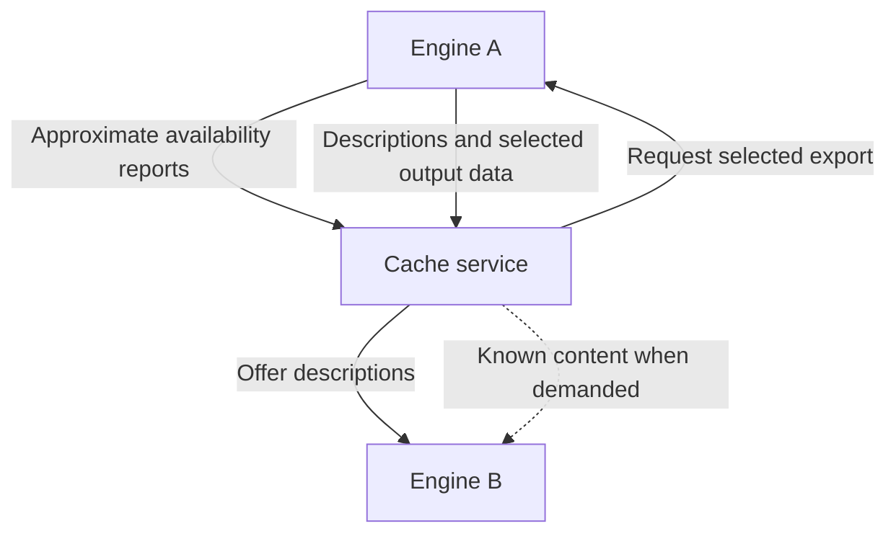
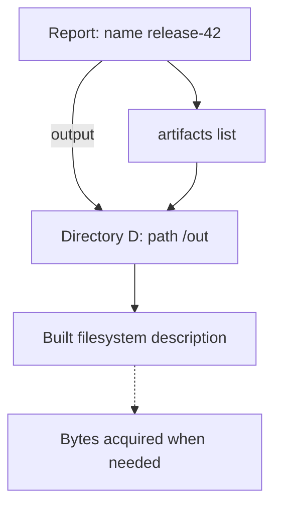

# Remote cache data flows

This document explains the selected engine design for Erik: what A exports, how B uses saved values, and how missing files are downloaded or computed without making incorrect cache matches. It also divides the work into seven PRs. The behavior is selected; the detailed plans and their source/model proofs must converge before implementation.

**Source:** `17f7dd89f4c2a3d5c3197e593e0e0488ebccc2a3`. **Branch:** `remote-cache-dataflow-author-98d7a770`. Source was read in the unchanged `45b88f2b81c0b6fa14d82e2f4a2dba289d012261` worktree; every cited source file was checked identical at 17f7. **Checked by:** reading and document reference checks; no tests or model runs for this revision. **Current** means implemented. **Selected** means Human decisions or council decisions under Human authorization. **Required proof** means unfinished design/validation work.

## Selected behavior

An **offer** is result information supplied by the service. A **digest** is a hash used to identify a call or assert something about a value; those meanings must remain distinct. A **matching association** records that lookup under a call or digest can find a result, subject to its conditions.

- A retains nothing extra while waiting for export requests. Normal references protect actual export. A pruned result may be unavailable.
- The service selects outputs to upload and may initially select all. Export does not run unfinished operations.
- Preserve the original recorded call and every known safe, useful matching association. Later discoveries need no synchronization. False misses are acceptable; incorrect matches are not.
- Demand uses local output, known remote output, then computation. B may obtain a fresh address for already-known content. Ordinary cache misses make no service request.
- Offers benefit already-created, unstarted work. Interrupting running execution remains a future option.
- Different exec outputs may come from different nondeterministic runs. Preserve already-served values.
- All eligible persistable values and immutable outputs remain in scope. Mutable cache-volume contents and full filesync/Git mirrors stay local.
- Persist learned descriptions without extending result expiry. Include sufficient referenced descriptions by default. Reuse a B value only when the transferred references and assertions remain valid for that concrete value; a recipe match alone does not establish this.

## What A exports

A selects `P.withExec(["make"])`, constructing Container **built** without running make. P contains the tools and inputs, works in `/src`, and has no mount covering `/out`. A later root-filesystem demand runs make and produces `/out/app`. Directory **D** comes from `built.directory("/out")`. Module M's `project.report()` returns Report.

A **part**, `PartKey`, names separately demandable data. A **group**, `LazyGroupKey`, identifies an evaluation body supplying one or more parts, including opening saved data (`dagql/types.go:179-210`).

The following names are explanatory references, not a wire format:

| Described value | Representative contents |
|---|---|
| Report from M | `name = "release-42"`, `output = D`, `artifacts = [D]`; call `project.report()` |
| built: Container | Workdir `/src`, platform `linux/amd64`, no mounts; call `P.withExec(["make"])` and applicable options/context |
| D: Directory | Path `/out`, platform `linux/amd64`, no services; call `built.directory(path: "/out", expand: false)` |
| Each value | Type, references, original call, supported matching associations, expiry, and required original computation information |

Built's root filesystem and standard output are computed, but only its root filesystem is offered. D uses that offered filesystem at path `/out` in this no-mount example. B already has P, project and M's **schema**, its installed type/field definitions. Include their necessary descriptions when absent.

A **call frame**, `ResultCall`, records the receiver, field, arguments, module and implicit inputs (`dagql/result_call_frame.go:188-204`). Its **recipe digest** identifies that recorded call. D retains its directory-producing frame when returned through `Report.output`; that getter simply returns a saved field and adds a lookup association. It does not replace D's original frame (`dagql/cache.go:5412-5436`, `dagql/cache_egraph.go:801-826`). The new matching rules below govern what those associations prove.

`ExportChain` describes ordered layers and a way to read their bytes (`engine/snapshots/remote_type.go:11-20`). An illustrative gzip layer has stored-byte digest `sha256:aa…`, size 16 KiB and uncompressed-layer digest `sha256:bb…`. These invented, abbreviated values describe layer storage, not DAGQL value equality. Import already uses the uncompressed digest (`engine/snapshots/blobs.go:192-207`).

Computed does not mean prepared or downloadable: layer preparation may require diff/compression (`engine/snapshots/blobs.go:156-172`). In a variant with a writable mount at `/out`, the service can request only that mounted output. Other completed parts may have no supplied source. A truly pending Container may also travel, with executable inputs and no invented layers; current pending codecs provide a starting point (`core/container_persistence.go:42-73`).

The arrows show selected new engine connections, not existing service integration:

## B returns saved values

1. A's `version()` returned String `"v1.2.3"`. B decodes that saved value and type.
2. B's eligible matching call returns the String without executing its function or transferring a filesystem. Current scalar decoding and cache-hit behavior already supply these pieces (`dagql/cache_persistence_self.go:255-285`, `dagql/cache.go:4882-4895`).
3. For Report, B resolves the module type and constructs `name`, `output` and `artifacts`. A field getter returns its saved child; other methods may execute (`core/object.go:774-798`, `core/object.go:967-993`, `core/object.go:1542-1551`).
4. If D's description is missing, decline that candidate and compute normally. If D's description is present but its bytes are remote, construct deferred access using the selected acquisition behavior.

For these example hits, B uses the described module and receiver values, or values proven interchangeable with them. A matching module name or producing recipe alone is insufficient. Once a call returns a saved project value, later calls use that concrete receiver and can reuse its saved answers. No download of unrelated inputs is needed to create equality.

Missing descriptions and missing bytes are different cases. Current list decoding requires referenced rows to exist (`dagql/cache_persistence_self.go:290-305`). The design adds no requirement to wait for missing descriptions.

References also occur inside encoded objects and typed IDs. A's row 17 must resolve to the corresponding B value, not B's unrelated row 17. Codec-aware translation must cover declared references; arbitrary JSON numbers or strings are not references merely because they resemble IDs (`core/persisted_object.go:46-60`, `core/persisted_object.go:76-104`). Handle-form typed IDs are engine-local; the codec must translate their exact result references, including private ModuleObject fields. An unavailable target refuses that candidate, not the entire type. Recipe-form IDs retain their typed call descriptions (`dagql/call/id.go:33-39`, `core/object.go:817-851`).

Typed use needs the defining schema and ordinary secret/socket resource checks. Descriptions carry resource identities/requirements; B supplies live bindings (`dagql/cache_egraph.go:708-715`). Client-bound identities remain explicit. Runtime-only fields are reconstructed, not copied as original inputs.

## B reads a file

Consider B's active `File.Contents` call for `built.file("/out/app")`; its contents answer was not offered.

1. `File.Contents` asks `file.Snapshot.GetOrEval` for its snapshot. `ContainerFileLazy` asks `Cache.EvaluateParts` for built's root filesystem (`core/file.go:815-837`, `core/container.go:3330-3361`).
2. The selected common acquisition code first uses valid local output, including another available result only when applicable value evidence proves it interchangeable. For an unhashed exec output, the row's own held part is usable; a different output of the same command is not thereby equal. It does not scan every result or force unrelated computations.
3. Otherwise it calls `ImportChain` for the known offered chain. Existing import reuses local snapshots before reading missing bytes and holds returned resources until release (`engine/snapshots/import.go:8-42`).
4. The Container adapter adopts an immutable `AcquiredOutput` describing the accepted snapshot, path, platform and services. For adapted values, `ReadOutputDescriptor` demands and reads that fixed descriptor; `PeekOutputDescriptor` reads it only when already fixed. Current local restore assigns Directory/snapshot accessors (`core/container_persistence.go:483-505`); ordinary/private construction may still use those assignments, but an exposed shell must read its accepted descriptor.
5. If cached data cannot supply the output, fresh `ContainerExecState.evaluateOutputs` obtains P's necessary filesystems and calls `engineClient.Run`. Its computed filesystem supplies `built.FS` (`core/container_exec.go:1302-1329`, `core/container_exec.go:2256-2278`).
6. The File view selects `/out/app` from the accepted descriptor, then `File.Contents` opens and reads it. Current `ContainerFileLazy` copies path, snapshot, platform and services separately (`core/container.go:3359-3373`, `core/container.go:3451-3471`, `core/file.go:827-845`); the acquisition plan makes adapted views derive them coherently after parent demand.

**Selected connection:** existing `Cache.Evaluate` / `EvaluateParts` invokes the type callback. Common code chooses local/import/computation; adapters construct ordinary private work and adopt coherent fixed descriptors. Adapted child, read, capture and clone paths use those descriptors. This shared acquisition helper is new work.

Demand may occur during selection: `Directory.file` evaluates and hashes the File, and `maintainContentHashing` can evaluate a returned Directory (`core/schema/directory.go:844-874`, `core/schema/directory.go:1941-1962`). `Container.workdir` reads saved configuration after metadata evaluation; not every metadata operation is filesystem-free (`core/schema/container.go:2081-2089`).

## A reusable call is not an equal value

Two executions of module `pickImage()` can return different existing Containers X and Y, each with an honest immutable-image identity. A later `pickImage()` may reuse either. A callback explicitly returning attached Y must not be changed into X.

**Current problem:** publication merges request/response recipe and extra-digest classes, then merges outputs for the same structural term: the same operation over equivalent inputs (`dagql/cache_egraph.go:1600-1647`, `dagql/cache_egraph.go:1697-1725`). Canonical adoption can then substitute another value from that class (`dagql/cache.go:2546-2581`). This problem exists in ordinary matching, independently of remote downloads.

**Selected:** a **value class** contains only results justified interchangeable by applicable value evidence. Examples of evidence are pinned image identity, resource handles under their binding rules, and established File/Directory content hashes within their actual scope. Derived hashes need the proof described below. A recipe indexes candidate outcomes; it does not unite their classes. Existing `egraphResultsByDigest` and `termResults` remain candidate indexes. A term may have several different outputs.

Each recipe association names its supporting operation and actual input value classes. Request recipes use request terms; response recipes use result terms. A getter's association is distinct from the child's producing call (`dagql/cache_egraph.go:1651-1694`).

All lookup routes validate those bindings and applicable conditions before teaching another association or returning a candidate. An attached return or exact ID load preserves the specified value unless actual value equality justifies substitution. Session-mode ID loading has a canonical-equivalence route too (`dagql/cache_persistence_resolver.go:64-118`).

A pending input contributes its own result identity. A different pending row with the same producer is not automatically equal. Today `ResultCallStructuralInputRef.inputDigest` reduces references to producer recipes, and recipe lookup can bypass structural examination; both change (`dagql/result_call_frame.go:1030-1042`, `dagql/cache_egraph.go:720-768`). Selecting a B row does not establish A's transferred assertions about it.

Active calls need the same distinction. If `F1.search(q)` and `F2.search(q)` both miss, the current join key can still combine them because it uses the recipe digest and concurrency key (`dagql/cache.go:4872-4917`). **Selected:** use the recipe digest plus the exact result-backed input rows for logical call identity, including the recursive-call guard. The active join key also retains the existing concurrency key; independently equal rows may duplicate work. Keep this key stable through class merges. Telemetry can still identify the recipe.

**Tradeoff:** preserve repeated-call reuse, shared pending work, safe extras and structural matching over proven-equal inputs. Independent outcomes sharing only a producer can lose downstream hits. Accept those misses instead of downloading all arguments or maintaining a solver for conditional equality. Proven input-class merges still require term repair.

### Derived hashes need evidence too

`ContentPreferredDigest` uses an explicit content digest when present; otherwise it derives one from the call and its inputs (`dagql/result_call_frame.go:782-878`). Hashing that result again does not convert an unverified producing call into value evidence. For example, `withVolatileVariable` derives an extra from its parent's preferred digest (`core/schema/container.go:2237-2245`).

**Selected:** an extra digest records whether it asserts established value equality or derives only from call identity, together with applicable byte conditions. Derivation preserves those limits from every contributing input. The existing `content` label alone is insufficient; matching and direct consumers must respect the evidence meaning. Audit all consumers, including ordinary shortcuts outside the graph.

Concrete case: distinct unhashed Before/After directories from one nondeterministic producer can have equal preferred digests. `Changeset.computePathsOnce` then returns no changes; `IsEmpty` similarly returns true without comparison (`core/changeset.go:180-190`, `core/changeset.go:564-575`). `mergeBeforeDirectories` also collapses inputs using that comparison (`core/changeset.go:1257-1275`). Require applicable value evidence or the same unchanged input; otherwise compare the directories. This is part of the ordinary matching repair.

## Saved observations require their actual bytes

A saved `F.search("1.2.3")` answer describes F containing `v1.2.3`. If B cannot acquire those bytes and obtains `v1.2.4`, it must perform the search over the latter bytes. Keeping the same B row is not enough: the requirement refers to the actual filesystem part used.

**Selected:** record exact-byte requirements at semantic reads and parsed-state construction. Before using a saved observation, validate the request's relevant input against that recorded content and retain it through ordinary ownership. Begin conservatively with exact snapshot/content-chain evidence. A selected File hash does not establish its whole parent snapshot.

This applies to direct and module-wrapped observations, including cached nested hits. Forward their requirements into the enclosing call; if the required input correspondence is unestablished, compute. Existing `FunctionCall` context is useful, but does not already implement this forwarding (`core/modfunc.go:878-937`, `engine/server/session.go:1516-1536`). The new candidate checks must precede current hit teaching (`dagql/cache_egraph.go:920-971`).

Examples include search/glob, Changeset comparisons, GitBundle headers and parsed module configuration. Another case is `withMountedSecret(owner: "app")` or `withUnixSocket(owner: "app")`: the saved Container metadata contains resolved numeric IDs that a later exec uses. Those numbers must still agree with the account-file snapshot used for that resolution, or the name must be resolved again before use (`core/container.go:6152-6172`, `core/container.go:6233-6245`, `core/container_exec.go:996-1035`). This does not require retaining an account-file input merely because `withFile(owner: "app")` already produced a copied snapshot with numeric ownership. Numeric owner arguments need no account-file lookup (`core/container.go:7214-7259`). A byte-inspected no-op alias, such as `Directory.Without`, also carries its condition (`core/directory.go:3315-3324`).

**Council choice under Human authorization:** copied, transformed and archived outputs may keep their honest bytes without acquiring their whole production history. A separately acquired source may differ. Observations over the copy still describe its own bytes; assertions about a source still require that source. Its own content labels cannot be kept after replacement with different bytes.

Use directed dependencies and snapshot ownership, not symmetric pruning groups or every exec mount as an observation (`dagql/cache.go:5693-5708`). These requirements can cause additional downloads for saved assertions; they do not require all exec outputs.

## Keeping computation possible

**Current:** `Container.WithExec` constructs `ContainerExecState` and `ContainerExecLazy`; it does not run make (`core/container_exec.go:90-110`, `core/container_exec.go:1261-1295`). Parent/options/module context describe work; evaluation later runs the process.

| State on A | Current encoding |
|---|---|
| Some parts pending | Executable `LazyJSON` plus available part records |
| All parts computed | Saved parts; executable `LazyJSON` omitted |

Completion clears Container's operational `Lazy` pointer while the original call remains separately persisted (`core/container_persistence.go:42-73`, `core/container_parts.go:498-521`, `dagql/cache_persistence_worker.go:259-267`).

**Selected:** retain immutable exec inputs through completion and construct fresh B execution state. Do not serialize consumed flags or mutated per-run metadata as original input: `evaluateOutputs` writes generated `ExecMD`, including session-specific context (`core/container_exec.go:1413-1417`, `core/container_exec.go:345-368`).

Directory/File views can use recorded inputs and factored ordinary constructors. For D reached through Report, construct its original `ContainerDirectoryLazy`; that demands built's filesystem. Do not rerun the getter or blindly execute ancestors (`core/container.go:3164-3212`).

On a direct `withExec` miss, the field function prepares options/context and calls `Container.WithExec` to construct pending work. A hit returns before that function runs (`core/schema/container.go:1589-1644`, `dagql/cache.go:4882-4895`). An already-pending B exec has its executable callback and inputs. For a completed imported exec, the saved original `Parent`, `Opts`, input `ExecMD` and `ModuleContext` must instead supply fresh B execution state after failed acquisition. Preserve original execution metadata; regenerate the per-run session additions.

Other synchronous producers use the same acquisition behavior. The ready-parent `withDirectory` branch can use the existing lazy constructor instead of requiring a separate remote design (`core/schema/container.go:3640-3660`). The producer plan must specify each concrete construction seam; no universal second operation serializer is selected.

Fix changeset merge's snapshot-ID/path-only child at its source. Introduce an ordinary Directory-producing operation over the original input changesets and strategy, sharing the merge algorithm; the outer call assembles its Changeset from that Directory (`core/changeset.go:1307-1344`). The merge still executes synchronously when `withChangeset` runs, through the new field body; this repair gives its Directory output an ordinary producing call without adding new lazy timing. Multi-input callers and independently retained After directories still need validation.

## Types, resources and lifetime

Already saved scalars need no byte acquisition. Objects such as `GeneratedCode.Code` and `GitBundle.File` refer to Directory/File children rather than owning separate download systems (`core/codegen.go:14-28`, `core/git_bundle.go:46-51`). All-type coverage also needs schema, ordinary resource and missing-codec work.

HTTP uses a canonical snapshot containing `contents` and matching response metadata. Its returned File can be renamed, so that File chain is not automatically the canonical body. If the body is unavailable, obtain it; a 304 supplies no missing bytes (`core/http.go:255-329`, `core/http.go:394-427`).

Git decode already selects a local mirror by URL. Filesync restore currently opens a local mutable snapshot; compatible client inputs need their own construction (`core/git.go:597-613`, `core/client_filesync_mirror.go:135-161`). Preserve client identities. An offer must not replace usable B work with unavailable A-specific inputs.

Live export must capture consistent committed parts while work continues, rather than read intermediate writes. Current persistence waits for quiescent close; it is not selected live capture (`dagql/cache.go:4238-4257`, `dagql/cache_persistence_worker.go:214-268`).

A stored filesystem role can have a local snapshot ID, a content description, or both. Ordinary snapshot leases apply only to actual local snapshots. Persist original inputs, requirements, references, expiry and content sources; reconstruct callbacks and session resources. A restarted Report must not point at a forgotten D.

Imported availability and B's computation completion are separate. If A's stdout was already served and a later root-filesystem download fails, one fresh exec may supply that filesystem without replacing served stdout. Current output application writes all produced bindings (`core/container_exec.go:1554-1577`). The new installation step must reserve each output part before writing it, preserve parts already stored or being opened, and release unused produced references. Separate opening and execution groups must not race to write one accessor. Cancellation stops work; genuine execution errors remain errors.

## Seven PRs and documents

All plan documents and a holistic review precede implementation. Each batch owns models, persistence and focused checks for the state it introduces. Paths below are planned, not links to finished documents.

1. **Lossless values and reference closures.** Repair null identity, exact numbers, declared lists and missing ordinary metadata/action codecs; enumerate row references, handle and recipe forms of typed IDs, client bindings and runtime-only fields. Planned: `hack/designs/remote-cache/persisted-value-graphs.md`.
2. **LLM configuration and conversations.** Use a typed internal config input: absent selects normally, explicit unresolved preserves requests, bound preserves effective settings. Keep requested overrides, defining schema and recording data; no new config row or saved credentials. Reuse `GetOrInitArbitrary` clients scoped to session, credential supplier and config, with separate cancelable `SessionScopedContext`, cleanup and join. Its initializer context is canceled when the final waiter leaves, so cannot own a cached tunnel (`dagql/cache_arbitrary.go:188-192`, `engine/server/session.go:2740-2745`). Planned: `hack/designs/remote-cache/llm-configuration-and-persistence.md`.
3. **Call candidates and value equality.** Repair publication, lookup, active-call joining, recursive guards, exact/session adoption, supporting terms and derived evidence, including Changeset shortcuts. Model actual input bindings and multiple outcomes; preserve a portable `Service.RuntimeID` across runtime keys and hostnames. Planned: `hack/designs/remote-cache/cache-candidates-and-value-equality.md`.
4. **Byte observations and nested calls.** Record scoped requirements; validate before teaching; forward nested hits; preserve ownership and parsed assertions without production-history downloads. Planned: `hack/designs/remote-cache/cache-byte-observations.md`.
5. **Normal producers and committed outputs.** Retain original inputs, specify type constructors, fix merge production, and capture committed state consistently. Own the native MCP joint result with Messages, HasChanges and always-present FinalWorkspace. Planned: `hack/designs/remote-cache/saved-filesystem-producers.md`.
6. **Selected live descriptions and admission.** Implement portable references, selected export, schema/resource checks, ownership and durable descriptions. Known chain descriptors may lack a source locator; first usable parsed handles require established backing conditions. Initially admit complete data, executable truly-pending values and completed parts B can already use; decline chain-only completed parts requiring the new acquisition path and their dependent roots. No hidden persistent phase solely for sequencing. Planned: `hack/designs/remote-cache/live-cache-descriptions.md`.
7. **Shared acquisition and combined lifecycle.** Extend that same admission to remote-only completed parts, add common acquisition/type adapters, late offers, overlap and restart leases, and check the combined engine flows. Factor the existing lazy kernel for construction, with temporary incoming counts rather than destination dependency edges. This incremental PR boundary does not narrow final eligibility. Planned: `hack/designs/remote-cache/remote-cache-acquisition.md`.

Start codec, matching and producer plans in parallel. Observations follow matching. The LLM plan follows the codec reference contract; its configuration input is an ordinary literal under matching. Live descriptions depend on those contracts and codec coverage. Acquisition and descriptions share a contract before coding. A possible private stack is 1 → 3 → 4 → 5 → 2 → 6 → 7; independent work need not wait for document numbering.

Use existing hard resets, without migrations. Each PR changing stored interpretation needs a safe version transition; incompatible intermediate representations cannot write the same version. Do not invent unused future fields to force one bump.

## Required proof before implementation

The direction is selected; safety and coverage are not assumed. Check every lookup, active join, recursive guard, teaching and adoption route; request versus result bindings; exact part/content evidence; nested-hit forwarding; and association lifetime without getter ownership cycles. Model class merges during active calls, cancellation, ownership and retry under stable join keys. Audit all preferred-digest consumers and concrete producer adapters.

The current lifecycle model assumes static `ClassOf` and interchangeable classes; it cannot prove the changed equality rule without revision (`dagql/tla/CacheLifecycle.tla:32-44`). Each owning batch needs reachable failure/concurrency cases and deliberate failure controls. Engine checks must cover actual values/content beyond model abstractions.

The separate codec lane has no implementation to inherit. Its required repairs are explicitly commissioned in this stack. No fake remote service/server, service deployment, or exhaustive producer-coverage claim is part of this document.
