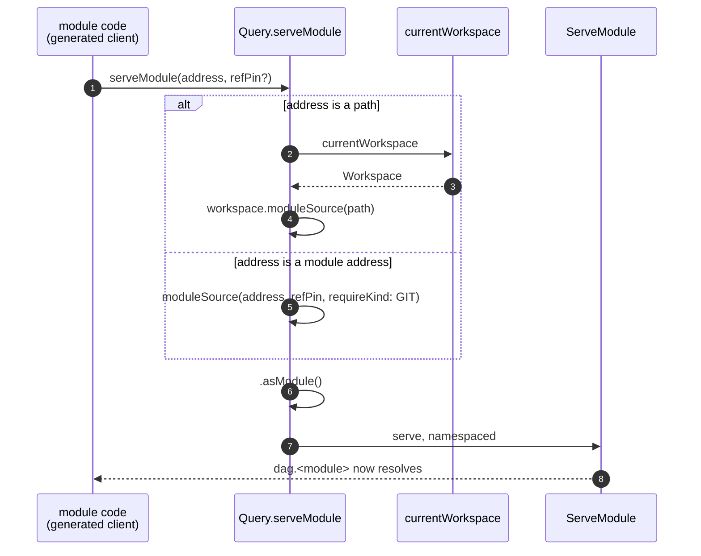

# `Query.serveModule`

## Status

Engine field implemented on branch `feat/serve-module-api`. Follow-ups
(module-side guard, SDK adoption) are listed at the end and are **not** part of
this change.

Successor to [`generated-client-module-loading.md`](./generated-client-module-loading.md),
which introduced `Workspace.moduleSource(path)` and the two-mode
(local / remote) bootstrap that the TypeScript client generator emits today.
Read that doc first for what a generated client is and why it must serve
its bound module at all; this doc only changes *how* the bootstrap is spelled.

## Table of Contents

- [Problem](#problem)
- [Solution](#solution)
- [API](#api)
- [Address classification](#address-classification)
- [Resolving a local address](#resolving-a-local-address)
- [What this deliberately does not do](#what-this-deliberately-does-not-do)
- [Implementation](#implementation)
- [Tests](#tests)
- [Follow-ups](#follow-ups)
- [Reference: relevant code](#reference-relevant-code)

## Problem

A generated client has to install the module it is bound to before the first
`dag.<module>()` call resolves. The bootstrap it emits is two different query
shapes depending on the bound module's kind. From the TypeScript SDK's unified
client ([typescript-sdk#54](https://github.com/dagger/typescript-sdk/pull/54)):

```ts
// remote
async function __serveModule(): Promise<void> {
  await __dag
    .moduleSource("github.com/shykes/daggerverse/hello@hello/v0.3.0", {
      refPin: "54d86c6002d954167796e41886a47c47d95a626d",
    })
    .asModule()
    .serve()
}

// local
async function __serveModule(): Promise<void> {
  await (__dag as any).getGQLClient().request(
    `{ currentWorkspace { moduleSource(path: "/.dagger/modules/test") { asModule { serve } } } }`,
  )
}
```

The local form is the problem. It is a **raw GraphQL escape hatch**, and it has
to be, because a client generated *into a module* has no `currentWorkspace()`
binding to call: `Query.currentWorkspace` and `Query.host` are stripped from the
schema a module's SDK generates against
(`core.FieldsToIgnoreForModuleIntrospection`,
`core.TypesToIgnoreForModuleIntrospection`). They are stripped on purpose — a
third-party module must not be able to read its caller's host or workspace.

So the local bootstrap is in an awkward spot:

1. **It is a hack.** Every SDK that generates clients has to reach past its own
   typed bindings and hand-assemble a GraphQL document, plus whatever private
   accessor gets it a raw transport (`getGQLClient()` above).
2. **It only works because scrubbing is introspection-only.** Hiding a field
   from the introspection JSON removes the *binding*, not the *field*. The dagql
   server still resolves `currentWorkspace` for a module client, which is what
   makes the raw query succeed. The hack depends on the guard being absent.
3. **The guard is coming.** The plan is for module code to depend on the
   released Dagger bindings — the full surface, `currentWorkspace` and `host`
   included — and for the *engine* to reject those calls when they come from a
   module, instead of hiding them at codegen time. The moment that lands, this
   raw query starts failing, and the only legitimate bootstrap left would be the
   remote one.

Point 3 is the forcing function. The bootstrap needs an operation that is
legitimate from inside a module, so it survives the guard rather than being
grandfathered around it.

## Solution

One engine field that takes an address and does the whole bootstrap:

```graphql
extend type Query {
  serveModule(address: String!, refPin: String): Void
}
```

Both client shapes collapse into one call with no raw GraphQL and no workspace
handle:

```ts
// remote
await dag.serveModule("github.com/shykes/daggerverse/hello@hello/v0.3.0", {
  refPin: "54d86c6002d954167796e41886a47c47d95a626d",
})

// local
await dag.serveModule("/.dagger/modules/test")
```

The engine classifies the address and picks the resolution strategy. The
workspace lookup that a module is not allowed to perform happens **inside** the
engine, on the caller's behalf, scoped to exactly one thing: finding the module
named by the address. Nothing about the workspace is returned — the field's
result is `Void`.

That is the property that matters for the guard: `serveModule` stays callable
from a module because it hands back no workspace, no host handle, and no
directory. It is a schema mutation, not a read.



## API

```graphql
"""
Load the module at the given address and serve its API in the current session.

A local address resolves against the caller's workspace, so a generated client
can serve the module it is bound to without reaching for the workspace itself.
"""
serveModule(
  """
  A module address, or an explicit path into the caller's workspace.

  Absolute paths (e.g. "/.dagger/modules/hello") resolve from the workspace
  root, relative ones (e.g. "./hello") from the workspace cwd.

  Installed module names are not accepted.
  """
  address: String!

  """
  The pinned version of a remote module address.
  """
  refPin: String
): Void
```

- Gated `AfterVersion("v1.0.0-0")`, matching `Workspace.moduleSource` and the
  sibling client-codegen primitives.
- `DoNotCache` — it mutates the calling session's schema, like `Module.serve`.
- The module is served **namespaced**: neither `includeDependencies` nor
  `entrypoint`. A client's schema is core plus its one bound module, so its
  bindings never reference a dependency, and promoting a bound module onto the
  `Query` root is not something a client bootstrap should decide.

## Address classification

Classification is purely lexical — no filesystem stat, no network. It reuses the
rule already used for recorded client targets
(`moduleAddressKind`, extracted from `clientModuleRefKind`):

| Address | Kind |
|---|---|
| `.`, `..`, `./x`, `../x`, `/x` | local workspace path |
| anything else that is not a bare name (`github.com/...`, `git://host/repo.git`, `dagger.io/go@main`) | module address |
| bare name (`hello`) | **rejected** |

Bare names are rejected rather than treated as installed-module lookups. An
installed name is a *workspace configuration* concept; letting a module pass one
would make `serveModule` a way to enumerate what the caller has installed, which
is the kind of leak the workspace scrubbing exists to prevent. It is also
ambiguous with a relative path, which is why client targets already reject it.

This is the same classifier, so an address recorded as a client target in
`dagger.toml` is spelled identically at runtime.

## Resolving a local address

A local address resolves through `Query.currentWorkspace` →
`Workspace.moduleSource(path)`, selected server-side. Two consequences worth
being explicit about:

**Path rules are the workspace's, not the process's.** `Workspace.moduleSource`
applies `resolveWorkspacePath`: absolute from the workspace root, relative from
the workspace cwd — the same rule as `Workspace.directory` / `file` / `glob`.
Codegen should bake **absolute** (workspace-root) paths, which is what the
TypeScript client generator already does (`/.dagger/modules/test`). A relative
path resolves against wherever the session happens to be inside the workspace,
which is not a property a baked value should depend on.

**"The caller's workspace" is `currentWorkspace`'s answer, not a new one.**
`currentWorkspace` prefers a `Workspace` bound into the context — a
generator/check group threading the workspace it was rolled up from, or an agent
operating on its own overlaid workspace — over the session's frozen workspace.
Routing through it means a module rolled up into a group resolves its local
addresses against the same tree the group is working on, including uncommitted
edits. A module client executing in an ordinary session gets the session
workspace, inherited from its nearest non-module ancestor
(`inheritWorkspaceBinding`).

There is a real gap here, inherited from the current hack rather than introduced
by it: a module loaded **from git** whose own config records a *local* client
target resolves that path against the **caller's** workspace, not against the
repository it came from. The right answer would be the workspace the calling
module was itself loaded from. `ModuleSource.Workspace` already exists for this
(it retains the originating workspace) but is only populated for sources loaded
through `Workspace.moduleSource` — workspace-config module loading resolves
local entries to absolute host paths and goes through `Query.moduleSource`
instead, so the field is empty for the modules that would need it. Closing the
gap means populating `ModuleSource.Workspace` along the config-loading path and
preferring the current module's retained workspace here. Deferred: it is a
change to module loading, not to this field, and no shipped client generator
emits a local target for a git-loaded module today.

## What this deliberately does not do

- **No `includeDependencies` / `entrypoint` passthrough.** See [API](#api). Add
  them only if a concrete caller needs them; `Module.serve` remains for callers
  that do.
- **No new resolution semantics.** Every branch is a server-side selection of an
  existing field. `serveModule` is a *composition*, so a client's bootstrap and
  a hand-written query resolve identically, and the local branch keeps behaving
  exactly as today's raw query does.
- **No guard.** The whole point is to make the guard *possible*, not to add it.
  See [Follow-ups](#follow-ups).
- **It does not make a local module servable from a shipped artifact.** A client
  compiled and run away from its project tree still has no workspace to resolve
  against; that case is remote-only. Unchanged from the predecessor doc's
  limitation section.

## Implementation

1. `Query.serveModule` registered in `core/schema/module.go` alongside the
   `Query` module fields, resolver `moduleSchema.serveModule` next to
   `moduleServe`. It:
   - classifies the address with `moduleAddressKind`;
   - **git**: selects `Query.moduleSource(refString, refPin?, disableFindUp:
     true, requireKind: GIT)` — the same selector recorded client targets use
     (`workspaceClientModuleSourceSelector`), plus `refPin`;
   - **local**: selects `Query.currentWorkspace` then
     `Workspace.moduleSource(path)`;
   - selects `asModule` and calls `Query.ServeModule(mod, false, false)`.
2. `clientModuleRefKind` split into a pure `moduleAddressKind(ref) (kind, ok)`
   plus the client-target-specific error message, so both callers share one rule
   and each reports its own error.

## Tests

`core/integration/module_serve_test.go`, on `ModuleLoadingSuite`:

- `TestServeModuleLocalAddress` — plain client session against a host workspace
  whose `hello` module is *not* installed in `dagger.toml` (so nothing serves it
  ambiently): absolute path, relative path from a nested cwd, a path with no
  module, and a bare name.
- `TestServeModuleFromModule` — a Go module calling `dag.ServeModule` and then
  reaching the served module through a raw selection, for both a local
  workspace path and a git address served from a local git daemon. This is the
  motivating case, and it doubles as the assertion that `serveModule` is present
  in the schema a module generates against.

## Follow-ups

Ordered by dependency. None are in this change.

1. **Adopt it in the SDK client generators.** Replace the two-shape
   `__serveModule` with a single `dag.serveModule(address, { refPin })` in the
   TypeScript client generator (the `withServe` hook keeps its current
   lifecycle), then the other client generators as they gain the same need.
   Removes the `getGQLClient()` raw-query escape hatch.
2. **Populate `ModuleSource.Workspace` on the config-loading path** and prefer
   the current module's retained workspace when resolving a local address. See
   [Resolving a local address](#resolving-a-local-address).
3. **The module-side guard.** Stop scrubbing `Query.currentWorkspace`,
   `Query.host` and friends from module introspection; instead let module code
   depend on the full released bindings and have the engine reject those calls
   when the caller is a module, with an error that points at the sanctioned
   alternative (`serveModule` for this case). Points to note for whoever picks
   it up:
   - `core.FieldsToIgnoreForModuleIntrospection` /
     `core.TypesToIgnoreForModuleIntrospection` are the current scrub lists and
     enumerate what the guard must cover.
   - The check is "is the calling client a module", which the engine already
     knows (`callerInModuleFunction`, `Server.ModuleParent`).
   - `serveModule` must stay *outside* the guard: it is on `Query`, it is
     callable from a module by design, and it internally selects
     `currentWorkspace`. Whatever form the guard takes has to distinguish "a
     module called this" from "the engine selected this while serving a module's
     call", or `serveModule` breaks along with the hack it replaces.
   - Removing the scrub lists is user-visible: modules gain bindings for fields
     that now fail at runtime instead of failing to compile. That trade — a
     clear runtime error over a missing binding — is the point, but it wants a
     release note and docs.

## Reference: relevant code

| Thing | Location | Note |
|---|---|---|
| **`Query.serveModule`** (this work) | `core/schema/module.go` (`serveModule`) | `v1.0.0-0`-gated, `DoNotCache` |
| **`moduleAddressKind`** (this work) | `core/schema/workspace_client.go` | lexical local/git classifier, shared with client targets |
| `Workspace.moduleSource(path)` | `core/schema/workspace_module.go`, registered in `core/schema/workspace.go` | local branch; abs-from-root / rel-from-cwd |
| `Query.currentWorkspace` | `core/schema/workspace.go` | prefers a context-bound workspace over the session's |
| `Query.moduleSource(refString, refPin, ...)` | `core/schema/modulesource.go` | git branch |
| `workspaceClientModuleSourceSelector` | `core/schema/workspace_client.go` | the git selector recorded client targets use |
| `Module.serve` → `Query.ServeModule` → `Server.serveModule` | `core/schema/module.go`, `engine/server/session.go` | per-session schema mutation, idempotent/conflict-checked |
| Module introspection scrub lists | `core/moddeps.go` | what the guard must eventually cover |
| Workspace binding inheritance for nested clients | `engine/server/session_workspaces.go` (`inheritWorkspaceBinding`) | why a module client sees the session workspace |
| `ModuleSource.Workspace` | `core/modulesource.go` | retained originating workspace; only set via `Workspace.moduleSource` |
| Predecessor design | [`hack/designs/generated-client-module-loading.md`](./generated-client-module-loading.md) | why the bootstrap exists at all |
| TypeScript unified client | [typescript-sdk#54](https://github.com/dagger/typescript-sdk/pull/54) | emits the bootstrap this replaces |
| Manifest v2 entrypoint loading | [#14038](https://github.com/dagger/dagger/pull/14038) | unblocked the unified client |
