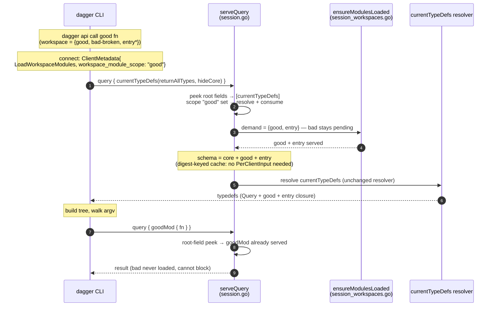

# Targeted Module Loading for `dagger api call` / `api functions`

Completes the demand-driven workspace module loading shipped for
`generate` / `check` / `up` (#13548, `hack/designs/demand-driven-module-loading.md`),
which explicitly left `call` / `functions` out of scope.

**Chosen design: a client-declared workspace module scope in `ClientMetadata`,
resolved and consumed engine-side.** No GraphQL API change, no SDK regeneration,
no version gating; the CLI forwards one token it already extracts today.

## Table of Contents

- [Problem](#problem)
- [The merged foundation](#the-merged-foundation)
- [Why `call` / `functions` are structurally harder](#why-call--functions-are-structurally-harder)
- [Prior attempts](#prior-attempts)
- [Design: client-declared module scope](#design-client-declared-module-scope)
  - [Client contract](#client-contract)
  - [CLI](#cli)
  - [Engine](#engine)
  - [One-shot consumption](#one-shot-consumption)
  - [Flow](#flow)
- [Behavior](#behavior)
- [Compatibility and gating](#compatibility-and-gating)
- [Observability](#observability)
- [Alternatives considered](#alternatives-considered)
- [Test plan](#test-plan)
- [Status](#status)

## Problem

1. **`api call` / `api functions` still load everything** — both build their
   command tree from a `currentTypeDefs(returnAllTypes: true)` introspection
   (`internal/cmd/dagger/module_inspect.go`), and `currentTypeDefs` is on the
   requires-full-workspace list (`rootFieldsRequireFullWorkspaceSchema`,
   `engine/server/session_workspaces.go`), so the first request loads every
   workspace module.
2. **Fragility** — a broken or stale sibling module fails the introspection, so
   it blocks calling *any* module.
3. **The target is not in the query** — the CLI knows the target (the leading
   argv token), but `currentTypeDefs` has no place to carry it, so the engine
   cannot narrow the load from the request.

Only the *introspection* request is the blocker: the execution request that
follows roots at the module's constructor field (`{ goodMod { fn } }`), which
the merged root-field peek already narrows to that module.

## The merged foundation

PR #13548 made loading **additive and demand-driven**: each request loads only
the modules it demands; the rest stay *pending* and load when a later request
needs them. The schema grows monotonically, so narrowing is deferral, not exclusion —
safe for open multi-request sessions.

Two demand sources exist today:

| Demand source | Mechanism | Used by |
|---|---|---|
| `currentWorkspace { checks \| generators \| services(include: […]) }` | resolver calls `Query.Server.EnsureWorkspaceModules(ctx, include)` at entry (`ensureWorkspaceIncludeModulesLoaded`, `core/schema/workspace.go`) | `generate` / `check` / `up` — the CLI already sends `include` as the command's functional argument, so narrowing needed **zero CLI and zero API change** |
| Request root fields | `dagql.PeekRootFields` in `ensureRequestModulesLoaded` (`engine/server/session.go`); a field naming a pending module loads it, unknown fields fall back to the entrypoint, full-schema fields load all | raw `dagger api query`, shell, the execution request of `api call` |

This design adds the third and final demand source: a **client-declared scope**,
consulted only where the existing sources have nothing to say — a request whose
sole full-schema demand is `currentTypeDefs`.

## Why `call` / `functions` are structurally harder

`generate good` sends `generators(include: ["good"])` — the target is already
the query's functional argument. `api call good fn` sends
`currentTypeDefs(returnAllTypes: true, hideCore: true)` — a request that:

1. **names no module** — it asks for the whole served schema, and legitimately
   so for its other consumers (bare `api functions`, the in-engine MCP/LLM tool
   builder, `shell`);
2. **must contain the target's types in its result** — the CLI walks argv
   against the returned Query typedef to build the Cobra tree
   (`FuncCommand.traverse`, `internal/cmd/dagger/functions.go`), so the target
   module must be loaded before the resolver computes its result;
3. **has an ambiguous target** — the leading token may be a module constructor
   (`goodMod`), an entrypoint-proxied function, or a typo; which one it is can
   only be decided against workspace config (module names) — knowledge the
   engine has without loading anything, but the CLI does not.

So the target must cross the wire somehow, and someone must resolve
token → {module | entrypoint | unknown}. The design question is only: **which
channel carries the token, and which side resolves it.**

## Prior attempts

Four iterations, each a reaction to the previous one's weakness:

| PR | State | `call`/`functions` signal | Resolution side | Why it fell short |
|---|---|---|---|---|
| [#13380](https://github.com/dagger/dagger/pull/13380) | closed | peeked `currentTypeDefs(include:)` argument | engine (request peek) | drop-based narrowing (pre-additive) was only safe under `SingleQuery`; the peek grew Dagger semantics into `dagql` (recognizing `currentWorkspace`/`currentTypeDefs` shapes, resolving variables) |
| [#13406](https://github.com/dagger/dagger/pull/13406) | draft | public `currentTypeDefs(include:)` argument | engine (resolver hook) | engine foundation merged as #13548; the typedefs phase mutates a base-schema field used by every SDK (gate + full SDK regen for a CLI-only concern), resolver-time loading makes `PerClientInput` load-bearing on a hot path for all clients, and the CLI grows an "Unknown argument" error-sniffing fallback |
| [#13539](https://github.com/dagger/dagger/pull/13539) | draft | operation name `DaggerModuleScope_<module>`, peeked | engine (pre-request) | no API change and no cache wart, but the target is smuggled through a semantic-free field: a magic string contract, a Dagger-specific codec in `dagql`, a fragile string-replace on `typedefs.graphql` |
| [#13543](https://github.com/dagger/dagger/pull/13543) | draft | `currentWorkspace.moduleList(module:).typeDefs` | **CLI** | the target enters as a normal argument, but the CLI queries `moduleList`, kebab-matches the token, and decides the entrypoint fallback itself — duplicating resolution rules the engine already owns in its demand filters |

The lesson: the engine must resolve the token (#13406/#13539 got this right
and #13543 regressed it), and the channel must not be a side effect of another
mechanism (#13539's operation name). The chosen design carries the token in the
one channel built for client→engine session contracts, and keeps every piece of
resolution intelligence engine-side.

## Design: client-declared module scope

### Client contract

One new field in `engine.ClientMetadata` (`engine/opts.go`), beside the six
load-shaping fields already there (`LoadWorkspaceModules`,
`SkipWorkspaceModules`, `ExtraModules`, `Workspace`, `WorkspaceEnv`,
`SingleQuery`):

```go
// WorkspaceModuleScope hints at the workspace module this client's first
// schema introspection targets: the leading CLI command token, unresolved
// (it may name a module, an entrypoint-proxied function, or nothing).
// The engine may use it to defer loading unrelated workspace modules for
// the first request whose only full-schema demand is currentTypeDefs.
// Purely an optimization hint: resolution happens engine-side, an
// unrecognized value degrades to loading everything, and deferred modules
// load on demand from later requests.
WorkspaceModuleScope string `json:"workspace_module_scope,omitempty"`
```

Semantics:

| LoadWorkspaceModules | WorkspaceModuleScope | First `currentTypeDefs`-demanding request |
|---|---|---|
| false | any | no workspace modules (unchanged) |
| true | unset | load all pending (unchanged) |
| true | set | load the resolved scope; siblings stay pending |

The scope is a *hint*, not a contract: unlike `SingleQuery` there is nothing to
enforce, because on the additive foundation a wrong or stale scope is just
deferral — any later request that demands more loads more.

### CLI

The token is already extracted today: `initModuleParams` sets
`client.Params.Function = functionName(args)`
(`internal/cmd/dagger/function_name.go`), currently consumed only by engine
provisioning opts. `functionName` is conservative by construction: it returns
the first positional token, and returns nothing when a preceding
non-self-contained flag makes the split ambiguous (`-o out.txt good fn`).

Changes:

1. `client.Params` gains `WorkspaceModuleScope string`.
2. The **two** command sites set it explicitly — `runFunctionList`
   (`internal/cmd/dagger/call.go`) and `FuncCommand.RunE`
   (`internal/cmd/dagger/functions.go`):

   ```go
   params := initModuleParams(execArgs)
   params.LoadWorkspaceModules = shouldLoadWorkspaceModules(fc.DisableModuleLoad)
   params.WorkspaceModuleScope = functionName(execArgs)
   ```

   Deliberately **not** set inside `initModuleParams`: `dagger shell` shares
   that helper (`internal/cmd/dagger/shell.go`) and must keep the full view.
3. The metadata construction (`engine/client/client.go`) forwards it only when
   workspace modules load at all, mirroring the existing
   `LoadWorkspaceModules` guard:

   ```go
   if md.LoadWorkspaceModules {
       md.WorkspaceModuleScope = c.WorkspaceModuleScope
   }
   ```

That is the entire client. It sends the same queries as today, has no
engine-version branches, and contains zero resolution logic.

### Engine

The scope is consumed in `ensureRequestModulesLoaded`
(`engine/server/session.go`), the existing per-request demand chokepoint. Today
it builds a filter from the peeked root fields; the scope extends that filter's
inputs:

```go
func (srv *Server) ensureRequestModulesLoaded(ctx context.Context, client *daggerClient, r *http.Request) error {
    var filter func([]pendingModule) []pendingModule
    if client.hasPendingWorkspaceModules() {
        if ok, rootFields, err := dagql.PeekRootFields(r); err == nil && ok {
            filter = func(mods []pendingModule) []pendingModule {
                // runs under client.modulesMu, which also guards
                // servedWorkspaceModuleNames and the scope's consumed flag
                return filterPendingWorkspaceModulesForRootFields(
                    mods, client.servedWorkspaceModuleNames, rootFields,
                    client.takeWorkspaceModuleScopeLocked(rootFields))
            }
        }
    }
    return srv.ensureModulesLoaded(ctx, client, filter)
}
```

The filter rules, extending `filterPendingWorkspaceModulesForRootFields`
(`engine/server/session_workspaces.go`):

1. **Scope empty (unset or already consumed)** — today's behavior, unchanged.
2. **Any full-schema root field other than `currentTypeDefs`** (`__schema`,
   `env`, `currentModule`, …) — load all, scope ignored. The scope modulates
   only the demand `currentTypeDefs` would otherwise force; it never overrides
   another field's requirement.
3. **`currentTypeDefs` present, scope set** — its contribution becomes the
   *resolved scope* instead of "all", unioned with whatever the other root
   fields demand (module-name fields keep their existing per-field matching).

Scope resolution — the same rules the root-field and selector filters already
apply, in the entrypoint-aware variant #13406 wrote for typedefs
(`EnsureWorkspaceModulesForTypeDefs` filter on that branch, reusable):

- kebab-normalize the token (`canonicalWorkspaceModuleName`): `good-mod`,
  `goodMod`, `GoodMod` are the same module;
- token names a pending or served module → demand **that module plus the
  pending entrypoint module(s)** — entrypoint functions are proxied onto the
  Query root, and the CLI tree wants them (root siblings, the `with`
  constructor flags), and this also resolves module/entrypoint-function name
  collisions without a precedence rule;
- token names nothing known → demand the **entrypoint module(s)** when
  configured (the token is probably one of their proxied functions), else
  **all** (conservative; the CLI then reports the unknown command exactly as
  today);
- multiple pending entrypoint declarations → `ensureModulesLoaded` already
  widens to all pending so the existing conflict detection runs — preserved
  automatically.

Everything downstream is the merged machinery, untouched: per-module non-sticky
failures (a broken sibling only fails requests that demand it), served-name
tracking (the execution request recognizes the already-served target),
`-m` extras eager with sticky errors.

### One-shot consumption

The scope applies to the **first** request it actually narrows, then clears
(`takeWorkspaceModuleScopeLocked` marks it consumed only when rule 3 fires,
under `client.modulesMu`).

This is load-bearing, not defensive. `dagger api call fn-returning-llm` hands
off to the interactive prompt-mode shell **in the same session**
(`startInteractivePromptMode` → `shellCallHandler.Initialize`,
`internal/cmd/dagger/functions.go` / `shell.go`), and the shell handler issues
its own typedefs introspections to build its command table. Session-lifetime
scope would keep those narrowed and the shell would silently see fewer modules
than today. With one-shot consumption the CLI's tree-building introspection
narrows, and any later `currentTypeDefs` in the session loads all remaining
pending modules — today's behavior.

Consumption is monotonically safe in both directions: consuming early can only
cause *more* to load later, and additive loading means nothing served is ever
taken away.

### Flow



Because loading stays **pre-request**, the served schema already contains the
scope when `currentTypeDefs` resolves: its `CurrentSchemaInput` cache key stays
workspace-distinguishing for free, and the resolver is not modified — bare
listings, `shell`, `mcp`, and the in-engine LLM tool builder keep today's exact
behavior. (This is the property #13406 lost by moving the load into the
resolver, forcing `PerClientInput`.)

## Behavior

| Command | Scope sent | Modules loaded by the introspection |
|---|---|---|
| `api call good fn` | `good` | `good` + entrypoint |
| `api call good-mod fn` (module `goodMod`) | `good-mod` | `goodMod` + entrypoint (kebab-normalized) |
| `api call deploy` (entrypoint-proxied fn) | `deploy` | entrypoint only |
| `api call typo fn` | `typo` | entrypoint if configured, else all — the unknown-command error is unchanged |
| `api functions good` | `good` | `good` + entrypoint |
| bare `api functions` / `api call` | none (`functionName` → "") | all (a full listing inherently needs everything, and still surfaces a broken module) |
| `api call -o out.txt good fn` | none (ambiguous flag) | all |
| `api call … --help` | same as the non-help invocation | same narrowing; help on the scoped tree |
| `-m <ref>` / core mode | not forwarded (`LoadWorkspaceModules=false`) | unchanged: extras eager, sticky errors |
| `shell`, `mcp`, `api query`, generate/check/up | field never set | unchanged |
| `api call … → LLM prompt mode` | consumed by the first introspection | shell handoff loads all remaining pending — unchanged view |

The headline win is identical to every prior attempt: `dagger api call good fn`
succeeds while a sibling module is broken or mid-`generate`, because the broken
module is never demanded.

## Compatibility and gating

- **No public GraphQL surface.** `base_schema.json` untouched,
  `TestBaseSchemaAllowlist` unaffected, no `View(AfterVersion(...))`, no SDK
  regeneration, no docs schema change.
- **Old engine + new CLI**: `ClientMetadata` travels as base64 JSON in HTTP
  headers and is decoded with plain `json.Unmarshal` (`engine/opts.go`) — an
  unknown key is ignored, the engine loads everything, today's behavior. No
  fallback branch, no version sniffing in the CLI.
- **New engine + old CLI / SDK clients**: field absent → scope empty → today's
  behavior.
- **Nested clients**: module/SDK clients build their own metadata and never set
  the field; there is no inheritance (unlike the workspace binding), so nested
  sessions are unaffected.

## Observability

The narrowing is invisible in the GraphQL request, so the engine states it
explicitly where module loading is already narrated: the `session.workspaceLoad`
phase logs the scope token and the resolved demand
(`slog.Debug("narrowing workspace module load", "scope", …, "modules", …)`),
and the per-module load spans continue to show exactly what loaded. A trace of
`api call good fn` therefore reads: scope `good` → load `good`, `entry` →
execution `{ goodMod { fn } }`.

## Alternatives considered

- **`Workspace.typeDefs(include:)` selector field** — the target enters the
  query as a typed argument on the `currentWorkspace` selector API, mirroring
  `checks`/`generators`/`services` exactly; `DoNotCache` avoids the cache wart
  and `currentTypeDefs` stays untouched. Maximally consistent with the merged
  targeted-loading design and discoverable by any client — but it is new public
  API surface (gate + SDK regen) and needs a CLI fallback for engines predating
  the field, all for a signal only the CLI emits. Chosen against for economy;
  it remains the natural evolution **if** other clients ever need scoped
  typedefs, and nothing in this design blocks adding it later (the metadata
  hint would then simply stop being sent by newer CLIs).
- **Finish #13406 (`currentTypeDefs(include:)`)** — already written, but gates
  an argument onto a base-schema field every SDK consumes, makes
  `PerClientInput` load-bearing on `currentTypeDefs` for all clients, and needs
  error-sniffing fallback.
- **#13539's operation-name peek** — hidden magic-string contract; rejected.
- **#13543 as-is** — client-side resolution; rejected.

## Test plan

- **Engine unit** (`engine/server/session_test.go` style, extending the merged
  filter tests): scope resolution matrix — module name, kebab variants,
  entrypoint-function token, typo with/without entrypoint, collision
  (module and entrypoint fn share a name), scope + non-typedefs full-schema
  field (`env`) loads all, scope + module root fields unions, multi-entrypoint
  widening, one-shot consumption (second `currentTypeDefs` loads the rest),
  served-name recognition after consumption.
- **Client unit** (`engine/client`): the field is forwarded only with
  `LoadWorkspaceModules`; absent for shell/mcp/query paths.
- **CLI unit**: the two command sites set the scope from `functionName`; shell
  does not (guard against `initModuleParams` regressions).
- **Integration** (`core/integration/generators_test.go`, reusing #13543's
  `call-narrowing` fixture — entry / goodMod / bad):
  `TestWorkspaceCallNarrowsToRequestedModule` and
  `TestWorkspaceFunctionsNarrowsToRequestedModule`: targeting `goodMod`
  (kebab and exact) succeeds with `bad` broken and never loads it; an
  entrypoint-function call loads `entry` only; bare `api functions` still
  loads everything and surfaces `bad`; old-CLI simulation (no metadata field)
  loads everything.

## Status

Design accepted direction (option 2 of the investigation). Implementation
pieces: `engine/opts.go` + `engine/client` (field + plumbing), two CLI call
sites, the scope-aware extension of `filterPendingWorkspaceModulesForRootFields`
with one-shot consumption, tests as above. The entrypoint-aware resolution rules
and the integration fixture exist on the #13406/#13543 branches and are
reusable.
