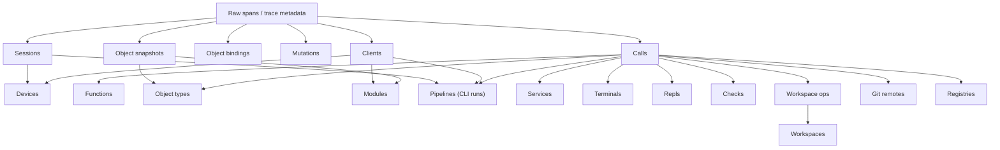
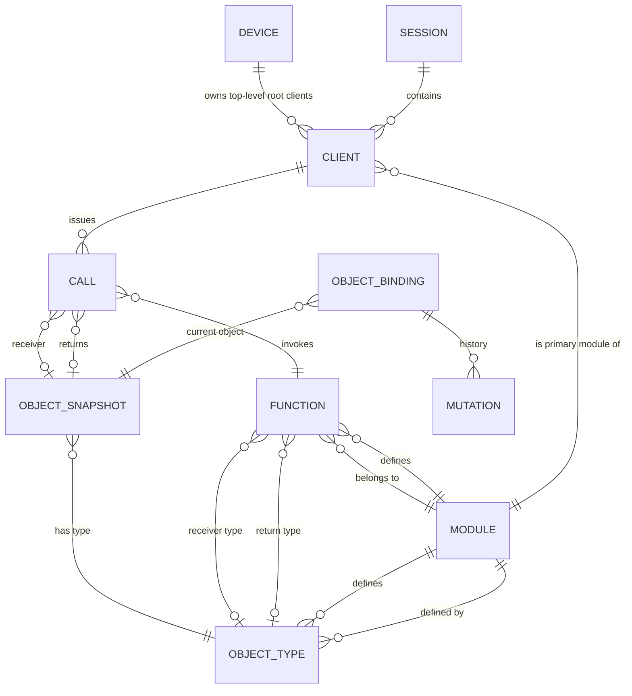
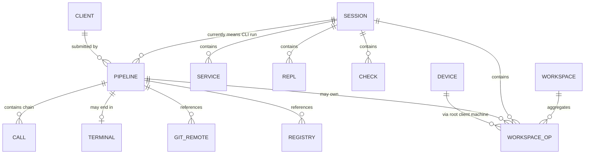

# ODAG Data Model

This document describes the current ODAG model as it exists in code today, not an idealized future model.

The intent is to keep three things explicit:

1. What is primary telemetry versus derived projection.
2. What entity identity actually means.
3. Which relationships should exist as links in the UI.

## Layering

ODAG has three layers:

1. Primary telemetry
   Source of truth: raw OTel spans plus stored trace metadata.
2. Canonical derived entities
   Stable, rebuildable entities extracted from telemetry and intended to model Dagger concepts directly.
3. Workflow projections
   Higher-level aggregates meant to help users navigate a trace from a human workflow point of view.

## Canonical Entity Graph

The most coherent current graph is:

These are the entities that should anchor the UX.

## Workflow Projections

These are useful, but they are projections over the canonical graph, not separate primitives:

## Entity Catalog

### Primary Telemetry

| Entity | Identity | Source | Notes |
| --- | --- | --- | --- |
| `Span` | `traceID/spanID` | stored OTel span | Raw substrate. Authoritative. |
| `Trace` | `traceID` | stored trace meta + spans | Not a first-class UI entity right now. |

### Canonical Derived Entities

| Entity | Identity | Derived from | Notes |
| --- | --- | --- | --- |
| `Session` | session ID | execution scope | Root execution grouping. |
| `Client` | client ID | `connect` spans + scope index | Includes nested clients when telemetry exists. |
| `Device` | machine ID | top-level clients only | Intentional projection, not span-level scope. |
| `Call` | `traceID/spanID` | mutation events | Canonical function invocation row. |
| `Object snapshot` | DAGQL ID | object state history | Immutable content-addressed snapshot. |
| `Object binding` | `traceID/objectID` | object history | Mutable handle history within a trace. |
| `Mutation` | event/span identity | projection events | Delta between bindings/snapshots. |
| `Function` | `moduleRef + callName` | calls + Function snapshots | `core` is treated as a module. |
| `Object type` | `moduleRef + typeName` | snapshots + type metadata | Also treats `core` as a module. |
| `Module` | module ref | module-load/module-source evidence | Aggregate identity, not a single object snapshot. |

### Workflow Projections

| Entity | Identity | Derived from | Notes |
| --- | --- | --- | --- |
| `Pipeline` | derived run ID | root client/session + call chain | Really a CLI run today. |
| `Service` | service object identity | service-related calls/spans | Can be container-backed or tunnel-backed. |
| `Terminal` | derived terminal ID | `Container.terminal` patterns | Projection over service/runtime behavior. |
| `Repl` | derived repl ID | repl command history | Session-oriented projection. |
| `Check` | derived check ID | check spans | Thin projection. |
| `Workspace op` | op span identity | host/export calls | Canonical host-activity fact. |
| `Workspace` | workspace root | materialized workspace ops | Inferred aggregate, currently fuzzy. |
| `Git remote` | normalized remote/ref key | git-related calls/spans | Projection of external source usage. |
| `Registry` | normalized registry/ref key | registry-related calls/spans | Projection of external registry activity. |

## Relationship Rules

These are the relationships the UI should link explicitly.

### Session

- Session -> root client
- Session -> device
- Session -> clients
- Session -> calls
- Session -> pipelines
- Session -> terminals
- Session -> services
- Session -> repls
- Session -> checks
- Session -> workspaces
- Session -> workspace ops

### Client

- Client -> session
- Client -> device
- Client -> parent client
- Client -> root client
- Client -> primary module
- Client -> calls

### Device

- Device -> top-level clients
- Device -> sessions
- Device -> pipelines
- Device -> workspaces
- Device -> workspace ops

### Call

- Call -> function
- Call -> session
- Call -> client
- Call -> device
- Call -> parent call
- Call -> receiver object snapshot
- Call -> returned object snapshot
- Call -> argument object snapshots
- Call -> return type
- Call -> module

### Object Snapshot

- Object snapshot -> object type
- Object snapshot -> producing calls
- Object snapshot -> referenced object snapshots in fields
- If `type=Module`: object snapshot -> canonical module
- If `type=Function`: object snapshot -> canonical function

### Function

- Function -> module
- Function -> receiver type
- Function -> return type
- Function -> calls
- Function -> function object snapshots

### Object Type

- Object type -> owning module
- Object type -> snapshots
- Object type -> functions that return it
- Object type -> functions that receive it

### Module

- Module -> functions
- Module -> object types
- Module -> module object snapshots
- Module -> prelude/load calls
- Module -> clients whose primary module is this module

### Pipeline

- Pipeline -> session
- Pipeline -> submitting client
- Pipeline -> device
- Pipeline -> call chain
- Pipeline -> output object snapshot
- Pipeline -> module

### Workspace

- Workspace -> workspace ops
- Workspace -> sessions
- Workspace -> pipelines
- Workspace -> devices

### Workspace Op

- Workspace op -> workspace
- Workspace op -> session
- Workspace op -> pipeline
- Workspace op -> device
- Workspace op -> receiver object snapshot
- Workspace op -> output object snapshot

## Current Blurriness

### 1. `Pipeline` is overloaded

Current behavior:

- the entity is implemented as `v2CLIRun`
- it is derived from command-bearing clients, top-level call chains, and follow-up spans
- it is often closer to "one CLI run" than "one pipeline"

Recommendation:

- rename the user-facing concept to `Run` or `CLI Run`
- reserve `pipeline` for a future concept only if it means something more precise than "a submitted command execution"

### 2. `Workspace` is still heuristic

Current behavior:

- workspace roots are inferred from module source roots and workspace ops
- host operations are authoritative evidence
- the aggregate identity can still get fuzzy when only relative paths exist

Recommendation:

- treat `Workspace op` as the canonical fact
- treat `Workspace` as an aggregate rooted by stable absolute module/workdir anchors only
- do not surface raw relative fallbacks as primary workspace identities

### 3. `Device` is not true execution scope

Current behavior:

- devices are built only from top-level client machine IDs
- nested clients may inherit the same session but have no device of their own

Recommendation:

- keep this model, but document it explicitly in the UI
- device is a host-origin projection, not a span-wide scope primitive

### 4. `Module` versus `Module` object snapshots

Current behavior:

- module pages are aggregates keyed by ref
- module object pages are immutable snapshots keyed by DAGQL ID

Recommendation:

- keep both
- always cross-link them
- never redirect module object pages to module aggregate pages

### 5. `Object type` and `Function` ownership should always include `core`

Current behavior:

- this is already mostly true in derivation
- the UI still treats `core` more like a label than a first-class module page

Recommendation:

- synthesize a first-class `core` module row so `Module:1-N:Function` and `Module:1-N:ObjectType` are always literal in the UI

## Simplification Recommendations

The detail pages should stay close to the canonical graph.

Keep:

- identity
- a compact recap
- direct relationships as links
- one or two evidence tables

Avoid by default:

- trace sets
- session sets
- client sets
- opaque internal IDs when there is already a better linked entity
- raw span IDs unless the page is specifically about spans

A good page should answer:

1. What entity is this?
2. What does it relate to?
3. What concrete evidence rows can I inspect next?

## UI Coverage Checklist

Every relationship above should exist as a link in at least one page or table cell.

At the time of writing, the main gaps to keep checking are:

- session/client scoping on large datasets where the unscoped cache truncates
- receiver/return-type links on function and call pages
- module/client links beyond summary pills
- workspace/device links where ownership is inferred rather than explicit
