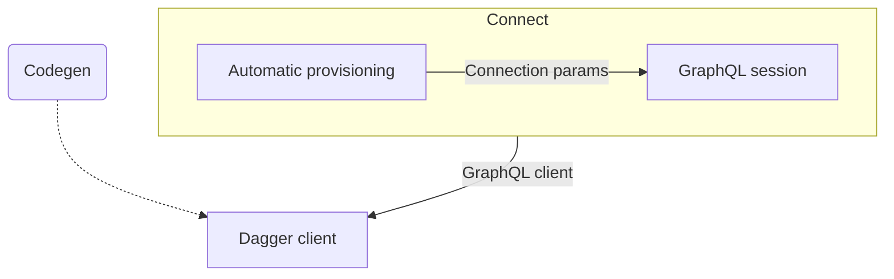
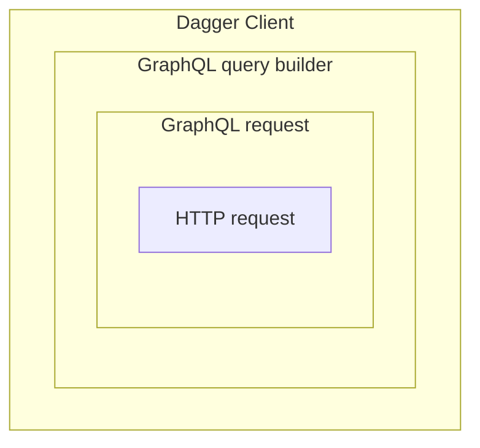

# SDK Contribution Guide

This document serves as a guide for creating a new Dagger SDK, but also to help maintain consistency between existing ones.

> **Warning**
> This is a work in progress. You will see missing or incomplete information.

<details><summary>Table of Contents</summary>

- [FAQ](#faq)
- [Design guidelines](#design-guidelines)
- [Development environment](#development-environment)
- [Architecture](#architecture)
- [Connect](#connect)
- [Dagger client](#dagger-client)
- [Codegen](#codegen)
- [Automatic provisioning](#automatic-provisioning)
- [Helpers](#helpers)
- [Tests](#tests)
- [CI](#ci)
- [Documentation](#documentation)

</details>

## FAQ

### What is a Dagger SDK?

A Dagger SDK contains everything to develop CI/CD pipelines for a particular platform. This may include:

* A client library
* Examples
* Documentation
* Platform-specific tooling

Dagger SDKs are open-source, and developed jointly with the community. Some SDKs are mature enough to be considered stable, while others are experimental. Our goal is to eventually offer stable and feature-complete SDKs for all platforms.

### Do I need a Dagger SDK to program Dagger?

No. Dagger SDKs are an optional convenience for programming the Dagger Engine. Under the hood, all SDKs make queries to the same [GraphQL API](https://docs.dagger.io/api). It's perfectly OK to write GraphQL clients in code directly, either using your platform's [GraphQL client implementation](https://graphql.org/code/), or even a raw HTTP client. You will still have access to all features of the Dagger Engine; the only difference will be a less polished developer experience.

### Can I develop my own SDK?

Yes, with a little effort you can develop your own SDK. If you think others may benefit from it, please consider contributing it as an experimental SDK, so that others can test it and help improve it.

### What's the difference between an experimental and stable SDK?

<details><summary>TODO: tbd</summary>

Notes:
- feature parity
- maturity and adoption
- documentation and test coverage

</details>

### How do I contribute a new SDK?

Follow our general [contribution guidelines](../CONTRIBUTING.md) and submit a pull request for adding your SDK to an  `sdk/<name>` directory in the main [dagger/dagger](https://github.com/dagger/dagger) repo.

## Design guidelines

General guidelines when making technical decisions:
- Aim for the best developer experience, in a way that is idiomatic to the language. It should feel as natural as possible to its users.
- Try to keep consistency with the stable SDKs, unless where it contradicts with the previous point which is more important.
- Try to keep the SDK as thin as possible to reduce the maintenance burden, taking advantage of popular third-party libraries especially if well tested.

## Development environment

There should be a `README.md` file with instructions for installation, usage and for setting up the local environment with everything needed to develop. This may include how to run tests, code linting and code generation (codegen).

## Architecture

**Note:** It is assumed you are familiar with general Dagger essentials and architecture. If not, read the [documentation](https://docs.dagger.io) and the [operator’s manual](../core/docs/d7yxc-operator_manual.md). This is only concerned with the internals of an SDK.

These are the main components of an SDK:



- **Codegen:** The process of pre-generating from the API schema the code for the Dagger client.
- **Connect:** Function to establish a connection to the API and return an instance of the Dagger client with access to the initialized GraphQL session.
    - **Automatic provisioning:** Convenience for establishing a session to the Dagger engine if no existing session is detected. This is what starts the GraphQL server.
    - **GraphQL session:** For establishing a GraphQL client connection to the GraphQL server, using the parameters provided during provisioning.
- **Dagger client:** A set of definitions (e.g., functions, classes…) that make it simple to talk to the Dagger API. When referenced in code (e.g., as returned by *Connect*), it usually refers to an instance of the root type that corresponds to *Query* in the API.

## Connect

The first step is to be able to connect to the API.

As a general convention there’s a `dagger.Connect()` function that receives any configuration from the user, and returns a client instance:

```python
# Pseudo: depends on what's most idiomatic for the language
client = dagger.Connect(dagger.Config())
```

**Note:** Closing the GraphQL client session must be handled gracefully.

Configuration options can be added later when needed. They’re used mostly for passing arguments to the engine session during provisioning, or for establishing the GraphQL client connection (e.g., timeout values).

### Engine provisioning

When an SDK calls `dagger.Connect`, there are two possible paths:
- Basic (e.g., by `dagger run`)
- Automatic provisioning

This is explained in more detail in the [Dagger Session Interface (DSI)](../core/docs/d7yxc-operator_manual.md#dagger-session-interface-dsi) of the *Operator Manual*.

If you’re starting a new SDK, provision the engine session manually by wrapping your script with `dagger run`. This will provide the connection parameters you need as environment variables:

```console
❯ dagger run env | grep DAGGER
DAGGER_SESSION_PORT=57511
DAGGER_SESSION_TOKEN=67535545-8a3c-4f79-91b1-c532c45ba2ec
```

You can expand on this later, when building the [automatic provisioning](#automatic-provisioning).

### GraphQL session

Connect to the server at `http://127.0.0.1:$DAGGER_SESSION_PORT/query`, using [basic authentication](https://developer.mozilla.org/en-US/docs/Web/HTTP/Authentication#basic_authentication_scheme), with the session token as the username and empty password. Run `dagger run -h` for more information, including an example using `curl`.

Just return the GraphQL client instance when starting. You’ll build the more polished client next.

## Dagger client

Start by designing a proof-of-concept with a few examples for the client.

Remember to follow the language’s naming conventions and make idiomatic choices, for example when deciding how to handle default values in field parameters. Look for the current stable SDKs for inspiration as they deal with these in different ways.

### Abstraction layers

The Dagger client is an abstraction built on layers. Its purpose is to make it simple to make GraphQL queries in a type-safe way (if possible), to provide a better experience while developing in IDEs.



At its core, you need to make HTTP requests to the GraphQL endpoint. There’s libraries that make this a little bit easier by making it simple to make a GraphQL request and parse the response from a string that contains the GraphQL query.

<details><summary>Example: GraphQL request</summary>

```python
result = client.execute(
    gql("""
        query {
          container {
            from(address: "python") {
              withExec(args: ["python", "-V"]) {
                stdout
              }
            }
          }
        }
        """
    )
)
print(result['container']['from']['withExec']['stdout'])
```

</details>

Developing with these query strings isn’t fun. It’s much better to build the query string dynamically by using a query [builder](https://en.wikipedia.org/wiki/Builder_pattern). Both Go and TypeScript SDKs have implemented their own because there didn’t seem to have a good library for it, while Python didn’t have to because Python’s GraphQL client library has a good enough feature to [compose queries dynamically](https://gql.readthedocs.io/en/stable/advanced/dsl_module.html).

<details><summary>Example: GraphQL query builder</summary>

```python
ds = DSLSchema(session.client.schema)
query = dsl_gql(
    DSLQuery(
        ds.Query.container.select(
            getattr(ds.Container, "from")(address="python").select(
                ds.Container.with_exec(args=["python", "-V"]).select(
                    ds.Container.stdout
                )
            )
        )
))
result = session.execute(query)
print(result['container']['from']['withExec']['stdout'])
```

</details>

However, generic query builders, being dynamic, still require passing around strings for type, field and argument names, which are easy to mistype. Ideally it would be type-safe to avoid typos and provide autocompletion and documentation in the IDE.

That’s why we decided to generate a custom built client that is typed (if possible) and hides away more boilerplate and verbosity.

<details><summary>Example: Dagger client</summary>

```python
result = await (
    client.container()
    .from_("python")
    .with_exec(["python", "-V"])
    .stdout()
)
print(result)
```

</details>

<details><summary>TODO</summary>

Notes:
- Chainable API
  - Extract result from response
  - Immutable query builder
  - Laziness
    - Lazy when building query
    - Execute when a value is needed (leaf)
    - Make sure DX is clear which is which (rule of thumb, e.g., `await`)
- Objects → ID
    - Pass around objects, not IDs
    - Do the conversion internally when executing the query
- Convenient imports
  - `dagger.Container` (type)
  - `dagger.Client` (i.e., `Query` type)
  - `client.Container()` (instance)
- Error/Exception types
- Deprecation warnings

</details>

## Codegen

When the POC is done, it’s time to build the automation to re-generate the full client, directly from the API.

This code generation (codegen for short) is done during development. Whenever there’s a change in the API schema, SDKs must regenerate their clients. These changes will then be available to users in the next release, both in the API and in the SDK at the same time.

<details><summary>TODO</summary>

Notes:
- Introspection query
  - Own language?
  - Dagger’s Go lib
  - [GraphQL Code Generator](https://the-guild.dev/graphql/codegen)
- Sort for reproducible generation
  - Types and object fields
  - Not field parameters (use API order), unless grouping required vs default arguments
- Handle types (by order)
  - Custom scalars
  - Enums
  - Input objects
  - Object types
- Docstrings
  - Get all documentation from introspection, including field parameters
  - Rename deprecated fields with language’s convention (backticks)
  - Maybe document that `ID` fields are “lazily” evaluated, a request is made but no operation is actually run in the engine runner
- `.gitattributes` for generated files

</details>

## Automatic provisioning

The “automatic provisioning” feature is a convenience to enable **easier onboarding** by not requiring the user to download the `dagger` CLI first. A diagram and a description of the steps involved is available at [DSI Advanced - Automatic Provisioning](../core/docs/d7yxc-operator_manual.md#dsi-advanced---automatic-provisioning) in the *Operator Manual*.

> **Note**
> As we’re working towards [standardizing project entrypoints](https://github.com/dagger/dagger/issues/4414) and shift to always use the `dagger` CLI as the common way to interact with Dagger, the automatic provisioning will possibly become deprecated eventually.

<details><summary>TODO</summary>

Notes:
- Config
  - Stream engine logs to a file (e.g., `log_output=stderr`)
  - Workdir & config path
- Log progress
- Supported engine version
- Session start (i.e., `dagger session`)
  - `--workdir` & `--config-path` (only if set)
  - Add labels
    - `--label dagger.io/sdk.name:%s`
    - `--label dagger.io/sdk.version:%s`
  - Print error message to user during provisioning
    - Duplicated stream from session’s stderr
      - In-memory buffer for user
      - Write back to log_output
  - Handle “text file busy” error
  - Return connection params from stdout
  - Handle termination gracefully
  - Handle timeouts and retries

</details>

## Helpers

We try to implement features in the API as much as possible so there’s no extra work bringing the SDKs to parity and consistency, but sometimes it’s not possible or viable. Some features make more sense as an SDK helper.

The following helpers have been considered worthwhile to include:
- [`With()` convenience](https://github.com/dagger/dagger/issues/3885)

## Tests

Add tests as you develop. Increasing coverage is usually harder later.

When the codegen component is done, an easy win is to port the [integration tests](./go/client_test.go) from the Go SDK. Replicating those exact pipelines will allow a boost in performance when running all SDK tests, by getting cached results from the API.

## CI

Our CI code is implemented with the Go SDK and run from Github Actions.

Implement the necessary functions in [`dev/`](../dev/) and run locally with the [`./hack`](https://github.com/dagger/dagger/tree/main/hack) scripts (e.g., `./hack/make sdk:<name>:test`). Start with tests, linting and codegen.

Add their corresponding jobs to [`.github/workflows/`](../.github/workflows/) for running in CI.

Later on, coordinate with the Dagger team for publicly releasing the SDK library in a package repository. Our release process is documented in [`RELEASING.md`](../RELEASING.md) and needs to be updated accordingly.

## Documentation

Add documentation to `sdk/<name>/docs`, including the reference.

As the SDK progresses from experimental to stable, more and more of the documentation should be moved to the root `docs/` directory for publishing in the https://docs.dagger.io website. The reference documentation can be published elsewhere if it’s easier. The Dagger team may reach out to coordinate on this.

A good start is to create similar “Installation” and “Get Started” guides. Then help port code examples in [Quickstart](https://docs.dagger.io/648215/quickstart) and [Guides](https://docs.dagger.io/278912/guides).
