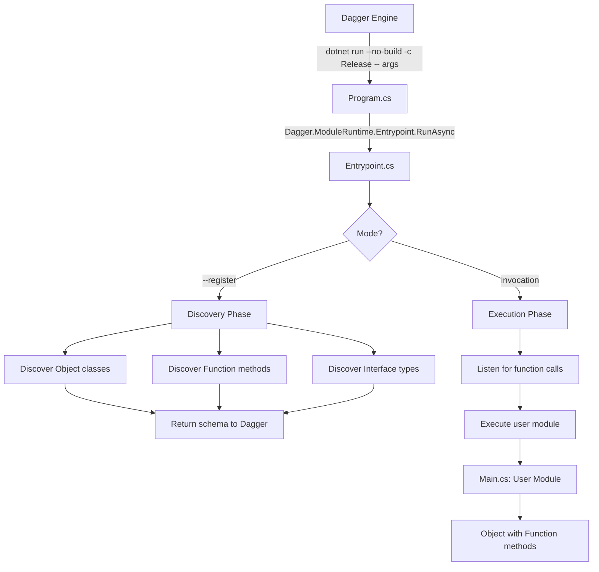

# C# SDK Architecture

## Module Structure

When a user creates a C# Dagger module, they get this structure:

```bash
my-module/
├── Main.cs                  # User's module class
├── Program.cs               # Bootstrap entrypoint (from template)
├── MyModule.csproj          # Project file (named after module in PascalCase)
├── dagger.json              # Module metadata (name: "my-module")
└── sdk/                     # Generated SDK source code (auto-generated, do not edit)
    ├── Dagger.SDK.props     # MSBuild properties imported by user's .csproj
    ├── Dagger.SDK.targets   # MSBuild targets for SDK compilation
    ├── Dagger.SDK.g.cs      # Generated Dagger API from introspection
    ├── Client.cs            # SDK source files
    ├── QueryExecutor.cs
    ├── GraphQL/
    ├── Attributes/
    ├── Module/              # CRITICAL: Module runtime infrastructure
    │   ├── ModuleRuntime.cs # Handles registration and function execution
    │   └── ModuleTypeInfo.cs
    ├── analyzers/
    │   └── dotnet/cs/
    │       └── Dagger.SDK.Analyzers.dll # Pre-built analyzer for IDE support
    |       |-- Dagger.SDK.CodeFixes.dll # Pre-built code fixes DLL 
    └── ... (all SDK source files)
```

**Project File Naming:** The `.csproj` file is automatically named to match your module name in PascalCase. For example, if your `dagger.json` has `"name": "my-awesome-module"`, the project file will be `MyAwesomeModule.csproj`. This creates a cohesive naming convention where the project file clearly identifies ownership.

**Important:** The `sdk/` folder is automatically generated by `dagger develop`. Do not manually edit files in this directory—they will be overwritten.

## Execution Flow



## Key Files

### Template Files (Copied to User's Module)

**Program.cs** - Simple bootstrap, calls into SDK:

```csharp
return await Dagger.ModuleRuntime.Entrypoint.RunAsync(args);
```

**Main.cs** - User's module definition:

```csharp
[Object]
public class DaggerModule
{
    [Function]
    public Container ContainerEcho(string stringArg) { ... }
}
```

**DaggerModule.csproj** - Imports MSBuild files from SDK:

```xml
<Project Sdk="Microsoft.NET.Sdk">
  <Import Project="sdk/Dagger.SDK.props" Condition="Exists('sdk/Dagger.SDK.props')" />
  <PropertyGroup>
    <OutputType>Exe</OutputType>
    <TargetFramework>net10.0</TargetFramework>
  </PropertyGroup>
  <Import Project="sdk/Dagger.SDK.targets" Condition="Exists('sdk/Dagger.SDK.targets')" />
</Project>
<!-- SDK .props/.targets handle compilation of sdk/**/*.cs files -->

### SDK Files (Generated and Copied to User's sdk/ Folder)

**Dagger.SDK.g.cs** - Generated Dagger API from GraphQL introspection:

- All Dagger types (Container, Directory, File, etc.)
- Type-safe query methods
- Fluent API with IntelliSense

**Entrypoint.cs** (Module/) - The runtime logic:

- Module discovery via reflection ([Object] attributes)
- Schema generation for `--register`
- Function execution for normal mode

## SDK Distribution (Source Vendoring)

The C# SDK uses **source vendoring** (similar to Python SDK):

1. **Full SDK source** is copied to `<module>/sdk/`
2. **Generated API** (`Dagger.SDK.g.cs`) is injected from GraphQL introspection
3. **MSBuild files** (`Dagger.SDK.props` and `Dagger.SDK.targets`) handle SDK compilation
4. **Analyzer DLLs** are pre-built and placed at `sdk/analyzers/dotnet/cs/`
5. **Module/ directory** is included (contains critical runtime infrastructure)

User modules compile against SDK source via MSBuild imports:

```xml
<Import Project="sdk/Dagger.SDK.props" Condition="Exists('sdk/Dagger.SDK.props')" />
<!-- User's project settings -->
<Import Project="sdk/Dagger.SDK.targets" Condition="Exists('sdk/Dagger.SDK.targets')" />
<!-- .targets file handles <Compile Include="sdk/**/*.cs" /> -->

### Why Source Vendoring?

**Advantages:**

- ✅ Simple generated code integration (just a file, no DLL rebuild)
- ✅ Users can debug into SDK source
- ✅ Version isolation per module (each module has its own SDK copy)
- ✅ Matches proven Python SDK pattern
- ✅ Works with `dagger develop` regeneration flow

This ensures user modules build successfully without broken references.

## Comparison with Other SDKs

| SDK        | User's Entrypoint | Calls Into  | SDK Runtime         |
|------------|-------------------|-------------|---------------------|
| Python     | `runtime.py`      | `→`         | `dagger.mod.cli.app()` |
| PHP        | `entrypoint.php`  | `→`         | `EntrypointCommand` |
| TypeScript | (implicit)        | `→`         | `entrypoint()`      |
| **C#**     | **`Program.cs`**  | **`→`**     | **`Entrypoint.RunAsync()`** |

All SDKs follow the same pattern:

1. User gets a simple bootstrap file in their module
2. Bootstrap calls into the SDK's runtime implementation
3. SDK runtime handles discovery, registration, and execution
