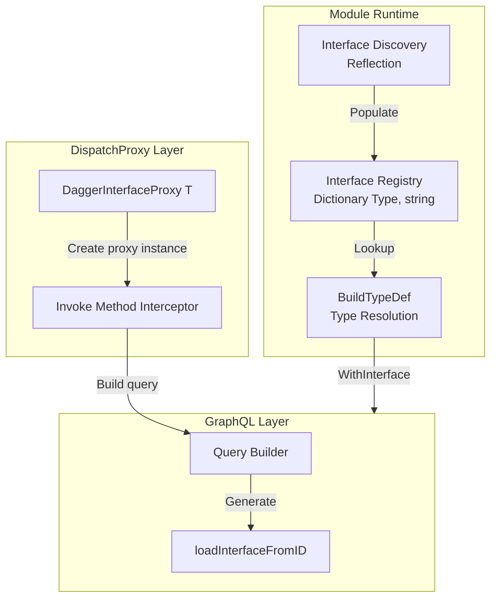
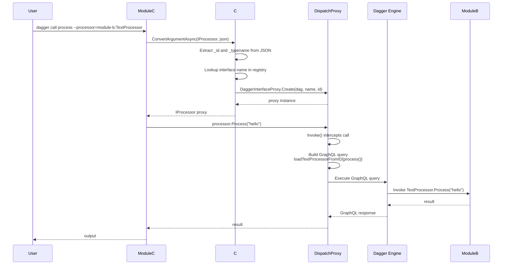

# Interface Support in the C# SDK

This document explains how the C# SDK implements interface support for cross-module polymorphism in Dagger.

## Overview

Dagger interfaces allow modules to define contracts that other modules can implement, enabling polymorphic behavior across module boundaries. The C# SDK implements this using .NET's built-in reflection and `DispatchProxy` APIs, without requiring code generation.

**Key characteristics:**

- **Structural typing**: Implementations don't explicitly declare they implement an interface—matching method signatures is sufficient
- **Runtime proxies**: Cross-module interface calls use dynamically generated proxies
- **Reflection-based discovery**: Interface methods and their signatures are discovered at runtime

---

## Architecture



### 1. Interface Registry

The `InterfaceTypeRegistry` is a static dictionary that maps CLR interface types to their GraphQL names:

```csharp
private static readonly Dictionary<Type, string> InterfaceTypeRegistry = new();
```

**Purpose:**

- Maintains a mapping between C# `Type` objects and their registered Dagger interface names
- Used during both registration and invocation to resolve interface references
- Enables proper GraphQL type name generation for interface parameters and return types

**Lifecycle:**

- **Registration Phase**: Populated when interfaces are discovered and registered with the Dagger engine
- **Invocation Phase**: Re-populated at the start of each invocation (since static state doesn't persist across container boundaries)

**Example registry entries:**

```csharp
InterfaceTypeRegistry[typeof(IProcessor)] = "Processor"  // With explicit [Interface(Name = "Processor")]
InterfaceTypeRegistry[typeof(ICustomInterface)] = "ICustomInterface"  // Uses type name as-is
InterfaceTypeRegistry[typeof(ITextProcessor)] = "InterfaceExampleTextProcessor"  // Cross-module
```

**Name transformations:**

- Local interfaces use the C# interface name as-is (e.g., `IProcessor` → `IProcessor`)
- Custom names must be explicitly defined with `[Interface(Name = "...")]` attribute
- Cross-module interfaces include module prefix: `<ModuleName><InterfaceName>`

---

### 2. Interface Discovery and Registration

During the `--register` phase, the runtime discovers interfaces marked with `[Interface]` attributes:

**Discovery process** (`BuildModuleTypeInfos` in Entrypoint.cs):

```csharp
var interfaceAttr = type.GetCustomAttribute<InterfaceAttribute>();
if (interfaceAttr is not null && type.IsInterface)
{
    // Use the name from InterfaceAttribute or default to the type name
    var interfaceName = interfaceAttr.Name ?? type.Name;
    
    var interfaceInfo = new InterfaceTypeInfo
    {
        Name = interfaceName,
        Description = interfaceAttr.Description,
        ClrType = type,
    };
    
    // Discover methods marked with [Function]
    foreach (var method in type.GetMethods(BindingFlags.Instance | BindingFlags.Public))
    {
        var functionAttr = method.GetCustomAttribute<FunctionAttribute>();
        if (functionAttr is not null)
        {
            // Add function metadata...
        }
    }
}
```

**Registration with Dagger** (`HandleRegistrationAsync`):

```csharp
// Pre-populate registry before processing (allows self-references)
foreach (var interfaceInfo in interfaceInfos)
{
    InterfaceTypeRegistry[interfaceInfo.ClrType] = interfaceInfo.Name;
}

// Register each interface with the Dagger engine
foreach (var interfaceInfo in interfaceInfos)
{
    var typeDef = dag.TypeDef()
        .WithInterface(interfaceInfo.Name, interfaceInfo.Description);
    
    // Register each function in the interface
    foreach (var function in interfaceInfo.Functions)
    {
        var returnTypeDef = BuildTypeDef(dag, function.ReturnType);
        var functionDef = dag.Function(function.Name, returnTypeDef);
        
        // Add parameters...
        typeDef = typeDef.WithFunction(functionDef);
    }
    
    module = module.WithInterface(typeDef);
}
```

**Current limitation:** Interfaces only support methods (functions), not properties (fields). This is a limitation in Dagger's GraphQL implementation—`InterfaceTypeDef` only has `WithFunction`, not `WithField`.

---

### 3. Structural Typing (Method Signature Matching)

Unlike traditional C# interfaces, Dagger uses **structural typing**:

```csharp
// Module A defines an interface
[Interface]
public interface IProcessor
{
    [Function]
    Task<string> Process(string input);
}

// Module B provides an implementation
// Note: No explicit "implements IProcessor" declaration
[Object]
public class TextProcessor
{
    [Function]
    public Task<string> Process(string input)  // Matches signature
    {
        return Task.FromResult(input.ToUpperInvariant());
    }
}
```

**Compatibility is determined by:**

1. **Method name** must match (case-insensitive in GraphQL)
2. **Parameter types and names** must match
3. **Return type** must match

The C# implementation doesn't inherit from the interface—Dagger validates compatibility at runtime through method signature inspection.

---

### 4. DispatchProxy-Based Runtime Proxies

When an interface parameter is passed to a module function, the SDK creates a **dynamic proxy** using .NET's `DispatchProxy`:

**DaggerInterfaceProxy implementation** (DaggerInterfaceProxy.cs):

```csharp
internal class DaggerInterfaceProxy<T> : DispatchProxy
    where T : class
{
    private Query? _dag;           // Dagger query context
    private string? _interfaceName; // GraphQL type name (e.g., "Processor")
    private string? _id;            // Interface instance ID

    public static T Create(Query dag, string interfaceName, string id)
    {
        var proxy = Create<T, DaggerInterfaceProxy<T>>() as DaggerInterfaceProxy<T>;
        proxy._dag = dag;
        proxy._interfaceName = interfaceName;
        proxy._id = id;
        return proxy as T;
    }

    protected override object? Invoke(MethodInfo? targetMethod, object?[]? args)
    {
        // Special case: Id() method returns the interface ID directly
        if (targetMethod.Name.Equals("Id", StringComparison.OrdinalIgnoreCase))
        {
            return Task.FromResult(_id);
        }

        // Build GraphQL query: loadProcessorFromID(id: "...") { methodName(args...) }
        var loadMethodName = $"load{_interfaceName}FromID";
        var queryBuilder = _dag.QueryBuilder
            .Select(loadMethodName, [new Argument("id", new StringValue(_id))])
            .Select(methodName, methodArgs);

        // Execute query and return result
        return QueryExecutor.ExecuteAsync(resultType, _dag.GraphQLClient, queryBuilder);
    }
}
```

**Key features:**

- **Lazy execution**: Method calls are translated to GraphQL queries, not executed immediately
- **Fluent chaining**: Object return types allow method chaining
- **Type safety**: Strongly typed proxies ensure compile-time correctness

---

### 5. Cross-Module Interface Invocation Flow

**Example scenario:**

- Module A defines `IProcessor` interface
- Module B implements `TextProcessor` (matches `IProcessor` signature)
- Module C calls a function accepting `IProcessor` and passes `TextProcessor`



**Step-by-step execution:**

#### Step 1: Consumer calls with interface parameter

```bash
dagger call -m module-c process --processor="module-b:TextProcessor"
```

#### Step 2: Interface parameter conversion (ConvertArgumentAsync)

```csharp
private static async Task<object?> ConvertArgumentAsync(
    Query dag, 
    Type targetType, 
    JsonElement value)
{
    if (targetType.IsInterface)
    {
        var id = value.GetProperty("_id").GetString();
        var typename = value.TryGetProperty("_typename", out var tn) 
            ? tn.GetString() 
            : null;

        // Determine interface name:
        // - Cross-module: Use typename from JSON (includes module prefix)
        // - Same-module: Use InterfaceTypeRegistry
        string interfaceName;
        if (!string.IsNullOrWhiteSpace(typename))
        {
            interfaceName = typename;  // "TextProcessorProcessor"
        }
        else if (InterfaceTypeRegistry.TryGetValue(targetType, out var registeredName))
        {
            interfaceName = registeredName;  // "Processor"
        }
        else
        {
            throw new InvalidOperationException($"Interface '{targetType}' not found in registry");
        }

        // Create dynamic proxy
        return DaggerInterfaceProxy<IProcessor>.Create(dag, interfaceName, id);
    }
}
```

#### Step 3: Method invocation on proxy

```csharp
// User code in Module C
var result = await processor.Process("hello");
```

Proxy intercepts the call and generates GraphQL:

```graphql
query {
  loadTextProcessorProcessorFromID(id: "...") {
    process(input: "hello")
  }
}
```

#### Step 4: Dagger engine routes to Module B

The engine:

1. Deserializes the ID to locate the `TextProcessor` instance
2. Invokes `TextProcessor.Process("hello")` in Module B's runtime
3. Returns the result to Module C

---

## Type Name Resolution

Interface type names follow different conventions depending on context:

### Local (Same-Module) Interfaces

```csharp
[Interface]
public interface IProcessor { }

// Registry: IProcessor -> "Processor"
// GraphQL: Processor
// Load method: loadProcessorFromID
```

### Cross-Module Interfaces

```csharp
// Module: "interface-example"
// Interface: "Processor"

// Registry entry for external module reference:
// Type: IProcessor
// Name: "InterfaceExampleProcessor"  (module prefix + interface name)

// GraphQL: InterfaceExampleProcessor
// Load method: loadInterfaceExampleProcessorFromID
```

**Naming logic** (from Entrypoint.cs):

```csharp
// Determine interface name from JSON payload
if (!string.IsNullOrWhiteSpace(typename))
{
    interfaceName = typename;  // Cross-module (has module prefix)
}
else if (InterfaceTypeRegistry.TryGetValue(interfaceType, out var registeredName))
{
    interfaceName = registeredName;  // Same-module (local name)
}
```

---

## BuildTypeDef: Interface Type References

When building GraphQL type definitions, interface types are resolved using the registry:

```csharp
private static (TypeDef, bool) BuildTypeDef(Query dag, Type clrType, ...)
{
    // Check if type is an interface
    if (clrType.IsInterface && InterfaceTypeRegistry.TryGetValue(clrType, out var registeredName))
    {
        // Use registered interface name
        return (dag.TypeDef().WithInterface(registeredName), false);
    }
    
    // Handle other types...
}
```

This ensures that:

- Function parameters referencing interfaces use the correct GraphQL type name
- Return types referencing interfaces are properly resolved
- Self-referential interfaces work (e.g., `IBuilder` with methods returning `IBuilder`)

---

## Limitations and Future Considerations

### Current Limitations

1. **No interface properties/fields**: Interfaces can only declare methods marked with `[Function]`, not properties marked with `[Function]`
   - **Reason**: Dagger's `InterfaceTypeDef` doesn't support fields yet
   - **Workaround**: Use getter methods instead of properties

2. **Structural typing only**: C# implementations don't explicitly declare interface implementation
   - **Reason**: Dagger validates compatibility through GraphQL schema matching
   - **Impact**: No compile-time interface validation—errors appear at runtime

3. **Numeric type precision**: C# numeric types are mapped to GraphQL's Int and Float types
   - `int`, `short`, `byte`, `long` → `IntValue` (GraphQL Int - 32-bit signed integer)
   - `float`, `double`, `decimal` → `FloatValue` (GraphQL Float - double-precision floating point)
   - **Note**: `long` values may overflow if they exceed 32-bit range; `decimal` precision may be lost when converting to `float`
   - **Impact**: Use appropriate types based on expected value ranges

### Future Enhancements

**Interface field support**: When Dagger extends `InterfaceTypeDef` to support fields, the C# SDK can discover properties:

```csharp
foreach (var property in type.GetProperties(BindingFlags.Instance | BindingFlags.Public))
{
    var fieldAttr = property.GetCustomAttribute<FunctionAttribute>();
    if (fieldAttr is not null)
    {
        typeDef = typeDef.WithField(property.Name, BuildTypeDef(dag, property.PropertyType));
    }
}
```

**Compile-time validation**: Roslyn analyzers could validate that implementations match interface contracts:

```csharp
// Analyzer rule: Validate method signatures match interface
[DiagnosticAnalyzer(LanguageNames.CSharp)]
public class InterfaceImplementationAnalyzer : DiagnosticAnalyzer
{
    // Check that [Object] classes with methods matching [Interface] signatures
    // have compatible parameter types and return types
}
```

**Custom module object support**: Extend `DaggerInterfaceProxy.Invoke` to handle custom module objects as arguments (not just Dagger core types):

```csharp
// Currently supported via IId<Scalar>:
Directory dir = ...;
iface.WithDirectory(dir); // ✅ Works

// Not yet supported (would need IId<T> check):
CustomModuleObject obj = ...;
iface.WithCustomObject(obj); // ❌ Would throw NotSupportedException
```

**Note**: All Dagger core types (Container, Directory, File, Secret, Service, etc.) are fully supported because they implement `IId<Scalar>`. Lists and other complex types are handled by the generated client code, not the proxy.

---

## Debugging Interface Issues

### Enable Debug Logging

```csharp
// In Program.cs, before RunAsync
using Microsoft.Extensions.Logging;

var loggerFactory = LoggerFactory.Create(builder => 
    builder.AddConsole().SetMinimumLevel(LogLevel.Debug));

Entrypoint.ConfigureLogging(loggerFactory.CreateLogger("Dagger.Module"));
await Entrypoint.RunAsync(args);
```

Run with:

```bash
dagger call --progress=plain <function>
```

### Common Debug Output

**Interface registration:**

```
Registering interface: Name='Processor', ClrType=IProcessor
Registry[MyModule.IProcessor] = 'Processor'
```

**Interface parameter conversion:**

```
ConvertArgumentAsync: Interface parameter with typename='InterfaceExampleProcessor'
Creating dynamic proxy for interface IProcessor with id='...' and typename='InterfaceExampleProcessor'
```

**Type resolution:**

```
BuildTypeDef: Interface type MyModule.IProcessor found in registry as 'Processor'
BuildTypeDef created TypeDef.WithInterface('Processor')
```

### Troubleshooting

**Error: "Interface 'X' not found in registry"**

- **Cause**: Interface wasn't discovered during registration phase
- **Solution**: Ensure interface has `[Interface]` attribute and is in a discovered assembly

**Error: "Method signature mismatch"**

- **Cause**: Implementation method doesn't exactly match interface signature
- **Solution**: Verify parameter names, types, and return type match exactly (including `Task<T>` wrappers)

**Error: "Argument type X not yet supported in interface proxy"**

- **Cause**: Proxy doesn't have conversion logic for the argument type
- **Solution**: Use supported types (string, int, bool, IId<Scalar>) or extend `DaggerInterfaceProxy.Invoke`

---

## Related Files

- **[Entrypoint.cs](./src/Dagger.SDK/Module/Entrypoint.cs)**: Interface discovery, registration, and type resolution
- **[DaggerInterfaceProxy.cs](./src/Dagger.SDK/Module/DaggerInterfaceProxy.cs)**: Runtime proxy implementation
- **[InterfaceTypeInfo.cs](./src/Dagger.SDK/Module/InterfaceTypeInfo.cs)**: Metadata model for discovered interfaces
- **[InterfaceAttribute.cs](./src/Dagger.SDK/Attributes/InterfaceAttribute.cs)**: Attribute for marking interfaces
- **[ARCHITECTURE.md](./ARCHITECTURE.md)**: Overall SDK architecture
- **[README.md](./README.md)**: User-facing interface usage documentation

---

## Summary

The C# SDK's interface implementation:

1. **Discovers** interfaces marked with `[Interface]` using reflection
2. **Registers** them with Dagger's GraphQL schema, storing mappings in `InterfaceTypeRegistry`
3. **Resolves** interface references during type definition building via registry lookups
4. **Proxies** cross-module interface calls using `DispatchProxy` to generate GraphQL queries
5. **Validates** structural compatibility at runtime through method signature matching

This approach provides:

- ✅ Zero code generation for interface implementations
- ✅ Type-safe proxies with compile-time checking
- ✅ Seamless cross-module polymorphism
- ✅ Consistent with other Dagger SDK patterns

The implementation leverages .NET's reflection and dynamic proxy capabilities to provide a native C# experience while maintaining compatibility with Dagger's GraphQL-based module system.
