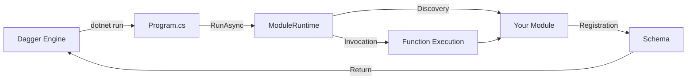

# Dagger C# SDK

[](https://www.nuget.org/packages/DaggerIO)
[](https://dotnet.microsoft.com/)
[](https://github.com/dagger/dagger/blob/main/LICENSE)

> [!WARNING]
> This SDK is experimental. Please do not use it for anything
> mission-critical. Possible issues include:
>
> - Missing features
> - Stability issues
> - Performance issues
> - Lack of polish
> - Upcoming breaking changes
> - Incomplete or out-of-date documentation

> [!IMPORTANT]
> The Dagger C# SDK requires Dagger v0.19.0 or later

A complete C# SDK for [Dagger](https://dagger.io/) with support for creating modules and building custom CI/CD pipelines.

## Philosophy

The C# SDK follows these core principles:

The SDK prioritizes **C# idioms and Microsoft conventions** over Dagger-specific patterns. When there's a choice between a Dagger convention and a C# convention, we choose C#. This means:

- **.NET conventions take precedence**: We follow [Microsoft's official coding conventions](https://learn.microsoft.com/en-us/dotnet/csharp/fundamentals/coding-style/coding-conventions) and [Framework Design Guidelines](https://learn.microsoft.com/en-us/dotnet/standard/design-guidelines/)
- **Global usings**: Modules use [`GlobalUsings.cs`](https://learn.microsoft.com/en-us/dotnet/csharp/language-reference/keywords/using-directive#global-modifier) for common imports like `System.Threading.Tasks`
- **EditorConfig**: Projects include [`.editorconfig`](https://learn.microsoft.com/en-us/dotnet/fundamentals/code-analysis/configuration-files) for consistent formatting and style rules

### Similar to Other SDKs, Where Possible

While being C#-idiomatic, the SDK maintains consistency with other Dagger SDKs:

- Module structure (`Main.cs`, `Program.cs`, `dagger.json`)
- Attribute-based API (`[Object]`, `[Function]`, `[Interface]`)
- Source vendoring pattern (SDK source copied to `sdk/` directory)

### MSBuild Integration

The SDK uses [MSBuild `.props` and `.targets` files](https://learn.microsoft.com/en-us/visualstudio/msbuild/customize-by-directory) for seamless integration:

- `sdk/Dagger.SDK.props` - Imported before user settings
- `sdk/Dagger.SDK.targets` - Imported after user settings, handles SDK compilation
- Standard MSBuild conventions for extensibility and tooling compatibility

### Interface Support

The SDK implements interface support using .NET's built-in [reflection](https://learn.microsoft.com/en-us/dotnet/framework/reflection-and-codedom/reflection) and [DispatchProxy](https://learn.microsoft.com/en-us/dotnet/api/system.reflection.dispatchproxy):

- No code generation required for interface proxies
- Runtime proxy creation for cross-module interface calls
- Structural typing via reflection-based method matching

## Features

- 🎯 **Module Development**: Create reusable Dagger modules
- 🔍 **Roslyn Analyzers**: Compile-time validation and code fixes for common issues
- 📚 **XML Docs**: XML Docs are used for dagger function docs

## What is the Dagger C# SDK?

The Dagger C# SDK provides two complementary ways to work with Dagger:

### 🔧 Module Development

Create reusable Dagger modules that can be called by other modules or from the CLI:

```bash
dagger init --sdk=csharp --name=my-module
```

Write classes with `[Object]`, functions with `[Function]` on methods and properties, and interfaces with `[Interface]` attributes.
The SDK source code is generated into your module's `sdk/` directory for version consistency.

**Use this for:** Reusable CI/CD functions, shareable build tools, extending Dagger's ecosystem

### 📦 Client Library

Use Dagger programmatically in any .NET 10 LTS application via NuGet:

```bash
dotnet add package DaggerIO
```

Build custom pipelines by importing the SDK and calling the Dagger API directly.

**Use this for:** Custom build scripts, automation tools, one-off pipeline tasks

## Learn more

- [Documentation](https://docs.dagger.io/sdk/csharp) (coming soon)
- [API Reference](https://docs.dagger.io/reference/csharp) (coming soon)
- [Source code](https://github.com/dagger/dagger/tree/main/sdk/csharp)
- [ARCHITECTURE.md](./ARCHITECTURE.md) - SDK architecture and internals
- [PUBLISHING.md](./PUBLISHING.md) - Guide for publishing the SDK
- [examples/](./examples/) - Example modules and standalone clients
- [Analyzers Documentation](./src/Dagger.SDK.Analyzers/README.md) - Roslyn analyzer features

## Requirements

- .NET 10.0 LTS or later
- [Docker](https://docs.docker.com/engine/install/), or another OCI-compatible container runtime

A compatible version of the [Dagger CLI](https://docs.dagger.io/cli) is automatically downloaded and run by the SDK for you, although it's possible to manage it manually.

---

## Getting Started

### Quick Start with Modules

Initialize a new C# module:

```bash
dagger init --sdk=csharp --name=my-module
cd my-module
```

The generated module includes:

- `Main.cs` - Your module class with Dagger functions
- `Program.cs` - Entrypoint that bootstraps the SDK runtime
- `MyModule.csproj` - Project file
- `sdk/` - Generated Dagger SDK source code

Edit `Main.cs` to add your functions:

```csharp
using Dagger;

[Object]
public class MyModule
{
    /// <summary>
    /// Returns a container that echoes a message
    /// </summary>
    [Function]
    public Container Echo(string message)
    {
        return Dag
            .Container()
            .From("alpine:latest")
            .WithExec(new[] { "echo", message });
    }
}
```

Test your module:

```bash
dagger call echo --message="Hello from Dagger!"
```

---

## 🔧 Module Development

### Attributes

The SDK uses attributes to define module structure:

- `[Object]` - Marks a class as a Dagger module object
- `[Function]` - Marks a method or property as a callable Dagger function
- `[Interface]` - Marks an interface for polymorphic behavior

### Optional Parameters and Default Values

C# supports optional parameters through two mechanisms:

**1. Nullable types** - Make parameters optional by using `?`:

```csharp
[Function]
public Container Build(string? version = null)
{
    var tag = version ?? "latest";
    return Dag.Container().From($"alpine:{tag}");
}
```

**2. Default values** - Provide default values for parameters:

```csharp
[Function]
public string Greet(string name = "World", int count = 1)
{
    return string.Join("\n", Enumerable.Repeat($"Hello, {name}!", count));
}
```

Both work with all parameter types including Dagger objects:

```csharp
[Function]
public Container WithOptionalSource(Directory? source = null)
{
    var container = Dag.Container().From("alpine:latest");
    return source != null 
        ? container.WithDirectory("/src", source)
        : container;
}
```

### Example Module

```csharp
using Dagger;

[Object]
public class MyModule
{
    /// <summary>
    /// Returns a container that echoes a message
    /// </summary>
    [Function]
    public Container Echo(string message)
    {
        return Dag
            .Container()
            .From("alpine:latest")
            .WithExec(new[] { "echo", message });
    }

    /// <summary>
    /// Builds and tests a Go project
    /// </summary>
    [Function]
    public async Task<string> BuildAndTest(Directory source)
    {
        return await Dag
            .Container()
            .From("golang:1.21")
            .WithMountedDirectory("/src", source)
            .WithWorkdir("/src")
            .WithExec(new[] { "go", "build", "./..." })
            .WithExec(new[] { "go", "test", "./..." })
            .Stdout();
    }
}
```

### Interface Support

Dagger supports interfaces for polymorphic module behavior using structural typing. Modules can define interfaces and accept any implementation that matches the interface's method signatures.

---

### MyInterfaceExample.csproj

```csharp
using System.Threading.Tasks;
using Dagger;

[Interface(Name = "Processor")]
public interface IProcessor
{
    [Function]
    Task<string> Process(string input);
}

[Object]
public class InterfaceExample
{
    [Function]
    public async Task<string> ProcessText(IProcessor processor, string text)
    {
        return await processor.Process(text);
    }
}
```

---

### MyImplementation.csproj

```csharp
[Object]
public class InterfaceImplementation
{
    [Function]
    public Task<string> Process(string text)
    {
        // Simple implementation that reverses the input text
        char[] charArray = text.ToCharArray();
        Array.Reverse(charArray);
        return Task.FromResult(new string(charArray));
    }
}
```

---

### ConsumerModule.csproj

```csharp
[Object]
public class ConsumerModule
{
    [Function]
    public async Task<string> UseInterfaceExample()
    {
        var example = Dag.InterfaceExample();
        var implementation = Dag.InterfaceImplementation();
        var converted = implementation.AsInterfaceExampleProcessor();
        return await example.ProcessText(converted, "Hello, Dagger!");
    }
}
```

---

**Key points:**

- Mark interfaces with `[Interface]` and methods with `[Function]`
- Accept interface parameters in your module functions
- Implementation modules don't need to explicitly declare they implement the interface
- Dagger uses **structural typing** - any module with matching method signatures is compatible

See the [interface example](./examples/interface-example/) and [interface tests](../../core/integration/testdata/modules/csharp/ifaces/) for complete examples.

---

## 📦 Client Library Usage

### Installation

Add the DaggerIO NuGet package to your project:

```bash
dotnet add package DaggerIO
```

### Example: Standalone Client

```csharp
using Dagger;

// Build a custom pipeline programmatically
var result = await Dag
    .Container()
    .From("alpine:latest")
    .WithExec(new[] { "echo", "Hello from Dagger!" })
    .Stdout();

Console.WriteLine(result);
```

### Running Your Client App

Use `dagger run` to ensure a Dagger session is available:

```bash
dagger run dotnet run
```

See the [standalone-client example](./examples/standalone-client/) for more detailed usage patterns.

---

## How It Works

### Module Runtime

When you run `dagger init --sdk=csharp`, the runtime generates everything needed:

1. SDK source code is generated into your module's `sdk/` directory
2. Template files are created (`Main.cs`, `Program.cs`, `.csproj`)
3. The Dagger engine executes your module via `dotnet run`

**Execution flow:**



The `ModuleRuntime` (in the SDK) handles:

- Discovering classes marked with `[Object]`
- Discovering methods marked with `[Function]`
- Schema registration when called with `--register`
- Function invocation when called by the engine

### Generated Code

The Dagger client API is generated from the GraphQL schema at build time, providing:

- Type-safe access to all Dagger API types
- IntelliSense support with XML documentation
- Proper async/await patterns
- Fluent method chaining

Access the API through the `Dag` property:

```csharp
var container = Dag
    .Container()
    .From("alpine:latest")
    .WithExec(new[] { "echo", "hello" });
```

---

## Development

The SDK is managed with a Dagger module. From the root of the Dagger repository, you can use the `csharp-sdk-dev` toolchain to work on the SDK:

```shell
dagger call -m toolchains/csharp-sdk-dev
```

### Common tasks

Generate code from introspection JSON (runs as CI check):

```shell
dagger call -m toolchains/csharp-sdk-dev generate export --path=sdk/csharp/src
```

Run tests (runs as CI check):

```shell
dagger call -m toolchains/csharp-sdk-dev test
```

Lint C# source files (runs as CI check):

```shell
dagger call -m toolchains/csharp-sdk-dev lint
```

Format C# source files:

```shell
dagger call -m toolchains/csharp-sdk-dev format export --path=sdk/csharp
```

Pack the SDK into a NuGet package:

```shell
dagger call -m toolchains/csharp-sdk-dev pack export --path=packages
```

Publish to NuGet (requires token):

```shell
dagger call -m toolchains/csharp-sdk-dev publish --version="0.1.0" --nuget-token=env:NUGET_TOKEN
```

Add `--help` to any command to check all available options.

---

## Advanced Topics & Considerations

### Class Inheritance

The module runtime **discovers inherited methods** when using `[Function]` attributes. This means:

```csharp
public class BaseModule
{
    [Function]
    public string BaseFunction() => "base";
}

[Object]
public class DerivedModule : BaseModule
{
    [Function]
    public string DerivedFunction() => "derived";
}
```

Both `BaseFunction()` and `DerivedFunction()` will be exposed as Dagger functions.

**Considerations:**
- Abstract base classes with `[Function]` methods work
- Virtual methods and overrides are discovered
- Multiple inheritance levels are supported
- Consider using composition over inheritance for clearer module boundaries

### Sealed Classes

Sealed classes work with the module runtime:

```csharp
[Object]
public sealed class MyModule  // Prevents inheritance
{
    [Function]
    public string Echo(string msg) => msg;
}
```

Sealing prevents other developers from extending your module class, which may be desirable for API stability.

### File-Scoped Namespaces

Modern C# file-scoped namespaces are fully supported:

```csharp
namespace MyModule;  // C# 10+ file-scoped namespace

[Object]
public class MyModule
{
    [Function]
    public string Echo(string msg) => msg;
}
```

This is the recommended style for new modules as it reduces indentation.

### Access Modifiers

The module runtime **only discovers `public` members**:

**Classes:**

- `[Object]` classes must be `public` to be discovered
- `internal` or `file` scoped classes are ignored
- Nested public classes work (as long as the containing class is also public)

**Methods and Properties:**

- `[Function]` methods/properties must be `public`
- `private`, `protected`, `internal`, `private protected` members are not exposed
- `file` scoped methods (C# 11) are not accessible to the runtime

**Example - What Works:**
```csharp
namespace MyModule;

[Object]
public class MyModule  // ✅ Public class
{
    [Function]
    public string Echo(string msg) => msg;  // ✅ Public method
    
    private string Helper() => "helper";  // ✅ Private helper (not exposed)
}
```

**Example - What Doesn't Work:**

```csharp
namespace MyModule;

[Object]
internal class MyModule  // ❌ Not discovered (not public)
{
    [Function]
    public string Echo(string msg) => msg;
}

[Object]
file class MyFileModule  // ❌ Not discovered (file-scoped)
{
    [Function]
    public string Echo(string msg) => msg;
}

[Object]
public class MyModule
{
    [Function]
    internal string Echo(string msg) => msg;  // ❌ Not exposed (not public)
}
```

This design ensures that only intentionally exposed APIs are callable through Dagger, following the principle of explicit public interfaces.

---

## Future Considerations

The following areas may see refinement in future SDK versions:

- **Inheritance filtering**: Option to limit discovery to `DeclaredOnly` methods
- **Abstract base class patterns**: Best practices for shared module functionality
- **Module composition**: Guidance on when to use inheritance vs dependency injection
- **Analyzer rules**: Additional diagnostics for inheritance edge cases
